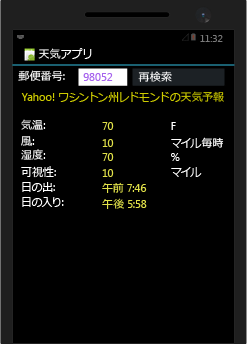
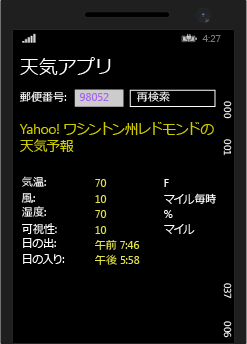

# <a name="build-apps-with-native-ui-using-xamarin-in-visual-studio"></a>Visual Studio で Xamarin を使用してネイティブ UI を備えたアプリを作成する
「[セットアップとインストール](../cross-platform/setup-and-install.md)」と「[Xamarin 環境を検証する](../cross-platform/verify-your-xamarin-environment.md)」の手順を完了しましたが、このチュートリアルでは、ネイティブ UI レイヤーを備えた基本的な Xamarin アプリ (下図) を作成する方法を示します。 ネイティブ UI を使用すると、共有コードはポータブル クラス ライブラリ (PCL) に存在し、個別のプラットフォーム プロジェクトに UI 定義が含まれます。  
  
   
  
 作成するには次の作業を行います。  
  
-   [ソリューションの設定](#solution)  
  
-   [共有データ サービス コードの記述](#dataservice)  
  
-   [Android 用 UI の設計](#Android)  
  
-   [Windows Phone 用 UI の設計](#Windows)  
  
-   [次のステップ](#next)  
  
> [!TIP]
>  このプロジェクトの完全なソース コードは [GitHub の mobile-samples リポジトリ](https://github.com/xamarin/mobile-samples/tree/master/Weather)にあります。
>
>   問題やエラーが発生した場合は、[forums.xamarin.com](http://forums.xamarin.com) に質問を投稿してください。Xamarin に必要な最新の SDK に更新することで多くのエラーを解決できます。エラーについては、[Xamarin リリース ノート](https://developer.xamarin.com/releases/)でプラットフォームごとの説明を参照してください。    
  
> [!NOTE]
>  Xamarin の開発者向けドキュメントには、以下の一覧に示すクイック スタートと詳細情報の両方のセクションで、いくつかのチュートリアルも用意されています。 これらのすべてのページで Visual Studio 固有のチュートリアルを表示するには、必ずページの右上で "Visual Studio" を選びます。  
>   
>  -   ネイティブ UI を使用した Xamarin アプリ:  
>   
>      -   [Hello, Android](https://developer.xamarin.com/guides/android/getting_started/hello,android/) (1 つの画面を使用した簡単なアプリ)  
>     -   [Hello, Android マルチスクリーン](https://developer.xamarin.com/guides/android/getting_started/hello,android_multiscreen/) (画面間でナビゲーションを使用したアプリ)  
>     -   [Android フラグメント チュートリアル](http://developer.xamarin.com/guides/android/platform_features/fragments/fragments_walkthrough/) (特に、マスター/詳細画面で使用)  
>     -   [Hello, iOS](https://developer.xamarin.com/guides/ios/getting_started/hello,_iOS/)  
>     -   [Hello, iOS マルチスクリーン](https://developer.xamarin.com/guides/ios/getting_started/hello,_iOS_multiscreen/)  
> -   Xamarin.Forms (共有 UI) を使用した Xamarin アプリ  
>   
>      -   [Hello, Xamarin.Forms](https://developer.xamarin.com/guides/cross-platform/xamarin-forms/getting-started/hello-xamarin-forms/quickstart/)  
>     -   [Hello, Xamarin.Forms マルチスクリーン](https://developer.xamarin.com/guides/cross-platform/xamarin-forms/getting-started/hello-xamarin-forms-multiscreen/)  
  
##  <a name="solution"></a>ソリューションの設定  
 次の手順では、ネイティブ UI を使用した、共有コードの PCL と 2 つの追加された NuGet パッケージを含む Xamarin ソリューションを作成します。  
  
1.  Visual Studio では、新しい **[空のアプリ (ネイティブ ポータブル)]** ソリューションを作成し、名前を **WeatherApp** とします。 このテンプレートは、検索フィールドに「**ネイティブ ポータブル**」と入力することによって、最も簡単に見つけることができます。  
  
     これがない場合は、Xamarin をインストールするか、Visual Studio 2015 の機能を有効にする必要があります。「[セットアップとインストール](../cross-platform/setup-and-install.md)」を参照してください。  
  
2.  ソリューションを作成するために [OK] をクリックすると、いくつかの個別のプロジェクトが表示されます。  
  
    -   **WeatherApp (ポータブル)**: Xamarin.Forms を使用している共通のビジネス ロジックと UI コードを含む、プラットフォームで共有されるコードの記述先である PCL。  
  
    -   **WeatherApp.Droid**: ネイティブの Android コードを含むプロジェクト。 これは、既定のスタートアップ プロジェクトとして設定されます。  
  
    -   **WeatherApp.iOS**: ネイティブの iOS コードを含むプロジェクト。  
  
    -   **WeatherApp.WinPhone (Windows Phone 8.1)**: ネイティブの Windows Phone コードを含むプロジェクト。  
  
     各ネイティブ プロジェクト内では、対応するプラットフォームのネイティブ デザイナーにアクセスでき、プラットフォーム固有の画面を実装できます。  
  
3.  気象データ サービスから取得した情報を処理するのに使用する **Newtonsoft.Json** と NuGet パッケージを PCL プロジェクトに追加します。  
  
    -   ソリューション エクスプローラーで **[ソリューション 'WeatherApp']** を右クリックし、**[ソリューションの NuGet パッケージの管理]** を選択します。  
  
         NuGet のウィンドウで **[参照]** タブを選択し、**Newtonsoft** を検索します。  
  
    -   **Newtonsoft.Json**を選択します。  
  
    -   ウィンドウの右側で、**WeatherApp** プロジェクトをチェックします (パッケージをインストールする必要があるプロジェクトは、このプロジェクトだけです)。  
  
    -   **[バージョン]** フィールドが **最新の安定した** バージョンに設定されていることを確認してください。  
  
    -   **[インストール]**をクリックします。  
  
    -     
  
4.  手順 3 を繰り返して、**Microsoft.Net.Http** パッケージを検索し、インストールします。  
  
5.  ソリューションをビルドし、ビルド エラーがないことを確認します。  
  
##  <a name="dataservice"></a> 共有データ サービス コードの記述  
 **WeatherApp (ポータブル)** プロジェクトは、すべてのプラットフォームで共有されているポータブル クラス ライブラリ (PCL) 用のコードを記述する場所です。 PCL は、iOS、Android、Windows Phone 用のプロジェクトでビルドされたアプリ パッケージに自動的に含まれます。  
  
 次の手順では、PCL にコードを追加して、気象サービスからのデータにアクセスし、データを格納します。  
  
1.  このサンプルを実行するには、まず [http://openweathermap.org/appid](http://openweathermap.org/appid)で無料 API キーを申し込む必要があります。  
  
2.  **WeatherApp** プロジェクトを右クリックし、**[追加]、[クラス...]** の順に選択します。**[新しい項目の追加]** ダイアログで、ファイルに **Weather.cs**という名前を指定します。 このクラスは、気象データ サービスからのデータを保存するときに使用します。  
  
3.  **Weather.cs** の内容全体を次のコードで置き換えます。  
  
    ```csharp  
    namespace WeatherApp  
    {  
        public class Weather  
        {  
            public string Title { get; set; }  
            public string Temperature { get; set; }  
            public string Wind { get; set; }  
            public string Humidity { get; set; }  
            public string Visibility { get; set; }  
            public string Sunrise { get; set; }  
            public string Sunset { get; set; }  
  
            public Weather()  
            {  
                //Because labels bind to these values, set them to an empty string to  
                //ensure that the label appears on all platforms by default.  
                this.Title = " ";  
                this.Temperature = " ";  
                this.Wind = " ";  
                this.Humidity = " ";  
                this.Visibility = " ";  
                this.Sunrise = " ";  
                this.Sunset = " ";  
            }  
        }  
    }  
    ```  
  
4.  別のクラスを **DataService.cs** という名前の PCL プロジェクトに追加します。これは、気象データ サービスからの JSON データを処理するのに使用します。  
  
5.  **DataService.cs** の内容全体を次のコードで置き換えます。  
  
    ```csharp  
    using System.Threading.Tasks;  
    using Newtonsoft.Json;  
    using System.Net.Http;  
  
    namespace WeatherApp  
    {  
        public class DataService  
        {  
            public static async Task<dynamic> getDataFromService(string queryString)  
            {  
                HttpClient client = new HttpClient();  
                var response = await client.GetAsync(queryString);  
  
                dynamic data = null;  
                if (response != null)  
                {  
                    string json = response.Content.ReadAsStringAsync().Result;  
                    data = JsonConvert.DeserializeObject(json);  
                }  
  
                return data;  
            }  
        }  
    }  
    ```  
  
6.  3 番目のクラスを、**Core** という名前の PCL に追加します。ここには、郵便番号を使用してクエリ文字列を生成し、気象データ サービスを呼び出した後に、**Weather** クラスのインスタンスを取り込むロジックなどの共有ビジネス ロジックを配置します。  
  
7.  **Core.cs** の内容を次のコードで置き換えます。  
  
    ```csharp  
    using System;  
    using System.Threading.Tasks;  
  
    namespace WeatherApp  
    {  
        public class Core  
        {  
            public static async Task<Weather> GetWeather(string zipCode)  
            {  
                //Sign up for a free API key at http://openweathermap.org/appid  
                string key = "YOUR KEY HERE";  
                string queryString = "http://api.openweathermap.org/data/2.5/weather?zip="  
                    + zipCode + ",us&appid=" + key + "&units=imperial";  

                //Make sure developers running this sample replaced the API key
                if (key == "YOUR API KEY HERE")
                {
                    throw new ArgumentException("You must obtain an API key from openweathermap.org/appid and save it in the 'key' variable.");
                }
  
                dynamic results = await DataService.getDataFromService(queryString).ConfigureAwait(false);  
  
                if (results["weather"] != null)  
                {  
                    Weather weather = new Weather();  
                    weather.Title = (string)results["name"];                  
                    weather.Temperature = (string)results["main"]["temp"] + " F";  
                    weather.Wind = (string)results["wind"]["speed"] + " mph";                  
                    weather.Humidity = (string)results["main"]["humidity"] + " %";  
                    weather.Visibility = (string)results["weather"][0]["main"];  
  
                    DateTime time = new System.DateTime(1970, 1, 1, 0, 0, 0, 0);  
                    DateTime sunrise = time.AddSeconds((double)results["sys"]["sunrise"]);  
                    DateTime sunset = time.AddSeconds((double)results["sys"]["sunset"]);  
                    weather.Sunrise = sunrise.ToString() + " UTC";  
                    weather.Sunset = sunset.ToString() + " UTC";  
                    return weather;  
                }  
                else  
                {  
                    return null;  
                }  
            }  
        }  
    }  
    ```  
  
8.  コード内の *YOUR KEY HERE* は、手順 1 で取得した API キーで置き換えます (キーを囲む引用符は必要です)。  
  
9. PCL の MyClass.cs は使用しないので削除します。  
  
10. **WeatherApp** PCL プロジェクトをビルドし、コードが正しいことを確認します。  
  
##  <a name="Android"></a> Android 用 UI の設計  
 次に、ユーザー インターフェイスを設計して共有コードに接続してから、アプリを実行します。  
  
### <a name="design-the-look-and-feel-of-your-app"></a>アプリの外観を設計する  
  
1.  **ソリューション エクスプ ローラー**で、**[WeatherApp.Droid]**>**[リソース]**>**[レイアウト]** フォルダーを開き、**Main.axml** を開きます。 ビジュアル デザイナーでファイルが開きます。 (Java 関連のエラーが表示された場合は、この[ブログの投稿](http://forums.xamarin.com/discussion/32365/connection-to-the-layout-renderer-failed-in-xs-5-7-and-xamarinvs-3-9)を参照してください。)  
  
    > [!TIP]
    >  このプロジェクトには、他にも多くのファイルがあります。 それらの説明はこのトピックの範囲を超えていますが、Android プロジェクトの構造を詳細に知りたい場合は、xamarin.com で Hello Android のトピックにある「[Part 2 Deep Dive](http://developer.xamarin.com/guides/android/getting_started/hello,android/hello,android_deepdive/)」を参照してください。  
  
2.  デザイナーで表示される既定のボタンを選択し、削除します。  
  
3.  **[表示] > [その他のウィンドウ] > [ツールボックス]**を選択してツールボックスを開きます。  
  
4.  **[ツールボックス]**から、 **[相対レイアウト]** コントロールをデザイナーにドラッグします。 このコントロールは、他のコントロールの親コンテナーとして使用します。  
  
    > [!TIP]
    >  レイアウトが正しく表示されない場合は、ファイルを保存し、**[デザイン]** タブと **[ソース]** タブを切り替えて表示を更新します。  
  
5.  **[プロパティ]** ウィンドウで、**background** プロパティ (スタイルのグループ) を `#545454` に設定します。  
  
6.  **[ツールボックス]**から、 **[TextView]** コントロールを **[相対レイアウト]** コントロールにドラッグします。  
  
7.  **[プロパティ]** ウィンドウで、次のプロパティを設定します (注: [プロパティ] ウィンドウのツール バーにある並べ替えボタンを使用して、一覧をアルファベット順に並べ替えるとわかりやすくなります)。  
  
    |プロパティ|値|  
    |--------------|-----------|  
    |**text**|**Search by Zip Code**|  
    |**id**|`@+id/ZipCodeSearchLabel`|  
    |**layout_marginLeft**|`10dp`|  
    |**textColor**|`@android:color/white`|  
    |**textStyle**|`bold`|  
  
    > [!TIP]
    >  選択可能な値のドロップダウン リストが表示されないプロパティが多いことに注意してください。  特定のプロパティにどのような文字列値を使用すべきなのか、推測しにくい場合があります。 情報が必要な場合は、 [R.attr](http://developer.android.com/reference/android/R.attr.html) クラスのページでプロパティの名前を検索してみてください。  
    >   
    >  また、クイック Web 検索を実行すると、他のユーザーが同じプロパティを使ったページ「 [http://stackoverflow.com/](http://stackoverflow.com/) 」が表示されることもよくあります。  
  
     参考として、**[ソース]** ビューに切り替えると、この要素のコードが次のように表示されます。  
  
    ```xml  
    <TextView  
        android:text="Search by Zip Code"  
        android:layout_width="wrap_content"  
        android:layout_height="wrap_content"  
        android:id="@+id/ZipCodeSearchLabel"  
        android:layout_centerVertical="true"  
        android:layout_marginLeft="10dp"  
        android:textColor="@android:color/white"  
        android:textStyle="bold" />  
  
    ```  
  
8.  **[ツールボックス]** から、**[TextView]** コントロールを **[RelativeLayout]** コントロールにドラッグして、ZipCodeSearchLabel コントロールの下に配置します。 このとき、新しいコントロールを既存のコントロールの端に合わせてドロップします。デザイナーを拡大表示すると操作しやすくなります。  
  
9. **[プロパティ]** ウィンドウで、次のプロパティを設定します。  
  
    |プロパティ|値|  
    |--------------|-----------|  
    |**テキスト**|**[郵便番号]**|  
    |**ID**|`@+id/ZipCodeLabel`|  
    |**layout_marginLeft**|`10dp`|  
    |**layout_marginTop**|`5dp`|  
  
     **[ソース]** ビューに表示されるコードは次のようになります。  
  
    ```xml  
    <TextView  
        android:text="Zip Code"  
        android:layout_width="wrap_content"  
        android:layout_height="wrap_content"  
        android:layout_below="@id/ZipCodeSearchLabel"  
        android:id="@+id/ZipCodeLabel"  
        android:layout_marginTop="5dp"  
        android:layout_marginLeft="10dp" />  
    ```  
  
10. **[ツールボックス]** から **[Number]** コントロールを **[RelativeLayout]** にドラッグし、**[Zip Code]** ラベルの下に配置します。 その後、次のプロパティを設定します。  
  
    |プロパティ|値|  
    |--------------|-----------|  
    |**ID**|`@+id/zipCodeEntry`|  
    |**layout_marginLeft**|`10dp`|  
    |**layout_marginBottom**|`10dp`|  
    |**width**|`165dp`|  
  
     コードは次のようになります。  
  
    ```xml  
    <EditText  
        android:inputType="number"  
        android:layout_width="wrap_content"  
        android:layout_height="wrap_content"  
        android:layout_below="@id/ZipCodeLabel"  
        android:id="@+id/zipCodeEntry"  
        android:layout_marginLeft="10dp"  
        android:layout_marginBottom="10dp"  
        android:width="165dp" />  
    ```  
  
11. **[ツールボックス]** から、**[Button]** を **[RelativeLayout]** コントロールにドラッグして、[zipCodeEntry] コントロールの右に配置します。 次に、以下のプロパティを設定します。  
  
    |プロパティ|値|  
    |--------------|-----------|  
    |**ID**|`@+id/weatherBtn`|  
    |**テキスト**|**Get Weather**|  
    |**layout_marginLeft**|`20dp`|  
    |**layout_alignBottom**|`@id/zipCodeEntry`|  
    |**width**|`165dp`|  
  
    ```xml  
    <Button    android:text="Get Weather"  
        android:layout_width="wrap_content"  
        android:layout_height="wrap_content"  
        android:layout_toRightOf="@id/zipCodeEntry"  
        android:id="@+id/weatherBtn"  
        android:layout_marginLeft="20dp"  
        android:layout_alignBottom="@id/zipCodeEntry"  
        android:width="165dp" />  
    ```  
  
12. 以上で、Android デザイナーを使用して基本的な UI を構築するための知識は十分です。 ページの .asxml ファイルにマークアップを直接追加して UI を構築することもできます。 その方法で残りの UI を構築するには、デザイナーの [ソース] ビューに切り替えて、次のマークアップを `</RelativeLayout>` タグの*下*に貼り付けます (つまり、これらの要素は ReleativeLayout に含まれません)。  
  
    ```xml  
    <TextView  
            android:text="Location"  
            android:textAppearance="?android:attr/textAppearanceSmall"  
            android:layout_width="match_parent"  
            android:layout_height="wrap_content"  
            android:id="@+id/locationLabel"  
            android:layout_marginLeft="10dp"  
            android:layout_marginTop="10dp" />  
        <TextView  
            android:textAppearance="?android:attr/textAppearanceMedium"  
            android:layout_width="match_parent"  
            android:layout_height="wrap_content"  
            android:id="@+id/locationText"  
            android:layout_marginLeft="20dp"  
            android:layout_marginBottom="10dp" />  
        <TextView  
            android:text="Temperature"  
            android:textAppearance="?android:attr/textAppearanceSmall"  
            android:layout_width="match_parent"  
            android:layout_height="wrap_content"  
            android:id="@+id/tempLabel"  
            android:layout_marginLeft="10dp" />  
        <TextView  
            android:textAppearance="?android:attr/textAppearanceMedium"  
            android:layout_width="match_parent"  
            android:layout_height="wrap_content"  
            android:id="@+id/tempText"  
            android:layout_marginBottom="10dp"  
            android:layout_marginLeft="20dp" />  
        <TextView  
            android:text="Wind Speed"  
            android:textAppearance="?android:attr/textAppearanceSmall"  
            android:layout_width="match_parent"  
            android:layout_height="wrap_content"  
            android:id="@+id/windLabel"  
            android:layout_marginLeft="10dp" />  
        <TextView  
            android:textAppearance="?android:attr/textAppearanceMedium"  
            android:layout_width="match_parent"  
            android:layout_height="wrap_content"  
            android:id="@+id/windText"  
            android:layout_marginBottom="10dp"  
            android:layout_marginLeft="20dp" />  
        <TextView  
            android:text="Humidity"  
            android:textAppearance="?android:attr/textAppearanceSmall"  
            android:layout_width="match_parent"  
            android:layout_height="wrap_content"  
            android:id="@+id/humidtyLabel"  
            android:layout_marginLeft="10dp" />  
        <TextView  
            android:textAppearance="?android:attr/textAppearanceMedium"  
            android:layout_width="match_parent"  
            android:layout_height="wrap_content"  
            android:id="@+id/humidityText"  
            android:layout_marginBottom="10dp"  
            android:layout_marginLeft="20dp" />  
        <TextView  
            android:text="Visibility"  
            android:textAppearance="?android:attr/textAppearanceSmall"  
            android:layout_width="match_parent"  
            android:layout_height="wrap_content"  
            android:id="@+id/visibilityLabel"  
            android:layout_marginLeft="10dp" />  
        <TextView  
            android:textAppearance="?android:attr/textAppearanceMedium"  
            android:layout_width="match_parent"  
            android:layout_height="wrap_content"  
            android:id="@+id/visibilityText"  
            android:layout_marginBottom="10dp"  
            android:layout_marginLeft="20dp" />  
        <TextView  
            android:text="Time of Sunrise"  
            android:textAppearance="?android:attr/textAppearanceSmall"  
            android:layout_width="match_parent"  
            android:layout_height="wrap_content"  
            android:id="@+id/sunriseLabel"  
            android:layout_marginLeft="10dp" />  
        <TextView  
            android:textAppearance="?android:attr/textAppearanceMedium"  
            android:layout_width="match_parent"  
            android:layout_height="wrap_content"  
            android:id="@+id/sunriseText"  
            android:layout_marginBottom="10dp"  
            android:layout_marginLeft="20dp" />  
        <TextView  
            android:text="Time of Sunset"  
            android:textAppearance="?android:attr/textAppearanceSmall"  
            android:layout_width="match_parent"  
            android:layout_height="wrap_content"  
            android:id="@+id/sunsetLabel"  
            android:layout_marginLeft="10dp" />  
        <TextView  
            android:textAppearance="?android:attr/textAppearanceMedium"  
            android:layout_width="match_parent"  
            android:layout_height="wrap_content"  
            android:id="@+id/sunsetText"  
            android:layout_marginBottom="10dp"  
            android:layout_marginLeft="20dp" />  
  
    ```  
  
13. ファイルを保存し、**[デザイン]** ビューに切り替えます。 次のような UI が表示されます。  
  
       
  
14. **MainActivity.cs** を開き、前の手順で削除した既定のボタンを参照している行を *OnCreate* メソッドから削除します。 完了したコードは次のようになります。  
  
    ```  
    protected override void OnCreate (Bundle bundle)  
    {  
        base.OnCreate (bundle);  
  
        // Set our view from the "main" layout resource  
        SetContentView (Resource.Layout.Main);  
    }  
    ```  
  
15. Android プロジェクトをビルドして作業内容を確認します。 ビルドを実行すると、**Resource.Designer.cs** ファイルにコントロール ID が追加されるため、コード中で名前を指定してコントロールを参照できるようになります。  
  
### <a name="consume-your-shared-code"></a>共有コードを使用する  
  
1.  コード エディターで **WeatherApp** プロジェクトの **MainActivity.cs** ファイルを開き、ファイルの内容を以下のコードに置き換えます。 このコードは、共有コードで定義した `GetWeather` メソッドを呼び出します。 そして、そのメソッドから取得したデータをアプリの UI に表示します。  
  
    ```csharp  
    using System;  
    using Android.App;  
    using Android.Widget;  
    using Android.OS;  
  
    namespace WeatherApp.Droid  
    {  
        [Activity(Label = "Sample Weather App", MainLauncher = true, Icon = "@drawable/icon")]  
        public class MainActivity : Activity  
        {  
            protected override void OnCreate(Bundle bundle)  
            {  
                base.OnCreate(bundle);  
  
                SetContentView(Resource.Layout.Main);  
  
                Button button = FindViewById<Button>(Resource.Id.weatherBtn);  
  
                button.Click += Button_Click;  
            }  
  
            private async void Button_Click(object sender, EventArgs e)  
            {  
                EditText zipCodeEntry = FindViewById<EditText>(Resource.Id.zipCodeEntry);  
  
                if (!String.IsNullOrEmpty(zipCodeEntry.Text))  
                {  
                    Weather weather = await Core.GetWeather(zipCodeEntry.Text);  
                    FindViewById<TextView>(Resource.Id.locationText).Text = weather.Title;  
                    FindViewById<TextView>(Resource.Id.tempText).Text = weather.Temperature;  
                    FindViewById<TextView>(Resource.Id.windText).Text = weather.Wind;  
                    FindViewById<TextView>(Resource.Id.visibilityText).Text = weather.Visibility;  
                    FindViewById<TextView>(Resource.Id.humidityText).Text = weather.Humidity;  
                    FindViewById<TextView>(Resource.Id.sunriseText).Text = weather.Sunrise;  
                    FindViewById<TextView>(Resource.Id.sunsetText).Text = weather.Sunset;  
                }  
            }  
        }  
    }  
    ```  
  
### <a name="run-the-app-and-see-how-it-looks"></a>アプリを実行して結果を確認してください。  
  
1.  **ソリューション エクスプローラー**で、**WeatherApp.Droid** プロジェクトがスタートアップ プロジェクトとして設定されていることを確認します。  
  
2.  適切なデバイスまたはエミュレーターのターゲットを選択し、F5 キーを押してアプリケーションを開始します。  
  
3.  デバイスまたはエミュレーターで、米国の有効な郵便番号 (例: 60601) を編集ボックスに入力してから、**[Get Weather]** をクリックします。 該当する地域の気象データがコントロールに表示されます。  
  
       
  
> [!TIP]
>  このプロジェクトの完全なソース コードは [GitHub の mobile-samples リポジトリ](https://github.com/xamarin/mobile-samples/tree/master/Weather)にあります。  
  
##  <a name="Windows"></a>Windows Phone 用 UI の設計  
 次に、Windows Phone 用のユーザー インターフェイスを設計して共有コードに接続してから、アプリを実行します。  
  
### <a name="design-the-look-and-feel-of-your-app"></a>アプリの外観を設計する  
 Xamarin アプリでネイティブの Windows Phone UI を設計するプロセスは、他のネイティブ Windows Phone アプリと同じです。 このため、デザイナーの使用方法の詳細についてここでは説明しません。 「[XAML デザイナーを使用した UI の作成](../designers/creating-a-ui-by-using-xaml-designer-in-visual-studio.md)」を参照してください。  
  
 代わりに、MainPage.xaml を開き、すべての XAML コードを以下のコードで置き換えます。  
  
```xaml  
<Page  
    x:Class="WeatherApp.WinPhone.MainPage"  
    xmlns="http://schemas.microsoft.com/winfx/2006/xaml/presentation"  
    xmlns:x="http://schemas.microsoft.com/winfx/2006/xaml"  
    xmlns:local="using:WeatherApp.WinPhone"  
    xmlns:d="http://schemas.microsoft.com/expression/blend/2008"  
    xmlns:mc="http://schemas.openxmlformats.org/markup-compatibility/2006"  
    mc:Ignorable="d"  
    Background="{ThemeResource ApplicationPageBackgroundThemeBrush}">  
  
    <Grid>  
        <StackPanel HorizontalAlignment="Left" Height="40" Margin="10,0,0,0" VerticalAlignment="Top" Width="400">  
            <TextBlock x:Name="pageTitle" Text="Weather App" FontSize="30" />  
        </StackPanel>  
        <StackPanel HorizontalAlignment="Left" Height="120" Margin="10,40,0,0" VerticalAlignment="Top" Width="400" Background="#FF545454">  
  
            <TextBlock x:Name="zipCodeSearchLabel" TextWrapping="Wrap" Text="Search by Zip Code" FontSize="18" FontWeight="Bold" HorizontalAlignment="Left" Margin="10,10,0,0"/>  
            <TextBlock x:Name="zipCodeLabel" TextWrapping="Wrap" Text="Zip Code" Margin="10,5,0,0" FontSize="14" Foreground="#FFA8A8A8"/>  
            <StackPanel Orientation="Horizontal">  
                <TextBox x:Name="zipCodeEntry" Margin="10,10,0,0" Text="" VerticalAlignment="Top" InputScope="Number" Width="165" />  
                <Button x:Name="weatherBtn" Content="Get Weather" Width="165" Margin="20,0,0,0" Height="60" Click="GetWeatherButton_Click"/>  
            </StackPanel>  
        </StackPanel>  
        <StackPanel Margin="10,175,0,0">  
            <TextBlock x:Name="locationLabel" HorizontalAlignment="Left" FontSize="14" Foreground="#FFA8A8A8" TextWrapping="Wrap" Text="Location" VerticalAlignment="Top"/>  
            <TextBlock x:Name="locationText" Margin="10,0,0,10" HorizontalAlignment="Left" FontSize="18" TextWrapping="Wrap" VerticalAlignment="Top"/>  
            <TextBlock x:Name="tempLabel" HorizontalAlignment="Left" FontSize="14" Foreground="#FFA8A8A8" TextWrapping="Wrap" Text="Temperature" VerticalAlignment="Top"/>  
            <TextBlock x:Name="tempText" Margin="10,0,0,10" HorizontalAlignment="Left" FontSize="18" TextWrapping="Wrap" VerticalAlignment="Top"/>  
            <TextBlock x:Name="windLabel" HorizontalAlignment="Left" FontSize="14" Foreground="#FFA8A8A8" TextWrapping="Wrap" Text="Wind Speed" VerticalAlignment="Top"/>  
            <TextBlock x:Name="windText" Margin="10,0,0,10" HorizontalAlignment="Left" FontSize="18" TextWrapping="Wrap" VerticalAlignment="Top"/>  
            <TextBlock x:Name="humidityLabel" HorizontalAlignment="Left" FontSize="14" Foreground="#FFA8A8A8" TextWrapping="Wrap" Text="Humidity" VerticalAlignment="Top"/>  
            <TextBlock x:Name="humidityText" Margin="10,0,0,10" HorizontalAlignment="Left" FontSize="18" TextWrapping="Wrap" VerticalAlignment="Top"/>  
            <TextBlock x:Name="visibilityLabel" HorizontalAlignment="Left" FontSize="14" Foreground="#FFA8A8A8" TextWrapping="Wrap" Text="Temperature" VerticalAlignment="Top"/>  
            <TextBlock x:Name="visibilityText" Margin="10,0,0,10" HorizontalAlignment="Left" FontSize="18" TextWrapping="Wrap" VerticalAlignment="Top"/>  
            <TextBlock x:Name="sunriseLabel" HorizontalAlignment="Left" FontSize="14" Foreground="#FFA8A8A8" TextWrapping="Wrap" Text="Time of Sunriweatherse" VerticalAlignment="Top"/>  
            <TextBlock x:Name="sunriseText" Margin="10,0,0,10" HorizontalAlignment="Left" FontSize="18" TextWrapping="Wrap" VerticalAlignment="Top"/>  
            <TextBlock x:Name="sunsetLabel" HorizontalAlignment="Left" FontSize="14" Foreground="#FFA8A8A8" TextWrapping="Wrap" Text="Time of Sunset" VerticalAlignment="Top"/>  
            <TextBlock x:Name="sunsetText" Margin="10,0,0,10" HorizontalAlignment="Left" FontSize="18" TextWrapping="Wrap" VerticalAlignment="Top"/>  
        </StackPanel>  
    </Grid>  
</Page>  
```  
  
 デザイン ビユーでは、UI は次のように表示されます。  
  
   
  
### <a name="consume-your-shared-code"></a>共有コードを使用する  
  
1.  デザイナーで、 **[Get Weather]** ボタンをクリックします。  
  
2.  **[プロパティ]** ウィンドウで、イベント ハンドラー ボタン () を選択します。  
  
     このアイコンは **[プロパティ]** ウィンドウの上隅に表示されます。  
  
3.  **[クリック]** イベントの隣に「 **GetWeatherButton_Click**」と入力し、ENTER キーを押します。  
  
     `GetWeatherButton_Click`という名前のイベント ハンドラーが生成されます。 コード エディターが開き、カーソルがイベント ハンドラーのコード ブロック内に配置されます。  注: Enter キーを押してもエディターが開かない場合は、イベント名をダブルクリックします。  
  
4.  イベント ハンドラーを次のコードで置き換えます。  
  
    ```csharp  
    private async void GetWeatherButton_Click(object sender, RoutedEventArgs e)  
    {  
        if (!String.IsNullOrEmpty(zipCodeEntry.Text))  
        {  
            Weather weather = await Core.GetWeather(zipCodeEntry.Text);  
            locationText.Text = weather.Title;  
            tempText.Text = weather.Temperature;  
            windText.Text = weather.Wind;  
            visibilityText.Text = weather.Visibility;  
            humidityText.Text = weather.Humidity;  
            sunriseText.Text = weather.Sunrise;  
            sunsetText.Text = weather.Sunset;  
  
            weatherBtn.Content = "Search Again";  
        }  
    }  
    ```  
  
     このコードは、共有コードで定義した `GetWeather` メソッドを呼び出します。 このメソッドは、Android アプリで呼び出したものと同じです。 このコードは、アプリの UI コントロールのメソッドから取得したデータも表示します。  
  
5.  開いている MainPage.xaml.cs で、**OnNavigatedTo** メソッドの中のすべてのコードを削除します。 このコードは、MainPage.xaml の内容を置き換えたときに削除された既定のボタンを処理したコードです。  
  
### <a name="run-the-app-and-see-how-it-looks"></a>アプリを実行して結果を確認してください。  
  
1.  **ソリューション エクスプローラー**で、**WeatherApp.WinPhone** プロジェクトをスタートアップ プロジェクトに設定します。  
  
2.  F5 キーを押すとアプリが起動します。  
  
3.  Windows Phone エミュレーターで、米国の有効な郵便番号を編集ボックスに入力 (例: 60601) してから、**[Get Weather]** をクリックします。 該当する地域の気象データがコントロールに表示されます。  
  
       
  
> [!TIP]
>  このプロジェクトの完全なソース コードは [GitHub の mobile-samples リポジトリ](https://github.com/xamarin/mobile-samples/tree/master/Weather)にあります。  
  
##  <a name="next"></a>次のステップ  
 **iOS 用 UI をソリューションに追加する**  
  
 iOS 用のネイティブ UI を追加することで、このサンプルを拡張します。 そのためには、Xcode と Xamarin がインストールされているローカル ネットワーク上の Mac に接続する必要があります。 接続すると、Visual Studio で直接 iOS デザイナーを使用することができます。 完成したアプリを確認するには、[GitHub の mobile-samples リポジトリ](https://github.com/xamarin/mobile-samples/tree/master/Weather)を参照してください。  
  
 また、[Hello, iOS](http://developer.xamarin.com/guides/ios/getting_started/hello,_iOS/hello,iOS_quickstart/) (xamarin.com) のチュートリアルもご覧ください。 このページで正しい手順のセットを表示するには、必ず xamarin.com 上のページの右上で "Visual Studio" を選びます。  
  
 **共有プロジェクトにプラットフォーム固有のコードを追加する**  
  
 PCL はコンパイルされてから各プラットフォーム固有のアプリ パッケージに組み込まれるため、PCL の共有コードはプラットフォームに中立的です。 条件付きコンパイルを使用してプラットフォーム固有のコードを区別した共有コードを記述する場合は、*共有*プロジェクトを使用することができます。 詳細については、[コード共有オプション](http://developer.xamarin.com/guides/cross-platform/application_fundamentals/building_cross_platform_applications/sharing_code_options/) (xamarin.com) の説明を参照してください。  
  
## <a name="see-also"></a>関連項目  
 [Xamarin の開発者向けサイト](http://developer.xamarin.com/)   
 [Windows デベロッパー センター](https://dev.windows.com/en-us)   
 [Swift および C# のクイック リファレンス ポスター](http://aka.ms/scposter)
