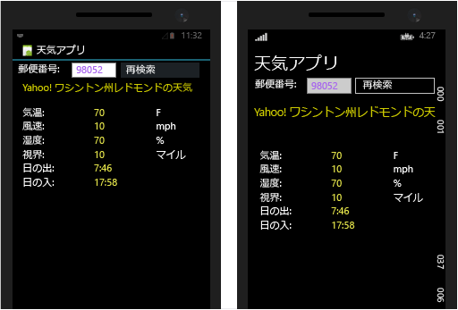

# <a name="build-apps-with-native-ui-using-xamarin-in-visual-studio"></a>Visual Studio で Xamarin を使用してネイティブ UI を備えたアプリを作成する

クロスプラットフォーム モバイル アプリケーションの記述に Xamarin と C# を選択する開発者の多くは Xamarin.Forms を使用します。 Xamarin.Forms によって、iOS、Android、ユニバーサル Windows プラットフォーム (UWP) のネイティブ コントロールにマッピングされるユーザー インターフェイスが定義されます。 Xamarin.Forms の詳細は「[Visual Studio での Xamarin Froms を使用したアプリ作成の基本事項](learn-app-building-basics-with-xamarin-forms-in-visual-studio.md)」という記事にあります。

この記事では、各プラットフォームのネイティブ ユーザー インターフェイス API へのアクセスに関連する別の手法について説明しています。 ネイティブ API の使用は、各プラットフォームの広範な知識が必要になるため、Xamarin.Forms の場合よりもはるかに難しい手法となります。 その利点は、各プラットフォームの特定の長所と機能に合わせてユーザー インターフェイスを作成できること、それでいながら基礎となるビジネス ロジックが共有されることにあります。

「[セットアップとインストール](../cross-platform/setup-and-install.md)」と「[Xamarin 環境を検証する](../cross-platform/verify-your-xamarin-environment.md)」の手順を完了しましたが、このチュートリアルでは、ネイティブ UI レイヤーを備えた基本的な Xamarin アプリを作成する方法を示します。 ネイティブ UI の場合、共有コードは .NET Standard ライブラリに存在し、個別のプラットフォーム プロジェクトに UI 定義が含まれます。 下の画像はこれからビルドするアプリケーションの画面です。(左から右へ) iOS フォン、Android フォン、Windows 10 で実行されています。
  
[](../cross-platform/media/cross-plat-xamarin-build-1-Large.png#lightbox)
  
作成するには次の作業を行います。  
  
- [ソリューションの設定](#solution)  
  
- [共有データ サービス コードの記述](#dataservice)  
  
- [Android 用 UI の設計](#Android)  

- [Windows 用 UI の設計](#Windows)  
  
- [次の手順](#next)、iOS ユーザー インターフェイスの設計が含まれます
  
> [!TIP]
> このプロジェクトの完全なソース コードは [GitHub の mobile-samples リポジトリ](https://github.com/xamarin/mobile-samples/tree/master/Weather)にあります。
>
> 問題やエラーが発生した場合は、[forums.xamarin.com](http://forums.xamarin.com) に質問を投稿してください。Xamarin に必要な最新の SDK に更新することで多くのエラーを解決できます。エラーについては、[Xamarin リリース ノート](https://developer.xamarin.com/releases/)でプラットフォームごとの説明を参照してください。    
  
> [!NOTE]
> Xamarin の開発者向けドキュメントには、以下の一覧に示すクイック スタートと詳細情報の両方のセクションで、いくつかのチュートリアルも用意されています。 いずれのページでも、必ず "Visual Studio" を選択し、Visual Studio に固有のチュートリアルを表示してください。  
>   
>  -   ネイティブ UI を使用した Xamarin アプリ:  
>     -   [Hello, Android](/xamarin/android/get-started/hello-android/) (1 つの画面を使用した簡単なアプリ)  
>     -   [Hello, Android マルチスクリーン](/xamarin/android/get-started/hello-android-multiscreen/) (画面間でナビゲーションを使用したアプリ)  
>     -   [Android フラグメント チュートリアル](/xamarin/android/platform/fragments/fragments/implementing-with-fragments/walkthrough/) (特に、マスター/詳細画面で使用)  
>     -   [Hello, iOS](/xamarin/ios/get-started/hello-iOS/)  
>     -   [Hello, iOS マルチスクリーン](/xamarin/ios/get-started/hello-iOS-multiscreen/) 

>  -   Xamarin.Forms (共有 UI) を使用した Xamarin アプリ  
>     -   [Hello, Xamarin.Forms](/xamarin/xamarin-forms/get-started/hello-xamarin-forms/quickstart/)  
>     -   [Hello, Xamarin.Forms マルチスクリーン](/xamarin/xamarin-forms/get-started/hello-xamarin-forms-multiscreen/)  
  
<a name="solution" />

##  <a name="set-up-your-solution"></a>ソリューションの設定  

Visual Studio には、.NET Standard ライブラリを共有するネイティブ UI アプリケーションを作成するためのソリューション テンプレートがありません。 しかしながら、そのようなソリューションを個々のプロジェクトからビルドすることは難しくありません。 以下の手順では、アプリケーション プラットフォームの種類別のプロジェクトで Xamarin ソリューションが作成され、共有されるコードのための .NET Standard ライブラリが作成されます。  
  
1.  Visual Studio で新しい**クラス ライブラリ (.NET Standard)** ソリューションを作成し、それに **WeatherApp** という名前を付けます。 このテンプレートは、左にある **[Visual C#]** を選択し、**[.NET Standard]** を選択することで非常に簡単に見つけることができます。 

    

    [OK] のクリック後、**WeatherApp** ソリューションが **WeatherApp** という名前の 1 つのプロジェクトで構成されます。 

2.  iOS を対象にする場合、ソリューションに iOS プロジェクトを追加します。 **ソリューション エクスプローラー**でソリューション名を右クリックし、**[追加]**、**[新しいプロジェクト]** の順に選択します。  **[新しいプロジェクト]** ダイアログで、左にある **[Visual C#]** を選択し、**[iOS]** と **[ユニバーサル]** を選択します。 (テンプレートがない場合は、Xamarin をインストールするか、Visual Studio 2017 の機能を有効にする必要があります。「[セットアップとインストール](../cross-platform/setup-and-install.md)」をご覧ください。)テンプレートの一覧で、**[単一ビュー アプリ (iOS)]** を選択します。 これに **WeatherApp.iOS** という名前を付けます。

3.  Android を対象にする場合、ソリューションに Android プロジェクトを追加します。 **[新しいプロジェクト]** ダイアログで、左にある **[Visual C#]** と **[Android]** を選択します。 テンプレートの一覧で、**[空のアプリ (Android)]** を選択します。 これに **WeatherApp.Android** という名前を付けます。 

4. ユニバーサル Windows プラットフォームを対象にする場合、**[新しいプロジェクト]** ダイアログで、左にある **[Visual C#]** と **[Windows ユニバーサル]** を選択します。 テンプレートの一覧で、**[空のアプリ (ユニバーサル Windows)]** を選択し、それに **WeatherApp.UWP** という名前を付けます。
  
5. アプリケーション プロジェクト (iOS、Android、UWP) ごとに、**ソリューション エクスプローラー**の **[参照]** セクションを右クリックし、**[参照の追加]** を選択します。 **[参照マネージャー]** ダイアログの左で **[プロジェクト]** と **[ソリューション]** を選択します。 ソリューションのすべてのプロジェクトが一覧表示されます。ただし、参照を自分で管理しているプロジェクトは含まれていません。

   

   **WeatherApp** の隣にあるチェックボックスを選択します。 

   アプリケーション プロジェクトごとにこのボックスを選択すると、すべてのプロジェクトに .NET Standard ライブラリの参照が含まれ、そのライブラリのコードを共有できます。
  
6. 気象データ サービスから取得した情報の処理に使用する .NET Standard プロジェクトに **Newtonsoft.Json** NuGet パッケージを追加します。  
  
    -   **ソリューション エクスプローラー**で **WeatherApp** プロジェクトを右クリックし、**[NuGet パッケージの管理]** を選択します。  
  
         NuGet のウィンドウで **[参照]** タブを選択し、**Newtonsoft** を検索します。  
  
    -   **Newtonsoft.Json**を選択します。  
  
    -   **[バージョン]** フィールドが **最新の安定した** バージョンに設定されていることを確認してください。  
  
    -   **[インストール]** をクリックします。  
  
7.  手順 7 を繰り返し、**Microsoft.CSharp** パッケージを見つけ、.NET Standard プロジェクトにインストールします。 このライブラリは、.NET Standard ライブラリの C# `dynamic` データ型を使用するために必要です。
  
8.  ソリューションをビルドし、ビルド エラーがないことを確認します。  
  
<a name="dataservice" />

## <a name="write-shared-data-service-code"></a>共有データ サービス コードの記述  

 **WeatherApp** プロジェクトは .NET Standard ライブラリです。 このプロジェクトは、すべてのプラットフォームで共有されるコードを記述する場所になります。 各アプリケーション プロジェクトに .NET Standard ライブラリの参照があるため、このライブラリは iOS、Android、UWP という各種アプリ パッケージに付属します。  
  
 次の手順では、.NET Standard ライブラリにコードを追加して、気象サービスからのデータにアクセスし、そのデータを格納します。  
  
1.  まず、[http://openweathermap.org/appid](http://openweathermap.org/appid) で新規登録し、無料の天気 API キーを入手してください。 この API キーによって、アプリケーションは米国のあらゆる郵便番号を対象に天気を取得できます。 (米国以外の郵便番号では機能しません。)
  
2.  **WeatherApp** プロジェクトを右クリックし、**[追加]、[クラス...]** の順に選択します。**[新しい項目の追加]** ダイアログで、ファイルに **Weather.cs**という名前を指定します。 このクラスは、気象データ サービスからのデータを保存するときに使用します。  
  
3.  **Weather.cs** の内容全体を次のコードで置き換えます。  
  
    ```csharp  
    namespace WeatherApp
    {
        public class Weather
        {
            // Because labels bind to these values, set them to an empty string to
            // ensure that the label appears on all platforms by default.
            public string Title { get; set; } = " ";
            public string Temperature { get; set; } = " ";
            public string Wind { get; set; } = " ";
            public string Humidity { get; set; } = " ";
            public string Visibility { get; set; } = " ";
            public string Sunrise { get; set; } = " ";
            public string Sunset { get; set; } = " ";
        }
    }
    ```  
  
4.  **DataService.cs** という名前の .NET Standard プロジェクトに別のクラスを追加します。 このクラスは、気象データ サービスからの JSON データを処理するときに使用します。  
  
5.  **DataService.cs** の内容全体を次のコードで置き換えます。  
  
    ```csharp  
    using System.Net.Http;  
    using System.Threading.Tasks;  
    using Newtonsoft.Json;  
  
    namespace WeatherApp  
    {  
        public class DataService  
        {  
            public static async Task<dynamic> getDataFromService(string queryString)  
            {  
                HttpClient client = new HttpClient();  
                var response = await client.GetAsync(queryString);  
  
                dynamic data = null;  
                if (response != null)  
                {  
                    string json = response.Content.ReadAsStringAsync().Result;  
                    data = JsonConvert.DeserializeObject(json);  
                }  
  
                return data;  
            }  
        }  
    }  
    ```  
  
6.  **Core.cs** という名前の .NET Standard ライブラリに 3 つ目のクラスを追加します。 このクラスを使用して郵便番号でクエリ文字列を生成し、気象データ サービスを呼び出し、**Weather** クラスのインスタンスにデータを取り込みます。  
  
7.  **Core.cs** の内容を次のコードで置き換えます。  
  
    ```csharp  
    using System;  
    using System.Threading.Tasks;  
  
    namespace WeatherApp  
    {  
        public class Core  
        {  
            public static async Task<Weather> GetWeather(string zipCode)  
            {  
                //Sign up for a free API key at http://openweathermap.org/appid  
                string key = "YOUR API KEY HERE";  
                string queryString = "http://api.openweathermap.org/data/2.5/weather?zip="  
                    + zipCode + ",us&appid=" + key + "&units=imperial";  

                //Make sure developers running this sample replaced the API key
                if (key == "YOUR API KEY HERE")
                {
                    throw new ArgumentException("You must obtain an API key from openweathermap.org/appid and save it in the 'key' variable.");
                }
  
                dynamic results = await DataService.GetDataFromService(queryString).ConfigureAwait(false);  
  
                if (results["weather"] != null)  
                {  
                    Weather weather = new Weather();  
                    weather.Title = (string)results["name"];                  
                    weather.Temperature = (string)results["main"]["temp"] + " F";  
                    weather.Wind = (string)results["wind"]["speed"] + " mph";                  
                    weather.Humidity = (string)results["main"]["humidity"] + " %";  
                    weather.Visibility = (string)results["weather"][0]["main"];  
  
                    DateTime time = new System.DateTime(1970, 1, 1, 0, 0, 0, 0);  
                    DateTime sunrise = time.AddSeconds((double)results["sys"]["sunrise"]);  
                    DateTime sunset = time.AddSeconds((double)results["sys"]["sunset"]);  
                    weather.Sunrise = sunrise.ToString() + " UTC";  
                    weather.Sunset = sunset.ToString() + " UTC";  
                    return weather;  
                }  
                else  
                {  
                    return null;  
                }  
            }  
        }  
    }  
    ```  
  
8. 最初に現れる *YOUR API KEY HERE* を手順 1 で取得した API キーで置き換えます。 ここでも引用符で囲む必要があります。
  
9. .NET Standard ライブラリの **MyClass.cs** は使用されないため、削除します。  
  
10. **WeatherApp** プロジェクトをビルドし、コードが正しいことを確認します。  
  
<a name="Android" />

## <a name="design-ui-for-android"></a>Android 用 UI の設計  

 これで、ユーザー インターフェイスを設計して共有コードに接続し、アプリを実行できます。  
  
### <a name="design-the-look-and-feel-of-your-app"></a>アプリの外観を設計する  
  
1.  **ソリューション エクスプ ローラー**で、**[WeatherApp.Droid]、[リソース]、[レイアウト]** フォルダーの順に展開し、**Main.axml** を開きます。 このコマンドによって、ビジュアル デザイナーでファイルが開きます。 (Java 関連のエラーが表示された場合は、この[ブログの投稿](http://forums.xamarin.com/discussion/32365/connection-to-the-layout-renderer-failed-in-xs-5-7-and-xamarinvs-3-9)を参照してください。)  
  
    > [!TIP]
    >  このプロジェクトには、他にも多くのファイルがあります。 それらの説明はこの記事の範囲を超えていますが、Android プロジェクトの構造をもう少し詳しく知りたい場合は、Hello Android という二部構成記事の第 2 部に相当する「[Hello Android: 詳細説明](/xamarin/android/get-started/hello-android/hello-android-deepdive/)」を参照してください。  
  
2.  **[表示] > [その他のウィンドウ] > [ツールボックス]** を選択してツールボックスを開きます。  
  
3.  **[ツールボックス]** から、 **[相対レイアウト]** コントロールをデザイナーにドラッグします。 このコントロールは、他のコントロールの親コンテナーとして使用します。  
  
    > [!TIP]
    >  レイアウトが正しく表示されない場合は、ファイルを保存し、**[デザイン]** タブと **[ソース]** タブを切り替えて表示を更新します。  
  
4.  **[プロパティ]** ウィンドウで、**background** プロパティ (スタイルのグループ) を `#545454` に設定します。  **[プロパティ]** ウィンドウの見出しを見て、**RelativeLayout** の背景を設定していることを確認してください。
  
5.  **[ツールボックス]** から、 **[TextView]** コントロールを **[相対レイアウト]** コントロールにドラッグします。  
  
6.  **[プロパティ]** ウィンドウで、次のプロパティを設定します。 ([プロパティ] ウィンドウのツール バーにある並べ替えボタンを使用して一覧をアルファベット順に並べ替えるとわかりやすくなります。)  
  
    |プロパティ|[値]|  
    |--------------|-----------|  
    |**text**|**Search by Zip Code**|  
    |**ID**|`@+id/ZipCodeSearchLabel`|  
    |**layout_marginStart**|`10dp`|  
    |**textColor**|`@android:color/white`|  
    |**textStyle**|`bold`|  
  
    > [!TIP]
    >  選択可能な値のドロップダウン リストが表示されないプロパティが多いことに注意してください。  特定のプロパティにどのような文字列値を使用すべきなのか、推測しにくい場合があります。 情報が必要な場合は、 [R.attr](http://developer.android.com/reference/android/R.attr.html) クラスのページでプロパティの名前を検索してみてください。  
    >   
    >  また、クイック Web 検索を実行すると、他のユーザーが同じプロパティを使った、[http://stackoverflow.com/](http://stackoverflow.com/) のページが表示されることもよくあります。  
  
     参考として、**[ソース]** ビューに切り替えると、この要素のコードが次のように表示されます。  
  
    ```xml  
    <TextView  
        android:text="Search by Zip Code"  
        android:layout_width="wrap_content"  
        android:layout_height="wrap_content"  
        android:id="@+id/ZipCodeSearchLabel"  
        android:layout_marginStart="10dp"  
        android:textColor="@android:color/white"  
        android:textStyle="bold" />  
  
    ```  
  
7.  **[ツールボックス]** から、**[TextView]** コントロールを **[RelativeLayout]** コントロールにドラッグして、ZipCodeSearchLabel コントロールの下に配置します。 既存のコントロールの適切な端に新しいコントロールをドロップします。 デザイナーをいくらか拡大すると、コントロールの位置を調整しやすくなります。  
  
8. **[プロパティ]** ウィンドウで、次のプロパティを設定します。  
  
    |プロパティ|[値]|  
    |--------------|-----------|  
    |**テキスト**|**[郵便番号]**|  
    |**ID**|`@+id/ZipCodeLabel`|  
    |**layout_marginStart**|`10dp`|  
    |**layout_marginTop**|`6dp`|  
    |**textColor**|`@android:color/white`|  
  
    **[ソース]** ビューに表示されるコードは次のようになります。  
  
    ```xml  
    <TextView  
        android:text="Zip Code"  
        android:layout_width="wrap_content"  
        android:layout_height="wrap_content"  
        android:layout_below="@id/ZipCodeSearchLabel"  
        android:id="@+id/ZipCodeLabel"  
        android:layout_marginStart="10dp"
        android:layout_marginTop="6dp"  
        android:textColor="@android:color/white" />  
    ```  
  
9. **[ツールボックス]** から **[Number]** コントロールを **[RelativeLayout]** にドラッグし、**[Zip Code]** ラベルの下に配置します。 その後、次のプロパティを設定します。  
  
    |プロパティ|[値]|  
    |--------------|-----------|  
    |**ID**|`@+id/zipCodeEntry`|  
    |**layout_marginStart**|`10dp`|  
    |**layout_marginBottom**|`10dp`|  
    |**width**|`165dp`|  
    |**textColor**|`@android:color/white`|  
  
    **Number** コントロールは、米国の 5 桁の郵便番号を入力する場所になります。 このコントロールに相当するマークアップは次のようになります。  
  
    ```xml  
    <EditText  
        android:inputType="number"  
        android:layout_width="wrap_content"  
        android:layout_height="wrap_content"  
        android:layout_below="@id/ZipCodeLabel"  
        android:id="@+id/zipCodeEntry"  
        android:layout_marginStart="10dp"  
        android:layout_marginBottom="10dp"  
        android:width="165dp"  
        android:textColor="@android:color/white" />  
    ```  
  
10. **[ツールボックス]** から、**[Button]** を **[RelativeLayout]** コントロールにドラッグして、[zipCodeEntry] コントロールの右に配置します。 次に、以下のプロパティを設定します。  
  
    |プロパティ|[値]|  
    |--------------|-----------|  
    |**ID**|`@+id/weatherBtn`|  
    |**テキスト**|**Get Weather**|  
    |**layout_marginStart**|`20dp`|  
    |**layout_alignBottom**|`@id/zipCodeEntry`|  
    |**width**|`165dp`|  
  
    ```xml  
    <Button
        android:text="Get Weather"  
        android:layout_width="wrap_content"  
        android:layout_height="wrap_content"  
        android:layout_toRightOf="@id/zipCodeEntry"  
        android:id="@+id/weatherBtn"  
        android:layout_marginStart="20dp"  
        android:layout_alignBottom="@id/zipCodeEntry"  
        android:width="165dp" />  
    ```  
  
11. 以上で、Android デザイナーを使用して基本的な UI を構築するための知識は十分です。 ページの Main.axml ファイルにマークアップを直接追加して UI を構築することもできます。 この方法で残りの UI をビルドするには、デザイナーでソース ビューに切り替え、終了タグ `</RelativeLayout>` の "下に" 次のマークアップを貼り付けます。 (このような要素は `RelativeLayout` に含まれて*いない*ため、タグの下に置く必要があります。)  
  
    ```xml  
    <TextView  
        android:text="Location"  
        android:textAppearance="?android:attr/textAppearanceSmall"  
        android:layout_width="match_parent"  
        android:layout_height="wrap_content"  
        android:id="@+id/locationLabel"  
        android:layout_marginStart="10dp"  
        android:layout_marginTop="10dp" />  
    <TextView  
        android:textAppearance="?android:attr/textAppearanceMedium"  
        android:layout_width="match_parent"  
        android:layout_height="wrap_content"  
        android:id="@+id/locationText"  
        android:layout_marginStart="20dp"  
        android:layout_marginBottom="10dp" />  
    <TextView  
        android:text="Temperature"  
        android:textAppearance="?android:attr/textAppearanceSmall"  
        android:layout_width="match_parent"  
        android:layout_height="wrap_content"  
        android:id="@+id/tempLabel"  
        android:layout_marginStart="10dp" />  
    <TextView  
        android:textAppearance="?android:attr/textAppearanceMedium"  
        android:layout_width="match_parent"  
        android:layout_height="wrap_content"  
        android:id="@+id/tempText"  
        android:layout_marginBottom="10dp"  
        android:layout_marginStart="20dp" />  
    <TextView  
        android:text="Wind Speed"  
        android:textAppearance="?android:attr/textAppearanceSmall"  
        android:layout_width="match_parent"  
        android:layout_height="wrap_content"  
        android:id="@+id/windLabel"  
        android:layout_marginStart="10dp" />  
    <TextView  
        android:textAppearance="?android:attr/textAppearanceMedium"  
        android:layout_width="match_parent"  
        android:layout_height="wrap_content"  
        android:id="@+id/windText"  
        android:layout_marginBottom="10dp"  
        android:layout_marginStart="20dp" />  
    <TextView  
        android:text="Humidity"  
        android:textAppearance="?android:attr/textAppearanceSmall"  
        android:layout_width="match_parent"  
        android:layout_height="wrap_content"  
        android:id="@+id/humidtyLabel"  
        android:layout_marginStart="10dp" />  
    <TextView  
        android:textAppearance="?android:attr/textAppearanceMedium"  
        android:layout_width="match_parent"  
        android:layout_height="wrap_content"  
        android:id="@+id/humidityText"  
        android:layout_marginBottom="10dp"  
        android:layout_marginStart="20dp" />  
    <TextView  
        android:text="Visibility"  
        android:textAppearance="?android:attr/textAppearanceSmall"  
        android:layout_width="match_parent"  
        android:layout_height="wrap_content"  
        android:id="@+id/visibilityLabel"  
        android:layout_marginStart="10dp" />  
    <TextView  
        android:textAppearance="?android:attr/textAppearanceMedium"  
        android:layout_width="match_parent"  
        android:layout_height="wrap_content"  
        android:id="@+id/visibilityText"  
        android:layout_marginBottom="10dp"  
        android:layout_marginStart="20dp" />  
    <TextView  
        android:text="Time of Sunrise"  
        android:textAppearance="?android:attr/textAppearanceSmall"  
        android:layout_width="match_parent"  
        android:layout_height="wrap_content"  
        android:id="@+id/sunriseLabel"  
        android:layout_marginStart="10dp" />  
    <TextView  
        android:textAppearance="?android:attr/textAppearanceMedium"  
        android:layout_width="match_parent"  
        android:layout_height="wrap_content"  
        android:id="@+id/sunriseText"  
        android:layout_marginBottom="10dp"  
        android:layout_marginStart="20dp" />  
    <TextView  
        android:text="Time of Sunset"  
        android:textAppearance="?android:attr/textAppearanceSmall"  
        android:layout_width="match_parent"  
        android:layout_height="wrap_content"  
        android:id="@+id/sunsetLabel"  
        android:layout_marginStart="10dp" />  
    <TextView  
        android:textAppearance="?android:attr/textAppearanceMedium"  
        android:layout_width="match_parent"  
        android:layout_height="wrap_content"  
        android:id="@+id/sunsetText"  
        android:layout_marginBottom="10dp"  
        android:layout_marginStart="20dp" />  
    ```  
  
12. ファイルを保存し、**[デザイン]** ビューに切り替えます。 次のような UI が表示されます。  
  
       
  
13. Open **MainActivity.cs** を開きます。 コードは次のようになります。  
  
    ```  
    protected override void OnCreate (Bundle bundle)  
    {  
        base.OnCreate (bundle);  
  
        // Set our view from the "main" layout resource  
        SetContentView (Resource.Layout.Main);  
    }  
    ```  
  
14. Android プロジェクトをビルドして作業内容を確認します。 このビルド プロセスにより、**Resource.Designer.cs** ファイルにコントロール ID が追加されるため、コード中で名前を指定してコントロールを参照できるようになります。  
  
### <a name="consume-your-shared-code"></a>共有コードを使用する  
  
1.  コード エディターで **WeatherApp** プロジェクトの **MainActivity.cs** ファイルを開き、ファイルの内容を以下のコードに置き換えます。 このコードは、共有コードで定義した `GetWeather` メソッドを呼び出します。 そして、そのメソッドから取得したデータをアプリの UI に表示します。  
  
    ```csharp  
    using System;  
    using Android.App;  
    using Android.Widget;  
    using Android.OS;  
  
    namespace WeatherApp.Droid  
    {  
        [Activity(Label = "Sample Weather App", 
                  Theme = "@android:style/Theme.Material.Light", 
                  MainLauncher = true)]  
        public class MainActivity : Activity  
        {  
            protected override void OnCreate(Bundle bundle)  
            {  
                base.OnCreate(bundle);  
  
                SetContentView(Resource.Layout.Main);  
  
                Button button = FindViewById<Button>(Resource.Id.weatherBtn);  
  
                button.Click += Button_Click;  
            }  
  
            private async void Button_Click(object sender, EventArgs e)  
            {  
                EditText zipCodeEntry = FindViewById<EditText>(Resource.Id.zipCodeEntry);  
  
                if (!String.IsNullOrEmpty(zipCodeEntry.Text))  
                {  
                    Weather weather = await Core.GetWeather(zipCodeEntry.Text);  
                    FindViewById<TextView>(Resource.Id.locationText).Text = weather.Title;  
                    FindViewById<TextView>(Resource.Id.tempText).Text = weather.Temperature;  
                    FindViewById<TextView>(Resource.Id.windText).Text = weather.Wind;  
                    FindViewById<TextView>(Resource.Id.visibilityText).Text = weather.Visibility;  
                    FindViewById<TextView>(Resource.Id.humidityText).Text = weather.Humidity;  
                    FindViewById<TextView>(Resource.Id.sunriseText).Text = weather.Sunrise;  
                    FindViewById<TextView>(Resource.Id.sunsetText).Text = weather.Sunset;  
                }  
            }  
        }  
    }  
    ```  

    背景が光のテーマがアクティビティに与えられています。
  
### <a name="run-the-app-and-see-how-it-looks"></a>アプリを実行して結果を確認してください。  
  
1.  **ソリューション エクスプローラー**で、**WeatherApp.Droid** プロジェクトがスタートアップ プロジェクトとして設定されていることを確認します。  
  
2.  適切なデバイスまたはエミュレーターのターゲットを選択し、F5 キーを押してアプリケーションを開始します。  

    > [!NOTE]
    > Android プロジェクトで Newtonsoft.Json ファイルが見つからないことが Visual Studio で示された場合、その NuGet パッケージを Android プロジェクトに追加します。 
  
3.  デバイスまたはエミュレーターで、米国の 5 桁の有効な郵便番号を編集ボックスに入力し、**[Get Weather]** を押します。 該当する地域の気象データがコントロールに表示されます。  
  
    [](../cross-platform/media/cross-plat-xamarin-build-1-android-Large.png#lightbox)  
  
> [!TIP]
>  このプロジェクトの完全なソース コードは [GitHub の mobile-samples リポジトリ](https://github.com/xamarin/mobile-samples/tree/master/Weather)にあります。  
  
<a name="Windows" /> 

## <a name="design-ui-for-windows"></a>Windows 用 UI の設計

次の手順として、Windows 用のユーザー インターフェイスを設計し、共有コードに接続し、アプリを実行します。  
  
### <a name="design-the-look-and-feel-of-your-app"></a>アプリの外観を設計する  

 Xamarin アプリでネイティブ UWP ユーザー インターフェイスを設計するプロセスは、他のあらゆるネイティブ UWP アプリの場合と異なりません。 そのため、デザイナーの使用についてはここではお話ししません。 詳細については、「[XAML デザイナーを使用した UI の作成](../designers/creating-a-ui-by-using-xaml-designer-in-visual-studio.md)」を参照してください。  
  
 代わりに **MainPage.xaml** を開き、XAML コンテンツ全体を次のマークアップに置き換えます。   
  
```xaml  
<Page
    x:Class="WeatherApp.UWP.MainPage"
    xmlns="http://schemas.microsoft.com/winfx/2006/xaml/presentation"
    xmlns:x="http://schemas.microsoft.com/winfx/2006/xaml"
    xmlns:local="using:WeatherApp.UWP"
    xmlns:d="http://schemas.microsoft.com/expression/blend/2008"
    xmlns:mc="http://schemas.openxmlformats.org/markup-compatibility/2006"
    mc:Ignorable="d">

    <Grid Background="{ThemeResource ApplicationPageBackgroundThemeBrush}">

        <StackPanel HorizontalAlignment="Left" 
                    VerticalAlignment="Top" 
                    Height="40" Margin="10,0,0,0" Width="400">
            <TextBlock Text="Weather App" FontSize="30" />
        </StackPanel>
        <StackPanel HorizontalAlignment="Left" 
                    VerticalAlignment="Top" 
                    Height="120" Margin="10,40,0,0" Width="400" 
                    Background="#FF545454">

            <TextBlock Text="Search by Zip Code" TextWrapping="Wrap" 
                       HorizontalAlignment="Left" Margin="10,10,0,0"
                       Foreground="White" FontSize="18" FontWeight="Bold" />
            
            <TextBlock Text="Zip Code" TextWrapping="Wrap" 
                       Margin="10,5,0,0" FontSize="14" Foreground="#FFA8A8A8"/>
            
            <StackPanel Orientation="Horizontal">

                <TextBox x:Name="zipCodeEntry" Text="" 
                         Margin="10,10,0,0" VerticalAlignment="Top" 
                         InputScope="Number" Width="165" />
                
                <Button x:Name="weatherBtn" Content="Get Weather" 
                        Foreground="White" Width="165" Margin="20,0,0,0" Height="60" 
                        Click="GetWeatherButton_Click"/>
            </StackPanel>
        </StackPanel>
        
        <StackPanel Margin="10,175,0,0">
            <StackPanel.Resources>
                <Style x:Key="commonText" TargetType="TextBlock">
                    <Setter Property="HorizontalAlignment" Value="Left" />
                    <Setter Property="VerticalAlignment" Value="Top" />
                    <Setter Property="TextWrapping" Value="Wrap" />
                </Style>
                
                <Style x:Key="labelText" TargetType="TextBlock" BasedOn="{StaticResource commonText}">
                    <Setter Property="FontSize" Value="14" />
                    <Setter Property="Foreground" Value="#FFA8A8A8" />
                </Style>

                <Style x:Key="valueText" TargetType="TextBlock" BasedOn="{StaticResource commonText}">
                    <Setter Property="FontSize" Value="18" />
                    <Setter Property="Margin" Value="10, 0, 0, 10" />
                </Style>
            </StackPanel.Resources>
            
            <TextBlock Text="Location" Style="{StaticResource labelText}" />
            <TextBlock x:Name="locationText" Style="{StaticResource valueText}" />

            <TextBlock Text="Temperature" Style="{StaticResource labelText}" />
            <TextBlock x:Name="tempText" Style="{StaticResource valueText}" />
            
            <TextBlock Text="Wind Speed" Style="{StaticResource labelText}" />
            <TextBlock x:Name="windText" Style="{StaticResource valueText}" />
            
            <TextBlock Text="Humidity" Style="{StaticResource labelText}" />
            <TextBlock x:Name="humidityText" Style="{StaticResource valueText}" />
            
            <TextBlock Text="Temperature" Style="{StaticResource labelText}" />
            <TextBlock x:Name="visibilityText" Style="{StaticResource valueText}" />
            
            <TextBlock Text="Time of Sunrise" Style="{StaticResource labelText}" />
            <TextBlock x:Name="sunriseText" Style="{StaticResource valueText}" />
            
            <TextBlock Text="Time of Sunset" Style="{StaticResource labelText}" />
            <TextBlock x:Name="sunsetText" Style="{StaticResource valueText}" />
        </StackPanel>
    </Grid>
</Page>
```  
  
### <a name="consume-your-shared-code"></a>共有コードを使用する  
  
**MainPage.xaml.cs** 分離コード ページで、ボタン用の次のイベント ハンドラーを追加します。 
  
```csharp  
private async void GetWeatherButton_Click(object sender, RoutedEventArgs e)  
{  
    if (!String.IsNullOrEmpty(zipCodeEntry.Text))  
    {  
        Weather weather = await Core.GetWeather(zipCodeEntry.Text);  
        locationText.Text = weather.Title;  
        tempText.Text = weather.Temperature;  
        windText.Text = weather.Wind;  
        visibilityText.Text = weather.Visibility;  
        humidityText.Text = weather.Humidity;  
        sunriseText.Text = weather.Sunrise;  
        sunsetText.Text = weather.Sunset;  

        weatherBtn.Content = "Search Again";  
    }  
}  
```  
  
このコードは、共有コードで定義した `GetWeather` メソッドを呼び出します。 `GetWeather` は、Android アプリで呼び出したものと同じメソッドです。 このコードは、アプリの UI コントロールのメソッドから取得したデータも表示します。  
  
### <a name="run-the-app-and-see-how-it-looks"></a>アプリを実行して結果を確認してください。  
  
1.  **ソリューション エクスプローラー**で、**WeatherApp.UWP** プロジェクトをスタートアップ プロジェクトとして設定します。  

2.  **[ソリューション プラットフォーム]** ドロップダウン ボックスで、**[x86]** を選択し、**[ローカル コンピューター]** を選択してアプリケーションを Windows 10 デスクトップに配置します。
  
3.  F5 キーを押すとアプリが起動します。  
  
4.  編集ボックスに米国の 5 桁の郵便番号を入力し、**[Get Weather]** を押します。 その地域の気象データがページに表示されます。  

    [](../cross-platform/media/cross-plat-xamarin-build-1-uwp-Large.png#lightbox)  

> [!TIP]
>  このプロジェクトの完全なソース コードは [GitHub の mobile-samples リポジトリ](https://github.com/xamarin/mobile-samples/tree/master/Weather)にあります。  

<a name="next" /> 

## <a name="next-steps"></a>次の手順  

 **iOS 用 UI をソリューションに追加する**  
  
 iOS 用のネイティブ UI を追加することで、このサンプルを拡張します。 iOS でコードをテストするには、Xcode と Xamarin がインストールされているローカル ネットワーク上の Mac に接続する必要があります。 接続すると、Visual Studio で直接 iOS デザイナーを使用できます。 完成したアプリを確認するには、[GitHub の mobile-samples リポジトリ](https://github.com/xamarin/mobile-samples/tree/master/Weather)を参照してください。  
  
 また、[Hello, iOS](/xamarin/ios/get-started/hello-ios/hello-ios-quickstart?tabs=vswin) のチュートリアルもご覧ください。   
  
 **共有プロジェクトにプラットフォーム固有のコードを追加する**  
  
 .NET Standard ライブラリの共有コードはプラットフォームに依存しません。 ライブラリは 1 回コンパイルされ、各プラットフォームに固有のアプリ パッケージに追加されます。 条件付きコンパイルを使用してプラットフォーム固有のコードを区別した共有コードを記述する場合は、*共有*プロジェクトを使用することができます。 詳細については、[コード共有オプション](/xamarin/cross-platform/app-fundamentals/building-cross-platform-applications/practical-code-sharing-strategies)に関するページを参照してください。  
  
## <a name="see-also"></a>参照  

 [Xamarin ドキュメント](http://docs.microsoft.com/xamarin)   
 [Windows デベロッパー センター](https://dev.windows.com/en-us)   
 [Swift および C# のクイック リファレンス ポスター](http://aka.ms/scposter)