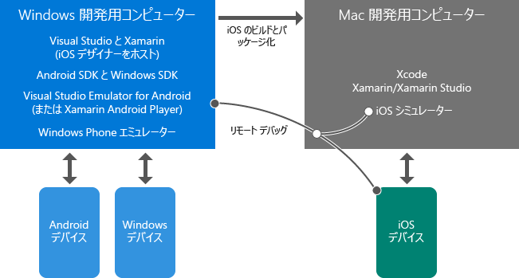

# Xamarin を使用したモバイル開発について学習します

このトピックでは、Xamarin を使用したクロス プラットフォーム モバイル アプリ開発を理解するのに役立つ概要の資料を提供します。 Visual Studio および Xamarinをまだインストールしていない場合は、まず [Setup and install](../cross-platform/setup-and-install.md) プロセスを開始して、ここに戻り、インストーラーの実行中にこれらのリソースを処理します。  
  
> [!NOTE]
> 明記されない限り、副次的なページではなく、ここに直接リンクしているページのみを最初に読むことをお勧めします。 インストール プロセスが、この一覧を表示した後もまだ実行している場合は、戻って他のトピックを検索してもかまいません。  
>   
> また、"要点" のマークの付いたトピックを参照したり、後で "詳細" トピックに戻ったりするのも自由です。  
  
## 要点: Xamarin の概要  

*10 分から 20 分*  
  
1.  [Xamarin を使用した Visual Studio におけるモバイル アプリ](https://www.visualstudio.com/explore/xamarin-vs) (visualstudio.com) は、Xamarin の主要な特性についての簡単な概要を提供します。  
  
2.  Xamarin を宣伝している James Montemagno 氏の[C# と Visual Studio を使用したクロスプラットフォーム モバイル アプリのビルド](https://channel9.msdn.com/Events/Visual-Studio/Visual-Studio-2015-Final-Release-Event/Building-cross-platform-mobile-apps-using-C-and-Visual-Studio-2015) (Channel 9、15 分 16 秒)。 最初の 3 分間は、Xamarin の概要、続けてコードのデモンストレーションです。  
  
## 要点: Visual Studio と Xamarin 環境の概要  

*5 分から 15 分*  
  
-   ほとんどの作業は、Visual Studio および Xamarin がインストールされている Windows コンピューターで行います。 このコンピューターで Windows および Android アプリを直接ビルドし、デバイスまたはエミュレーターでそれらを実行およびデバッグします。 また、Mac を使用して iOS アプリをリモートでビルド、実行、およびデバッグします。 Windows コンピューターの Visual Studio は、iOS Storyboard Designer や iOS シミュレーターにも接続できます。  
  
-   Xcode および Xamarin がある Mac は、iOS アプリ向けのビルド/署名ホスト、およびランタイム環境としての役割を果たします。 Windows コンピューターの Visual Studio からの iOS のビルドは、この Mac に委任されます。Visual Studio から iOS アプリをデバッグするときは、Mac の iOS シミュレーターか、または Mac に接続されているテザリングされたデバイスで直接実行されます。 この場合、Mac 上または Mac の近くでアプリとやり取りして、Visual Studio でデバッグ機能を実行します。  
  
これらの関係を次に示します。また、iOS アプリでの作業について詳しくは、「 [Introduction to Xamarin.iOS for Visual Studio](http://developer.xamarin.com/guides/ios/getting_started/installation/windows/introduction_to_xamarin_ios_for_visual_studio/) 」(xamarin.com) で読むことができます。  
  
  
  
## 要点: プロジェクトの構造化の方法  

*10 分から 30 分*  
  
1.  [コード共有のオプション](http://developer.xamarin.com/guides/cross-platform/application_fundamentals/building_cross_platform_applications/sharing_code_options/) (xamarin.com)。 すべてのターゲット プラットフォームでサポートされる .NET API のみの使用を最も良くサポートしているため、ポータブル クラス ライブラリのオプションを使用することをお勧めします。 ほとんどのビジネス ロジックのコードは、データベースへのアクセス、REST API の呼び出し、ポータブル Xamarin コンポーネントの呼び出し (このトピックの最後の「 [Deeper Dive: Xamarin Components](#components) 」を参照) を含めて、PCL に存在します。 Xamarin.Forms で記述された共通の UI コードは、PCL にも置くことができます。  
  
2.  (省略可能) [ケース スタディ: Tasky](http://developer.xamarin.com/guides/cross-platform/application_fundamentals/building_cross_platform_applications/case_study-tasky/) (xamarin.com) では、フル機能アプリのデザインと構造のベスト プラクティスを説明します。たとえば、データ、データ アクセス、ビジネスの各レイヤーを分離する共有コードのために PCL を使用してプロジェクトを構成するなどです。  
  
## 要点: ネイティブと Xamarin.Forms UI レイヤー  

*10 分から 40 分*  
  
Xamarin では、優れたネイティブ アプリを構築する Xamarin Native と Xamarin.Forms の 2 つの方法を提供します。  
  
Xamarin Native を使用して、iOS、Android、Windows の各ターゲット プラットフォームに個別の UI コードを記述します。  この方法では、プラットフォーム固有の API に直接アクセスでき、プラットフォームごとにカスタマイズされた UI エクスペリエンスが可能になります。  また、それぞれの UI の構築を支援するため、各プラットフォーム用のネイティブのデザイナーとコントロールのすべての機能を利用できます。  
  
Xamarin.Forms では、ポータブル クラス ライブラリですべてのプラットフォーム用の共有 UI レイヤーを記述できる汎用化された API セットを提供します。  Xamarin.Forms は各ターゲット プラットフォームのネイティブ コントロールに表示され、ネイティブの外観になります。  デザイナーを使用する代わりに、Xamarin.Forms を使用して、C# と XAML で UI を構築します。  
  
アプローチをあらかじめ決めておく必要はありません。Xamarin Native と Xamarin.Forms の両方を組み合わせてアプリを実装できます。  
  
-   Xamarin.Forms を使用して、プラットフォーム間で類似した UI と機能を提供する汎用目的の画面を構築します。たとえば、ログイン、連絡先フォーム、検索結果などです。  
  
-   プラットフォームごとに UI を調整するには、Xamarin.Forms のさまざまなカスタマイズ機能を使用します。 これらには、コードと XAML の両方から使用できる OnPlatform API が含まれ、カスタム ビューの作成、既存のレンダラーの拡張、カスタム レンダラーの作成を行います。  
  
-   必要に応じて、Xamarin Native を使用して、各プラットフォームの独自の UI 機能を使用する画面 (ネイティブのカメラ キャプチャとイメージの操作を使用する画面など) を構築します。  
  
必ず、まず Xamarin.Forms ソリューションを使用してプラットフォーム間での UI コード共有をセットアップしてから、カスタマイズ機能を使用してプラットフォーム固有の調整を行うようお勧めします。 完全にプラットフォーム固有の画面が必要な場合は、Xamarin Native を使用して個別に追加できます。  
  
詳細を表示：  
  
1.  [Xamarin.Forms](http://developer.xamarin.com/guides/cross-platform/xamarin-forms/) (xamarin.com) は、簡単な概要、および Xamarin.Forms とネイティブ UI レイヤー (つまり、Xamarin.iOS と Xamarin.Android) を比較した長所と短所を提供します。  
  
2.  James Montemagno 氏のビデオ「[Xamarin.Forms: Native iOS, Android & Windows apps with C# & XAML](https://channel9.msdn.com/events/Visual-Studio/Connect-event-2015/704)」 (Xamarin.Forms: C# と XAML を使用した、ネイティブの iOS、Android および Windows アプリ) (Channel9、13 分 3 秒) の最初の 3 分間では、別の構成で概要を紹介しており、それに続けてデモを見ることができます。  
  
3.  (省略可能) [Xamarin.Forms の概要](http://developer.xamarin.com/guides/cross-platform/xamarin-forms/getting-started/introduction-to-xamarin-forms/) (xamarin.com)  
  
4.  (省略可能) [デバイス クラス](http://developer.xamarin.com/guides/xamarin-forms/platform-features/device/) ドキュメント (xamarin.com) でカスタマイズに OnPlatform を使用する例をご覧ください。  
  
5.  (省略可能) Jason Smith による「 [クロスプラットフォーム - Xamarin.Forms を使用して UI コードをモバイル プラットフォーム間で共有する](https://msdn.microsoft.com/magazine/dn904669.aspx) 」(MSDN マガジン) では、Xamarin.Forms 内でのさまざまなカスタマイズ オプションの概要を説明します。それについて詳しくは、「 [各プラットフォームでコントロールをカスタマイズする](http://developer.xamarin.com/guides/xamarin-forms/custom-renderer/) 」(xamarin.com) で説明されています。  
  
## 詳細: エミュレーターでのデバッグ  

*10 分から 15 分*  
  
物理デバイスを使用せずにクロスプラットフォーム アプリをデバッグするには、次を使用する必要があります。  
  
1.  **Android エミュレーター** 使用している Windows のバージョンに応じて、Microsoft の Visual Studio Emulator for Android と Xamarin Player のいずれかをお勧めします。どちらも高速パフォーマンスを提供し、さまざまなデバイスの機能をサポートしています。  
  
    -   **Windows 8 以降のコンピューター:** Visual Studio と共にインストールされる Microsoft の [Visual Studio Emulator for Android](https://www.visualstudio.com/en-us/features/msft-android-emulator-vs.aspx)の使用を強くお勧めします。  [Visual Studio Emulator for Android](https://channel9.msdn.com/events/Visual-Studio/Connect-event-2015/711) ビデオ (Channel9、5 分 55 秒) は、概要とデモを提供します  
  
    -   **Windows 7 以前/Mac OS X で実行する Windows**: [Xamarin Android Player](http://developer.xamarin.com/guides/android/getting_started/installation/android-player) (xamarin.com) を使用します。  
  
2.  **Apple の iOS シミュレーター。** 詳しくは、「 [iOS シミュレーター入門](https://developer.apple.com/library/prerelease/content/documentation/IDEs/Conceptual/iOS_Simulator_Guide/GettingStartedwithiOSSimulator/GettingStartedwithiOSSimulator.html#//apple_ref/doc/uid/TP40012848-CH5-SW1) 」(apple.com) をお読みください。  
  
3.  **Microsoft の Windows Phone エミュレーター。** 詳しくは、「 [Windows Phone 8 用 Windows Phone エミュレーター](../debugger/run-windows-phone-apps-in-the-emulator.md)」をお読みください。  
  
##   Deeper Dive: Xamarin Components  

*10 分*  
  
多くの拡張機能は、Xamarin コンポーネントをとおして、Xamarin アプリで利用できます。 [http://components.xamarin.com/](http://components.xamarin.com/)でダウンロードできる完全なカタログを見つけることができます。それには、追加の UI コントロール、認証、Microsoft Azure などのさまざまなクラウド サービス、その他多数のコンポーネントが含まれます。