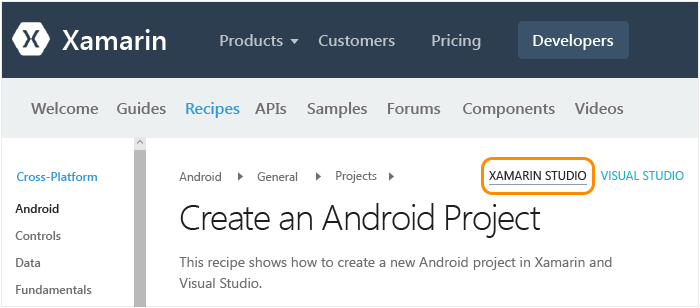
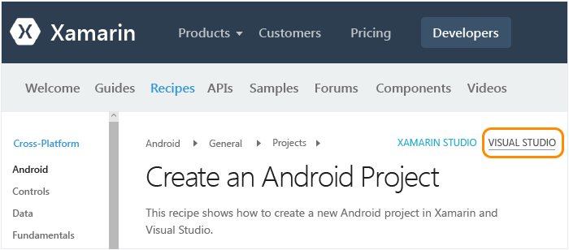

# Mac ユーザー向けのセットアップ、インストール、および 検証
このトピックは、主に Mac で作業し、Mac で Windows 仮想マシン内部の Visual Studio を必要に応じて使用する開発者を対象としています。 主に Windows コンピューターで作業する開発者であり、かつ iOS をターゲットとするためにセカンダリの Mac を設定する必要がある場合は、メインの「[Setup and install](../cross-platform/setup-and-install.md)」トピックをご覧ください。

 Mac で Xamarin を操作するには、次の条件が必要です。

-   macOS Sierra 10.12 以降が搭載され、Xcode と Xamarin がインストールされている Mac。

-   次の構成のいずれか。

    -   **Mac 上で直接 Xamarin Studio を実行する場合:** Xamarin Studio は、C# を使用した Android、iOS、および Windows のアプリ作成をサポートする Xamarin の開発環境です。  Xamarin Studio の概要をすばやく確認するには、「 [Xamarin Studio の概要](https://xamarin.com/studio) 」(xamarin.com) を参照してください。

    -   **既に Parallels または VMWare が Mac に構成されている場合:** Parallels または VMWare 内の Visual Studio 2017 と Xamarin で Windows を実行します。  この構成では、Xamarin は拡張機能であり、C# を使用して Android、iOS、および Windows のアプリを作成するための開発環境として Visual Studio を使用する機能を提供する Visual Studio と共にインストールされます。  Visual Studio Developer Essentials プログラムの一部として、3 か月無料の Parallels サブスクリプションを取得できます。 「 [Microsoft Visual Studio Dev Essentials には、Parallels Desktop Pro と Parallels Access が含まれます](http://blog.parallels.com/blog/2015/11/18/visual-studio-dev-essentials/) 」(Parallels ブログ) を参照してください。

 このトピックでは、これらの要件について説明します。  インストール プロセスの実行中に、トピック「[Xamarin を使用したモバイル開発について学習します](../cross-platform/learn-about-mobile-development-with-xamarin.md)」を参照して、必要な背景情報に注目することができます。

##   Mac のセットアップ (Apple ID、Xcode、および Xamarin)

1.  [My Apple ID](https://appleid.apple.com/) で無料の Apple ID を作成します (まだ作成していない場合)。 これは Xcode をインストールしてサインインするために必要です。

2.  [https://developer.apple.com/xcode/](https://developer.apple.com/xcode/)から Xcode をダウンロードしてインストールします。

3.  「 [Xamarin.iOS のダウンロードとインストール](http://developer.xamarin.com/guides/ios/getting_started/installation/mac/) 」(xamarin.com) の手順に従って、Xamarin をダウンロードしてインストールします。

4.  Windows と Mac のコンピューターの両方に Xamarin をインストールしたら、「[XMA を使用した Mac への接続](http://developer.xamarin.com/guides/ios/getting_started/installation/windows/#Connecting_to_the_Mac_Using_XMA)」(xamarin.com) の手順に従って、Windows コンピューター上の Visual Studio から iOS と Mac を扱えるようにします。

##   Parallels (Visual Studio と Xamarin) 内での Windows のセットアップ

1.  Parallels/VMWare 内に構成した Windows デスクトップを使用して、 [任意のエディションの Visual Studio 2017 のインストーラーをダウンロードして起動します](https://www.visualstudio.com/downloads/) (Community、Professional、または Enterprise)。 Visual Studio 2017 Community は、無償のエディションです。Professional および Enterprise の各エディションは評価版として 30 日間使用できます。

2.  インストーラー内で **[起動]** の_横にある_ **[その他の選択項目]** (横線 3 本のアイコン) ボタンをクリックし、**[変更]** を選択します。  
  
     ![Visual Studio のインストールで [変更] オプションを選択する](../cross-platform/media/cross-plat-xamarin-setup-1a.png "クロスプラットフォームの Xamarin セットアップ 1")  
  
3.  次のチェック ボックスを選択します。

    1.  **[Mobile & Gaming (モバイルとゲーム)] > [.NET によるモバイル開発]**。 これにより、[共通のツールとソフトウェア開発キット] の下のさまざまな Android ツールも自動的に選択されます。 このオプションでは、既存の Xamarin インストールも更新されるはずです。  
  
         ![[Gaming and Mobile Development (ゲームとモバイル開発)] の [モバイル開発] オプションを選択する](../cross-platform/media/cross-plat-xamarin-setup-2a.png "クロスプラットフォーム Xamarin セットアップ 2")  
  
    2. (省略可能) **[Windows] > [ユニバーサル Windows プラットフォーム開発]**。 これには、ダウンロードに時間がかかるエミュレーター イメージをインストールするためのオプションが含まれています。いつでも Visual Studio インストーラーに戻って後で追加できます。  

4.  **[変更]** ボタンをクリックし、プロセスを実行します。 このプロセスでも、完了までにしばらく時間がかかります。その間、Mac のセットアップ手順を続行し、「[Xamarin を使用したモバイル開発について学習します](../cross-platform/learn-about-mobile-development-with-xamarin.md)」を読むことができます。

5.  インストールが完了したら、Visual Studio を起動し、アカウントを求められたら Microsoft アカウントでサインインします (これは Windows で使用するのと同じアカウントです)。

6.  Windows と Mac のコンピューターの両方に Xamarin をインストールしたら、「[XMA を使用した Mac への接続](http://developer.xamarin.com/guides/ios/getting_started/installation/windows/#Connecting_to_the_Mac_Using_XMA)」(xamarin.com) の手順に従って、Windows コンピューター上の Visual Studio から iOS と Mac を扱えるようにします。

##   環境の確認
 インストーラーが完了したら、数分をかけて、Xamarin 開発を実行するための準備ができているかどうかを確認します。

### Xamarin Studio
 まず初めに、提供されたリンクへの移動時に、右上隅で **Xamarin Studio** が選択され、適切なバージョンの Xamarin ドキュメントが表示されていることを確認します。

 

**Outlook Web Access (OWA)**

1.  「 [Android プロジェクトの作成](http://developer.xamarin.com/recipes/android/general/projects/create_an_android_project/) 」(xamarin.com) の手順に従って、Android プロジェクトの作成を検証します。

2.  [Android エミュレーター > Xamarin Studio ドキュメントとの統合](https://developer.xamarin.com/guides/android/getting_started/installation/android-player/#Integration_with_Xamarin_Studio) (xamarin.com) を通して、Android Player でのデバッグを検証します。

**iOS**

1.  「 [iOS の作成](http://developer.xamarin.com/recipes/ios/general/projects/create_an_ios_project/) 」(xamarin.com) の手順に従って、iOS プロジェクトの作成を検証します。

2.  「 [シミュレーターのドキュメントでのデバッグ](https://developer.xamarin.com/guides/ios/deployment,_testing,_and_metrics/debugging_in_xamarin_ios/#Debugging_on_the_Simulator) 」(xamarin.com) を通して、iOS シミュレーターでのデバッグを検証します。

### Visual Studio
 まず初めに、提供されたリンクへの移動時に、右上隅で **Visual Studio** が選択され、適切なバージョンの Xamarin ドキュメントが表示されていることを確認します。

 

**Android**

1.  「 [Android プロジェクトの作成](http://developer.xamarin.com/recipes/android/general/projects/create_an_android_project/) 」(xamarin.com) の手順に従って、Android プロジェクトの作成を検証します。

2.  Android デザイナーの検証: ソリューション エクスプローラーの Android プロジェクトで、**[リソース] > [レイアウト] > [Main.axml]** ファイルを開きます。

    -   「インストールされている Android SDK が古すぎます」というエラーが発生した場合は、メッセージ内の **[Android SDK を開く]** をクリックして、利用可能な最新の SDK バージョンを選びます。 SDK を更新するには、管理者として Visual Studio を実行している必要があることに注意してください。

3.  Mac にインストールされているエミュレーターに Visual Studio から接続できることを検証します。  この結果、デバッグ用に Visual Studio 内から選択できるエミュレーターの一覧に Xamarin Player が表示されます。  これを行うには、「 [Visual Studio を Xamarin Android Player に接続する](http://developer.xamarin.com/guides/android/deployment,_testing,_and_metrics/android-player-with-visual-studio-in-vm/) 」(xamarin.com) の手順に従います。

**iOS**

1.  「[Connecting to the Mac](https://developer.xamarin.com/guides/ios/getting_started/installation/windows/#Connecting_to_the_Mac)」(xamarin.com) で説明されているように、ネットワーク上で Mac が利用でき、Visual Studio とペアになっていることを確認してください。

2.  「 [iOS の作成](http://developer.xamarin.com/recipes/ios/general/projects/create_an_ios_project/) 」(xamarin.com) の手順に従って、iOS プロジェクトの作成を検証します。

3.  ストーリーボード デザイナーの検証: ソリューション エクスプローラーの iOS プロジェクトで、 **MainStoryboard.storyboard** ファイルを開きます。 ここでは、Visual Studio が Mac でリモート実行されているデザイナーをホストしています。

4.  ビルドとデバッグの検証:

    1.  ソリューション エクスプローラーで iOS プロジェクトを右クリックして **[スタートアップ プロジェクトに設定]**を選択します。

    2.  次に示すように、Visual Studio のビルド ドロップダウン リストで **iPhoneSimulator** のターゲットを選びます。 シミュレーターが表示されていない場合は、Mac で Xcode を起動し、**[Xcode] > [ユーザー設定]** の順に選び、**[ダウンロード]** をクリックします。 **[コンポーネント]** の下に、ダウンロード可能なシミュレーターのバージョンが表示されます。 デバッグに関する詳しい説明については、Xamarin の「[デバッグ](https://developer.xamarin.com/guides/ios/deployment,_testing,_and_metrics/debugging_in_xamarin_ios/#Debugging_on_the_Simulator)」ページ (xamarin.com) を参照してください。

         

    3.  次に示すように、Visual Studio のデバッグ ドロップダウン リストで iPhone のターゲットを選び、F5 キーを押してデバッガーを開始します。 これによって、Mac 上のシミュレーターが起動し、Visual Studio でのデバッグ中にアプリを操作できるようになります。

         