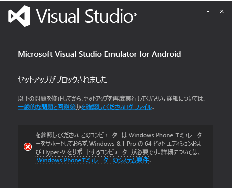
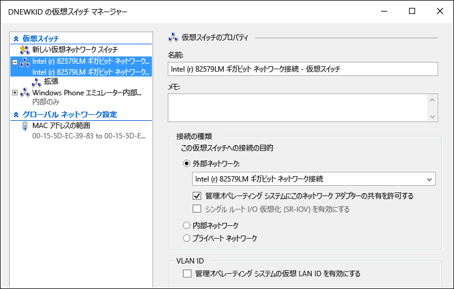

# Troubleshooting the Visual Studio Emulator for Android
このトピックには、Visual Studio Emulator for Android の使用時に発生する可能性のある問題の解決に役立つ情報が含まれています。  
  
> [!WARNING]
>  エミュレーターがインストールされている場合は、セットアップ プログラムがソフトウェア実行の前提条件をチェックします。 前提条件が存在しない場合、警告が表示されますが、インストールでは必要ありません。  
  
 このトピックは、次のセクションで構成されています。  
  
-   [開始する前に](#BeforeYouStart)  
  
-   [エミュレーターをインストールできない](#NoInstall)  
  
-   [ドメインまたは企業ネットワーク上のネットワーク接続先に接続できません](#DomainNetwork)  
  
-   [ネットワーク設定で手動構成が要求されている場合に、ネットワーク上の接続先に接続できません](#ManualNetworkConfig)  
  
-   [エミュレーターの起動に時間がかかるか、タイムアウトによって起動が失敗するか、アプリを配置できません](#SlowStart)  
  
-   [エミュレーターを起動できません](#NoStart2)  
  
-   [Emulator fails to start (first use)](#NoStart)  
  
-   [エミュレーターのインストール後にコンピューターを起動できません](#NoBoot)  
  
-   [Visual Studio がエミュレーターにアプリを配置しようとして行き詰まっているか、エミュレーターが他の IDE でデバッグ ターゲットとして表示されません。](#ADB)  
  
-   [UDP ポートを設定できなかったため、エミュレーターがハングします](#XamarinPlayer)  
  
-   [Xamarin プロジェクトにデバッガーをアタッチできません](#Skylake)  
  
-   [エミュレーターが Google Play サービスを使用するアプリを実行できません](#GooglePlay)  
  
-   [ファイル、APK、フラッシュ可能な zip ファイルのドラッグ アンド ドロップが機能しない](#DragAndDrop)  
  
-   [スクリーン ショットの解像度が正しくありません](#Resolution)  
  
-   [エミュレーターが OpenGL のコンテンツをレンダリングできません](#OpenGL)  
  
-   [エミュレーターがマルチタッチ ジェスチャに応答しません](#Multitouch)  
  
-   [サポート リソース](#Support)  
  
##   開始する前に  
 トラブルシューティングを開始する前に、次のトピックを参照すると便利です。  
  
-   [System Requirements for the Visual Studio Emulator for Android](../cross-platform/system-requirements-for-the-visual-studio-emulator-for-android.md)  
  
##   エミュレーターをインストールできない  
 Hyper-V がインストールされていないと、エミュレーターのインストール時に次のメッセージが表示されます。 HyperV がコンピューターでサポートされていて、有効になっていなければなりません。  
  
   
  
> [!NOTE]
>  このメッセージは、Visual Studio Emulator for Android と Windows Phone エミュレーターの両方に適用されます。 Windows 8.1 と Windows 10 はエミュレーターをサポートします。  
  
 このメッセージが表示された場合は、 [System Requirements for the Visual Studio Emulator for Android](../cross-platform/system-requirements-for-the-visual-studio-emulator-for-android.md) を確認して、エミュレーターを実行できるかどうかを確認します。  
  
##   ドメインまたは企業ネットワーク上のネットワーク接続先に接続できません  
 Visual Studio Emulator for Android は、独自の IP アドレスを持つ独立したデバイスとしてネットワーク上に表示されます。 これは Windows ドメインに参加せず、ドメインやワークグループの資格情報をホスト コンピューターと共有しません。  
  
 ネットワークで基本的なネットワークおよびインターネット接続のためにドメインまたはワークグループ認証を要求している場合は、IT 管理者に例外について問い合わせてください。 この例外により、開発用コンピューターは境界マシンとして機能できるようになり、エミュレーターのようなドメインに参加していないネットワーク デバイスからの接続を受け付けるようになります。  
  
 また、Visual Studio Emulator for Android は独自の MAC アドレス セットを使用します エミュレーターからネットワークまたはインターネット リソースにアクセスできない場合は、IT 管理者に問い合わせて、エミュレーターの MAC アドレスがネットワークで承認されていることを確認してください。  
  
#### エミュレーターの MAC アドレスを表示するには  
  
1.  エミュレーターを起動します。  
  
2.  エミュレーターのツール バーで、シェブロン ボタン (>>) をクリックして [その他のツール] ウィンドウを開きます。  
  
3.  [その他のツール] ウィンドウで、[ネットワーク] タブをクリックします。  
  
4.  [ネットワーク] ページで、物理アドレス エントリを探します。  
  
##   ネットワーク設定で手動構成が要求されている場合に、ネットワーク上の接続先に接続できません  
 エミュレーターからネットワーク上の接続先に接続するには、ネットワークが次の要件を満たしている必要があります。  
  
-   DHCP。 エミュレーターは、独自の IP アドレスでネットワーク上に個別のデバイスとして自動的に構成されるため、DHCP が必要です。  
  
-   自動的に構成された DNS およびゲートウェイの設定。 エミュレーターの DNS およびゲートウェイ設定を手動で構成することはできません。  
  
 ネットワークで手動構成の設定が必要な場合は、IT 管理者に問い合わせて、エミュレーターのネットワーク接続を可能にする方法を確認してください。  
  
##   エミュレーターの起動に時間がかかるか、タイムアウトによって起動が失敗するか、アプリを配置できません  
 特定の状況においては、エミュレーターの起動に数分かかることや、タイムアウトによって起動が失敗することがあります。 エミュレーターが起動に失敗すると、”`App deployment failed. Please try again`” というメッセージが表示されます。 このエラーの原因として、次のような状況が考えられます。  
  
-   起動可能な VHD から Visual Studio Emulator for Android を実行している。 この構成はサポートされていません。"と言うメッセージが表示されます。  
  
-   ハード ドライブの不良。 chkdsk プログラムの実行を検討してください。  
  
-   ハード ドライブのデフラグが必要。 ドライブのデフラグを検討してください。  
  
-   ハード ドライブがほぼ満杯。 ドライブの空き容量を確認してください。  
  
-   他のアプリケーションが実行されているため、使用可能なメモリが十分ではない。 メモリを消費しているアプリケーションの数を減らすか、メモリの量を増やしてください。  
  
-   一般的にシステムのパフォーマンス低下に関係するあらゆる要因。 Windows エクスペリエンス インデックスで最も低いサブスコアを持つコンポーネントからトラブルシューティングを開始します。該当するコンポーネントは [コントロール パネル] の [パフォーマンスの情報とツール] ページで見つけることができます。  
  
##   エミュレーターを起動できません  
 以前はエミュレーターが動作しており、現在は動作しない場合は、次のタスクを実行します。 初めてエミュレーターを使う場合は、次の手順を実行する前に「 [Emulator fails to start (first use)](#NoStart) 」をご確認ください。  
  
-   エミュレーターの他のすべての Hyper-V インスタンスを削除します。  
  
    1.  Visual Studio を閉じます。  
  
    2.  Hyper-V マネージャーを開き、既に実行されており、場合によっては破損状態にあるエミュレーター (仮想マシン) の Hyper-V インスタンスを停止します。  
  
    3.  Hyper-V マネージャーで、他のすべてのエミュレーターの VM を削除します。  
  
    4.  コンピューターを再起動します。  
  
-   少なくとも 4 GB のシステム メモリがあり、リソースを大量に消費する他のプログラムおよびプロセスによって消費されていないことを確認します (例：ブラウザーのウィンドウを閉じる)。  
  
-   Hyper-V マネージャーで仮想スイッチ マネージャーを開き、2 つのネットワーク スイッチがあることを確認します。最初のスイッチが内部スイッチで、2 つ目が外部スイッチであることをご確認ください。  
  
       
  
     セットアップに誤りがあり、Windows 10 を使っている場合は、 [netcfg -d コマンドを使ってネットワーク デバイスを再インストール](http://windows.microsoft.com/en-us/windows-10/fix-network-connection-issues) (セクション 6) してみることもできます。  
  
-   これらの手順を実行しても問題が解決しない場合は、エミュレーターに干渉している可能性のあるサード パーティ ソフトウェアの情報について、「 [Emulator fails to start (first use)](#NoStart) 」をご覧ください。  
  
##   Emulator fails to start (first use)  
 エミュレーターが起動しない場合は、次のタスクを順に実行して、問題を特定して解決します。  
  
-   ハードウェアの最小要件を満たしていることと、BIOS 設定が正しいことを確認します。  
  
     エミュレーターと Windows 8 Hyper-V には、第 2 レベルのアドレス変換 (SLAT) をサポートする 64 ビット プロセッサが必要です。 Intel では、本質的に Core i3、i5 または i7 プロセッサが必要です (または多くの Xeon のいずれか)。 AMD のチップの一覧は [こちら](http://support.amd.com/en-us)です。  
  
    1.  コンピューターが [システム要件](../cross-platform/system-requirements-for-the-visual-studio-emulator-for-android.md)を満たしていることを確認します。  
  
    2.  [SLAT ツール](https://slatstatuscheck.codeplex.com/) によって、コンピューターが SLAT 対応であることがレポートされていることを確認します。  
  
    3.  コンピューターの BIOS 設定で、すべての仮想化テクノロジが有効になっていることを確認します。 BIOS の正確な記述はハードウェアの製造元によって異なる場合があります。 通常は、以下に関する機能を有効にします。  
  
        -   SLAT (第 2 レベルのアドレス変換)  
  
        -   EPT (Extended Page Tables) (Intel)  
  
        -   NPT (Nested Page Tables) (AMD)  
  
        -   RVI (Rapid Virtualization Indexing) (AMD)  
  
        -   VMX (ハードウェア支援による仮想化機能のサポートを示す Intel の頭字語)  
  
        -   SVM (ハードウェア支援による仮想化機能のサポートを示す AMD の頭字語)  
  
        -   XD (Execute Disable) (Intel)。これを有効にする必要があります。  
  
        -   NX (Execute) (AMD)。これを有効にする必要があります。  
  
    4.  BIOS に次のオプションが存在する場合は、無効にします。  
  
        -   Intel VT-d を無効にする  
  
        -   Trusted Execution を無効にする  
  
         詳細については、TechNet の記事「Hyper-v を有効にして BIOS エラーを修正する方法」を参照してください。  
  
    5.  少なくとも 4 GB のシステム メモリがあり、リソースを大量に消費する他のプログラムおよびプロセスによって消費されていないことを確認します。  
  
    6.  Windows 8 Professional 以上を実行していることを確認します (Windows Server 2008 はサポートされていません)。 Windows Server 2012 はサポートされていますが、デスクトップ エクスペリエンスを有効にする必要があります。  
  
     イベント ビューアーを調べて、ハイパーバイザーのエラーがないかどうかを確認することができます。 これを行うには、イベント ビューアーを開き (スタート キーを押しながら R キーを押して、「 `eventvwr`」と入力)、 **[Windows ログ]**、 **[システム]**を選択します。 次に、ソースを **Hyper-V ハイパーバイザー**に設定して、イベント ソースでログをフィルタリングします。 エラー確認は、根本原因の特定に役立ちます。  
  
     プロセッサが最小要件を満たしているにもかかわらず、ハイパーバイザーでまだ障害が発生する場合は、コンピューターに使用可能な BIOS アップグレードがあるかどうかを確認してみてください。 アップグレードがあり、アップグレードすることを選択する場合は、BIOS のアップグレード時に製造元からの注意事項 (BIOS が完全に破損する可能性のある、停電により BIOS ファームウェアのアップグレードが中断されないようにするなど) をすべて確認してください。  
  
-   少なくとも 4 GB のシステム メモリがあり、リソースを大量に消費する他のプログラムおよびプロセスによって消費されていないことを確認します。  
  
-   仮想ネットワークに干渉する場合があるサード パーティ製ドライバーまたはソフトウェアを削除または無効にします。  
  
     Hyper-V ネットワーク スタックと完全に互換性がないネットワーク ドライバーやプロトコルなど、Windows 8 にインストールされている一部のサード パーティ製品に関する既知の問題がいくつかあります。  
  
     一般に、Windows 8 および Hyper-V と互換性のあるソフトウェアを更新するかどうかは、製品の開発者の責任となります。  
  
     Windows 8 と互換性を持たせるためにアップグレードが必要になる可能性がある製品には、VirtualBox、Virtual PC 7、VMWare、一部の VPN クライアント、ソフトウェア ファイアウォール、一部のバージョンの Cisco VPN クライアント、およびその他の仮想化システムがあります。 問題のある仮想化ソフトウェアの開発者と協力して、ソフトウェアをアップグレードし、Windows 8 および Hyper-V と互換性を持たせるようにしてください。  
  
     **回避策**として、Visual Studio との通信のためにエミュレーターで使用される仮想ネットワークに干渉している可能性があるすべてのサード パーティ製のドライバーとアプリケーションを無効にすることができます。 これらのアプリケーションには以下のようなものがあります。  
  
    -   ウイルス対策アプリケーション (ネットワーク スタックにフックする)  
  
    -   ネットワーク監視ツール  
  
    -   ネットワーク ログ ツール  
  
    -   その他のシステム監視ソフトウェア  
  
     問題のある製品のアンインストール (および製品開発者への更新版のリリースの要求) 以外に考えられる別の回避策では、次の手順を実行します。  
  
    1.  ネットワーク接続マネージャーを起動します (スタート画面から「 `View Network Connections` 」と入力し、このオプションを選択してネットワーク接続を表示)。  
  
    2.  vEthernet (Internal Ethernet Port Windows Phone Emulator Internal Switch) アダプターの場合は、コンテキスト メニューから **[プロパティ]** を選択します。  
  
           
  
         ここでアダプター プロパティが表示されます。  
  
           
  
    3.  このアダプターの場合、 **[この接続は次の項目を使用します]** で選択する必要があるのは以下の項目のみです。  
  
        -   Microsoft ネットワーク用クライアント  
  
        -   QoS パケット スケジューラ  
  
        -   Microsoft ネットワーク用ファイルとプリンター共有  
  
        -   Microsoft LLDP Protocol Driver  
  
        -   Link-Layer Topology Discovery Mapper I/O Driver  
  
        -   Link-Layer Topology Discovery Responder  
  
        -   インターネット プロトコル バージョン 6 (TCP/IPv6)  
  
        -   インターネット プロトコル バージョン 4 (TCP/IPv4)  
  
    4.  その他の項目の選択は解除します。  
  
     この手法を使用する場合の欠点は、新しいサード パーティ製品でサポートされていないドライバーがインストールされるたび、またはエミュレーターがインストールされるたびに、これらの手順を繰り返す必要があることです。  
  
     サード パーティ製品をアンインストールした後で、Windows Phone Emulator Internal Switch を復元する必要があります。 これを行うには、次のようにします。  
  
    -   Hyper V を開き、仮想スイッチ マネージャーに移動します。 「Windows Phone Emulator Internal Switch」という名前の仮想スイッチを作成し、その接続の種類を **内部ネットワーク**に設定します。  
  
           
  
     ここでエミュレーターを起動します。 エミュレーターが作動します。  
  
##   エミュレーターのインストール後にコンピューターを起動できません  
 この問題は、次の条件に該当する場合に発生する可能性があります。  
  
-   コンピューターに Gigabyte マザーボードがある。  
  
-   USB3 がマザーボードで有効になっている。  
  
 この問題を解決するには、マザーボードの BIOS 設定で USB3 を無効にして、コンピューターを再起動します。 次に、Gigabyte からマザーボードの BIOS の更新プログラムがリリースされているかどうかを確認します。  
  
 詳細については、サポート技術情報の記事「 [Gigabyte システムで Hyper-V ロールのインストール後に起動できない](https://support.microsoft.com/en-us/kb/2693144)」を参照してください。  
  
##   Visual Studio がエミュレーターにアプリを配置しようとして行き詰まっているか、エミュレーターが他の IDE でデバッグ ターゲットとして表示されません。  
 エミュレーターが実行されていても、ADB (Android Debug Bridge) に接続されているように見えない、または ADB を利用する Android ツール (Android Studio や Eclipse など) 内で見えない場合は、エミュレーターが ADB を検索する場所を調整する必要があります。 エミュレーターはレジストリ キーを使用して、Android SDK の基本場所を識別し、そのディレクトリで \platform-tools\adb.exe ファイルを検索します。 エミュレーターで使用される Android SDK パスを変更するには、次のようにします。  
  
-   スタート ボタンのコンテキスト メニューから **[ファイル名を指定して実行]** を選択して、ダイアログ ボックスに「 `regedit` 」と入力し、 **[OK]**を選択してレジストリ エディターを開きます。  
  
-   左側のフォルダー ツリーで、HKEY_LOCAL_MACHINE\SOFTWARE\Wow6432Node\Android SDK ツールに移動します。  
  
-   Android SDK へのパスと一致するように **パス** レジストリ変数を変更します。  
  
 エミュレーターを再起動します。これで、ADB と関連する Android ツールにエミュレーターが接続されていることを確認できるはずです。  
  
##   UDP ポートを設定できなかったため、エミュレーターがハングする  
 Xamarin Player との互換性がないためにこの問題が発生する可能性があります。 エミュレーターがハングしているように見えたり、"エミュレーターがデバイスのオペレーティング システムに接続できません。UDP ポートを設定できませんでした。  一部の機能が無効になっている可能性があります。" というエラー メッセージが表示されたりした場合は、この問題が発生している可能性があります。 次の手順を実行します。  
  
1.  Xamarin Player をアンインストールします。  
  
2.  仮想ボックスが削除されていることを確認します (Xamarin Player は仮想ボックス上で実行されます)。  
  
3.  デバイス マネージャーに移動し、非表示のデバイスを表示するオプションを選び、物理ネットワーク カードを除くすべての項目を削除します。  
  
4.  非物理ネットワーク アダプターの削除後に Hyper-V をアンインストールまたは再インストールします。  
  
##   Xamarin プロジェクトにデバッガーをアタッチできません  
 Intel Skylake プロセッサを搭載した Windows 10 を使用している場合は、エミュレーターで Xamarin アプリの実行が失敗するか、Visual Studio デバッガーがアプリにアタッチしない可能性があります。 これは、Hyper-V と Skylake プロセッサの問題によるものです。 回避策として次の手順を実行してください。  
  
1.  Hyper-V マネージャーを開き、使用しているエミュレーター プロファイルの VM を選択します。  
  
2.  **[保存された状態の削除]**(右下) を選択します。  
  
3.  **[設定...]** を選択します。  
  
4.  プロセッサ ノードを展開し、**[互換性]** を選択します。  
  
5.  **[プロセッサ バージョンが異なる物理コンピューターへ移行する]** を有効にします。  
  
6.  サービスを (**[操作]** で) 再起動し、もう一度試します。  
  
##   エミュレーターが Google Play サービスを使用するアプリを実行できません  
 エミュレーターには Google Play サービスのライブラリは付属していません。 ただし、エミュレーターはフラッシュ可能な zip ファイルのドラッグ アンド ドロップ インストールをサポートします。  
  
##   ファイル、APK、フラッシュ可能な zip ファイルのドラッグ アンド ドロップが機能しない  
 エミュレーターは、画面にファイルをドラッグ アンド ドロップする際にファイル転送を容易にするために、ADB.exe を使用します。 ファイルをドラッグ アンド ドロップしようとしたときにエラーが発生した場合、おそらく、エミュレーターは ADB.exe に接続されていません。 解決するには、 [Visual Studio がエミュレーターにアプリを配置しようとして行き詰まっているか、エミュレーターが他の IDE でデバッグ ターゲットとして表示されません。](#ADB)です。  
  
##   スクリーン ショットの解像度が正しくありません  
 **[その他のツール]** ウィンドウの [スクリーン ショット] タブを使用してスクリーン ショットを取得し、結果のイメージが予期しないサイズの場合、 **[キャプチャ]**を選択する前に画面のズーム レベルを調整する必要があります。 エミュレーターはホスト PC モニターの画面の解像度でスクリーン ショットを取得します。  
  
##   エミュレーターが OpenGL のコンテンツをレンダリングできません  
 エミュレーターはホスト マシンの GPU を使用して OpenGL のコンテンツをレンダリングし、ANGLE プロジェクトを使用して DirectX 間でこれらの呼び出しを変換します。 アプリケーションがデバイスでは正しくレンダリングするが、エミュレーターでは正しくレンダリングしない場合、デバイスが不適切な OpenGL 呼び出し (一致しないシェーダー変数を使用するなどして) を軽減している可能性があります。  
  
##   エミュレーターがマルチタッチ ジェスチャに応答しません  
 タッチ対応画面からの直接対話またはエミュレーター ツールバーのマルチタッチ ツールを使用して、エミュレーターを起動すると、マルチタッチに応答しない場合があります。 この場合は、エミュレーター ツールバーの **[回転]** ボタンを選択して、マルチタッチをもう一度使用してみてください。 問題が解決しない場合は、「 [エミュレーターが OpenGL のコンテンツをレンダリングできません](#OpenGL) 」の問題を参照してください。  
  
##   サポート リソース  
 ホスト コンピューターがシステム要件を満たしていて、このトラブルシューティング ガイドに記載されていない問題が発生した場合は次のようにします。  
  
-   [android エミュレーター](http://stackoverflow.com/questions/tagged/android-emulator) と visual-studio タグの試用について StackOverflow で質問を投稿します。  
  
-   Visual Studio またはエミュレーター マネージャーで、[気に入った機能の報告] を使用して、問題を報告します。
