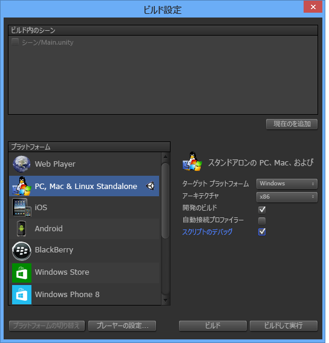

# Visual Studio Tools for Unity を使用する
このセクションでは、Visual Studio Tools for Unity の統合と生産性の機能の使用法、および Unity 開発における Visual Studio デバッガーの使用法について取り上げます。  

## Unity の統合と生産性  
 Visual Studio Tools for Unity は、生産性を向上させるために、Unity エディターと統合されています。 これらの生産性を向上させる機能により、スクリプト作成の一般的なタスクが自動化されます。また、Unity から Visual Studio に情報が送られるので、そのような情報を見つけるために Unity エディターに切り替える必要がありません。  

### Unity のドキュメントへのアクセス  
 Visual Studio から簡単に Unity スクリプトに関するドキュメントにアクセスできます。 Visual Studio Tools for Unity は、ローカルの API ドキュメントを見つけられない場合、ドキュメントをオンラインで検索することを試みます。  

##### Unity のドキュメントにアクセスするには  

-   Visual Studio で、情報を必要とする Unity API を選択するか、その上にカーソルを置き、**Ctrl + Alt + M、Ctrl + H** キーの順に押します。  

### Unity MonoBehavior のスクリプト作成ウィザード  
 Unity では、ほとんどのスクリプトを、MonoBehavior クラスを継承し、そのメソッドの一部をオーバーライドすることにより実装します。 MonoBehavior ウィザードを使用すると、オーバーロード元にする MonoBehavior メソッドの空の定義を素早く作成できます。 このウィザードを使用して、使用可能なメソッドの一覧からオーバーロードする 1 つ以上のメソッドを指定し、それをコードのどの場所に挿入するかを選択し、使用方法についてのコメントを含めるかどうかを決定できます。  

   

##### MonoBehavior ウィザードを使用して空の MonoBehavior メソッド定義を作成するには  

1.  Visual Studio で、メソッドの挿入位置にカーソルを合わせてから、**Ctrl + Shift + M** キーを押して MonoBehavior ウィザードを起動します。 または、既に実装されているメソッドの後に新しいメソッドを挿入する場合は、それを後のステップで指定できるので、とりあえず **Ctrl + Shift + M** キーを押します。  

2.  オーバーロードするメソッドを選択します。 **[スクリプト メソッドの作成]** ウィンドウの **[作成方式の選択]** の下で、オーバーロードする各メソッドの名前の横にあるチェック ボックスをオンにします。  

3.  **[Framework のバージョン]** ドロップダウンに表示されているフレームワークのバージョンが、使用しているバージョンと一致していることを確認します。 一致していない場合は、ドロップダウンの値を、使用するバージョンに変更します。  

4.  メソッドを挿入する場所を選択します。 既定では、メソッドはカーソルの位置に挿入されます。別の場所に挿入する場合は、クラスで既に実装されている任意のメソッドの後に挿入することができます。 これらの場所のいずれかを選択するには、**[挿入ポイント]** ドロップダウンの値を目的の場所に変更します。  

5.  選択したメソッドについてウィザードがコメントを生成するように指定するには、**[メソッドのコメントを生成]** チェック ボックスをオンにします。 これらのコメントは、メソッドを呼び出すタイミングやメソッドの全般的な役割について説明するためのものです。  

6.  **[OK]** ボタンを選択すると、ウィザードが終了し、コードにメソッドが挿入されます。  

 MonoBehavior ウィザードは、Unity API を使い始めた時や、慣れていないメソッドをオーバーロードする必要がある場合に特に役立ちます。 Unity API の使用経験が増してからは、既に使い慣れたメソッドを素早く作成するために、クイック MonoBehavior ウィザードのほうを利用することもできます。  

#### クイック MonoBehavior スクリプト作成ウィザード  
 既に Unity API を使い慣れている場合は、クイック MonoBehavior ウィザードを使用すれば、オーバーロードされたメソッドをさらに迅速に実装できます。 このウィザードを使用すると、1 つのメソッドを指定して、カーソル位置に、メソッドのコメントなしで挿入できます。  

   

###### クイック MonoBehavior ウィザードを使用して空の MonoBehavior メソッド定義を作成するには  

1.  Visual Studio で、メソッドの挿入位置にカーソルを合わせてから、**Ctrl + Shift + Q** キーを押してクイック MonoBehavior ウィザードを起動します。 もう 1 つの MonoBehavior ウィザードとは違って、このウィザードでは新しいメソッドがいつもカーソル位置に挿入されるので、使用時にカーソルを目的の位置に置く必要があります。  

2.  **[スクリプト メソッドの作成]** ウィンドウの右上隅に表示されているフレームワークのバージョンが、使用しているバージョンと一致していることを確認します。 一致していない場合は、ドロップダウンの値を、使用するバージョンに変更します。  

3.  オーバーロードするメソッドを見つけます。 それには、スクリプト メソッドの作成ウィンドウでテキスト ボックスにメソッド名を入力します。 入力し始めた文字に名前が一致するメソッドの一覧が表示されます。  

4.  オーバーロードするメソッドを選択します。 必要なメソッドが一覧に表示されている場合は、マウスまたは方向キーを使用してメソッドを選択し、**Enter** キーを押します。 一覧に表示されているメソッドが 1 つだけの場合は、**Enter** キーを押すだけです。 メソッドがコードに挿入されます。  

### Unity プロジェクト エクスプローラー  
 Unity プロジェクト エクスプローラーを使用すると、Visual Studio から Unity プロジェクト内を移動できます。  

   

##### Unity プロジェクト エクスプローラーを表示するには  

-   Visual Studio のメイン メニューで、**[表示]**、**[Unity Project Explorer]** の順に選択します。 キーボードでは、**Alt + Shift + E** キーを押します。  

       

 Unity プロジェクト エクスプローラーには、Unity プロジェクトのすべてのファイルとディレクトリが Unity エディターと同じ方法で表示されます。この表示は、ソリューション エクスプローラーで Unity のスクリプトを移動する場合とは異なります。ソリューション エクスプローラーにはスクリプト ファイルのみが含まれており、Visual Studio Tools for Unity によって生成されたプロジェクトおよびソリューションとして整理されて表示されます。 大規模なプロジェクトの場合には特に、Unity プロジェクト エクスプローラーを使用したほうが、変更するスクリプトを簡単に見つけることができます。また、他の種類のファイル (たとえば、テキスト ベースの構成ファイル) を Visual Studio 内で変更する場合も、Visual Studio ソリューション内のプロジェクトの 1 つにそれらのファイルを追加せずに変更できるので、操作が簡単です。  

### Unity のエラー一覧  
 Visual Studio が Unity のインスタンスに接続されている場合、Visual Studio 内で Unity コンソールからのメッセージを表示できます。 これには、Unity からのエラーと警告が含まれます。 Visual Studio の **[エラー一覧]** ウィンドウでは、Unity からのエラー メッセージが **[エラー]** タブ、警告メッセージが **[警告]** タブ、その他のメッセージ (Unity API の Debug.Log を使用して送信されたメッセージなど) が **[メッセージ]** タブに表示されます。  

 メッセージを表示するには、Unity プロジェクトが [Unity プレーヤーでプロジェクトをデバッグ](#debugging-your-project-in-a-unity-player)し、スクリプト デバッグをサポートして、使用している Visual Studio のバージョンに対応した Visual Studio Tools for Unity パッケージをインポートする必要があります。また、[Visual Studio を Unity に接続する](#connecting-visual-studio-to-unity)必要があります。  

 Unity からのエラー、警告、メッセージを Visual Studio の **[エラー一覧]** ウィンドウに表示しないようにするには、[構成] メニューでその機能を無効にします。  

### キーボード ショートカット  
 キーボード ショートカットを使用すると、Visual Studio Tools for Unity の機能に素早くアクセスできます。 使用できるショートカットの概要を次に示します。  

|コマンド|ショートカット|シュートカット コマンド名|  
|-------------|--------------|---------------------------|  
|MonoBehavior ウィザードを開く|**Ctrl + Shift + M**|**EditorContextMenus.CodeWindow.ImplementMonoBehaviours**|  
|クイック MonoBehavior ウィザードを開く|**Ctrl + Shift + Q**|**EditorContextMenus.CodeWindow.QuickMonoBehaviours**|  
|Unity プロジェクト エクスプローラーを開く|**Alt + Shift + E**|**View.UnityProjectExplorer**|  
|Unity のドキュメントにアクセスする|**Ctrl + Alt + M、Ctrl + H**|**Help.UnityAPIReference**|  
|Unity のデバッガー (プレーヤーまたはエディター) にアタッチする|***既定値なし***|**Debug.AttachUnityDebugger**|  
  
 既定値では不便な場合は、ショートカット キーの組み合わせを変更できます。 変更方法については、「[Visual Studio でのキーボード ショートカットの識別とカスタマイズ](../ide/identifying-and-customizing-keyboard-shortcuts-in-visual-studio.md)」を参照してください。  
  
## Unity のデバッグ  
 Visual Studio Tools for Unity では、Visual Studio の強力なデバッガーを使用して、Unity プロジェクトのエディター スクリプトとゲーム スクリプトの両方をデバッグできます。  

###   Visual Studio を Unity に接続する  
 Visual Studio Tools for Unity は、UDP 接続を介して Unity と通信します。 そのため、ローカルで実行されている Unity インスタンスにも、ネットワーク上の任意の場所で実行されている Unity インスタンスにも、まったく同じ方法で接続できます。 ネットワーク上で参照できる Unity インスタンスのいずれかに接続するには、**[Unity のインスタンスの選択]** ダイアログを使用します。  

##### [Select Unity Instance] ダイアログを開くには  

-   Visual Studio のメイン メニューで、**[デバッグ]**、**[Unity デバッガーのアタッチ]** の順に選択します。  

       

-   *または*、Visual Studio のステータス バーの右下隅にあるプラグのアイコンを選択します。  

       

> [!TIP]
>  プラグのアイコンにチェックマークが表示されている場合は、既に Unity インスタンスに接続しています。  

 **[Unity のインスタンスの選択]** ダイアログには、接続できる各 Unity インスタンスに関する情報が表示されます。  

   

 **Project**  
 Unity のこのインスタンスで実行されている Unity プロジェクトの名前。  

 **マシン**  
 Unity のこのインスタンスが実行されているコンピューターまたはデバイスの名前。  

 **Type**  
 Unity のこのインスタンスが Unity エディターの一部として実行されている場合は **Editor** です。Unity のこのインスタンスがスタンドアロン プレーヤーの場合は **Player** です。  

 **ポート**  
 Unity のこのインスタンスが通信に使用している UDP ソケットのポート番号。  

> [!IMPORTANT]
>  Visual Studio Tools for Unity と Unity インスタンスは UDP ネットワーク ソケット上で通信を行っているため、ファイアウォールからメッセージが表示されることがあります。 その場合は、VSTU と Unity が通信できるように、接続を承認する必要があります。  

###   Unity プレーヤーでのプロジェクトのデバッグ  
 Unity エディターを実行していない場合、またはプラットフォーム固有の問題をデバッグする場合は、Visual Studio Tools for Unity を、スタンドアロン プレーヤーで実行されている Unity アプリケーションに直接接続できます。  

##### Unity プレーヤーでのスクリプトのデバッグを有効にするには  

-   スクリプトのデバッグを有効にして開発ビルドを作成していることを確認します。 Unity プロジェクトのビルド設定で、**[開発のビルド]** と **[スクリプトのデバッグ]** の各チェック ボックスをオンにします。  

   

 さらに、**Unity Web Player** で実行されている Unity アプリをデバッグするには、**開発リリース チャネル**を使用するように構成することも必要です。  

##### Unity Web Player で、開発リリース チャネルを構成するには  

-   Unity Web Player のコンテキスト メニューで **[Release Channel]** を選択し、**[Development]** オプションが有効になっていることを確認します。  

    > [!IMPORTANT]
    >  Unity 4.2 以降では、**[Release Channel]** コンテキスト メニュー項目は、Web Player のコンテキスト メニューを開くときに **Alt** キーを押した場合にのみ表示されます。 Web Player が Mac OS X で実行されている場合は、代わりに **Option** キーを押します。  

 最後に、デバッグ対象の Unity インスタンスに接続していることを確認します。 その方法については、「[Visual Studio を Unity に接続する](#connecting-visual-studio-to-unity)」セクションを参照してください。  

### Unity プロジェクトの DLL のデバッグ  
 多くの Unity 開発者は、コード コンポーネントを外部 DLL として作成し、自分で開発した機能を他のプロジェクトと簡単に共有できるようにしています。 Visual Studio Tools for Unity では、これらの DLL のコードを Unity プロジェクトの他のコードとシームレスにデバッグできます。  

> [!NOTE]
>  現時点で、Visual Studio Tools for Unity はマネージ DLL のみをサポートしています。 C++ で記述された DLL など、ネイティブ コード DLL のデバッグはサポートしていません。  

 ここで説明するシナリオは、ソース コードを持っていることを前提としている点に注意してください。つまり、自分のファースト パーティ コードを開発しているか再利用している場合、またはサード パーティ製のライブラリのソース コードを持っている場合に、作成する Unity プロジェクトを DLL として配置することを計画しているというケースです。 このシナリオは、ソース コードを持っていない DLL のデバッグには適用されません。  

##### Unity プロジェクトで使用されるマネージ DLL プロジェクトをデバッグするには  

1.  Visual Studio Tools for Unity によって生成された Visual Studio のソリューションに、既存の DLL プロジェクトを追加します。 あまり一般的な方法ではありませんが、Unity プロジェクトのコード コンポーネントが含まれた新しいマネージ DLL プロジェクトを開始することもできます。その場合は、Visual Studio のソリューションに新しいマネージ DLL プロジェクトを代わりに追加します。 新規または既存のプロジェクトをソリューションに追加する方法の詳細については、「[方法: プロジェクトをソリューションに追加する](https://msdn.microsoft.com/en-us/library/vstudio/ff460187.aspx)」を参照してください。  

       

     どちらの場合も Visual Studio Tools for Unity によってプロジェクト参照が保持されるため、プロジェクト ファイルとソリューション ファイルを再生成する必要がある場合でも、これらの手順は 1 回実行するだけ済みます。  

2.  DLL プロジェクトで、適切な Unity フレームワーク プロファイルを参照します。 Visual Studio では、DLL プロジェクトのプロパティで、**[対象のフレームワーク]** プロパティを、使用している Unity フレームワークのバージョンに設定します。 これは、Unity フル、Micro、または Web 基底クラス ライブラリなど、プロジェクトが対象とする API 互換性と一致する Unity 基底クラス ライブラリです。 この設定により、他のフレームワークまたは互換性レベルに存在するが、使用している Unity フレームワークのバージョンには存在しないフレームワーク メソッドを DLL が呼び出すことを防止できます。  

       

3.  DLL は、Unity プロジェクトのアセット フォルダーにコピーします。 Unity では、アセットとは、Unity のアプリと一緒にパッケージ化され、実行時に読み込めるように配置されるファイルのことです。 DLL は実行時にリンクされるので、DLL はアセットとして配置する必要があります。 アセットとして配置するには、Unity エディターは DLL を Unity プロジェクトの Assets フォルダー内に置く必要があります。 これを実行するには、次の 2 つの方法があります。  

    -   DLL プロジェクトのビルド設定を変更して、出力 DLL ファイルと PDB ファイルを出力フォルダーから Unity プロジェクトの **Assets** フォルダーにコピーするビルド後タスクを組み込みます。  

    -   DLL プロジェクトのビルド設定を変更して、出力フォルダーを自分の Unity プロジェクトの **Assets** フォルダーに設定します。 DLL ファイルと PDB ファイルの両方が **Assets** フォルダーに置かれます。  

     PDB ファイルには DLL のデバッグのシンボルや、DLL コードからソース コード フォームへのマップが格納されているため、デバッグには PDB ファイルが必要です。 Visual Studio Tools for Unity は、DLL と PDB からの情報を使用して DLL.MDB ファイルを作成します。このファイルは、Unity スクリプト エンジンが使用するデバッグ シンボル形式になっています。  

4.  コードをデバッグします。 これで、Unity プロジェクトのソース コードと DLL ソース コードを一緒にしてデバッグできるようになりました。ブレークポイントやコードのステップ実行など、いつも使用しているデバッグ機能をすべて使用できます。
