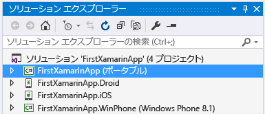
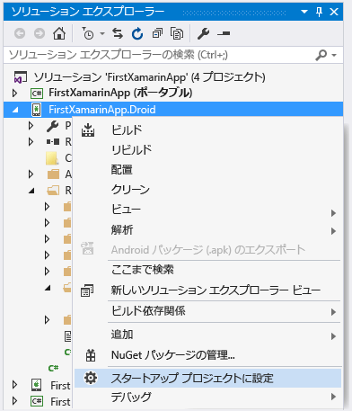
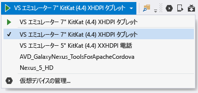
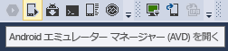
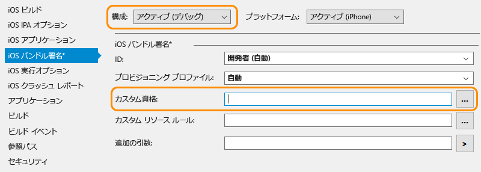

# Xamarin 環境を検証する
インストーラーが完了したら (「[セットアップとインストール](../cross-platform/setup-and-install.md)」を参照)、数分をかけて、Xamarin 開発を実行するための準備ができているかどうかを確認します。  
  
 これらの確認が終わったら、次のチュートリアルの一方または両方を実行できます。  
  
-   [Visual Studio での Xamarin.Forms を使用したアプリ作成の基本事項](../cross-platform/learn-app-building-basics-with-xamarin-forms-in-visual-studio.md)  
  
-   [Visual Studio で Xamarin を使用してネイティブ UI を備えたアプリを作成する](../cross-platform/build-apps-with-native-ui-using-xamarin-in-visual-studio.md)  
  
## すべてのプラットフォーム  
 最初に、**[ツール] > [オプション]** を選択し、**[Xamarin] > [その他]** を展開して、**[今すぐ確認]** リンクをクリックして更新プログラムを確認します。 以前のライセンスの問題を回避するには、Xamarin 4.0.3.214 以降を使用する必要があります。  
  
 その後、**[ファイル] > [新しいプロジェクト]** を使って Visual Studio で新しい Xamarin ソリューションを作成し、ダイアログで **[テンプレート] > [他の言語] > [Visual C#] > [クロスプラットフォーム]** の順に展開して、**[空のアプリ (ネイティブ ポータブル)]** を選び、[OK] をクリックします。 これによって、共有ポータブル クラス ライブラリ プロジェクトと Android、iOS、Windows の個々のプロジェクトを含むソリューションが作成されます。  
  
   
  
> [!NOTE]
>  テンプレートが表示されない場合は、「[Xamarin のプロジェクト テンプレートが見当たりませんか?」を参照してください。次の操作を試してみてください](#missing)」をこのページの下部でご覧ください。  
  
## Android  
  
1. 最新の Android SDK ツールがインストールされていることを確認するには、**[ツール] > [Android] > [Android SDK Manager]** に移動し、最新バージョンの Android SDK ツール、Android SDK プラットフォーム ツール、Android SDK ビルド ツール コンポーネントがインストールされていることをご確認ください。 最新の Android API レベルを必ずインストールする必要はないことにご注意ください。必要な API は、対象となるプラットフォームのレベルによって異なります。 通常、Xamarin をインストールすると、必要なプラットフォームのレベルがインストールされます。  

2.  Android デザイナーの検証: Android プロジェクトのソリューション エクスプローラーで、**[リソース] > [レイアウト] > [Main.axml]** ファイルを開きます  (このファイルが直接参照されない場合、ソリューション エクスプローラーで検索してください。Android プロジェクトにのみ存在し、iOS プロジェクトには存在しません)。  
  
    - 「インストールされている Android SDK が古すぎます」というエラーが発生した場合は、そのメッセージ内の **[Android SDK を開く]** をクリックして、上記の手順 1 に従って利用可能な最新の SDK バージョンを選んでインストールします。 
  
3.  エミュレーター (またはデバイス) でのビルドとデバッグの検証:  
  
    -   ソリューション エクスプローラーで Android プロジェクトを右クリックして **[スタートアップ プロジェクトに設定]**をクリックします。  
  
           
  
    -   対象の Android バージョンに基づき、適切なエミュレーターを選びます。コンピューターに Android 開発デバイスが接続されている場合は、エミュレーターと共にそれもここに一覧表示されます。  
  
        -   Windows 8+: 次に示すように、Visual Studio のデバッグ ドロップダウン リストで **VS エミュレーター** のターゲットを選び、**F5** キーを押してデバッガーを開始します。 詳細については、「[Introducing Visual Studio's Emulator for Android](http://blogs.msdn.com/b/visualstudioalm/archive/2014/11/12/introducing-visual-studio-s-emulator-for-android.aspx)」 (Visual Studio ALM ブログ) をご覧ください。 エミュレーターを機能させるときに問題が発生する場合は、「 [Troubleshooting the Visual Studio Emulator for Android](../cross-platform/troubleshooting-the-visual-studio-emulator-for-android.md)」を参照してください。 **[ツール] > [Visual Studio Emulator for Android...]** を選択して、エミュレーターの新しいデバイス プロファイルを作成することもできます。  
  
               
  
             注: **[ツール] > [Visual Studio Emulator for Android...]** メニュー オプションが表示されない場合、エミュレーター自体がインストールされていない可能性があります。 **[コントロール パネル] > [プログラムと機能]** に移動し、**[Microsoft Visual Studio]** を選択して、**[変更]** をクリックすると、インストーラーを再実行できます。 インストーラーで **[変更]** をクリックし、**[Cross Platform Mobile Development] > [Microsoft Visual Studio Emulator for Android]** のボックスにチェックマークを付け、**[更新]** をクリックします。  
  
        -   Windows 7 以前: ドロップダウン リストで Xamarin Player for Android を代わりに選び、F5 キーを押して実行します。 Xamarin プレーヤー、そのデバイス マネージャー、トラブルシューティングのヒントについて詳しくは、「 [Xamarin Android Player](http://developer.xamarin.com/guides/android/getting_started/installation/android-player/) 」(xamarin.com) をご覧ください。  
  
> [!NOTE]
>  Visual Studio では、ツール バーに Android エミュレーター マネージャー (AVD) ボタンが表示される場合があります (以下に示します)。これは、特に Google Android エミュレーターを構成するために使用されるデバイス マネージャーを開くものです。  これは、Visual Studio Emulator for Android と Xamarin Player のどちらにも影響しません。それぞれプロファイルを構成するための独自のデバイス マネージャーを持ちます。  詳しくは、「[Introducing Visual Studio's Emulator for Android](http://blogs.msdn.com/b/visualstudioalm/archive/2014/11/12/introducing-visual-studio-s-emulator-for-android.aspx) 」 (Visual Studio ALM ブログ) と「[Xamarin Android Player](http://developer.xamarin.com/guides/android/getting_started/installation/android-player/) (xamarin.com) の概要」をご覧ください。  
>   
  
## Windows Phone  
  
1.  Windows Phone デザイナーの検証: ソリューション エクスプローラーの Windows Phone プロジェクトで、 **MainPage.xaml** ファイルを開きます。  
  
2.  エミュレーターまたはデバイスでのビルドとデバッグの検証 (注: このステップでは、Visual Studio セットアップでインストールされた Windows Phone エミュレーターか、テザリングされたデバイスが必要です):  
  
    -   ソリューション エクスプローラーで Windows Phone プロジェクトを右クリックして **[スタートアップ プロジェクトに設定]**をクリックします。  
  
    -   次に示すように、Visual Studio のデバッグ ドロップダウンで **エミュレーター 8.1** のターゲットまたは接続されたデバイスを選び、F5 キーを押してデバッガーを開始します。  
  
           
  
    -   エミュレーターを機能させる際に問題が発生した場合は、「 [Windows Phone 8 エミュレーターのトラブルシューティング](https://msdn.microsoft.com/library/windows/apps/jj681694.aspx)」をご覧ください。  
  
## iOS  
  
1.  「 [Connecting to the Mac](http://developer.xamarin.com/guides/ios/getting_started/installation/windows/xamarin-mac-agent/) 」(xamarin.com) で説明されているように、ネットワーク上で Mac が利用でき、Visual Studio とペアになっていることを確認してください。  
  
2.  ストーリーボード デザイナーの検証: ソリューション エクスプローラーの iOS プロジェクトで、 **Main.storyboard** ファイルを開きます。 ここでは、Visual Studio が Mac でリモート実行されているデザイナーをホストしています。  
  
3.  ビルドとデバッグの検証:  
  
    1.  ソリューション エクスプローラーで iOS プロジェクトを右クリックして **[スタートアップ プロジェクトに設定]**を選択します。  
  
    2.  次に示すように、Visual Studio のビルド ドロップダウン リストで **iPhoneSimulator** のターゲットを選ぶか、テザリングされたデバイスがある場合には、**iPhone** のターゲットを選びます。 シミュレーターが表示されていない場合は、Mac で Xcode を起動し、**[Xcode] > [ユーザー設定]** の順に選び、**[ダウンロード]** をクリックします。 **[コンポーネント]** の下に、ダウンロード可能なシミュレーターのバージョンが表示されます。 デバッグに関する詳しい説明については、Xamarin の「[デバッグ](https://developer.xamarin.com/guides/ios/deployment,_testing,_and_metrics/debugging_in_xamarin_ios/#Debugging_on_the_Simulator)」ページ (xamarin.com) を参照してください。  
  
           
  
    3.  次に示すように、Visual Studio のデバッグ ドロップダウン リストで iPhone のターゲットを選び、F5 キーを押してデバッガーを開始します。 これによって、Mac 上のシミュレーターが起動し、Visual Studio でのデバッグ中にアプリを操作できるようになります。 iPhone または iPad の実機を Mac に接続した場合は、ここに表示され、代わりに選択できます。 いずれかのデバイスまたはシミュレーターが一覧に表示されない場合は、上記の手順 1 にあるリンク先のトピックを参照するか、 **[ツール]** >**iOS** >**[Xamarin Mac エージェント]**  
  
           
  
    4.  Mac に接続する際に問題が発生した場合は、「 [接続のトラブルシューティング](http://developer.xamarin.com/guides/ios/getting_started/installation/windows/xamarin-mac-agent/xma-troubleshooting/) 」(xamarin.com) をご覧ください。  
  
    5.  "インストールされている iOS の署名キーに一致するプロビジョニング プロファイルがインストールされていません" というエラーが表示された場合は、次の操作を行います。  
  
        -   「 [Xcode にアカウントを追加する](https://developer.apple.com/library/content/documentation/IDEs/Conceptual/AppStoreDistributionTutorial/AddingYourAccounttoXcode/AddingYourAccounttoXcode.html#//apple_ref/doc/uid/TP40013839-CH40-SW1) 」(apple.com) の説明に従って、Mac 上の Xcode に Apple ID アカウントが追加されていることを確認します。  アカウントの追加後、必ず Visual Studio と Xcode の両方を再起動します。  
  
               
  
        -   iOS バンドル署名タブの iOS プロジェクト プロパティで、アクティブなデバッグ構成のカスタム権利フィールドが空であることを確認します。  注: 上記のエラー メッセージが表示された場合は、この設定の削除だけを試してみる必要があります。  
  
##   Xamarin プロジェクト テンプレートが見当たりませんか? 次の操作を試してみてください  
 Xamarin の Web サイトから直接 Xamarin をインストールして、Visual Studio 2013 と Visual Studio 2015 が同時にインストールされていると、テンプレートが見つからないことがあります。 直すのは簡単: Xamarin セットアップ プログラムで **[Xamarin for Visual Studio 2015]** 機能を有効にするだけです。  
  
1.  コントロール パネルで **[プログラムと機能]**を開き、 **[Xamarin]** の項目を選択してから **[変更]**をクリックします。  
  
2.  表示される Xamarin のセットアップ ウィザードで、 **[次へ]** をクリックしてから、 **[変更]**をクリックします。  
  
3.  インストールするオプション機能の一覧で、 **[Xamarin for Visual Studio 2015]**を展開し、 **[ローカル ドライブにインストールする]**を選択し、 **[次へ]** をクリックして機能の追加に進みます。