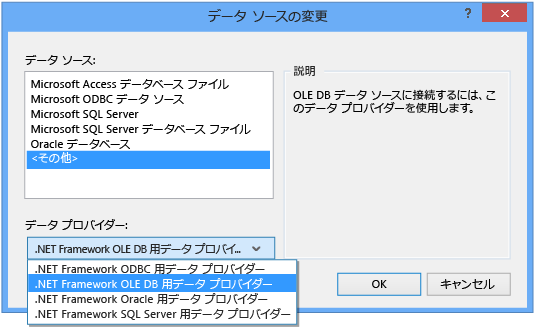

# チュートリアル: Access データベース内のデータへの接続 (Windows フォーム)
Visual Studio を使用して Access データベース \(.mdf ファイルまたは .accdb ファイル\) に接続できます。  接続を定義すると、**\[データ ソース ウィンドウ\]** にデータが表示されます。  ここから、テーブルまたはビューをフォームにドラッグできます。  Visual Studio のプロジェクト システムがこれらのローカル データベース ファイルを管理する方法を調べるには、「[方法 : プロジェクトでローカル データ ファイルを管理する](../data-tools/how-to-manage-local-data-files-in-your-project.md)」を参照してください。  
  
## 必須コンポーネント  
 これらの手順を実行するには、Windows フォーム アプリケーション プロジェクト、および Microsoft Access データベース ファイル \(.accdb ファイル\) または Access 2000\-2003 データベース \(.mdb ファイル\) が必要です。  ファイルの種類に対応する手順に従ってください。  
  
## .accdb ファイルのデータセットの作成  
 次の手順を実行して、Access 2013、Office 365、Access 2010、または Access 2007 で作成したデータベースに接続できます。  
  
#### データセットを作成するには  
  
1.  データの接続先となる Windows フォーム アプリケーションを開きます。  
  
2.  **\[表示\]** メニューで、**\[その他のウィンドウ\]** \> **\[データ ソース\]** をクリックします。  
  
       
  
3.  **\[データ ソース\]** ウィンドウで、**\[新しいデータ ソースの追加\]** をクリックします。  
  
       
  
4.  **\[データソースの種類を選択\]** ページで **\[データベース\]** をクリックし、**\[次へ\]** をクリックします。  
  
5.  **\[データベース モデルの選択\]** ページで **\[データセット\]** をクリックし、**\[次へ\]** をクリックします。  
  
6.  **\[データ接続の選択\]** ページで、**\[新しい接続\]** を選択して新しいデータ接続を構成します。  
  
7.  **\[データ ソース\]** を **\[.NET Framework OLE DB 用データ プロバイダー\]** に変更します。  
  
       
  
    > [!IMPORTANT]
    >  **\[Microsoft Access データベース ファイル \(OLE DB\) \]** のデータ ソースが正しい選択のように思われますが、このデータ ソースの種類は .mdb データベース ファイルにのみ使用します。  
  
8.  **\[OLE DB プロバイダー\]** で **\[Microsoft Office 12.0 Access データベース エンジン OLE DB プロバイダー\]** をクリックします。  
  
       
  
9. **\[サーバー名またはファイル名\]** で、接続する .accdb ファイルのパスと名前を指定し、**\[OK\]** をクリックします。  
  
    > [!NOTE]
    >  データベース ファイルにユーザー名とパスワードがある場合は、それらを指定し、**\[OK\]** をクリックします。  
  
10. **\[データ接続の選択\]** ページで **\[次へ\]** をクリックします。  
  
11. **\[アプリケーション構成ファイルに接続文字列を保存\]** ページで **\[次へ\]** をクリックします。  
  
12. **\[データベース オブジェクトの選択\]** ページの **\[テーブル\]** ノードを展開します。  
  
13. データセットに含めるビューまたはテーブルをすべて選択し、**\[完了\]** をクリックします。  
  
     プロジェクトにデータセットが追加され、テーブルとビューが **\[データ ソース\]** ウィンドウに表示されます。  
  
## .mdb ファイルのデータセットの作成  
 **データ ソース構成**ウィザードを実行して、データセットを作成します。  
  
#### データセットを作成するには  
  
1.  データの接続先となる Windows フォーム アプリケーションを開きます。  
  
2.  **\[表示\]** メニューで、**\[その他のウィンドウ\]** \> **\[データ ソース\]** をクリックします。  
  
       
  
3.  **\[データ ソース\]** ウィンドウで、**\[新しいデータ ソースの追加\]** をクリックします。  
  
       
  
4.  **\[データソースの種類を選択\]** ページで **\[データベース\]** をクリックし、**\[次へ\]** をクリックします。  
  
5.  **\[データベース モデルの選択\]** ページで **\[データセット\]** をクリックし、**\[次へ\]** をクリックします。  
  
6.  **\[データ接続の選択\]** ページで、**\[新しい接続\]** を選択して新しいデータ接続を構成します。  
  
7.  **\[データ ソース\]** が **\[Microsoft Access データベース ファイル \(OLE DB\)\]** でない場合は、**\[変更\]** をクリックして **\[データ ソースの変更\]** ダイアログ ボックスを開き、**\[Microsoft Access データベース ファイル\]** をクリックし、**\[OK\]** をクリックします。  
  
8.  **\[データベース ファイル名\]** で、接続する .mdb ファイルのパスと名前を指定し、**\[OK\]** をクリックします。  
  
       
  
9. **\[データ接続の選択\]** ページで **\[次へ\]** をクリックします。  
  
10. **\[アプリケーション構成ファイルに接続文字列を保存\]** ページで **\[次へ\]** をクリックします。  
  
11. **\[データベース オブジェクトの選択\]** ページの **\[テーブル\]** ノードを展開します。  
  
12. データセットに含めるビューまたはテーブルをすべて選択し、**\[完了\]** をクリックします。  
  
     プロジェクトにデータセットが追加され、テーブルとビューが **\[データ ソース\]** ウィンドウに表示されます。  
  
## セキュリティ  
 機密情報 \(パスワードなど\) を格納すると、アプリケーションのセキュリティに影響を及ぼすことがあります。  データベースへのアクセスを制御する方法としては、Windows 認証 \(統合セキュリティとも呼ばれます\) を使用する方が安全です。  詳細については、「[接続情報の保護](../Topic/Protecting%20Connection%20Information.md)」を参照してください。  
  
## 次の手順  
 作成したデータセットが **\[データ ソース\]** ウィンドウで利用できるようになります。  これで、以下のタスクをどれでも実行できます。  
  
-   **\[データ ソース\]** ウィンドウの項目を選択し、フォームにドラッグします \([Visual Studio でのデータへの Windows フォーム コントロールのバインド](../data-tools/bind-windows-forms-controls-to-data-in-visual-studio.md) を参照\)。  
  
-   [データセット デザイナー](../data-tools/creating-and-editing-typed-datasets.md)でデータ ソースを開き、データセットを構成するオブジェクトを追加または編集します。  
  
-   データセット内のデータ テーブルの <xref:System.Data.DataTable.ColumnChanging> イベントまたは <xref:System.Data.DataTable.RowChanging> イベントに検証ロジックを追加します \([データセットのデータの検証](../data-tools/validate-data-in-datasets.md) を参照\)。  
  
## 参照  
 [Visual Studio でのデータへの接続](../data-tools/connecting-to-data-in-visual-studio.md)   
 [アプリケーションでデータを受け取る準備](../Topic/Preparing%20Your%20Application%20to%20Receive%20Data.md)   
 [アプリケーションへのデータのフェッチ](../data-tools/fetching-data-into-your-application.md)   
 [Visual Studio でのデータへのコントロールのバインド](../data-tools/bind-controls-to-data-in-visual-studio.md)   
 [アプリケーションでのデータ編集](../data-tools/editing-data-in-your-application.md)   
 [データの検証](../Topic/Validating%20Data.md)   
 [データの保存](../data-tools/saving-data.md)   
 [データに関するチュートリアル](../Topic/Data%20Walkthroughs.md)