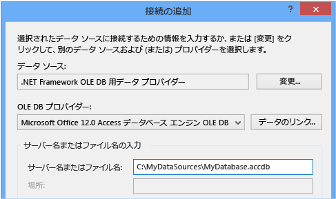
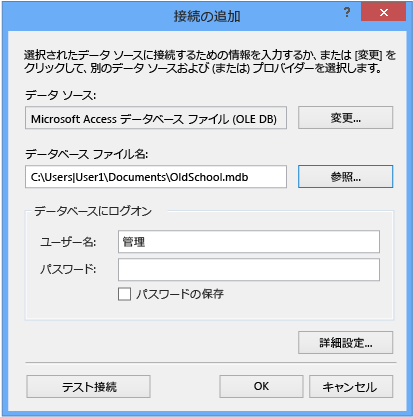

# Access データベース (Windows フォーム) にデータへの接続します。
Visual Studio を使用して、Access データベース (.mdf ファイルまたは .accdb ファイル) に接続することができます。 接続の定義後に表示される、データ、**データソース**ウィンドウです。 ここから、テーブルまたはビューをフォームにドラッグできます。   
  
## 必須コンポーネント  
 これらの手順を使用するのには、Windows フォーム アプリケーション プロジェクト、および Access データベース (ファイル.accdb ファイル) または Access 2000-2003 データベース (.mdb ファイル) する必要があります。 ファイルの種類に対応する手順に従ってください。  
  
## .Accdb ファイルのデータセットの作成  
 Access 2013、Office 365、Access 2010、または Access 2007 で、次の手順を使用して作成されたデータベースに接続することができます。  
  
#### データセットを作成するには  
  
1.  データに接続する Windows フォーム アプリケーションを開きます。  
  
2.  **ビュー**メニューの **その他のウィンドウ** > **データソース**です。  
  
       
  
3.  **[データ ソース]** ウィンドウで、 **[新しいデータ ソースの追加]**をクリックします。  

     **データ ソース構成ウィザード**が開きます。  
  
4.  選択**データベース**上、**データ ソースの種類を選択**ページし、 **次へ**です。  
  
5.  選択**データセット**上、**データベース モデルの選択**ページし、 **次へ**です。  
  
6.  **データ接続の選択**] ページで、[**新しい接続**新しいデータ接続を構成します。  

     **接続の追加** ダイアログ ボックスが表示されます。  
  
7.  選択、**変更**横に、**データソース**テキスト ボックス。

     **データ ソースの変更** ダイアログ ボックスが表示されます。  
  
8.  データ ソースの一覧で選択**\<他\>**です。 **データ プロバイダー**ドロップダウン リストで、 **.NET Framework Data Provider for OLE DB**、順に選択**OK**です。  

9. 戻り、**接続の追加**ダイアログ ボックスで、 **Microsoft Office 12.0 Access Database Engine OLE DB Provider**から、 **OLE DB プロバイダー**ドロップダウンします。  
  
       

     > [!NOTE]
     >  表示されない場合**Microsoft Office 12.0 Access Database Engine OLE DB Provider**ドロップダウン OLE DB プロバイダーをインストールする必要があります、 [2007 Office System ドライバー: データ接続コンポーネント](https://www.microsoft.com/download/confirmation.aspx?id=23734)です。
  
9. **サーバーまたはファイル名**テキスト ボックスで、パスを指定し、ファイルに接続する .accdb ファイルの名前と順に選択**OK**です。 (データベース ファイルにユーザー名とパスワードがある場合を指定して、選択する前に**OK**)。    
  
10. 選択**次**上、**データ接続の選択**ページ。  

     データ ファイルは、現在のプロジェクトではありませんを示すダイアログ ボックスが表示する可能性があります。 **[はい]** または **[いいえ]**をクリックします。
  
11. 選択**次**上、**接続文字列をアプリケーション構成ファイルに保存**ページ。  
  
12. 展開して、**テーブル**上のノード、**データベース オブジェクトの選択**ページ。  
  
13. どのようなテーブルまたはビュー、データセット内に指定し、選択**完了**です。  
  
     データセットが、プロジェクトに追加され、テーブルとビューに表示されます、**データソース**ウィンドウです。  
  
## .Mdb ファイルのデータセットの作成  
 実行して、データセットを作成する、**データ ソース構成ウィザード**です。  
  
#### データセットを作成するには  
  
1.  データに接続する Windows フォーム アプリケーションを開きます。  
  
2.  **ビュー**メニューの **その他のウィンドウ** > **データソース**です。  
  
       
  
3.  **[データ ソース]** ウィンドウで、 **[新しいデータ ソースの追加]**をクリックします。  

     **データ ソース構成ウィザード**が開きます。
  
4.  選択**データベース**上、**データ ソースの種類を選択**ページし、 **次へ**です。  
  
5.  選択**データセット**上、**データベース モデルの選択**ページし、 **次へ**です。  
  
6.  **データ接続の選択**] ページで、[**新しい接続**新しいデータ接続を構成します。  
  
7.  データ ソースがない場合**Microsoft Access データベース ファイル (OLE DB)****変更**を開くには、**データ ソースの変更** ダイアログ ボックスと選択**Microsoftデータベース ファイルへのアクセス**、し、 **OK**です。  
  
8.  **データベース ファイルの名前**を選択し、接続する .mdb ファイルの名前とパスを指定**OK**です。  
  
       
  
9. 選択**次**上、**データ接続の選択**ページ。  
  
10. 選択**次**上、**接続文字列をアプリケーション構成ファイルに保存**ページ。  
  
11. 展開して、**テーブル**上のノード、**データベース オブジェクトの選択**ページ。  
  
12. どのようなテーブルまたはビュー、データセット内に指定し、選択**完了**です。  
  
     データセットが、プロジェクトに追加され、テーブルとビューに表示されます、**データソース**ウィンドウです。  
  
## セキュリティ  
 機密情報 (パスワードなど) を格納すると、アプリケーションのセキュリティに影響を及ぼすことがあります。 データベースへのアクセスを制御する方法としては、Windows 認証 (統合セキュリティとも呼ばれます) を使用する方が安全です。 詳細については、「[接続情報の保護](/dotnet/framework/data/adonet/protecting-connection-information)」を参照してください。  
  
## 次の手順  
 先ほど作成したデータセットがで使用できるようになりました、**データソース**ウィンドウです。 これで、次のタスクのいずれかを実行できます。  
  
-   内の項目を選択して、**データ ソース**ウィンドウ、フォームにドラッグし、(を参照してください[Visual Studio でのデータにコントロールを Windows フォームのバインド](../data-tools/bind-windows-forms-controls-to-data-in-visual-studio.md))。  
  
-   データ ソースを開き、**データセット デザイナー**データセットを構成するオブジェクトを追加または編集します。  
  
-   検証ロジックを追加、<xref:System.Data.DataTable.ColumnChanging>または<xref:System.Data.DataTable.RowChanging>データセット内のデータ テーブルのイベント (を参照してください[データセット内のデータを検証](../data-tools/validate-data-in-datasets.md))。  
  
## 関連項目
[接続の追加](../data-tools/add-new-connections.md)
