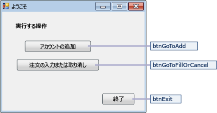
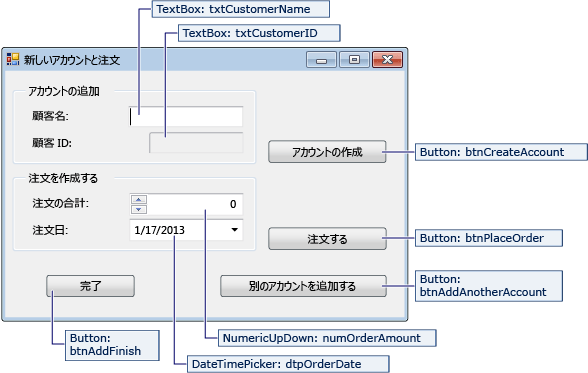
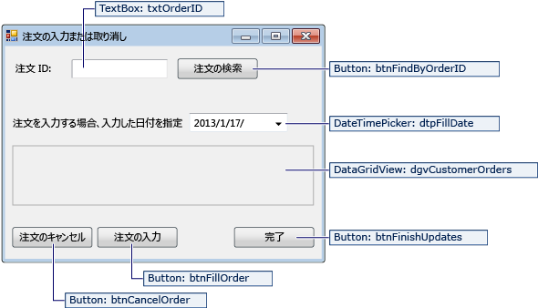

# <a name="create-a-simple-data-application-by-using-adonet"></a>ADO.NET を使用して単純なデータ アプリケーションを作成します。

データベース内のデータを操作するアプリケーションを作成するときに、接続文字列の定義、データの挿入、ストアド プロシージャの実行などの基本的なタスクを実行します。 このトピックでは、Visual c# または Visual Basic および ADO.NET 使用した簡単な Windows フォーム「フォーム オーバー データ」アプリケーション内部から、データベースとやり取りする方法を検出できます。  すべての .NET データ テクノロジ — LINQ to SQL、および Entity Framework のデータセットを含む、最終的にこの記事で示したものとよく似ている手順を実行します。

 この記事では、非常に高速の方法で、データベースからデータを取得する簡単な方法を示します。 場合は、アプリケーションは、重要な方法でデータを変更し、データベースを更新する必要があります、Entity Framework を使用して、基になるデータの変更をユーザー インターフェイス コントロールを自動的に同期へのデータ バインディングを使用してを考慮する必要があります。

> [!IMPORTANT]
> 運用環境での例外処理コードをシンプルにするに含まれません。

## <a name="prerequisites"></a>必須コンポーネント

アプリケーションの作成には、次が必要です:

-   Visual Studio

-   SQL Server Express LocalDB です。 SQL Server Express LocalDB をお持ちでない場合からをインストール、 [SQL Server Express のダウンロード ページ](https://www.microsoft.com/sql-server/sql-server-editions-express)です。

このトピックする Visual Studio IDE の基本的な機能を理解してとことができます、Windows フォーム アプリケーションを作成すると仮定ボタンとその他のコントロールをフォームには、配置、プロジェクトへのフォーム コントロール、およびシンプルなイベントのコードのプロパティの設定を追加します。 完了することをお勧めこれらのタスクに慣れていない場合、 [Visual c# および Visual Basic の概要](../ide/getting-started-with-visual-csharp-and-visual-basic.md)トピックこのチュートリアルを開始する前にします。

## <a name="set-up-the-sample-database"></a>サンプル データベースを設定する

次の手順に従って、サンプル データベースを作成します。

1. Visual Studio で開く、**サーバー エクスプ ローラー**ウィンドウです。

2. 右クリックして**データ接続**を選択して * * 新しい SQL Server データベースの作成..."です。

3. **サーバー名**テキスト ボックスに、入力**(localdb) \mssqllocaldb**です。

4. **新しいデータベース名**テキスト ボックスに、入力**Sales**、順に選択**OK**です。

     空の**Sales**データベースが作成され、サーバー エクスプ ローラーでデータ接続 ノードに追加します。

5. 右クリックし、 **Sales**データ接続と選択**新しいクエリ**です。

     クエリ エディター ウィンドウが開きます。

6. コピー、 [Sales TRANSACT-SQL スクリプト](https://github.com/MicrosoftDocs/visualstudio-docs/raw/master/docs/data-tools/samples/sales.sql)をクリップボードにします。

7. T-SQL スクリプトをクエリ エディターに貼り付けを選択し、 **Execute**ボタンをクリックします。

     短期間のうち、クエリの実行が終了され、データベース オブジェクトが作成されます。 データベースには、2 つのテーブルが含まれています: 顧客と注文します。 これらのテーブルにはデータが最初で作成するアプリケーションを実行するときにデータを追加することができます。 データベースには、次の 4 つの単純なストアド プロシージャも含まれています。

## <a name="create-the-forms-and-add-controls"></a>フォームを作成してコントロールを追加する

1.  Windows フォーム アプリケーション用のプロジェクトを作成し、SimpleDataApp と名前をつけます。

     Visual Studio は、Form1 という名前の空の Windows フォームを含めた、いくつかのファイルとプロジェクトを作成します。

2.  3 つの形式を持つように、2 つの Windows フォームをプロジェクトに追加し、アクセス許可、次の名前。

    -   ナビゲーション

    -   NewCustomer

    -   FillOrCancel

3.  各フォームに、次の図に示されるように、テキスト ボックス、ボタン、および他のコントロールを追加します。 各コントロールに、テーブルを示すプロパティを設定します。

    > [!NOTE]
    >  グループ ボックス、およびラベル コントロールは明確性を追加しますが、コードでは使用されません。

 **Navigation フォーム**

 

|Navigation フォームのコントロール|プロパティ|
|--------------------------------------|----------------|
|ボタン|Name = btnGoToAdd|
|ボタン|Name = btnGoToFillOrCancel|
|ボタン|Name = btnExit|

 **NewCustomer フォーム**

 

|NewCustomer フォームのコントロール|プロパティ|
|---------------------------------------|----------------|
|TextBox|Name = txtCustomerName|
|TextBox|Name = txtCustomerID<br /><br /> Readonly = True|
|ボタン|Name = btnCreateAccount|
|NumericUpdown|DecimalPlaces = 0<br /><br /> Maximum = 5000<br /><br /> Name = numOrderAmount|
|DateTimePicker|Format = Short<br /><br /> Name = dtpOrderDate|
|ボタン|Name = btnPlaceOrder|
|ボタン|Name = btnAddAnotherAccount|
|ボタン|Name = btnAddFinish|

 **FillOrCancel フォーム**

 

|FillOrCancel フォームのコントロール|プロパティ|
|----------------------------------------|----------------|
|TextBox|Name = txtOrderID|
|ボタン|Name = btnFindByOrderID|
|DateTimePicker|Format = Short<br /><br /> Name = dtpFillDate|
|DataGridView|Name = dgvCustomerOrders<br /><br /> Readonly = True<br /><br /> RowHeadersVisible = False|
|ボタン|Name = btnCancelOrder|
|ボタン|Name = btnFillOrder|
|ボタン|Name = btnFinishUpdates|

## <a name="store-the-connection-string"></a>接続文字列を保存する
 アプリケーションがデータベースの接続を開くとき、アプリケーションは接続文字列にアクセスする必要があります。 各フォームで文字列を手動で入力しなくても、プロジェクトの App.config ファイルに文字列を格納し、アプリケーションのすべてのフォームからメソッドを呼び出したときに、文字列を返すメソッドを作成します。

 右クリックして、接続文字列を見つけることができます、 **Sales**内のデータ接続**サーバー エクスプ ローラー**を選択して**プロパティ**です。 検索、 **ConnectionString**プロパティ、しを使用して、CTRL + A Ctrl + C を選択し、文字列をクリップボードにコピーします。

1.  C# の場合、使用している場合**ソリューション エクスプ ローラー**、展開、**プロパティ**ノード、プロジェクトの下で開き、 **Settings.settings**ファイル。
    Visual Basic を使用している場合**ソリューション エクスプ ローラー**、] をクリックして**[すべてのファイル**、展開、 **My Project**ノードを開き、 **Settings.settings**ファイル。

2.  **名前**列、入力`connString`です。

3.  **型**一覧で、 **(接続文字列)**です。

4.  **スコープ**一覧で、**アプリケーション**です。

5.  **値**列 (任意の外部の引用符)、なし、接続文字列を入力し、変更を保存します。

> [!NOTE]
> 実際のアプリケーションでは文字列を格納する接続」の説明に従って、安全に[接続文字列と構成ファイル](/dotnet/framework/data/adonet/connection-strings-and-configuration-files)です。

##  <a name="write-the-code-for-the-forms"></a>フォームのコードを記述する

このセクションには、各フォームの動作の概要が含まれています。 フォーム上のボタンがクリックされたときに、基になるロジックを定義するコードも提供します。

### <a name="navigation-form"></a>Navigation フォーム

Navigation フォームはアプリケーションを実行すると開きます。 **アカウントを追加する**NewCustomer フォームを開きます。 **Fill またはキャンセル オーダー** FillOrCancel フォームを開きます。 **終了**ボタンがアプリケーションを終了します。

#### <a name="make-the-navigation-form-the-startup-form"></a>Navigation フォームをスタートアップ フォームに設定

C# の場合、使用している場合**ソリューション エクスプ ローラー**、Program.cs を開き、変更、`Application.Run`をこの行。 `Application.Run(new Navigation());`

Visual Basic を使用している場合**ソリューション エクスプ ローラー**を開き、**プロパティ**ウィンドウで、**アプリケーション**、タブをクリックし**SimpleDataApp.Navigation**で、**スタートアップ フォーム** ボックスの一覧です。

#### <a name="create-auto-generated-event-handlers"></a>自動生成されたイベント ハンドラーを作成します。

空のイベント ハンドラー メソッドを作成する Navigation フォーム上の 3 つのボタンをダブルクリックします。 イベントを発生させるボタンのクリックをできるようにするデザイナー コード ファイルで自動生成されたコードを追加もボタンをダブルクリックします。

#### <a name="add-code-for-the-navigation-form-logic"></a>ナビゲーションのフォーム ロジックのコードを追加します。

Navigation フォームのコード ページで、完了メソッド本体の 3 つのボタンのクリックしてイベント ハンドラー、次のコードに示すようにします。

[!code-csharp[Navigation#1](../data-tools/codesnippet/CSharp/SimpleDataApp/Navigation.cs#1)]
[!code-vb[Navigation#1](../data-tools/codesnippet/VisualBasic/SimpleDataApp/Navigation.vb#1)]

### <a name="newcustomer-form"></a>NewCustomer フォーム

顧客名を入力しを選択し、**アカウントの作成**ボタン、NewCustomer フォームは、顧客のアカウントを作成し、SQL Server は、新しい顧客 ID として IDENTITY 値を返します。 金額と注文日を指定することを選択して、新しいアカウントの注文を設定することができますし、 **Place Order**ボタンをクリックします。

#### <a name="create-auto-generated-event-handlers"></a>自動生成されたイベント ハンドラーを作成します。

空のクリックを作成するそれぞれの 4 つのボタンをダブルクリックすると、NewCustomer フォーム上の各ボタンのイベント ハンドラー。 イベントを発生させるボタンのクリックをできるようにするデザイナー コード ファイルで自動生成されたコードを追加もボタンをダブルクリックします。

#### <a name="add-code-for-the-newcustomer-form-logic"></a>NewCustomer フォームのロジックのコードを追加します。

NewCustomer フォームのロジックを完了するには、次の手順に従います。

1. 表示、`System.Data.SqlClient`スコープに名前空間を完全にする必要があるないようには、そのメンバーの名前を修飾します。

     ```csharp
     using System.Data.SqlClient;
     ```
     ```vb
     Imports System.Data.SqlClient
     ```

2. 次のコードに示すように、クラスにいくつかの変数とヘルパー メソッドを追加します。

     [!code-csharp[NewCustomer#1](../data-tools/codesnippet/CSharp/SimpleDataApp/NewCustomer.cs#1)]
     [!code-vb[NewCustomer#1](../data-tools/codesnippet/VisualBasic/SimpleDataApp/NewCustomer.vb#1)]

3. 次のコードに示すように、メソッド本体の 4 つのボタンのクリック イベント ハンドラーを完了します。

     [!code-csharp[NewCustomer#2](../data-tools/codesnippet/CSharp/SimpleDataApp/NewCustomer.cs#2)]
     [!code-vb[NewCustomer#2](../data-tools/codesnippet/VisualBasic/SimpleDataApp/NewCustomer.vb#2)]

### <a name="fillorcancel-form"></a>FillOrCancel フォーム

FillOrCancel フォームを注文 ID を入力し、をクリックすると、注文を返すクエリの実行、 **Find Order**ボタンをクリックします。 戻された行は読み取り専用なデータ グリッドに表示されます。 キャンセル (X) と順序をマークするには、選択した場合、 **Cancel Order**ボタン、またはをマークできます順序を満たした (F) を選択した場合、 **Fill Order**ボタンをクリックします。 選択した場合、 **Find Order**を再度クリックして、更新された行が表示されます。

#### <a name="create-auto-generated-event-handlers"></a>自動生成されたイベント ハンドラーを作成します。

空の作成ボタンをダブルクリックして FillOrCancel フォームに 4 つのボタンのイベント ハンドラーをクリックします。 イベントを発生させるボタンのクリックをできるようにするデザイナー コード ファイルで自動生成されたコードを追加もボタンをダブルクリックします。

#### <a name="add-code-for-the-fillorcancel-form-logic"></a>FillOrCancel フォーム ロジックのコードを追加します。

FillOrCancel フォームのロジックを完了するには、次の手順に従います。

1. そのメンバーの名前を完全に修飾する必要はありませんので、次の 2 つの名前空間をスコープに移動します。

     ```csharp
     using System.Data.SqlClient;
     using System.Text.RegularExpressions;
     ```
     ```vb
     Imports System.Data.SqlClient
     Imports System.Text.RegularExpressions
     ```

2. 次のコードに示すように、変数とヘルパー メソッドをクラスに追加します。

     [!code-csharp[FillOrCancel#1](../data-tools/codesnippet/CSharp/SimpleDataApp/FillOrCancel.cs#1)]
     [!code-vb[FillOrCancel#1](../data-tools/codesnippet/VisualBasic/SimpleDataApp/FillOrCancel.vb#1)]

3. 次のコードに示すように、メソッド本体の 4 つのボタンのクリック イベント ハンドラーを完了します。

     [!code-csharp[FillOrCancel#2](../data-tools/codesnippet/CSharp/SimpleDataApp/FillOrCancel.cs#2)]
     [!code-vb[FillOrCancel#2](../data-tools/codesnippet/VisualBasic/SimpleDataApp/FillOrCancel.vb#2)]

## <a name="test-your-application"></a>アプリケーションをテストする

選択、 **f5 キーを押して**キーをビルドし、各クリック イベント ハンドラーのコードを作成した後、アプリケーションをテストし、コーディングを完了した後、します。

## <a name="see-also"></a>関連項目

- [.NET 用の Visual Studio データ ツール](../data-tools/visual-studio-data-tools-for-dotnet.md)
