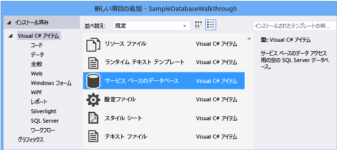
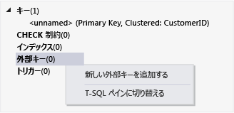

# <a name="create-a-database-and-add-tables-in-visual-studio"></a>データベースを作成し、Visual Studio でのテーブルの追加
Visual Studio を使用して作成し、SQL Server Express LocalDB でローカル データベース ファイルを更新することができます。 内の TRANSACT-SQL ステートメントを実行することによって、データベースを作成することも、 **SQL Server オブジェクト エクスプ ローラー** Visual Studio でのツール ウィンドウです。 このトピックでは、.mdf ファイルを作成し、テーブル デザイナーを使用してテーブルおよびキーを追加します。
  
## <a name="prerequisites"></a>必須コンポーネント  
このチュートリアルを完了にする必要があります、省略可能な**データ ストレージと処理**Visual Studio にインストールされているワークロード。 これをインストールするには、開く**Visual Studio インストーラー**を選択し、**ワークロード**タブです。**Web およびクラウド**、選択**データ ストレージと処理**です。 選択、**変更**ワークロードを Visual Studio に追加するボタンをクリックします。
  
## <a name="create-a-project-and-a-local-database-file"></a>プロジェクトとローカル データベース ファイルを作成します。  
  
### <a name="to-create-a-project-and-a-database-file"></a>プロジェクトとローカル データベース ファイルを作成するには  
1.  という名前は、Windows フォーム プロジェクトを作成する`SampleDatabaseWalkthrough`です。  
  
2.  メニュー バーで、次のように選択します。**プロジェクト**、**新しい項目の追加**です。  
  
3.  項目テンプレートの一覧で下へスクロールし、選択**サービス ベースのデータベース**です。  
  
       
  
4.  データベースの名前**SampleDatabase**、クリックして、**追加**ボタンをクリックします。

### <a name="to-add-a-data-source"></a>データ ソースを追加するには  
5.  場合、**データソース**ウィンドウが開いていないを選択して開きます、 **Shift + Alt + D**キーまたは、メニュー バーを選択すると、**ビュー**、**その他のウィンドウ**、**データソース**です。
  
6.  **データ ソース**ウィンドウで、**新しいデータ ソースの追加**リンクします。

    **データ ソース構成ウィザード**が開きます。

7. **データ ソースの種類を選択**ページで、選択**データベース**を選択し**次**です。

8. **データベース モデルの選択**ページで、選択**次**を既定値 (データセット) を受け入れるようにします。

9. **データ接続の選択**] ページで、[、 **SampleDatabase.mdf**クリックしてドロップダウン リストでファイル**次**です。

10. **アプリケーション構成ファイルへの接続文字列を保存**ページで、選択**次**です。

11. 1 つ、**データベース オブジェクトの選択** ページで、データベースを示すメッセージがすべてのオブジェクトが含まれていない表示されます。 選択**完了**です。

### <a name="to-view-properties-of-the-data-connection"></a>データ接続のプロパティを表示するには
SampleDatabase.mdf ファイルの接続文字列を表示するには、データ接続のプロパティ ウィンドウを開きます。
  
-   Visual Studio で、次のように選択します。**ビュー**、 **SQL Server オブジェクト エクスプ ローラー**そのウィンドウが開いていない場合。 展開して [プロパティ] ウィンドウを開き、**データ接続**ノードは、SampleDatabase.mdf のショートカット メニューを開きを選択して**プロパティ**です。  
  
-   または、選択することができます**ビュー**、**サーバー エクスプ ローラー**、そのウィンドウがまだ開いていない場合。 展開して [プロパティ] ウィンドウを開き、**データ接続**ノード。 クリックして、SampleDatabase.mdf のショートカット メニューを開き**プロパティ**です。  
  
## <a name="create-tables-and-keys-by-using-table-designer"></a>テーブル デザイナーを使用してテーブルおよびキーを作成します。
このセクションでは、2 つのテーブル、テーブルごとに、およびサンプル データのいくつかの行の主キーを作成します。 1 つのテーブル内のレコードが他のテーブルのレコードに対応する方法を指定する外部キーを作成することもあります。  
  
### <a name="to-create-the-customers-table"></a>Customers テーブルを作成するには  
1.  **サーバー エクスプ ローラー**または**SQL Server オブジェクト エクスプ ローラー**、展開、**データ接続** ノードの順に展開し、 **SampleDatabase.mdf**ノード。  
  
2.  ショートカット メニューを開き、**テーブル**、し、**新しいテーブルの追加**です。  
  
     **テーブル デザイナー**が開き、作成しているテーブル内の 1 つの列を表す 1 つの既定の行を含むグリッドを表示します。 行をグリッドに追加することによって、テーブルに列を追加します。  
  
3.  グリッドで、次のエントリのそれぞれに行を追加します。  
  
    |列名|データ型|Null を許容|  
    |-----------------|---------------|-----------------|  
    |`CustomerID`|`nchar(5)`|false (オフ)|  
    |`CompanyName`|`nvarchar(50)`|false (オフ)|  
    |`ContactName`|`nvarchar (50)`|true (オン)|  
    |`Phone`|`nvarchar (24)`|true (オン)|  
  
4.  ショートカット メニューを開き、`CustomerID`行をクリックし **主キーの設定**です。  
  
5.  既定の行のショートカット メニューを開き、選択**削除**です。  
  
6.  スクリプト ペインの最初の行の次のサンプルのように更新して、Customers (顧客) をテーブルと名前を付けます:  
  
    ```  
    CREATE TABLE [dbo].[Customers]  
    ```  
  
    次のように表示されます。  
  
      
  
7.  左上隅にある、**テーブル デザイナー**、select、**更新**ボタンをクリックします。  
  
8.  **データベース更新のプレビュー**ダイアログ ボックスで、**更新データベース**ボタンをクリックします。  
  
    変更はローカル データベース ファイルに保存されます。  
  
### <a name="to-create-the-orders-table"></a>Orders テーブルを作成するには  
1.  別のテーブルを追加し、次の表の各エントリの行を追加します。  
  
    |列名|データ型|Null を許容|  
    |-----------------|---------------|-----------------|  
    |`OrderID`|`int`|false (オフ)|  
    |`CustomerID`|`nchar(5)`|false (オフ)|  
    |`OrderDate`|`datetime`|true (オン)|  
    |`OrderQuantity`|`int`|true (オン)|  
  
2.  設定**OrderID** primary key、および、削除、既定の行として。  
  
3.  スクリプト ペインの最初の行の次のサンプルのように更新して、Orders (注文) をテーブルと名前を付けます:  
  
    ```sql  
    CREATE TABLE [dbo].[Orders]  
    ```  
  
4.  左上隅にある、**テーブル デザイナー**、select、**更新**ボタンをクリックします。  
  
5.  **データベース更新のプレビュー**ダイアログ ボックスで、**更新データベース**ボタンをクリックします。  
  
    変更はローカル データベース ファイルに保存されます。  
  
### <a name="to-create-a-foreign-key"></a>外部キーを作成するには  
1.  グリッドの右側にある コンテキスト ウィンドウでショートカット メニューを開き、**外部キー**、し、**新しい外部キーの追加**次の図に示すようにします。  
  
       
  
2.  テキスト ボックスが表示されますが、置換**ToTable**で`Customers`です。  
  
3.  T-SQL ウィンドウで、次の例に一致する最後の行を更新します。  
  
    ```sql  
    CONSTRAINT [FK_Orders_Customers] FOREIGN KEY ([CustomerID]) REFERENCES [Customers]([CustomerID])  
    ```  
  
4.  左上隅にある、**テーブル デザイナー**、select、**更新**ボタンをクリックします。  
  
5.  **データベース更新のプレビュー**ダイアログ ボックスで、**更新データベース**ボタンをクリックします。  
  
    変更はローカル データベース ファイルに保存されます。  
  
## <a name="populate-the-tables-with-data"></a>テーブルにデータへの追加します。  
  
### <a name="to-populate-the-tables-with-data"></a>テーブルにデータを読み込むには  
  
1.  **サーバー エクスプ ローラー**または**SQL Server オブジェクト エクスプ ローラー**、サンプル データベースのノードを展開します。  
  
2.  ショートカット メニューを開き、**テーブル**ノードで、選択**更新**の順に展開し、**テーブル**ノード。  
  
3.  Customers テーブルのショートカット メニューを開き、選択**テーブル データの表示**です。  
  
4.  一部のお客様に必要なデータを追加します。  
  
    顧客 ID には任意の 5 文字を指定できます。この手順では、後で使用するために、少なくとも 1 つを選択します。  
  
5.  Orders テーブルのショートカット メニューを開き、選択**テーブル データの表示**です。  
  
6.  いくつかの注文のデータを追加します。  
  
    > [!IMPORTANT]
    > すべての注文 Id と注文数量が整数があると、各顧客 ID に、Customers テーブルの CustomerID 列で指定した値が一致することを確認してください。  
  
7.  メニュー バーで、次のように選択します。**ファイル**、**すべて保存**です。
  
## <a name="see-also"></a>関連項目
[Visual Studio でのデータへのアクセス](accessing-data-in-visual-studio.md)