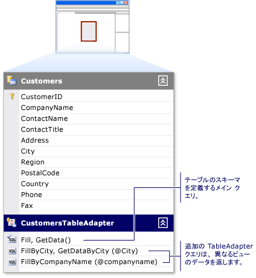

# 作成し、Tableadapter を構成します。
TableAdapter を使用すると、アプリケーションとデータベース間で通信できます。 データベース、クエリまたはストアド プロシージャに接続して、新しいデータを返すか、テーブルまたは既存の fill<xref:System.Data.DataTable>返されたデータです。 Tableadapter では、データベースに、アプリケーションから更新されたデータを送信することもできます。  
  
次の操作のいずれかの操作を行うときの Tableadapter が作成されます。  
  
-   実行、[データ ソース構成ウィザード](../data-tools/media/data-source-configuration-wizard.png)いずれかを選択し、**データベース**または**Web サービス**データ ソースの種類。  
  
-   データベース オブジェクトからのドラッグ**サーバー エクスプ ローラー**に、**データセット デザイナー**です。  
  
また新しい TableAdapter を作成し、内の空の領域をツールボックスから、TableAdapter をドラッグしてデータ ソースを構成することができます、**データセット デザイナー**画面。  
  
Tableadapter の概要については、次を参照してください。 [Tableadapter を使用してデータセットを入力](../data-tools/fill-datasets-by-using-tableadapters.md)です。  
  
[!INCLUDE[note_settings_general](../data-tools/includes/note_settings_general_md.md)]  
  
## TableAdapter 構成ウィザードを使用します。  
実行、 **TableAdapter 構成ウィザード**を作成または Tableadapter およびそれらに関連する Datatable を編集します。 上で右クリックして既存の TableAdapter を構成することができます、**データセット デザイナー**です。  
  
  
  
場合は、ツールボックスから新しい TableAdapter をドラッグするときに、**データセット デザイナー**注目、ウィザードが起動し、TableAdapter をソース データを指定するプロンプトが接続するには。 次のページでは、ウィザードは、データベース、SQL ステートメントまたはストアド プロシージャのいずれかと通信するために使用するコマンドの種類を確認します。 (表示されませんこの既にデータ ソースに関連付けられた TableAdapter を構成している場合。)  
  
-   データベースの適切なアクセス許可がある場合、基になるデータベースに新しいストアド プロシージャを作成するオプションがあります。 これらのアクセス許可を持っていない場合は、このオプションはできません。  
  
-   既存のストアド プロシージャの実行を選択することもできます、**選択**、**挿入**、**更新**、および**削除**のコマンド、TableAdapter。 割り当てられているストアド プロシージャ、**更新**コマンド、たとえばが実行時に、`TableAdapter.Update()`メソッドが呼び出されます。  
  
選択したストアド プロシージャのパラメーターを、データ テーブルの対応する列に割り当てます。 たとえば、ストアド プロシージャがという名前のパラメーターを受け入れる場合`@CompanyName`に渡される、`CompanyName`セット、テーブル内の列、**基になる列**の`@CompanyName`パラメーターを`CompanyName`です。  
  
> [!NOTE]
>  SELECT コマンドに割り当てられているストアド プロシージャは、ウィザードの次の手順で指定する TableAdapter のメソッドを呼び出すことによって実行されます。 既定のメソッドは`Fill`なので、通常は、SELECT プロシージャの実行に使用するコードは`TableAdapter.Fill(tableName)`します。 既定の名前を変更する場合`Fill`、置き換える`Fill`名前の割り当て、および"TableAdapter"を TableAdapter の実際の名前に置き換えます (たとえば、 `CustomersTableAdapter`)。  
  
-   選択すると、**更新を送信するデータベースに直接メソッドを作成する**オプションは設定に相当、`GenerateDBDirectMethods`プロパティを true にします。 元の SQL ステートメントが十分な情報を提供していないか、クエリは、更新可能なクエリではない場合は、オプションは使用できません。 この状態が発生する、たとえば、**参加**クエリや単一 (スカラー) 値を返すクエリです。  
  
**オプションの高度な**ウィザードを使用します。  
- 定義されている SELECT ステートメントに基づいた INSERT、UPDATE、および DELETE のステートメントを生成、 **SQL ステートメントの生成**ページ
- [オプティミスティック同時実行制御]
- 挿入した後に、データ テーブルを更新するかどうかを指定し、UPDATE ステートメントが実行されます。  
  
## TableAdapter の塗りつぶし方法を構成します。  
場合によって、TableAdapter のテーブルのスキーマを変更することができます。 TableAdapter のプライマリに変更するには、`Fill`メソッドです。 Tableadapter の作成がプライマリ`Fill`関連付けられたデータ テーブルのスキーマを定義するメソッド。 プライマリ`Fill`メソッドは、クエリまたはストアド プロシージャが最初に TableAdapter を構成するときに入力したに基づいています。 データセット デザイナーでデータ テーブルの下にある最初の (最上位) メソッドを勧めします。  
  
  
  
TableAdapter に行った変更のメイン`Fill`メソッドは、関連付けられたデータ テーブルのスキーマに反映されます。 たとえば、メインのクエリから列を削除する`Fill`も、メソッドは、関連付けられたデータ テーブルから列を削除します。 さらに、列を削除するメイン`Fill`メソッドは、その TableAdapter の他のクエリから列を削除します。  
  
TableAdapter クエリの構成ウィザードを使用して、作成し、TableAdapter の他のクエリを編集することができます。 これら他のクエリは、スカラー値を返す、しない限り、テーブル スキーマに従う必要があります。  各追加のクエリでは、指定した名前があります。  
 
次の例をという名前で追加するクエリを呼び出す方法を示します`FillByCity`:  
 
`CustomersTableAdapter.FillByCity(NorthwindDataSet.Customers, "Seattle")`  
  
#### 新しいクエリを使用して、TableAdapter クエリの構成ウィザードを開始するには  
  
1.  データセットを開き、**データセット デザイナー**です。  
  
2.  新しいクエリを作成する場合は、ドラッグ、**クエリ**オブジェクトから、**データセット**のタブ、**ツールボックス**上に、 <xref:System.Data.DataTable>、または選択**クエリの追加**TableAdapter のショートカット メニューからです。 ドラッグすることも、**クエリ**の空の領域にオブジェクト、**データセット デザイナー**が関連付けられていない TableAdapter を作成する<xref:System.Data.DataTable>です。 これらのクエリは、単一 (スカラー) 値、または実行、更新、挿入、返すのみまたは、データベースに対するコマンドを削除します。  
  
3.  **データ接続の選択**画面を選択するか、クエリを使用する接続を作成します。  
  
    > [!NOTE]
    >  この画面は、デザイナーを使用する適切な接続が判断できないとき、または接続が使用できない場合にのみ表示されます。  
  
4.  **コマンドの種類を選択して** 画面で、データベースからデータをフェッチするメソッドを次から選択します。  
  
    -   **SQL ステートメントを使用して**データベースからデータを選択する SQL ステートメントを入力することができます。  
  
    -   **新しいストアド プロシージャを作成する**により新規に作成するウィザードでストアド プロシージャ (データベース)、指定した SELECT ステートメントに基づいています。  
  
    -   **既存のストアド プロシージャを使用して**クエリを実行しているときに、既存のストアド プロシージャを実行することができます。  
  
#### 既存のクエリで、TableAdapter クエリの構成ウィザードを開始するには  
  
-   既存の TableAdapter クエリを編集している場合、クエリを右クリックし、**構成**ショートカット メニューからです。  
  
    > [!NOTE]
    >  TableAdapter を再構成、TableAdapter のメイン クエリを右クリックし、<xref:System.Data.DataTable>スキーマです。 選択したクエリのみを構成ただし、追加のクエリは TableAdapter 上を右クリックして、します。 **TableAdapter 構成ウィザード**TableAdapter クエリの構成ウィザードは、選択したクエリのみを再構成中に、TableAdapter の定義を再構成します。  
  
#### グローバル クエリ TableAdapter を追加するには  
  
-   *グローバル クエリ*を単一の (スカラー) 値または値のいずれかを返す SQL クエリは、します。 通常、グローバル関数は、挿入、更新、削除など、データベース操作を実行します。 また、テーブルまたは特定の順序ですべてのアイテムの合計金額の顧客の数などの情報を集計します。  
  
     グローバル クエリをドラッグして追加する、**クエリ**オブジェクトから、**データセット**のタブ、**ツールボックス**の空の領域に、**データセット デザイナー**.  
  
-   たとえば、目的のタスクを実行するクエリを指定する`SELECT COUNT(*) AS CustomerCount FROM Customers`です。  
  
    > [!NOTE]
    >  ドラッグ、**クエリ**オブジェクトの上に直接、**データセット デザイナー**スカラー (単一) 値のみを返すメソッドを作成します。 クエリまたはストアド プロシージャを選択すると、単一の値を超えるで返すことがあります、中に、ウィザードによって作成されるメソッドには、1 つの値のみを返します。 たとえば、クエリには、返されるデータの最初の行の最初の列が返されます。

## 関連項目
[TableAdapters を使用してデータセットを入力する](../data-tools/fill-datasets-by-using-tableadapters.md)