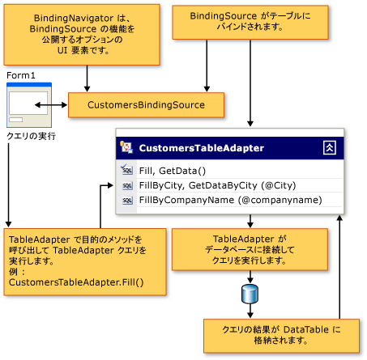

# Tableadapter を使用してデータセットを入力します。
TableAdapter のコンポーネントは、クエリまたは指定したストアド プロシージャの 1 つまたは複数に基づいて、データベースからデータを含むデータセットを格納します。 Tableadapter を行うことができますも追加、更新、およびデータセットに対して行った変更を保持するデータベースを削除します。 特定のテーブルに関連しないグローバル コマンドを発行することもできます。  
  
> [!NOTE]
>  Tableadapter は、Visual Studio のデザイナーによって生成されます。 データセットをプログラムで作成する場合は、.NET Framework クラスであるデータ アダプターを使用します。  
  
 TableAdapter の操作に関する詳細については、次のトピックのいずれかに直接を省略できます。  
  
|トピック|説明|  
|-----------|-----------------|  
|[Tableadapter の作成および構成](../data-tools/create-and-configure-tableadapters.md)|デザイナーを使用して作成し、Tableadapter を構成する方法|  
|[パラメーター付きの TableAdapter クエリを作成する](../data-tools/create-parameterized-tableadapter-queries.md)|TableAdapter のプロシージャまたはクエリに引数を指定するユーザーを有効にする方法|  
|[TableAdapter で直接データベースにアクセスする](../data-tools/directly-access-the-database-with-a-tableadapter.md)|Tableadapter の Dbdirect メソッドを使用する方法|  
|[データセットの読み込み中に制約をオフにする](../data-tools/turn-off-constraints-while-filling-a-dataset.md)|データを更新するときに、foreign key 制約を使用する方法|  
|[TableAdapter の機能を拡張する方法](../data-tools/fill-datasets-by-using-tableadapters.md)|Tableadapter にカスタム コードを追加する方法|  
|[XML データのデータセットへの読み込み](../data-tools/read-xml-data-into-a-dataset.md)|XML を操作する方法|  
  
  
  
## TableAdapter の概要  
 Tableadapter は、データベース、クエリまたはストアド プロシージャに接続し、返されたデータ、DataTable にデータをデザイナーで生成されるコンポーネントです。 Tableadapter では、データベースに、アプリケーションから更新されたデータを送信することもできます。 上でどのように TableAdapter TableAdapter が関連付けられているテーブルのスキーマに準拠するデータを返す限り、できるだけ多くのクエリを実行することができます。 次の図は、Tableadapter がデータベースとメモリ内の他のオブジェクトと対話する方法を示しています。  
  
   
  
 Tableadapter がでデザインされます、**データセット デザイナー**、TableAdapter のクラスが入れ子になったクラスとして生成されません<xref:System.Data.DataSet>です。 各データセットに固有の個別の名前空間内にあります。 たとえば、という名前のデータセットがある場合`NorthwindDataSet`、Tableadapter に関連付けられている<xref:System.Data.DataTable>内、`NorthwindDataSet`ようになります。、`NorthwindDataSetTableAdapters`名前空間。 プログラムで特定の TableAdapter にアクセスするには、TableAdapter の新しいインスタンスを宣言する必要があります。 例:  
  
 [!code-csharp[VbRaddataTableAdapters#7](../data-tools/codesnippet/CSharp/fill-datasets-by-using-tableadapters_1.cs)]
 [!code-vb[VbRaddataTableAdapters#7](../data-tools/codesnippet/VisualBasic/fill-datasets-by-using-tableadapters_1.vb)]  
  
## 関連付けられた DataTable スキーマ  
 TableAdapter を作成するとき、最初のクエリを使用する TableAdapter のスキーマを定義するストアド プロシージャの関連付けられた<xref:System.Data.DataTable>です。 この最初のクエリを実行するか、ストアド プロシージャを呼び出して、TableAdapter の`Fill`メソッド (TableAdapter の値を格納するの関連付けられた<xref:System.Data.DataTable>)。 TableAdapter のメインのクエリに加えられた変更は、関連付けられたデータ テーブルのスキーマに反映されます。 たとえば、メイン クエリから列を削除しても列から削除関連付けられたデータ テーブルです。 TableAdapter に関する他のクエリは、メインのクエリに含まれていない列を返す SQL ステートメントを使用して、デザイナーは、メインのクエリと他のクエリの間で列の変更を同期しようとします。 
  
## TableAdapter 更新コマンド  
 TableAdapter の更新プログラム機能は、情報の量は、TableAdapter ウィザードでは、メインのクエリで使用できるに左右されます。 たとえば、複数のテーブル (JOIN)、スカラー値、ビュー、または集約関数の結果から値をフェッチするように設定された TableAdapter の場合、最初の作成時には、基になるデータベースに更新を戻す機能がありません。 ただし、手動で INSERT、UPDATE、および DELETE コマンドを構成することができます、**プロパティ**ウィンドウです。  
  
## TableAdapter クエリ  
   
  
 Tableadapter では、その関連付けられたデータ テーブルを入力する複数のクエリを含めることができます。 それぞれのクエリが、関連するデータ テーブルと同じスキーマに従ったデータを返す限り、アプリケーションに必要なクエリをいくつでも TableAdapter に定義できます。 この機能は、さまざまな条件に基づいて異なる結果を読み込む TableAdapter を使用します。  
  
 たとえば、アプリケーションに顧客名を含むテーブルが含まれている場合と同じ状態にあるすべての顧客テーブルに格納する別の特定の英字で始まるすべての顧客名とテーブルを格納するクエリを作成できます。 入力する、`Customers`テーブルと、特定の状態の顧客と作成することができます、`FillByState`パラメーターを受け取る、状態の値を次のようにクエリ:`SELECT * FROM Customers WHERE State = @State`です。 呼び出してクエリを実行する、`FillByState`メソッドとパラメーター値に渡す次のような:`CustomerTableAdapter.FillByState("WA")`です。  
  
 TableAdapter のデータ テーブルと同じスキーマのデータを返すクエリを追加するだけでなく、スカラー (単一) 値を返すクエリを追加できます。 たとえば、顧客の数を返すクエリ (`SELECT Count(*) From Customers`) に対して有効では、`CustomersTableAdapter,`場合でも、返されるデータは、テーブルのスキーマに準拠していません。  
  
## ClearBeforeFill プロパティ  
 既定では、TableAdapter のデータ テーブルを格納するクエリを実行するたびに、既存のデータがクリアされ、クエリの結果のみがテーブルに読み込まれます。 設定、TableAdapter の`ClearBeforeFill`プロパティを`false`を追加またはデータ テーブル内の既存のデータにクエリから返されるデータをマージするかどうか。 データを消去するかどうかに関係なく必要があります明示的に更新プログラムに返信する、データベースに保持する場合。 テーブルに格納する別のクエリを実行する前に、テーブル内のデータに対する変更を保存してください。 詳細については、次を参照してください。 [TableAdapter を使用してデータ更新](../data-tools/update-data-by-using-a-tableadapter.md)です。  
  
## TableAdapter の継承  
 Tableadapter では、標準のデータ アダプターの機能を拡張、構成されたをカプセル化して<xref:System.Data.Common.DataAdapter>クラスです。 既定では、TableAdapter の継承から、<xref:System.ComponentModel.Component>クラスおよびにキャストすることはできません、<xref:System.Data.Common.DataAdapter>クラスです。 TableAdapter をキャスト、<xref:System.Data.Common.DataAdapter>で結果をクラス、<xref:System.InvalidCastException>エラーです。 TableAdapter の基本クラスを変更するにはから派生するクラスを指定することができます<xref:System.ComponentModel.Component>で、**基底クラス**の TableAdapter のプロパティ、**データセット デザイナー**です。  
  
## TableAdapter のメソッドとプロパティ  
 TableAdapter クラスの一部、[!INCLUDE[dnprdnshort](../code-quality/includes/dnprdnshort_md.md)]です。 つまり、ドキュメント内を検索できませんまたは**オブジェクト ブラウザー**です。 既に説明したウィザードの 1 つを使用すると、デザイン時に作成されます。 作成するときに、TableAdapter に割り当てられている名前を使用しているテーブルの名前に基づきます。 たとえば、という名前のデータベース内のテーブルに基づいて TableAdapter を作成する`Orders`、TableAdapter の名前は`OrdersTableAdapter`します。 使用して、TableAdapter のクラス名を変更することができます、**名前**プロパティに、**データセット デザイナー**です。  
  
 一般的に使用されるメソッドと Tableadapter のプロパティを次に示します。  
  
|メンバー|説明|  
|------------|-----------------|  
|`TableAdapter.Fill`|TableAdapter の関連付けられたデータ テーブルに、TableAdapter の SELECT コマンドの実行結果が格納されます。|  
|`TableAdapter.Update`|データベースに変更を送信し、更新によって影響を受ける行の数を表す整数を返します。 詳細については、次を参照してください。 [TableAdapter を使用してデータ更新](../data-tools/update-data-by-using-a-tableadapter.md)です。|  
|`TableAdapter.GetData`|新しいを返します<xref:System.Data.DataTable>データが格納されます。|  
|`TableAdapter.Insert`|データ テーブル内に新しい行を作成します。 詳細については、次を参照してください。[データベースに新しいレコードを挿入](../data-tools/insert-new-records-into-a-database.md)です。|  
|`TableAdapter.ClearBeforeFill`|いずれかの `Fill` メソッドを呼び出す前に、データ テーブルが空になっているかどうかを確認します。|  
  
## TableAdapter 更新メソッド  
 TableAdapter では、データ コマンドを使用して、データベースからの読み取りと書き込みを実行します。 TableAdapter の最初`Fill`(メイン) クエリが関連付けられているデータ テーブルのスキーマを作成するための基準として使用されるだけでなく`InsertCommand`、 `UpdateCommand`、および`DeleteCommand`コマンドに関連付けられている、`TableAdapter.Update`メソッドです。 呼び出す TableAdapter の`Update`メソッドが TableAdapter であったときに作成された、ステートメントが実行されるように構成で追加された追加のクエリのいずれかのない、 **TableAdapter クエリの構成ウィザード**.  
  
 TableAdapter を使用すると、通常実行するコマンド操作を効果的に実行できます。 たとえば、アダプターを呼び出すと`Fill`メソッド、アダプターのデータでコマンドを実行、`SelectCommand`プロパティ データ リーダーを使用して (たとえば、 <xref:System.Data.SqlClient.SqlDataReader>) をデータ テーブルに結果セットを読み込みます。 同様を呼び出すと、アダプターの`Update`メソッド、適切なコマンド実行 (で、 `UpdateCommand`、 `InsertCommand`、および`DeleteCommand`プロパティ) ごとに、データ テーブル内のレコードを変更します。  
  
> [!NOTE]
>  メインのクエリに十分な情報がある場合、TableAdapter の生成時に既定で `InsertCommand`、`UpdateCommand`、および `DeleteCommand` の各コマンドが作成されます。 TableAdapter のメインのクエリが 1 つのテーブルの SELECT ステートメントを超える場合は、可能であれば、デザイナーが生成することはできません`InsertCommand`、 `UpdateCommand`、および`DeleteCommand`です。 実行しているときにエラーが発生する場合、これらのコマンドは生成されません、`TableAdapter.Update`メソッドです。  
  
## TableAdapter の GenerateDbDirectMethods  
 加え`InsertCommand`、 `UpdateCommand`、および`DeleteCommand`Tableadapter の作成が、データベースに対して直接実行できるメソッドです。 これらのメソッド (`TableAdapter.Insert`、`TableAdapter.Update`、および `TableAdapter.Delete`) は、データベース内でデータを直接操作するために呼び出すことができます。 つまり、これらの各メソッドを呼び出す代わりに、コードから呼び出すことができます`TableAdapter.Update`挿入、更新、および保留になっている削除を処理する、関連付けられたデータ テーブルにします。  
  
 これらの直接メソッドを作成しない場合は、設定、TableAdapter の**GenerateDbDirectMethods**プロパティを`false`(で、**プロパティ**ウィンドウ)。 TableAdapter に追加されるその他のクエリはスタンドアロン クエリなど、これらのメソッドを生成しません。  
  
## Null 許容型の TableAdapter のサポート  
 Null 許容型をサポートする Tableadapter`Nullable(Of T)`と`T?`です。 Visual Basic での null 許容型について詳しくは、「[null 許容値型](/dotnet/visual-basic/programming-guide/language-features/data-types/nullable-value-types)」をご覧ください。 C# での null 許容型の詳細については、次を参照してください。 [null 許容型を使用して](/dotnet/csharp/programming-guide/nullable-types/using-nullable-types)です。  
  
  
  
## TableAdapterManager 参照  
 既定では、`TableAdapterManager`関連テーブルを含むデータセットを作成するときに、クラスを生成します。 クラスが生成されないようにするには、値を変更、`Hierarchical Update`を false にデータセットのプロパティです。 Windows フォームや WPF ページのデザイン サーフェイスに関係のあるテーブルをドラッグすると、Visual Studio は、クラスのメンバー変数を宣言します。 データ バインドを使用しない場合は、手動で変数を宣言する必要があります。  
  
 `TableAdapterManager`クラスは、の一部、[!INCLUDE[dnprdnshort](../code-quality/includes/dnprdnshort_md.md)]です。 そのため、ドキュメントを参照することはできません。 デザイン時に、データセットの作成プロセスの一部として作成されます。  
  
 よく使用されるメソッドとプロパティの次のとおり、`TableAdapterManager`クラス。  
  
|メンバー|説明|  
|------------|-----------------|  
|`UpdateAll` メソッド|すべてのデータ テーブルからすべてのデータを保存します。|  
|`BackUpDataSetBeforeUpdate` プロパティ|実行する前に、データセットのバックアップ コピーを作成するかどうか、`TableAdapterManager.UpdateAll`メソッドです。ブール値。|  
|*tableName* `TableAdapter`プロパティ|表す、`TableAdapter`です。 生成された`TableAdapterManager`ごとにプロパティを含む`TableAdapter`を管理します。 Customers と Orders テーブルを含むデータセットが生成など、`TableAdapterManager`を格納している`CustomersTableAdapter`と`OrdersTableAdapter`プロパティです。|  
|`UpdateOrder` プロパティ|個々 の insert、update、および delete コマンドの順序を制御します。 この設定の値のいずれかに、`TableAdapterManager.UpdateOrderOption`列挙します。   既定では、`UpdateOrder`に設定されている**InsertUpdateDelete**です。 つまり、挿入し、更新、および削除しは、データセット内のすべてのテーブルに対して実行されます。|

## セキュリティ  
CommandType プロパティに設定されたデータ コマンドを使用すると<xref:System.Data.CommandType.Text>、慎重に、データベースに渡す前に、クライアントから送信される情報を確認します。 悪意のあるユーザーが、承認なしでデータベースにアクセスしたり、データベースを破壊したりする目的で、変更した SQL ステートメントや追加の SQL ステートメントの送信 (挿入) を試みる場合があります。 データベースへのユーザー入力を転送する前に、常に情報が有効なことを確認します。 常にパラメーター化クエリ、または可能であればストアド プロシージャを使用することをお勧めします。  
  
## 関連項目
[データセットのツール](../data-tools/dataset-tools-in-visual-studio.md)