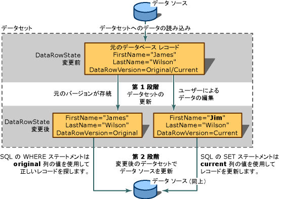

# <a name="save-data-back-to-the-database"></a>データをデータベースに保存します。
データセットは、データのメモリ内のコピーです。 そのデータを変更する場合は、これらの変更をデータベースに保存することをお勧めします。 これには 3 つの方法のいずれかの操作を行います。

-   TableAdapter の更新方法のいずれかを呼び出す

-   TableAdapter の DBDirect メソッドのいずれかを呼び出す

-   Visual Studio で生成する、データセットには、データセット内の他のテーブルに関連付けられているテーブルが含まれている場合、TableAdapterManager で UpdateAll メソッドを呼び出すことにより

Windows フォームまたは XAML ページ上のコントロールをデータセット テーブルをバインドするデータとデータ バインディング アーキテクチャは、すべての作業を行います。

Tableadapter に慣れている場合は、次のトピックのいずれかに直接ジャンプできます。

|トピック|説明|
|-----------|-----------------|
|[データベースに新しいレコードを挿入する](../data-tools/insert-new-records-into-a-database.md)|実行する方法が更新し、Tableadapter またはコマンド オブジェクトを使用して挿入します。|
|[TableAdapter を使用してデータを更新する](../data-tools/update-data-by-using-a-tableadapter.md)|Tableadapter が更新を実行する方法|
|[階層更新](../data-tools/hierarchical-update.md)|2 つ以上の関連するテーブルを含むデータセットから更新プログラムを実行する方法|
|[同時実行例外を処理する](../data-tools/handle-a-concurrency-exception.md)|2 つのユーザーを同時に、データベース内の同じデータを変更するときに例外を処理する方法|
|[方法: トランザクションを使用してデータを保存](../data-tools/save-data-by-using-a-transaction.md)|System.Transactions 名前空間と TransactionScope オブジェクトを使用して、トランザクションでデータを保存する方法|
|[チュートリアル: トランザクションにデータを保存する](../data-tools/save-data-in-a-transaction.md)|トランザクション内のデータベースへのデータの保存を示すために Windows フォーム アプリケーションを作成するチュートリアル|
|[データベースへのデータの保存 (複数テーブル)](../data-tools/save-data-to-a-database-multiple-tables.md)|レコードを編集し、データベースに複数のテーブルで変更を保存する方法|
|[オブジェクトからデータベースにデータを保存する](../data-tools/save-data-from-an-object-to-a-database.md)|TableAdapter DbDirect メソッドを使用して、データセットをデータベースに含まれないオブジェクトからデータを渡す方法|
|[TableAdapter DBDirect メソッドを使用してデータを保存する](../data-tools/save-data-with-the-tableadapter-dbdirect-methods.md)|TableAdapter を使用して、データベースに直接 SQL クエリを送信する方法|
|[データセットを XML として保存する](../data-tools/save-a-dataset-as-xml.md)|XML ドキュメントにデータセットを保存する方法|

## <a name="two-stage-updates"></a>2 段階の更新
 2 段階のプロセスは、データ ソースを更新します。 最初の手順では、新しいレコード、変更されたレコード、または削除されたレコードでデータセットを更新します。 アプリケーションは、データ ソースに戻ることはありませんこれらの変更を送信する場合を完了すると、更新プログラムはします。

 データベースに変更を送信する場合、2 番目の手順が必要です。 データ バインド コントロールを使用していない場合は、手動でデータセットを作成するために使用する同じ TableAdapter (またはデータ アダプター) の Update メソッドを呼び出す必要があります。 ただし、1 つのデータ ソースからデータを移動する、または複数のデータ ソースを更新するも別のアダプターを使用することができます。 データ バインディングを使用するいないし、関連テーブルに対して変更の保存は、TableAdapterManager、自動生成されたクラスの変数を手動でインスタンス化し、その UdpateAll メソッドを呼び出す必要があります。

  2 段階プロセスと、正常な更新における DataRowVersion の役割の更新

 データセットには、行のコレクションを含むテーブルのコレクションが含まれています。 後で、基になるデータ ソースを更新する場合は、DataTable.DataRowCollection プロパティの追加または行を削除するときにメソッドを使用する必要があります。 これらのメソッドは、データ ソースの更新のために必要な変更の追跡を実行します。 行のプロパティで RemoveAt コレクションを呼び出すと場合、削除がデータベースに戻されて伝えするされません。

## <a name="merge-datasets"></a>データセットをマージします。
 によってデータセットの内容を更新する*マージ*別のデータセットにします。 内容をコピーするためにこの、*ソース*に呼び出し元のデータセットのデータセット (と呼ばれる、*ターゲット*データセット)。 データセットをマージすると、ソース データセットの新しいレコードはターゲット データセットに追加されます。 また、ソース データセットのその他の列もターゲット データセットに追加されます。 ローカルのデータセットを用意して、別のアプリケーションから 2 番目のデータセットを取得する場合は、データセットをマージすると便利です。 XML web サービスなどのコンポーネントから 2 番目のデータセットを取得する場合、または複数のデータセットからデータを統合する必要がある場合にも便利です。

 データセットをマージする場合は、ブール型の引数を渡すことができます (`preserveChanges`) ことが示されます、<xref:System.Data.DataSet.Merge%2A>メソッドはターゲット データセットの既存の変更を保持するかどうか。 データセットは、レコードの複数のバージョンを維持、ために、レコードの 1 つ以上のバージョンがマージされることに注意してください必要があります。 次の表は、2 つのデータセット内のレコードをマージする方法を示しています。

|DataRowVersion|ターゲット データセット|ソース データセット|
|--------------------|--------------------|--------------------|
|元|James Wilson|James C. Wilson|
|現在|Jim Wilson|James C. Wilson|

 呼び出す、<xref:System.Data.DataSet.Merge%2A>メソッドで、前の表を`preserveChanges=false targetDataset.Merge(sourceDataset)`結果、次の。

|DataRowVersion|ターゲット データセット|ソース データセット|
|--------------------|--------------------|--------------------|
|元|James C. Wilson|James C. Wilson|
|現在|James C. Wilson|James C. Wilson|

 <xref:System.Data.DataSet.Merge%2A> である場合に `preserveChanges = true targetDataset.Merge(sourceDataset, true)` メソッドを呼び出すと、結果は次のようになります。

|DataRowVersion|ターゲット データセット|ソース データセット|
|--------------------|--------------------|--------------------|
|元|James C. Wilson|James C. Wilson|
|現在|Jim Wilson|James C. Wilson|

> [!CAUTION]
>  `preserveChanges = true`シナリオでは場合、<xref:System.Data.DataSet.RejectChanges%2A>メソッドは、ターゲット データセットのレコードにし、元のデータに戻ります、*ソース*データセット。 つまりターゲット データセットによって元のデータ ソースを更新しようとする場合にできないことがありますを更新する元の行を検出できません。 別のデータセット、データ ソースから更新されたレコードに格納し、同時実行制御違反を防ぐためにマージを実行することによって、同時実行制御違反を防ぐことができます。 (同時実行違反は、データセットにレコードが格納された後で別のユーザーがデータ ソース内のレコードを変更すると発生します)。

## <a name="update-constraints"></a>更新の制約
 既存のデータ行を変更するには、追加または個々 の列のデータを更新します。 データセットに制約 (外部キー、null 非許容の制約など) が含まれている場合は、レコード一時的にできること、エラー状態に更新すると考えられるです。 つまり、できます、エラー状態に 1 つの列の更新の終了後、次のいずれかを取得する前にします。

 早期に制約違反を防ぐために、更新制約を一時的に中断できます。 これには 2 つの目的があります。

-   エラーが 1 つの列の更新が完了しましたが、別の更新を開始していない後にスローされるを防ぐ。

-   これにより、特定の更新イベントの発生 (検証によく使われるイベント)。

> [!NOTE]
>  Windows フォームでのデータ グリッドに組み込まれているデータ バインディング アーキテクチャは、フォーカスが、行外に移動し、明示的に呼び出していないまで制約チェックを中断、 <xref:System.Data.DataRow.BeginEdit%2A>、 <xref:System.Data.DataRow.EndEdit%2A>、または<xref:System.Data.DataRow.CancelEdit%2A>メソッドです。

 データセットで <xref:System.Data.DataSet.Merge%2A> メソッドが呼び出されると、制約は自動的に無効になります。 マージが完了したら、有効にするデータセットに制約がある場合、<xref:System.Data.ConstraintException>がスローされます。 この場合、<xref:System.Data.DataSet.EnforceConstraints%2A> プロパティが `false,` に設定されるので、すべての制約違反を解決してから <xref:System.Data.DataSet.EnforceConstraints%2A> プロパティを `true` に設定し直す必要があります。

 更新プログラムを完了すると、再利用できます制約チェックをこれも更新イベントを再度有効になり、それらを発生させます。

 イベントの中断に関する詳細については、次を参照してください。[データセットの読み込み中に制約をオフに](../data-tools/turn-off-constraints-while-filling-a-dataset.md)です。

## <a name="dataset-update-errors"></a>データセットの更新エラー
 データセットのレコードを更新するときにエラーが発生する場合があります。 たとえば、列に正しくない型のデータまたは非常に長いデータまたは他の整合性の問題のあるデータを誤って書き込んだ場合します。 または、更新イベントのいずれかの段階においてカスタム エラーを引き起こすアプリケーション固有の検証チェックする必要があります。 詳細については、次を参照してください。[データセット内のデータを検証](../data-tools/validate-data-in-datasets.md)です。

## <a name="maintaining-information-about-changes"></a>変更に関する情報を保持します。
 データセットの変更に関する情報を保持する 2 つの方法: 行が変更されたことを示すフラグを設定 (<xref:System.Data.DataRow.RowState%2A>)、およびレコードの複数のコピーを保持することで (<xref:System.Data.DataRowVersion>)。 変更に関する情報を使用することにより、プロセスはデータセットの変更内容を確認し、適切な更新内容をデータ ソースに送信できます。

### <a name="rowstate-property"></a>RowState プロパティ
 <xref:System.Data.DataRow.RowState%2A> オブジェクトの <xref:System.Data.DataRow> プロパティは、データの特定の行のステータスに関する情報を提供する値です。

 <xref:System.Data.DataRowState> 列挙定数に使用できる値の詳細を次の表に示します。

|DataRowState 列挙定数の値|説明|
|------------------------|-----------------|
|<xref:System.Data.DataRowState.Added>|行は項目として <xref:System.Data.DataRowCollection> に追加されました。 (この状態の行が対応する元のバージョンが存在しないため場合、最後<xref:System.Data.DataRow.AcceptChanges%2A>メソッドが呼び出されました)。|
|<xref:System.Data.DataRowState.Deleted>|行は <xref:System.Data.DataRow.Delete%2A> オブジェクトの <xref:System.Data.DataRow> を使用して削除されました。|
|<xref:System.Data.DataRowState.Detached>|行は作成されましたが、<xref:System.Data.DataRowCollection> の一部ではありません。 A<xref:System.Data.DataRow>がコレクションから削除された後、それが作成された後に追加された、コレクションにすぐに、オブジェクトがこの状態にします。|
|<xref:System.Data.DataRowState.Modified>|行の列の値が何らかの方法で変更します。|
|<xref:System.Data.DataRowState.Unchanged>|行は <xref:System.Data.DataRow.AcceptChanges%2A> が最後に呼び出されてから変更されていません。|

### <a name="datarowversion-enumeration"></a>DataRowVersion 列挙型
データセットはレコードの複数のバージョンを保持します。 <xref:System.Data.DataRowVersion>で見つかった値を取得する場合に、フィールドを使用できます、<xref:System.Data.DataRow>を使用して、<xref:System.Data.DataRow.Item%2A>プロパティまたは<xref:System.Data.DataRow.GetChildRows%2A>のメソッド、<xref:System.Data.DataRow>オブジェクト。

<xref:System.Data.DataRowVersion> 列挙定数に使用できる値の詳細を次の表に示します。

|DataRowVersion 列挙定数の値|説明|
|--------------------------|-----------------|
|<xref:System.Data.DataRowVersion.Current>|現在のバージョン レコードのレコードで前回実行されたすべての変更が含まれています<xref:System.Data.DataRow.AcceptChanges%2A>が呼び出されました。 行が削除された場合、現在のバージョンはありません。|
|<xref:System.Data.DataRowVersion.Default>|データセット スキーマまたはデータ ソースにより定義されたレコードの既定値です。|
|<xref:System.Data.DataRowVersion.Original>|レコードの元のバージョンは、データセットで最後の変更がコミットされたときのレコードのコピーです。 つまり、通常はデータ ソースから読み込まれたときのレコードのバージョンです。|
|<xref:System.Data.DataRowVersion.Proposed>|一時的の実行中の更新に使用できるレコードの提案されたバージョン: されるは、までの時間を呼び出す、<xref:System.Data.DataRow.BeginEdit%2A>メソッドおよび<xref:System.Data.DataRow.EndEdit%2A>メソッドです。 通常は <xref:System.Data.DataTable.RowChanging> などのイベントのハンドラーで、レコードの提案されたバージョンにアクセスします。 <xref:System.Data.DataRow.CancelEdit%2A> メソッドを呼び出すと、変更は無効になり、データ行の提案されたバージョンは削除されます。|

 元のバージョンおよび現在のバージョンは、更新情報をデータ ソースに送信する場合に役立ちます。 通常、更新情報をデータ ソースに送信すると、データベースの新しい情報がレコードの現在のバージョンに含まれます。 元のバージョンの情報は、更新するレコードを見つけるために使用されます。

 たとえば、レコードの主キーが変更されている場合は、変更内容を更新するために、データ ソース内で適切なレコードを検索する方法が必要です。 元のバージョンがなかった場合、レコードはデータ ソースに追加される可能性が高く、結果として不要なレコードが作成されるだけでなく、不正確な古いレコードが 1 つ作成されることになります。 2 つのバージョンは、同時実行制御でも使用されます。 元のバージョンを特定のレコードがデータセットに読み込まれてから変更されていないデータ ソース内のレコードを比較できます。

 提案されたバージョンは、実際に変更をデータセットにコミットする前に検証が必要な場合に役立ちます。

 レコードが変更されていても、その行の元のバージョンまたは現在のバージョンが必ず存在するわけではありません。 新しい行をテーブルに挿入した場合、元のバージョンは存在せず、現在のバージョンがあるだけです。 同様に、テーブルの `Delete` メソッドを呼び出すことにより行を削除した場合、元のバージョンはありますが現在のバージョンはありません。

 データ行の <xref:System.Data.DataRow.HasVersion%2A> メソッドを照会することにより、レコードの特定のバージョンが存在するかどうかを確認するテストを行うことができます。 列の値を要求するときに <xref:System.Data.DataRowVersion> 列挙値をオプションの引数として渡すことにより、レコードのいずれかのバージョンにアクセスできます。

## <a name="getting-changed-records"></a>変更されたレコードを取得します。
 データセットのすべてのレコードを更新しないように一般的なことをお勧めします。 たとえば、多数のレコードを表示する Windows フォームの <xref:System.Windows.Forms.DataGridView> コントロールをユーザーが使用しているとします。 このとき、ユーザーが一部のレコードだけを更新し、レコードを 1 つ削除し、新しいレコードを 1 つ挿入したとします。 そのような場合のために、データセットおよびデータ テーブルには、変更された行だけを返すためのメソッド (`GetChanges`) が用意されています。

 データ テーブルの `GetChanges` メソッド (<xref:System.Data.DataTable.GetChanges%2A>) またはデータセットの <xref:System.Data.DataSet.GetChanges%2A> メソッド () を使って、変更されたレコードのサブセットを作成できます。 データ テーブルのメソッドを呼び出すと、変更されたレコードだけを含むテーブルのコピーが返されます。 同様に、データセットのメソッドを呼び出すと、変更されたレコードだけを含む新しいデータセットを取得できます。

 `GetChanges` それ自体では、変更されたすべてのレコードを返します。 目的を渡すことによってこれに対し、<xref:System.Data.DataRowState>へのパラメーターとして、`GetChanges`メソッド、か変更されたレコードのサブセットを指定することができます。 新たにデタッチされた、レコードのレコード、削除対象としてマークされているレコードを追加または変更されたレコード。

 レコードを処理するための別のコンポーネントに送信する場合は、変更されたレコードのサブセットを取得すると便利です。 データセット全体を送信する代わりに、コンポーネントが必要としているレコードだけを取得することにより、ほかのコンポーネントとの通信によるオーバーヘッドを小さくできます。

## <a name="committing-changes-in-the-dataset"></a>データセットの変更をコミットします。
 データセットを変更すると、変更された行の <xref:System.Data.DataRow.RowState%2A> プロパティが設定されます。 レコードの元と現在のバージョンが確立、維持されて、および利用可能で、<xref:System.Data.DataRowView.RowVersion%2A>プロパティです。 これらの変更された行のプロパティに格納されているメタデータは、データ ソースに適切な更新プログラムを送信する必要があります。

 変更内容がデータ ソースの現在の状態を反映している場合は、この情報を保持する必要はなくなります。 通常が 2 つありますが、データセットとそのソースの同期。

-   ソースからデータを読み込んだときなど、情報をデータセットに読み込んだ直後。

-   データセットからデータ ソースへの変更の送信後に (前に、ではありません、ため、変更をデータベースに送信するために必要な変更情報を失います)。

保留中の変更は、<xref:System.Data.DataSet.AcceptChanges%2A> メソッドを呼び出してデータセットにコミットできます。 通常、<xref:System.Data.DataSet.AcceptChanges%2A>は次のタイミングで呼び出されます。

-   した後、データセットを読み込みます。 TableAdapter の `Fill` メソッドを呼び出すことによりデータセットを読み込んだ場合、TableAdapter により変更が自動的にコミットされます。 ただし、別のデータセットをマージすることによりデータセットを読み込む場合は、変更を手動でコミットする必要があります。

    > [!NOTE]
    >  アダプターが防止を呼び出すときに自動的に変更をコミットすることができます、`Fill`を設定することによって、`AcceptChangesDuringFill`アダプターのプロパティ`false`です。 設定されている場合`false`、続いて、<xref:System.Data.DataRow.RowState%2A>の読み込み中に挿入される行ごとに設定されている<xref:System.Data.DataRowState.Added>です。

-   後に、データセットの変更内容を XML Web サービスなどの別のプロセスに送信します。

    > [!CAUTION]
    >  この方法で変更をコミットすると、変更情報はすべて削除されます。 ない変更をコミットするまでした後をデータセットにどのような変更が加えられた次のトピックに、アプリケーションを必要とする操作の実行を完了します。

この方法で実行できる処理は次のとおりです。

-   書き込みます、<xref:System.Data.DataRowVersion.Current>にレコードのバージョンの<xref:System.Data.DataRowVersion.Original>バージョンと元のバージョンを上書きします。

-   任意の行を削除位置、<xref:System.Data.DataRow.RowState%2A>プロパティに設定されている<xref:System.Data.DataRowState.Deleted>です。

-   レコードの <xref:System.Data.DataRow.RowState%2A> プロパティを <xref:System.Data.DataRowState.Unchanged> に設定する。

<xref:System.Data.DataSet.AcceptChanges%2A> メソッドは、3 つのレベルで利用可能です。 呼び出せる、<xref:System.Data.DataRow>行にだけコミットするオブジェクトを変更します。 も呼び出すことができます、<xref:System.Data.DataTable>テーブル内のすべての行をコミットするオブジェクト。 最後に、それを呼び出せます、<xref:System.Data.DataSet>データセットのすべてのテーブルの全レコードの保留中のすべての変更をコミットするオブジェクト。

メソッドが呼び出されたオブジェクトに基づいてコミットされる変更を次の表に示します。

|メソッド|結果|
|------------|------------|
|<xref:System.Data.DataRow.AcceptChanges%2A?displayProperty=fullName>|変更は、特定の行にだけコミットされます。|
|<xref:System.Data.DataTable.AcceptChanges%2A?displayProperty=fullName>|変更は、特定のテーブルのすべての行にコミットされます。|
|<xref:System.Data.DataSet.AcceptChanges%2A?displayProperty=fullName>|変更は、データセットのすべてのテーブルのすべての行にコミットされます。|

> [!NOTE]
>  TableAdapter を呼び出すことによって、データセットを読み込んだかどうか`Fill`メソッドがない明示的に変更を確定します。 既定では、`Fill`メソッドの呼び出し、`AcceptChanges`メソッド テーブルのデータ設定が終了した後です。

 関連するメソッドでは、 <xref:System.Data.DataSet.RejectChanges%2A>、コピーして変更の効果を元に戻します、<xref:System.Data.DataRowVersion.Original>に戻るバージョン、<xref:System.Data.DataRowVersion.Current>レコードのバージョン。 また、設定、<xref:System.Data.DataRow.RowState%2A>各レコードの<xref:System.Data.DataRowState.Unchanged>します。

## <a name="data-validation"></a>データの検証
 アプリケーションのデータが、渡される対象プロセスの要件を満たしているかどうかを検査するために、検証を追加することが必要な場合もあります。 フォームのユーザーのエントリが正しいこと、他のアプリケーションによって、アプリケーションに送信されるデータの検証またはでもチェック コンポーネント内で計算される情報が、データ ソースの制約内にあることを確認でこのが含まれますアプリケーションの要件です。

 データを検証するには次の方法があります。

-   ビジネス層で、データを検証するコードをアプリケーションに追加する。 データセットでこれを行うことができます。 データセットでは、列および行の値が変更されるたびに変更を検証する機能など、バック エンド検証を活用できます。 詳細については、次を参照してください。[データセット内のデータを検証](../data-tools/validate-data-in-datasets.md)です。

-   プレゼンテーション層で、検証をフォームに追加する。 詳細については、次を参照してください。 [Windows フォームでのユーザーの入力検証](/dotnet/framework/winforms/user-input-validation-in-windows-forms)です。

-   データのバック エンドで、データをデータベースなどのデータ ソースに送信し、データの受け入れまたは拒否を行うことができるようにする。 データの検証やエラー情報を提供する洗練された機能を備えたデータベースを使用している場合、実用的なアプローチになります。データのソースが何であるかにかかわらずデータを検証できるからです。 ただし、このアプローチでは、アプリケーション固有の検証の要件が対応いない可能性があります。 また、アプリケーションが、バック エンドによって発生する検証エラーの解決を容易にする方法に応じて、データ ソースにラウンド トリップが多数データ ソースでデータを検証の結果ことができます。

    > [!IMPORTANT]
    >  データ コマンドを使用する場合、<xref:System.Data.SqlClient.SqlCommand.CommandType%2A>プロパティに設定されている<xref:System.Data.CommandType.Text>、慎重に、データベースに渡す前に、クライアントから送信される情報を確認します。 悪意のあるユーザーが、承認なしでデータベースにアクセスしたり、データベースを破壊したりする目的で、変更した SQL ステートメントや追加の SQL ステートメントの送信 (挿入) を試みる場合があります。 データベースへのユーザー入力を転送する前に、常に情報が有効なことを確認します。 常にパラメーター化クエリまたはストアド プロシージャ可能な場合に使用することをお勧めします。

## <a name="transmitting-updates-to-the-data-source"></a>データ ソースへの送信の更新
データセットを変更した後で、変更内容をデータ ソースに転送できます。 一般に、これは TableAdapter (またはデータ アダプター) の `Update` メソッドを呼び出すことによって行います。 メソッドをループし、データ テーブル内の各レコードは、必要な更新プログラムの種類を決定 (update、insert、または delete) 存在する場合、適切なコマンドを実行します。

 更新を行う方法の図解は、アプリケーションを 1 つのデータ テーブルを含むデータセットを使用する場合を考えます。 アプリケーションはデータベースから 2 つの行をフェッチします。 行の取得後、インメモリ データ テーブルは次のようになります。

```
(RowState)     CustomerID   Name             Status
(Unchanged)    c200         Robert Lyon      Good
(Unchanged)    c400         Nancy Buchanan    Pending
```

 アプリケーションによって Nancy Buchanan のステータスが "Preferred" に変更されます。 この変更の結果、その行の <xref:System.Data.DataRow.RowState%2A> プロパティの値は、<xref:System.Data.DataRowState.Unchanged> から <xref:System.Data.DataRowState.Modified> に変更されます。 最初の行の <xref:System.Data.DataRow.RowState%2A> プロパティの値は、<xref:System.Data.DataRowState.Unchanged> のままです。 データ テーブルは次のようになります。

```
(RowState)     CustomerID   Name             Status
(Unchanged)    c200         Robert Lyon      Good
(Modified)     c400         Nancy Buchanan    Preferred
```

 アプリケーションは `Update` メソッドを呼び出し、データセットをデータベースに転送します。 このメソッドは各行を順に調べます。 最初の行にメソッド SQL ステートメントに転送されません、データベースの該当する行が変更されていないため、データベースからフェッチされました。

 2 番目の行、ただし、`Update`メソッドは自動的に正しいデータ コマンドを呼び出すし、データベースに転送されます。 SQL ステートメントの特定の構文は、基になるデータ ストアでサポートされている SQL の言語に依存します。 ただし、転送される SQL ステートメントには次のような一般的な特徴があります。

-   転送される SQL ステートメントは UPDATE ステートメントである。 <xref:System.Data.DataRow.RowState%2A> プロパティの値が <xref:System.Data.DataRowState.Modified> であるため、このアダプターは UPDATE ステートメントを使用します。

-   転送される SQL ステートメントには、UPDATE ステートメントの対象が行であることを示す WHERE 句が含まれています。 ここで`CustomerID = 'c400'`です。 `CustomerID` は転送先のテーブルの主キーであるため、SELECT ステートメントのこの部分により転送先の行を他の行と区別します。 WHERE 句の派生のレコードの元のバージョンに関する情報 (`DataRowVersion.Original`)、行を識別するために必要な値が変更された場合に、します。

-   転送される SQL ステートメントには SET 句が含まれており、変更された列の新しい値を設定する。

    > [!NOTE]
    > TableAdapter の `UpdateCommand` プロパティにストアド プロシージャの名前が設定されている場合、TableAdapter は SQL ステートメントを作成しません。 その代わりに、適切なパラメーターを渡してストアド プロシージャを呼び出します。

## <a name="passing-parameters"></a>パラメーターを渡す
 通常、パラメーターを使用するには、データベースで更新するレコードの値を渡します。  ときに、TableAdapter の`Update`メソッドには UPDATE ステートメントが実行され、パラメーター値を設定する必要があります。 この値は、該当するデータ コマンドの `Parameters` コレクションから取得します。この場合は TableAdapter の `UpdateCommand` オブジェクトです。

 データ アダプターを生成する Visual Studio のツールを使用した場合、`UpdateCommand`オブジェクトには、ステートメント内の各パラメーター プレース ホルダーに対応するパラメーターのコレクションが含まれています。

 各パラメーターの <xref:System.Data.SqlClient.SqlParameter.SourceColumn%2A?displayProperty=fullName> プロパティは、データ テーブル内の列を指しています。 たとえば、`SourceColumn` パラメーターおよび `au_id` パラメーターの `Original_au_id` プロパティには、データ テーブルの author id を含む列が設定されます。ときに、アダプターの`Update`メソッドを実行する、作成者 id 列から読み取るレコードが更新されると、ステートメントに値を設定します。

 UPDATE ステートメントでは、(レコードに書き込まれるもの) 両方の新しい値をできるだけでなく、古い値が (レコードは、データベース内にあることができます) を指定する必要があります。 したがって、それぞれの値に、SET 句のパラメーターと WHERE 句の 2 つのパラメーターがあります。 両方のパラメーターが、更新されるレコードからデータを読み取りますが、異なるバージョンのパラメーターの列の値の<xref:System.Data.SqlClient.SqlParameter.SourceVersion>プロパティです。 SET 句のパラメーターは現在のバージョンを取得し、WHERE 句のパラメーターは元のバージョンを取得します。

> [!NOTE]
> `Parameters` コレクションの値はコードで設定することもできます。通常はデータ アダプターの <xref:System.Data.DataTable.RowChanging> イベントのイベント ハンドラーで設定します。

## <a name="see-also"></a>関連項目

- [Visual Studio のデータセット ツール](../data-tools/dataset-tools-in-visual-studio.md)
- [作成し、Tableadapter を構成します。](create-and-configure-tableadapters.md)
- [TableAdapter を使用してデータを更新する](../data-tools/update-data-by-using-a-tableadapter.md)
- [Visual Studio でのデータへのコントロールのバインド](../data-tools/bind-controls-to-data-in-visual-studio.md)
- [データの検証](validate-data-in-datasets.md)
- [データの保存](../data-tools/saving-data.md)