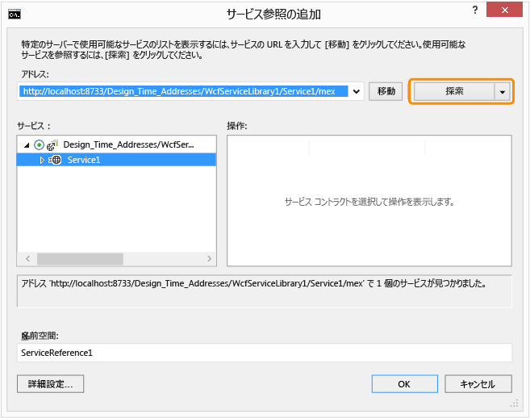

# Walkthrough: Creating and Accessing WCF Services
このチュートリアルは、単純な [!INCLUDE[vsindigo](../data-tools/includes/vsindigo_md.md)] サービスを作成し、テストして、Windows フォーム アプリケーションからアクセスする方法を例示しています。  
  
 [!INCLUDE[note_settings_general](../data-tools/includes/note_settings_general_md.md)]  
  
## サービスの作成  
  
#### WCF サービスを作成するには  
  
1.  **\[ファイル\]** メニューの **\[新規作成\]** をポイントし、**\[プロジェクト\]** をクリックします。  
  
2.  **\[新しいプロジェクト\]** ダイアログ ボックスで、**\[Visual Basic\]** または **\[Visual C\#\]** ノードを展開し、**\[WCF\]** をクリックしてから **\[WCF サービス ライブラリ\]** をクリックします。  **\[OK\]** をクリックして、プロジェクトを開きます。  
  
       
  
    > [!NOTE]
    >  これにより、テストしてアクセスすることが可能な機能するサービスが作成されます。  次の 2 つの手順は、別のデータ型を使用するように既定の方法を変更する方法を示しています。  実際のアプリケーションで、独自の関数をサービスに追加することもできます。  
  
3.    
  
     **ソリューション エクスプローラー**で、IService1.vb または IService1.cs をダブルクリックし、次の行を探します。  
  
     [!code-cs[WCFWalkthrough#4](../data-tools/codesnippet/CSharp/walkthrough-creating-a-simple-wcf-service-in-windows-forms_1.cs)]
     [!code-vb[WCFWalkthrough#4](../data-tools/codesnippet/VisualBasic/walkthrough-creating-a-simple-wcf-service-in-windows-forms_1.vb)]  
  
     `value` パラメーターの種類を `String` に変更します。  
  
     [!code-cs[WCFWalkthrough#1](../data-tools/codesnippet/CSharp/walkthrough-creating-a-simple-wcf-service-in-windows-forms_2.cs)]
     [!code-vb[WCFWalkthrough#1](../data-tools/codesnippet/VisualBasic/walkthrough-creating-a-simple-wcf-service-in-windows-forms_2.vb)]  
  
     上記のコードで、`<OperationContract()>` または `[OperationContract]` 属性に注意してください。  これらの属性は、サービスによって公開されている任意のメソッドに必要です。  
  
4.    
  
     **ソリューション エクスプローラー**で、Service1.vb または Service1.cs をダブルクリックし、次の行を探します。  
  
     [!code-vb[WCFWalkthrough#5](../data-tools/codesnippet/VisualBasic/walkthrough-creating-a-simple-wcf-service-in-windows-forms_3.vb)]
     [!code-cs[WCFWalkthrough#5](../data-tools/codesnippet/CSharp/walkthrough-creating-a-simple-wcf-service-in-windows-forms_3.cs)]  
  
     値パラメーターの種類を `String` に変更します。  
  
     [!code-cs[WCFWalkthrough#2](../data-tools/codesnippet/CSharp/walkthrough-creating-a-simple-wcf-service-in-windows-forms_4.cs)]
     [!code-vb[WCFWalkthrough#2](../data-tools/codesnippet/VisualBasic/walkthrough-creating-a-simple-wcf-service-in-windows-forms_4.vb)]  
  
## サービスのテスト  
  
#### WCF サービスをテストするには  
  
1.  **F5** キーを押してサービスを実行します。  **\[WCF のテスト用クライアント\]** フォームが表示されて、サービスが読み込まれます。  
  
2.  **\[WCF のテスト用クライアント\]** フォームで、**IService1** の下の **GetData\(\)** メソッドをダブルクリックします。  **\[GetData\]** タブが表示されます。  
  
       
  
3.  **\[要求\]** ボックスで、**\[値\]** フィールドを選択して `Hello` と入力します。  
  
       
  
4.  **\[起動\]** ボタンをクリックします。  **\[セキュリティ警告\]** ダイアログ ボックスが表示された場合、**\[OK\]** をクリックします。  結果が **\[応答\]** ボックスに表示されます。  
  
       
  
5.  **\[ファイル\]** メニューの **\[終了\]** をクリックして、テスト フォームを閉じます。  
  
## サービスへのアクセス  
  
#### WCF サービスを参照するには  
  
1.  **\[ファイル\]** メニューの **\[追加\]** をポイントし、**\[新しいプロジェクト\]** をクリックします。  
  
2.  **\[新しいプロジェクト\]** ダイアログ ボックスで、**\[Visual Basic\]** ノードまたは **\[Visual C\#\]** ノードを展開し、**\[Windows\]** を選択して **\[Windows フォーム アプリケーション\]** を選択します。  **\[OK\]** をクリックして、プロジェクトを開きます。  
  
       
  
3.  **\[WindowsApplication1\]** を右クリックして **\[サービス参照の追加\]** をクリックします。  **\[サービス参照の追加\]** ダイアログ ボックスが表示されます。  
  
4.  **\[サービス参照の追加\]** ダイアログ ボックスで **\[探索\]** をクリックします。  
  
       
  
     **Service1** が **\[サービス\]** ペインに表示されます。  
  
5.  **\[OK\]** をクリックしてサービス参照を追加します。  
  
#### クライアント アプリケーションをビルドするには  
  
1.  **ソリューション エクスプローラー**で、**\[Form1.vb\]** または **\[Form1.cs\]** をダブルクリックして、Windows フォーム デザイナーを \(まだ開いていない場合に\) 開きます。  
  
2.  **ツールボックス**で、`TextBox` コントロール、`Label` コントロール、および`Button` コントロールをフォームにドラッグします。  
  
       
  
3.  `Button` をダブルクリックし、`Click` イベント ハンドラーに次のコードを追加します。  
  
     [!code-cs[WCFWalkthrough#3](../data-tools/codesnippet/CSharp/walkthrough-creating-a-simple-wcf-service-in-windows-forms_5.cs)]
     [!code-vb[WCFWalkthrough#3](../data-tools/codesnippet/VisualBasic/walkthrough-creating-a-simple-wcf-service-in-windows-forms_5.vb)]  
  
4.  **ソリューション エクスプローラー**で、**\[WindowsApplication1\]** を右クリックして **\[スタートアップ プロジェクトに設定\]** をクリックします。  
  
5.  **F5** キーを押してプロジェクトを実行します。  いくつかのテキストを入力し、ボタンをクリックします。  ラベルに「You entered:」と入力したテキストが表示されます。  
  
       
  
## 参照  
 [ASMX サービスと WCF サービスを利用するサンプル](http://msdn.microsoft.com/ja-jp/788ddf2c-2ac1-416b-8789-2fbb1e29b8fe)