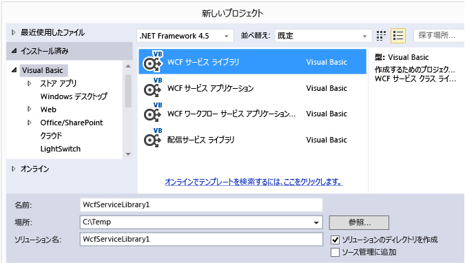
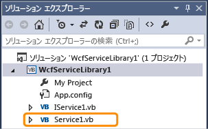
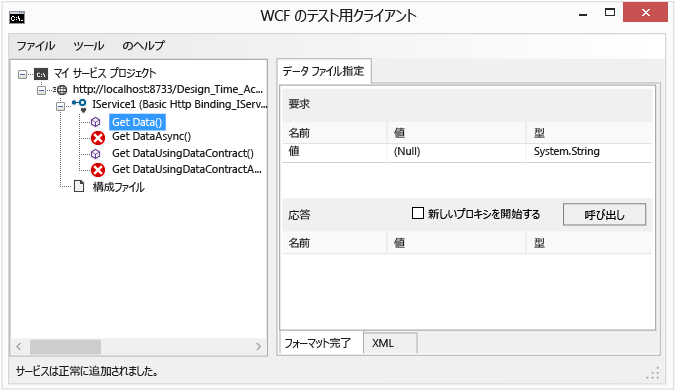
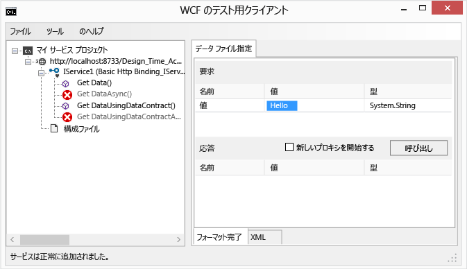
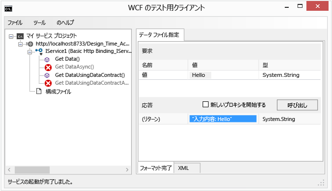
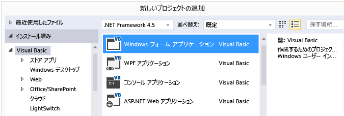
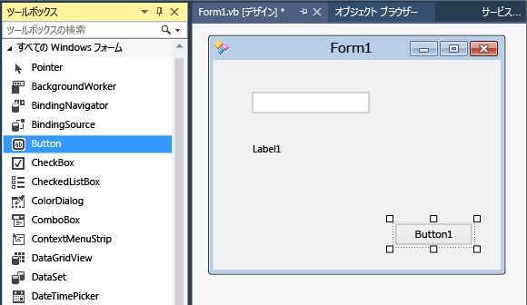

# チュートリアル: Windows フォームでの簡単な WCF サービスの作成
このチュートリアルは、単純な [!INCLUDE[vsindigo](../data-tools/includes/vsindigo_md.md)] サービスを作成し、テストして、Windows フォーム アプリケーションからアクセスする方法を例示しています。  
  
[!INCLUDE[note_settings_general](../data-tools/includes/note_settings_general_md.md)]  
  
## サービスの作成  
  
#### WCF サービスを作成するには  
  
1.  **[ファイル]** メニューの **[新規作成]** をポイントし、 **[プロジェクト]**をクリックします。  
  
2.  **新しいプロジェクト** ダイアログ ボックスで、展開、 **Visual Basic**または**Visual c#**ノードをクリック**WCF**で始まり、 **WCFサービス ライブラリ**です。 をクリックして**OK**プロジェクトを開きます。  
  
       
  
    > [!NOTE]
    >  これにより、テストしてアクセスすることが可能な機能するサービスが作成されます。 次の 2 つの手順は、別のデータ型を使用するように既定の方法を変更する方法を示しています。 実際のアプリケーションで、独自の関数をサービスに追加することもできます。  
  
3.    
  
     **ソリューション エクスプ ローラー**、IService1.vb または IService1.cs をダブルクリックし、次の行を探します。  
  
     [!code-csharp[WCFWalkthrough#4](../data-tools/codesnippet/CSharp/walkthrough-creating-a-simple-wcf-service-in-windows-forms_1.cs)]
     [!code-vb[WCFWalkthrough#4](../data-tools/codesnippet/VisualBasic/walkthrough-creating-a-simple-wcf-service-in-windows-forms_1.vb)]  
  
     種類を変更、`value`文字列へのパラメーター。  
  
     [!code-csharp[WCFWalkthrough#1](../data-tools/codesnippet/CSharp/walkthrough-creating-a-simple-wcf-service-in-windows-forms_2.cs)]
     [!code-vb[WCFWalkthrough#1](../data-tools/codesnippet/VisualBasic/walkthrough-creating-a-simple-wcf-service-in-windows-forms_2.vb)]  
  
     上記のコードで、`<OperationContract()>` または `[OperationContract]` 属性に注意してください。 これらの属性は、サービスによって公開されている任意のメソッドに必要です。  
  
4.    
  
     **ソリューション エクスプ ローラー**、Service1.vb または Service1.cs をダブルクリックし、次の行を探します。  
  
     [!code-vb[WCFWalkthrough#5](../data-tools/codesnippet/VisualBasic/walkthrough-creating-a-simple-wcf-service-in-windows-forms_3.vb)]
     [!code-csharp[WCFWalkthrough#5](../data-tools/codesnippet/CSharp/walkthrough-creating-a-simple-wcf-service-in-windows-forms_3.cs)]  
  
     値パラメーターの型を文字列に変更します。  
  
     [!code-csharp[WCFWalkthrough#2](../data-tools/codesnippet/CSharp/walkthrough-creating-a-simple-wcf-service-in-windows-forms_4.cs)]
     [!code-vb[WCFWalkthrough#2](../data-tools/codesnippet/VisualBasic/walkthrough-creating-a-simple-wcf-service-in-windows-forms_4.vb)]  
  
## サービスのテスト  
  
#### WCF サービスをテストするには  
  
1.  キーを押して**f5 キーを押して**サービスを実行します。 A **WCF テスト クライアント**フォームが表示され、サービスが読み込まれます。  
  
2.  **WCF テスト クライアント**フォームをダブルクリックして、 **GetData()**対象メソッドの**IService1**です。 **GetData**タブが表示されます。  
  
       
  
3.  **要求**ボックスで、選択、**値**フィールドとタイプ`Hello`です。  
  
       
  
4.  クリックして、 **Invoke**ボタンをクリックします。 場合、**セキュリティ警告** ダイアログ ボックスが表示されたら、をクリックして**OK**です。 結果が表示されます、**応答**ボックス。  
  
       
  
5.  **ファイル** メニューのをクリックして**終了**テスト フォームを閉じます。  
  
## サービスへのアクセス  
  
#### WCF サービスを参照するには  
  
1.  **ファイル** メニューのをポイント**追加** をクリックし、**新しいプロジェクト**です。  
  
2.  **新しいプロジェクト**] ダイアログ ボックスで、展開、 **Visual Basic**または**Visual c#**ノードを選択**Windows**、し、[ **Windows フォーム アプリケーション**です。 をクリックして**OK**プロジェクトを開きます。  
  
       
  
3.  右クリック**WindowsApplication1**  をクリック**サービス参照の追加**です。 **サービス参照の追加** ダイアログ ボックスが表示されます。  
  
4.  **サービス参照の追加**ダイアログ ボックスで、をクリックして**Discover**です。  
  
     ![[サービス参照の追加] ダイアログ ボックス](../data-tools/media/wcf8.png "wcf8")  
  
     **Service1**に表示される、 **Services**ウィンドウです。  
  
5.  をクリックして**OK**サービス参照を追加します。  
  
#### クライアント アプリケーションをビルドするには  
  
1.  **ソリューション エクスプ ローラー**をダブルクリックして**Form1.vb**または**Form1.cs**がまだ開いていない場合は、Windows フォーム デザイナーを開きます。  
  
2.  **ツールボックス**、ドラッグ、`TextBox`コントロール、`Label`コントロール、および`Button`コントロールをフォームにします。  
  
       
  
3.  `Button` をダブルクリックし、`Click` イベント ハンドラーに次のコードを追加します。  
  
     [!code-csharp[WCFWalkthrough#3](../data-tools/codesnippet/CSharp/walkthrough-creating-a-simple-wcf-service-in-windows-forms_5.cs)]
     [!code-vb[WCFWalkthrough#3](../data-tools/codesnippet/VisualBasic/walkthrough-creating-a-simple-wcf-service-in-windows-forms_5.vb)]  
  
4.  **ソリューション エクスプ ローラー**を右クリックして**WindowsApplication1**  をクリック**スタートアップ プロジェクトとして設定**です。  
  
5.  キーを押して**f5 キーを押して**プロジェクトを実行します。 いくつかのテキストを入力し、ボタンをクリックします。 ラベルに「You entered:」と入力したテキストが表示されます。  
  
       
  
## 関連項目  
 [Visual Studio での Windows Communication Foundation サービスと WCF データ サービス](../data-tools/windows-communication-foundation-services-and-wcf-data-services-in-visual-studio.md)