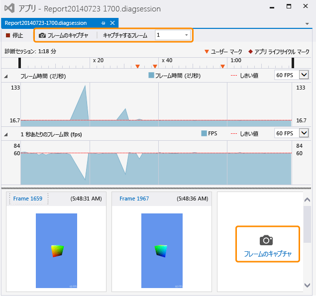

# グラフィックス情報のキャプチャ
[!INCLUDE[vs2017banner](../code-quality/includes/vs2017banner.md)]

Visual Studio Graphics Analyzer を使用してレンダリングに関する問題とパフォーマンスに関する問題を診断できるように、Direct3D アプリからグラフィックス情報をキャプチャします。  
  
## グラフィックス情報をキャプチャする  
 グラフィックス情報のキャプチャは 2 段階のプロセスです。  最初に、アプリをグラフィックス診断の下で実行し、詳細情報をキャプチャする 1 つ以上のフレームを指定します。  
  
#### グラフィックス診断の下でアプリを実行するには  
  
-   メニュー バーで、**\[デバッグ\]**、**\[グラフィックス\]**、**\[診断の開始\]** の順に選択します。  \(キーボード: Alt キーを押しながら F5 キーを押します\)  
  
-   **\[グラフィックス\]** ツール バーで、**\[診断の開始\]** ボタンをクリックします。  
  
 アプリがグラフィックス診断の下で実行されている間、特定の種類のグラフィックス情報が常にキャプチャされます。これには、デバイス セットアップ、スワップ チェーンの作成、グラフィックス オブジェクトとリソースの作成、および複数のフレームに影響するその他の重要なイベントが含まれます。  同時に、特定のフレームに関する詳細情報をキャプチャできます。これには、描画の呼び出しおよび計算シェーダーのディスパッチと、これらをサポートする Direct3D オブジェクトおよびリソースが含まれます。  
  
#### フレームをキャプチャするには  
  
-   Visual Studio の **\[グラフィックス\]** ツール バーで、**\[フレームのキャプチャ\]** ボタンをクリックします。  
  
-   キーボードで、PrintScreen キーを押します。  
  
    > [!NOTE]
    >  アプリケーションが **\[グラフィックス診断\]** で実行されている間、PrintScreen キーはグラフィックス情報のフレームをキャプチャするためだけに使用できます。通常の機能は実行できません。  これは、デバッグを停止するかアプリケーションを正常に終了して、グラフィックス情報のキャプチャを停止するまで有効です。別のアプリケーションにフォーカスがある場合でも同じです。  
  
-   Visual Studio キャプチャ インターフェイスで、**\[診断セッション\]** タイムラインの上にある **\[フレームのキャプチャ\]** ボタンを選択するか、**\[1 秒あたりのフレーム数\]** スイム レーンの下、または以前にキャプチャされたフレームの右側にある大きな **\[フレームのキャプチャ\]** ボタンを選択します。  下の画像では、両方のボタンが強調表示されています。  
  
       
  
     キャプチャしたフレームを確認する準備ができたら、サムネール画像の上の **\[フレーム\]** リンクに従って、またはサムネールをダブルクリックして、**Visual Studio Graphics Analyzer** を起動します。  
  
 フレーム全体のみをキャプチャできます。そのため、キャプチャを開始したときに実際に記録されるのは、次のフレームのグラフィックス情報です。  記録は、キャプチャを開始したフレームが表示された直後に開始され、キャプチャするフレームが表示されると終了します。  アプリがグラフィックス診断の下で実行されている間、フレームを必要なだけキャプチャできます。  どのフレームもキャプチャしない場合、グラフィックス ログは破棄されます。  
  
 フレームをキャプチャするときに、Visual Studio では診断セッション \(.diagsession\) ウィンドウが表示されます。  このウィンドウを閉じるか、デバッグを停止するか、アプリを閉じると、それ以上フレームをそのログにキャプチャできなくなります。  より多くのグラフィックス情報をキャプチャするには、グラフィックス診断の下で再度アプリを実行し、新しい診断セッションを開始する必要があります。  
  
### グラフィックス診断のキャプチャ オプション  
 キャプチャを構成して、すべてのグラフィックス イベントまたは特定のサブセットの呼び出し履歴の収集、キャプチャの HUD の無効化、およびキャプチャ互換モードの有効化または無効化を行うことができます。  
  
##### グラフィックス診断のキャプチャ オプションを構成するには  
  
1.  メニュー バーで \[ツール\]、\[オプション\] の順にクリックします。  \[オプション\] ダイアログ ボックスが表示されます。  
  
2.  左側にあるオプション カテゴリの一覧からグラフィックス診断を選択した後、使用するグラフィックス診断オプションを構成します。  
  
     **呼び出し履歴をキャプチャ中に収集する \(キャプチャ速度が低下します\)**  
     呼び出し履歴を収集するには、このチェック ボックスをオンにします。  既定では、呼び出し履歴は収集されません。  呼び出し履歴を取得するには、**\[呼び出し履歴をキャプチャ中に収集する \(キャプチャ速度が低下します\)\]** チェック ボックスで収集を有効にするよう設定し、**\[描画、ディスパッチ、表示、およびパフォーマンス マーカー\]** オプション \(既定\) を設定して最も重要な呼び出し履歴のみを収集するか、**\[すべて\]** オプションを設定してすべての呼び出し履歴を収集します。  後で呼び出し履歴の収集を停止するには、**\[呼び出し履歴をキャプチャ中に収集する \(キャプチャ速度が低下します\)\]** チェック ボックスをクリアします。  
  
     **キャプチャ中にゲーム内の HUD を無効にする**  
     グラフィックス診断の下で実行されているアプリが通常表示する HUD オーバーレイを無効にするには、このチェック ボックスをオンにします。  HUD オーバーレイを表示するには、このチェック ボックスをオフにします。  
  
     **互換モードでキャプチャする**  
     グラフィックス情報を互換モードでキャプチャするには、このチェック ボックスをオンにします。  互換モードでのキャプチャが既定の動作です。  互換モードでは、Direct3D は、基本機能レベルで定義されていない追加機能が GPU でサポートされることを報告しません。  このため、アプリをキャプチャしている GPU のハードウェア固有の拡張機能が、キャプチャ中のアプリで使用されなくなり、同じまたはそれ以上の機能レベルをサポートしている任意の GPU を使用して、グラフィックス ログを再生できるようになります。  互換モードを無効にするには、このチェック ボックスをオフにします。互換モードでキャプチャされたログは、キャプチャ中にアプリで使用されたものと同じ追加機能をサポートしていない GPU 上では再生できません。  
  
     **SDK レイヤーが見つかったらキャプチャを停止する**  
     このボックスをオンにすると、エラーが発生した場合、すぐにキャプチャを停止します。  
  
## グラフィックス情報をリモートでキャプチャする  
 グラフィックス情報は、ローカル コンピューターか、リモート コンピューターまたはリモート デバイスで実行されているアプリからキャプチャできます。  リモート キャプチャは、[!INCLUDE[winblue_client_2](../debugger/includes/winblue_client_2_md.md)] コンピューターと [!INCLUDE[winblue_winrt_2](../debugger/includes/winblue_winrt_2_md.md)] デバイスでサポートされています。  リモートで実行されているアプリからグラフィックス情報をキャプチャするには、リモート デバッグ用にプロジェクトを構成し、既に説明したように、グラフィックス診断の下でアプリを実行します。  アプリがリモート コンピューターで実行され、キャプチャされたグラフィックス情報が開発用コンピューターに記録されます。  
  
 プロジェクトをリモート デバッグ用に構成する方法は、開発中のアプリの種類と、使用しているプログラミング言語によって異なります。  Windows ストア アプリのリモート デバッグの構成方法については、「[リモート コンピューターでの Windows ストア アプリの実行](../debugger/run-windows-store-apps-on-a-remote-machine.md)」を参照してください。  Windows デスクトップ アプリのリモート デバッグの構成方法については、「[Set Up Remote Debugging for a Visual Studio Project \(Visual Studio のリモート デバッグのセットアップ\)](../Topic/Set%20Up%20Remote%20Debugging%20for%20a%20Visual%20Studio%20Project.md)」を参照してください。  
  
 後で、情報をキャプチャした場所にかかわらず、リモート コンピューターまたはリモート デバイスを使用してグラフィックス情報を再生できます。  詳細については、「[方法: グラフィックス診断再生マシンを変更する](../debugger/how-to-change-the-graphics-diagnostics-playback-machine.md)」を参照してください。  
  
## コマンド ラインからのグラフィックス情報のキャプチャ  
 コマンド ライン ツールを使用して、アプリからグラフィックス情報をキャプチャできます。  この DXCap.exe というツールでは、Visual Studio またはプログラムによるキャプチャを使用することなく、簡単にグラフィックス情報をキャプチャして再生できます。  具体的には、オートメーションを行う場合や、テスト環境で DXCap.exe を使用できます。  DXCap.exe の詳細については、「[コマンド ライン キャプチャ ツール](../debugger/command-line-capture-tool.md)」を参照してください。  
  
## 参照  
 [チュートリアル: グラフィックス情報のキャプチャ](../debugger/walkthrough-capturing-graphics-information.md)