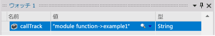
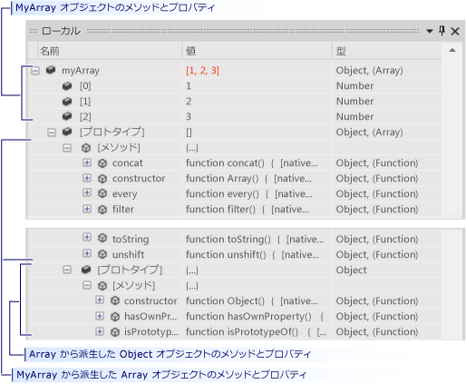
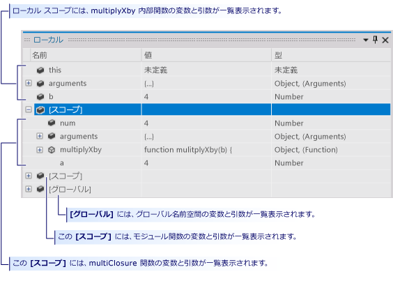

# Windows ストア アプリ用の Visual Studio デバッグ セッションでの、ストア アプリの実行制御 (JavaScript)
[!INCLUDE[vs2017banner](../code-quality/includes/vs2017banner.md)]

このクイック スタートでは、Visual Studio デバッガー内を移動する方法と、セッションでのプログラムの状態を表示する方法を示します。  
  
 Visual Studio でのデバッグに慣れていない開発者や、Visual Studio でのデバッグ セッション間の移動について詳しく学習したい開発者向けです。 デバッグ自体の手法については説明しません。 サンプル コードの関数は、このトピックで説明しているデバッグ手順を示すためだけに設計されています。 これらの関数は、アプリまたは関数の設計に関するベスト プラクティスに従ったものではありません。 実際、すぐにわかるように、関数もアプリ自体もほとんど何もしません。  
  
 このクイック スタートの各セクションは、できるだけ独立した設計にしたので、既に精通している情報が含まれているセクションはスキップできます。 また、サンプル アプリを作成する必要はありません。 それでも、できる限り簡単にしてあるので、作成することをお勧めします。  
  
 **デバッガーのキーボード ショートカット。**Visual Studio デバッガーのナビゲーションは、マウスとキーボードの両方に最適化されています。 このトピックの手順の多くでは、キーボード アクセス キーまたはショートカット キーが、かっこで囲まれて示されています。 たとえば、\(キーボード: F5\) は、F5 キーを押すとデバッガーの実行が開始または継続されることを示しています。  
  
> [!NOTE]
>  **モジュール パターン**  
>   
>  Windows ストア アプリでは、JavaScript の*モジュール パターン*を使用してデータと関数をページ内にカプセル化することがよくあります。 モジュール パターンでは、自己実行形式の単一の匿名クロージャを使用して、ページの機能をグローバル名前空間から分離します。 このトピックでは、そのような関数を*モジュール*と呼びます。  
  
## このトピックの内容  
 以下の方法について説明します。  
  
 [サンプル アプリを作成する](#BKMK_Create_the_sample_app)  
  
 [ブレークポイントを設定してそこまで実行し、関数にステップ インして、プログラムのデータを調べる](#BKMK_Set_and_run_to_a_breakpoint__step_into_a_function__and_examine_program_data)  
  
 [関数をステップイン、ステップオーバー、ステップアウトする](#BKMK_Step_into__over__and_out_of_functions)  
  
 [条件付きブレークポイントを設定し、カーソル位置まで実行して、変数を視覚化する](#BKMK_Set_a_conditional_breakpoint__run_to_the_cursor__and_visualize_a_variable)  
  
 [[ローカル] ウィンドウで変数のデータを表示する](#BKMK_View_variable_data_in_the_Locals_window)  
  
-   [オブジェクトの変数データとプロトタイプ チェーンを表示する](#BKMK_View_variable_data_and_the_prototype_chain_of_an_object)  
  
-   [スコープ チェーンのデータを調べる](#BKMK_Examine_scope_chain_data)  
  
 [[呼び出し履歴] ウィンドウを使用してコードに移動する](#BKMK_Navigate_to_code_by_using_the_Call_Stack_window)  
  
##   サンプル アプリを作成する  
 デバッグの対象はコードなので、このサンプル アプリでは、デバッグ セッション内の移動方法とプログラムの状態を調べる方法がわかる程度のソース ファイルを作成するためだけに Windows ストア アプリのフレームワークを使用します。 呼び出すコードはすべて、default.js ファイルの `module` 関数から呼び出されます。 コントロールは追加されず、イベントは処理されません。  
  
1.  **空の JavaScript Windows ストア アプリを作成します。**Visual Studio を開きます。 ホーム ページで、**\[新しいプロジェクト\]** リンクを選択します。**\[新しいプロジェクト\]** ダイアログ ボックスで、**\[インストール済み\]** ボックスの一覧の **\[JavaScript\]** を選択し、**\[Windows ストア\]** を選択します。 プロジェクト テンプレートの一覧で、**\[新しいアプリケーション\]** を選択します。 新しいソリューションとプロジェクトが作成され、default.htm ファイルがコード エディターに表示されます。  
  
     ページに読み込まれるスクリプト ファイルにご注意ください。  
  
    -   `base.js` および `ui.js` ファイルによって、**JavaScript 用 Windows ライブラリ**が作成されます。 JavaScript 用 Windows ライブラリは一連の JavaScript および CSS ファイルであり、JavaScript を使用して Windows ストア アプリを簡単に作成できるようにします。 これを HTML、CSS、Windows ランタイムと共に使用して、アプリを作成します。  
  
    -   コードは `default.js`  ファイルで開始します。  
  
2.  **default.js ソース ファイルを開きます。**ソリューション エクスプローラーで、**\[js\]** ノードを開いて `default.js` を選びます。  
  
3.  **ページの内容をサンプル コードに置き換えます。** `default.js` ファイルの内容をすべて削除します。 「[デバッガー ナビゲーションのサンプル コード \(JavaScript\)](../debugger/debugger-navigation-sample-code-javascript.md)」を参照して、JavaScript セクションに記載されているコードをクリップボードにコピーします。 \(このクイック スタート ページに戻るには、ブラウザーまたはヘルプ ビューアーで **\[戻る\]** をクリックします。\) Visual Studio エディターで、空にした `default.js` にコードを貼り付けます。**Ctrl\+ S** を選んでファイルを保存します。  
  
 これで、このトピックの例を実際に行うことができるようになりました。  
  
##   ブレークポイントを設定してそこまで実行し、関数にステップ インして、プログラムのデータを調べる  
 デバッグ セッションを開始する最も一般的な方法は、**\[デバッグ\]** メニューの **\[デバッグ開始\]** を選ぶことです \(キーボード: F5\)。 アプリが開始し、ブレークポイントに達するか、手動で実行が中断されるか、例外が発生するか、アプリが終了するまで実行が続きます。  
  
 デバッガーで実行が中断されているときは、変数の上にマウスを置けば、アクティブな変数の値をデータのヒントで確認できます。  
  
 アプリの実行を中断 \(デバッガーで中断\) した後、残りのプログラム コードの実行方法を制御します。 1 行ずつ実行したり、関数呼び出しから関数自体に移動したり、呼び出されている関数をシングル ステップで実行したりできます。 これらの手順は、アプリのステップ実行と呼ばれます。 また、アプリの普通の実行を再開したり、設定してある次のブレークポイントまで実行したり、カーソルを置いた行まで実行したりすることもできます。 デバッグ セッションはいつでも停止できます。 デバッガーは、必要なクリーンアップ操作を行って実行を終了するように設計されています。  
  
###   例 1  
 この例では、`default.js` の `module` 関数の本体にブレークポイントを設定します。ここで、最初のユーザー ステートメントが呼び出されます。 次に、関数にステップ インし、デバッガーのデータのヒントで変数の値を表示して、デバッグを停止します。  
  
1.  **ブレークポイントを設定します。** `app.start()` の呼び出しの直後にあるステートメント `callTrack = "module function";` にブレークポイントを設定します。 ソース コード エディターの網掛けされた余白で行を選びます \(キーボード: 行にカーソルを置き、**F9** キーを押します\)。  
  
       
  
     ブレークポイント アイコンが余白に表示されます。  
  
2.  **ブレークポイントまで実行します。 \[デバッグ\]** メニューの **\[デバッグの開始\]** をクリックして、デバッグ セッションを開始します \(キーボード: F5 キー\)。  
  
     アプリの実行が開始され、ブレークポイントを設定したステートメントの直前で実行が中断します。 余白の現在行アイコンによって場所が示され、現在のステートメントが強調表示されます。  
  
       
  
     アプリの実行を制御できるようになり、プログラムのステートメントをステップ実行しながらプログラムの状態を確認できます。  
  
3.  **関数にステップ インします。 \[デバッグ\]** メニューの **\[ステップ イン\]** を選びます \(キーボード: **F11**\)。  
  
       
  
     デバッガーが次の行である `example1` 関数の呼び出しに移動します。**\[ステップ イン\]** を再び選択します。 デバッガーが `example1` 関数の最初のコード行に移動します。 強調表示された行はまだ実行されていませんが、関数は呼び出し履歴に読み込まれ、ローカル変数のメモリが割り当てられています。  
  
4.  コード行にステップ インするとき、デバッガーは次の操作のいずれかを実行します。  
  
    -   次のステートメントがソリューション内の関数の呼び出しではない場合、デバッガーはステートメントを実行し、次のステートメントに移動して、実行を中断します。  
  
    -   ステートメントがソリューション内の関数の呼び出しの場合、デバッガーは呼び出された関数の最初の行に移動して、実行を中断します。  
  
     終了ポイントに到達するまで、`example1` のステートメントのステップ インを続けます。 デバッガーにより、関数の終了の中かっこが強調表示されます。  
  
5.  **データのヒントで変数の値を表示します。**終了ポイントに到達するまで、`example1` のステートメントのステップ インを続けます。 デバッガーにより、関数の終了の中かっこが強調表示されます。 変数名の上にマウス ポインターを置くと、変数の名前と値がデータのヒントに表示されます。  
  
       
  
6.  **callTrack 変数のウォッチ式を追加します。**このクイック スタートでは、例の中で呼び出された関数の表示に `callTrack` 変数を使用しています。 変数の値を見やすくするため、ウォッチ ウィンドウに追加します。 エディターで変数名を選び、ショートカット メニューの **\[ウォッチ式の追加\]** を選びます。  
  
       
  
     \[ウォッチ\] ウィンドウでは複数の変数を確認できます。 データ ヒント ウィンドウの値など、ウォッチ対象の変数の値は、実行が中断されるたびに更新されます。 ウォッチ対象の変数は、デバッグ セッション間で保存されます。  
  
7.  **デバッグを停止します。 \[デバッグ\]** メニューの **\[デバッグの停止\]** を選択します \(キーボード: **Shift\+F5**\)。 これによりデバッグ セッションが終了します。  
  
##   関数をステップイン、ステップオーバー、ステップアウトする  
 親関数によって呼び出される関数へのステップ インとは異なり、関数のステップ オーバーでは、子関数が実行された後、親が再開すると、呼び出し側の関数で実行が中断されます。 関数の動作がよくわかっていて、その実行が調査中の問題に影響を与えないことが明らかな場合などは、関数をステップ オーバーします。  
  
 関数の呼び出しを含まないコード行をステップ オーバーすると、行へのステップ インと同じように行が実行されます。  
  
 子関数をステップ アウトすると、子関数の実行が続けられ、子関数から呼び出し側の関数に戻った後で、実行が中断されます。 長い関数で残りの部分は重要ではないと判断した場合など、ステップ アウトを使用できます。  
  
 関数のステップ オーバーでもステップ アウトでも、関数は実行されます。  
  
   
  
###   例 2  
 この例では、関数のステップイン、ステップ オーバー、およびステップ アウトを実行します。  
  
1.  **モジュール関数内の example2 関数を呼び出します。** `module` 関数を編集し、`var callTrack = "module function"` の後の行を `example2();` に置き換えます。  
  
       
  
2.  **ブレークポイントまで実行します。 \[デバッグ\]** メニューの **\[デバッグの開始\]** をクリックして、デバッグ セッションを開始します \(キーボード: F5 キー\)。 デバッガーの実行がブレークポイントで中断します。  
  
3.  **コード行をステップ オーバーします。 \[デバッグ\]** メニューの **\[ステップ オーバー\]** をクリックします \(キーボード: F10\)。 デバッガーは、ステートメントのステップ インと同じ方法で、`var callTrack = "module function"` ステートメントを実行します。  
  
4.  **example2 と example2\_a にステップ インします。 F11** キーを押して `example2` 関数にステップインします。`var x = example2_a();` 行に到達するまで `example2` のステートメントのステップ インを続けます。 再びこの行にステップ インして、`example2_a` のエントリ ポイントに移動します。`example2` に戻るまで `example2_a` の各ステートメントのステップ インを続けます。  
  
       
  
5.  **関数をステップ オーバーします。** `example2` の次の行 `var y = example2_a();` は基本的に前の行と同じであることに注意してください。 この行は安全にステップ オーバーできます。**F10** キーを押して、`example2` の再開から `example2_a` のこの 2 回目の呼び出しまで移動します。`callTrack` 文字列で `example2_a` 関数が 2 回実行されたことが示されている点にご注意ください。  
  
6.  **関数をステップ アウトします。 F11** キーを押して `example2_b` 関数にステップインします。`example2_b` が `example2_a` と大差ないことに注意してください。 関数をステップ アウトするには、**\[デバッグ\]** メニューの **\[ステップ アウト\]** を選択します \(キーボード: **Shift\+F11**\)。`callTrack` 変数で、`example2_b` が実行されたこと、またデバッガーが `example2` の再開ポイントに戻ったことが示されていることにご注意ください。  
  
7.  **デバッグを停止します。 \[デバッグ\]** メニューの **\[デバッグの停止\]** を選択します \(キーボード: **Shift\+F5**\)。 これによりデバッグ セッションが終了します。  
  
##   条件付きブレークポイントを設定し、カーソル位置まで実行して、変数を視覚化する  
 条件付きブレークポイントでは、デバッガーが実行を中断する条件を指定します。 条件は、true または false として評価できる任意のコード式によって指定します。 たとえば、条件付きブレークポイントを使用すると、変数が特定の値に到達した場合にのみ、頻繁に呼び出される関数でのプログラムの状態を確認できます。  
  
 カーソルまでの実行は、一度だけのブレークポイントを設定することと同じです。 実行が中断されたら、ソースで行を選択し、選択した行に到達するまで実行を再開できます。 たとえば、関数内のループをステップ実行していて、ループのコードが正しく実行していることがわかったものとします。 そのような場合、ループのすべての反復をステップ実行する代わりに、ループの実行が終了した後に配置したカーソルまで実行できます。  
  
 データのヒントや他のデータ ウィンドウの行で変数の値を表示することが困難な場合があります。 デバッガーでは、スクロール可能なウィンドウに書式設定された値が表示されるテキスト ビジュアライザーで、文字列、HTML、Xml を表示できます。  
  
###   例 3  
 この例では、ループの特定の繰り返しで中断するように条件付きブレークポイントを設定し、ループの後に配置したカーソルまで実行します。 また、テキスト ビジュアライザーで変数の値を表示します。  
  
1.  **モジュール関数内の example3 関数を呼び出します。** `module` 関数を編集し、`var callTrack = "module function";` の後の行を行 `example3();` に置き換えます。  
  
       
  
2.  **ブレークポイントまで実行します。 \[デバッグ\]** メニューの **\[デバッグの開始\]** を選択して、デバッグ セッションを開始します \(キーボード: **F5** キー\)。`module` 関数内のブレークポイントでデバッガーの実行が中断します。  
  
3.  **example3 関数にステップ インします。 \[デバッグ\]** メニューの **\[ステップ イン\]** を選択し \(キーボード: **F11**\)、`example3` 関数のエントリ ポイントに移動します。 関数のステップ インを続けて、`for` ブロックのループを 1 または 2 回繰り返します。 1000 回の繰り返しすべてをステップ実行するには長い時間がかかります。  
  
4.  **条件付きブレークポイントを設定します。**コード ウィンドウの左側の余白で、`s += i.toString() + "\n";` という行を右クリックし、ショートカット メニューの **\[条件\]** を選択します。  
  
     **\[条件\]** チェック ボックスをオンにして、テキスト ボックスに「`i == 500;`」と入力します。**\[true の場合\]** オプションを選択し、**\[OK\]** をクリックします。 ブレークポイントでは、`for` ループの 500 回目の繰り返しでの値を確認できます。 条件付きブレークポイント アイコンは白い十字が目印です。  
  
       
  
5.  **ブレークポイントまで実行します。 \[デバッグ\]** メニューの **\[続行\]** を選択します \(キーボード: **F5**\)。`i` で一時停止し、`i` の現在の値が 500 であることを確認します。 変数 `s` が 1 行に表示され、データ ヒント ウィンドウよりかなり長いことにもご注意ください。  
  
6.  **文字列変数を表示します。** `s` のデータのヒントで虫眼鏡アイコンをクリックします。  
  
     テキスト ビジュアライザー ウィンドウが表示され、文字列の値が複数行の文字列として示されます。  
  
       
  
7.  **カーソル位置まで実行します。** `callTrack += "->example3";` 行を選択し、ショートカット メニューの **\[カーソル行の前まで実行\]** を選択します \(キーボード: **Ctrl\+F10**\)。 デバッガーは、ループの繰り返しを完了して、カーソルの行で実行を中断します。  
  
8.  **デバッグを停止します。 \[デバッグ\]** メニューの **\[デバッグの停止\]** を選択します \(キーボード: **Shift\+F5**\)。 これによりデバッグ セッションが終了します。  
  
###   \[カーソル行の前まで実行\] を使用してコードに戻り、ブレークポイントを削除する  
 Microsoft またはサードパーティから提供されているライブラリ コードにステップ インしている場合、カーソル行の前まで実行すると便利な場合があります。 ライブラリ コードのステップ実行は役に立ちますが、長い時間がかかることがあります。 また、自分のコードに対する興味の方がはるかに大きいのが普通です。 この演習では、その方法を説明します。  
  
1.  **app.start の呼び出しにブレークポイントを設定します。** `module` 関数で、`app.start()` の行にブレークポイントを設定します。  
  
2.  **ブレークポイントまで実行し、ライブラリ関数にステップ インします。**  
  
     `app.start()` にステップ インすると、エディターに `base.js` のコードが表示されます。 さらに数行ステップ インします。  
  
3.  **関数をステップ オーバーしてステップ アウトします。** `base.js` のコードをステップ オーバー \(**F10**\) してステップ アウト \(**SHIFT\+F11**\) すると、実際にするべきことは start 関数の複雑さと長さを調べることではないということに気づきます。  
  
4.  **自分のコードにカーソルを設定して、そこまで実行します。**コード エディターで `default.js` ファイルに切り替えます。`app.start()` の後の最初のコード行を選択します \(コメント行または空白行まで実行することはできません\)。 ショートカット メニューの **\[カーソル行の前まで実行\]** を選択します。 デバッガーは app.start の関数の実行を続け、ブレークポイントで実行を中断します。  
  
##   \[ローカル\] ウィンドウで変数のデータを表示する  
 \[ローカル\] ウィンドウは、現在実行中の関数のスコープ チェーンに含まれるパラメーターと変数のツリー ビューです。  
  
###   オブジェクトの変数データとプロトタイプ チェーンを表示する  
  
1.  **配列オブジェクトをモジュール関数に追加します。** `module` 関数を編集し、`var callTrack = "module function"` の後の行を `var myArray = new Array(1, 2, 3);` に置き換えます。  
  
       
  
2.  **ブレークポイントまで実行します。 \[デバッグ\]** メニューの **\[デバッグの開始\]** を選択して、デバッグ セッションを開始します \(キーボード: **F5** キー\)。 デバッガーの実行がブレークポイントで中断します。 この行までステップ インします。  
  
3.  **\[ローカル\] ウィンドウを開きます。 \[デバッグ\]** メニューの **\[ウィンドウ\]** をポイントし、**\[ローカル\]** をクリックします  \(キーボード: Alt\+4\)。  
  
4.  **モジュール関数でローカル変数を調べます。**\[ローカル\] ウィンドウでは、現在実行中の関数 \(`module` 関数\) の変数が、ツリーの最上位ノードとして表示されます。 関数に入ると、JavaScript はすべての変数を作成し、`undefined` という値を設定します。 関数内で定義されている関数には、値としてそれぞれテキストが設定されています。  
  
       
  
5.  **callTrack および myArray の定義をステップ実行します。**\[ローカル\] ウィンドウで callTrack 変数および myArray 変数を探します。 2 つの定義をステップ オーバーし \(**F10**\)、**Value** フィールドと **Type** フィールドが変更されていることを確認します。 \[ローカル\] ウィンドウでは、前回のブレーク以降に変更された変数の値が強調表示されます。  
  
6.  **myArray オブジェクトを調べます。** `myArray` 変数を展開します。 配列の各要素が、`Array` オブジェクトの継承階層を含む **\[プロトタイプ\]** ノードに一覧表示されます。 このノードを展開します。  
  
       
  
    -   **\[メソッド\]** ノードには、`Array` オブジェクトのすべてのメソッドが一覧表示されます。  
  
    -   **\[prototype\]** ノードには、`Array` の派生元である `Object` オブジェクトのプロトタイプが含まれます。**\[prototype\]** ノードは再帰的である場合があります。 オブジェクト階層内の各親オブジェクトは、その子の **\[prototype\]** ノードで記述されています。  
  
7.  **デバッグを停止します。 \[デバッグ\]** メニューの **\[デバッグの停止\]** を選択します \(キーボード: Shift\+F5\)。 これによりデバッグ セッションが終了します。  
  
##   スコープ チェーンのデータを調べる  
 関数の*スコープ チェーン*には、アクティブであり、関数で到達可能なすべての変数が含まれます。 グローバル変数は、現在実行中の関数を定義している関数内で定義されているオブジェクト \(関数を含みます\) と同様に、スコープ チェーンの一部です。 たとえば、`default.js` の `module` 関数で定義されている `callTrack` 変数は、`module` 関数で定義されているすべての関数から到達可能です。 各スコープは \[ローカル\] ウィンドウで個別に一覧表示されます。  
  
-   現在実行中の関数の変数はウィンドウの最上部に表示されます。  
  
-   スコープ チェーン内の各関数スコープの変数は、その関数の **\[Scope\]** ノードに一覧表示されます。 スコープ関数は、現在の関数を定義している関数から、チェーンの最も外側の関数まで、チェーン内での順番で一覧表示されます。  
  
-   **\[Globals\]** ノードには、すべての関数の外側で定義されているグローバル オブジェクトが一覧表示されます。  
  
 スコープ チェーンはわかりにくいことがあり、例で示すとよくわかります。 次の例を見ると、`module` 関数によってそれ自体のスコープが作成されている方法、およびクロージャを作成することで別のレベルのスコープを作成する方法がわかります。  
  
###   例 4  
  
1.  **モジュール関数内の example4 関数を呼び出します。** `module` 関数を編集し、`var callTrack = "module function"` の後の行を `example4()` に置き換えます。  
  
       
  
2.  **ブレークポイントまで実行します。 \[デバッグ\]** メニューの **\[デバッグの開始\]** を選択して、デバッグ セッションを開始します \(キーボード: **F5** キー\)。 デバッガーの実行がブレークポイントで中断します。  
  
3.  **\[ローカル\] ウィンドウを開きます。**必要に応じて、**\[デバッグ\]** メニューの **\[ウィンドウ\]** をポイントし、**\[ローカル\]** を選択します \(キーボード: **Alt\+4**\)。 ウィンドウには `module` 関数内のすべての変数と関数が一覧表示されているほか、**\[Globals\]** ノードが含まれています。  
  
4.  **グローバル変数を確認します。 \[グローバル\]** ノードを展開します。 \[グローバル\] 内のオブジェクトや変数は、JavaScript 用 Windows ライブラリによって設定されたものです。 グローバル スコープには独自の変数を追加できます。  
  
5.  **example4 にステップ インし、ローカル変数とスコープ変数を調べます。** `example4` 関数にステップ インします \(キーボード: **F11**\)。`example4` は `module` 関数で定義されるため、`module` 関数が親スコープになります。`example4` は `module` 関数内の任意の関数を呼び出し、その変数にアクセスできます。 \[ローカル\] ウィンドウで **\[Scope\]** ノードを展開し、`module` 関数と同じ変数が含まれることをご確認ください。  
  
       
  
6.  **example4\_a にステップ インし、ローカル変数とスコープ変数を調べます。**続けて `example4` にステップ インし、`example4_a` の呼び出しにステップ インします。 ローカル変数が `example4_a` のものになり、**\[スコープ\]** ノードには引き続き `module` 関数の変数が保持されていることに注意してください。`example4` の変数はアクティブですが、`example4_a` では到達できず、スコープ チェーンの一部ではなくなっています。  
  
7.  **multipyByA にステップ インし、ローカル変数とスコープ変数を調べます。**残りの `example4_a` をステップ実行し、`var x = multilpyByA(b);` の行にステップ インします。  
  
     関数の変数 `multipyByA` は、*クロージャ*である `multiplyClosure` 関数に設定されています。`multipyClosure` は、内部関数 `mulitplyXby` を定義して返し、そのパラメーターと変数をキャプチャし \(閉じ込め\) ます。 クロージャでは、返される内部関数は外部関数のデータにアクセスでき、独自のスコープ レベルを作成します。  
  
     `var x = multilpyByA(b);` にステップ インすると、`mulitplyXby` 内部関数の `return a * b;` 行に移動します。  
  
8.  \[ローカル\] ウィンドウでは、`b` パラメーターだけが `multiplyXby` のローカル変数として表示されていますが、新しい **\[Scope\]** レベルが追加されています。 このノードを展開すると、`multiplyClosure` のパラメーター、関数、変数が含まれ、さらに `multiplyXby` の最初の行で呼び出されている `a` 変数も含まれることがわかります。 2 番目の **\[Scope\]** ノードを調べると、`multiplyXby` が次の行でアクセスしているモジュール関数の変数が表示されます。  
  
       
  
9. **デバッグを停止します。 \[デバッグ\]** メニューの **\[デバッグの停止\]** を選択します \(キーボード: **Shift\+F5**\)。 これによりデバッグ セッションが終了します。  
  
##   \[呼び出し履歴\] ウィンドウを使用してコードに移動する  
 呼び出し履歴は、アプリケーションの現在のスレッドで実行されている関数についての情報を格納するデータ構造です。 ブレークポイントにヒットすると、スタック上でアクティブなすべての関数が \[呼び出し履歴\] ウィンドウに一覧表示されます。 現在実行中の関数が、\[呼び出し履歴\] ウィンドウのリストの先頭に表示されます。 スレッドを開始した関数は、リストの最後にあります。 その間の関数は、開始関数から現在の関数までの呼び出しパスを示します。  
  
 現在実行中の関数までの呼び出しパスを表示するだけでなく、\[呼び出し履歴\] ウィンドウはコード エディター内のコードへの移動にも使用できます。 この機能は、複数のファイルの作業を実行していて、特定の関数にすばやく移動する場合に便利です。  
  
###   例 5  
 この例では、5 つのユーザー定義関数を含む呼び出しパスにステップ インします。  
  
1.  **モジュール関数内の example5 関数を呼び出します。** `module` 関数を編集し、`var callTrack = "module function";` の後の行を行 `example5();` に置き換えます。  
  
       
  
2.  **ブレークポイントまで実行します。 \[デバッグ\]** メニューの **\[デバッグの開始\]** を選択して、デバッグ セッションを開始します \(キーボード: **F5** キー\)。 モジュール関数内のブレークポイントでデバッガーの実行が中断します。  
  
3.  **\[呼び出し履歴\] ウィンドウを開きます。 \[デバッグ\]** メニューの **\[ウィンドウ\]** を選択し、**\[呼び出し履歴\]** を選択します \(キーボード: Alt \+ 7\)。 \[呼び出し履歴\] ウィンドウに 2 つの関数が表示されます。  
  
    -   **\[グローバル コード\]** は、呼び出し履歴の下端にある `module` 関数のエントリ ポイントです。  
  
    -   **\[匿名関数\]** には、`module` 関数内で実行が中断されている行が示されます。 これは、呼び出し履歴の先頭にあります。  
  
4.  **関数にステップインして example5\_d 関数に到達します。 \[デバッグ\]** メニューの **\[ステップ イン\]** を選択し \(キーボード:**F11**\)、example5\_d 関数のエントリ ポイントに達するまで呼び出しパスの呼び出しを実行します。 ある関数で別の関数が呼び出されるたびに、呼び出す関数の行番号が保存され、呼び出される関数がスタックの先頭に表示されることに注意してください。 呼び出す関数の行番号は、呼び出す関数の実行が中断しているポイントです。 黄色の矢印は、現在実行中の関数を示します。  
  
       
  
5.  **\[呼び出し履歴\] ウィンドウを使用して example5\_a のコードに移動し、ブレークポイントを設定します。 \[呼び出し履歴\]** ウィンドウで、`example5_a` リスト項目を選択し、ショートカット メニューの \[ソースに移動\] を選択します。 コード エディターで、関数の return 行にカーソルが設定されます。 この行にブレークポイントを設定します。 現在実行中の行は変更されないことに注意してください。 エディターのカーソルだけが移動します。  
  
6.  **関数にステップ インし、ブレークポイントまで実行します。** `example5_d` のステップ インを続けます。 関数から戻ると、関数が呼び出し履歴から削除されることに注意してください。**F5** キーを押してプログラムの実行を続行します。 前の手順で作成したブレークポイントで停止します。  
  
7.  **デバッグを停止します。 \[デバッグ\]** メニューの **\[デバッグの停止\]** を選択します \(キーボード: **Shift\+F5**\)。 これによりデバッグ セッションが終了します。  
  
## 参照  
 [デバッグ セッションの開始 \(JavaScript\)](../debugger/start-a-debugging-session-for-store-apps-in-visual-studio-javascript.md)   
 [Quickstart: Debugger navigation \(JavaScript\)](../debugger/control-execution-of-a-store-app-in-a-visual-studio-debug-session-for-windows-store-apps-javascript.md)   
 [クイック スタート: HTML および CSS のデバッグ](../debugger/quickstart-debug-html-and-css.md)   
 [Windows ストアの中断イベント、再開イベント、およびバックグラウンド イベントのトリガー](../debugger/how-to-trigger-suspend-resume-and-background-events-for-windows-store-apps-in-visual-studio.md)   
 [Visual Studio でのアプリのデバッグ](../debugger/debug-store-apps-in-visual-studio.md)