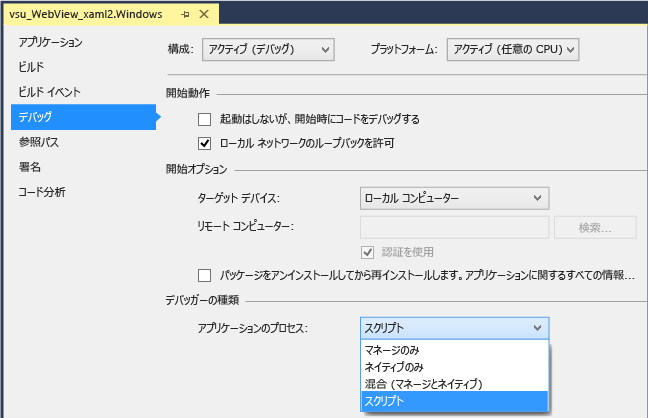
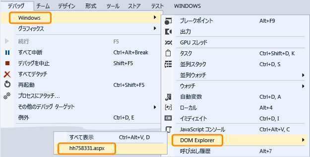

---
title: WebView コントロール (UWP) のデバッグ |Microsoft Docs
ms.date: 11/04/2016
ms.topic: conceptual
dev_langs:
- CSharp
- VB
- FSharp
- C++
ms.assetid: 7d105907-8b39-4d07-8762-5c5ed74c7f21
author: mikejo5000
ms.author: mikejo
manager: jillfra
ms.workload:
- uwp
ms.openlocfilehash: 4945515def65a0a1a363e6ba6cd76ca411dc6d6f
ms.sourcegitcommit: 2193323efc608118e0ce6f6b2ff532f158245d56
ms.translationtype: MTE95
ms.contentlocale: ja-JP
ms.lasthandoff: 01/25/2019
ms.locfileid: "55009047"
---
# UWP アプリの WebView コントロールをデバッグします。
  
 Windows Runtime アプリで `WebView` コントロールを検査しデバッグするには、アプリの開始時にスクリプト デバッガーをアタッチするよう Visual Studio を設定できます。 対話する 2 つの方法がある`WebView`デバッガーの使用方法を制御します。  
  
-   `WebView` インスタンスで [DOM Explorer](../debugger/quickstart-debug-html-and-css.md) を開き、DOM 要素を検査し、CSS スタイルの問題を調査し、スタイルに対する動的な変更をテストします。  
  
-   Web ページを選択または`iFrame`に表示される、`WebView`でターゲットとしてのインスタンス、 [JavaScript コンソール](../debugger/javascript-console-commands.md)ウィンドウで、コンソールのコマンドを使用して web ページと対話し、します。 コンソールは、現在のスクリプト実行コンテキストへのアクセスを提供します。  
  
### デバッガーのアタッチ (C#、Visual Basic、C++)  
  
1.  Visual Studio で、Windows Runtime アプリに `WebView` コントロールを追加します。  
  
2.  ソリューション エクスプローラーで、プロジェクトのショートカット メニューから **[プロパティ]** を選択して、プロジェクトのプロパティを開きます。  
  
3.  **[デバッグ]** を選択します。 **[アプリケーション プロセス]** ボックスの一覧の **[スクリプト]** をクリックします。  
  
       
  
4.  (オプション) Visual Studio の非 Express バージョンの場合、**[ツール]、[オプション]、[デバッグ]、[Just-In-Time]** の順にクリックして、スクリプトの JIT デバッグを無効にします。  
  
    > [!NOTE]
    >  JIT デバッグを無効にすると、一部の Web ページで生じる未処理の例外のダイアログ ボックスを非表示にできます。 Visual Studio Express では、JIT デバッグは常に無効となっています。  
  
5.  F5 キーを押してデバッグを開始します。  
  
### DOM Explorer を使って WebView コントロールを検査およびデバッグします。  
  
1.  (C#、Visual Basic、C++) スクリプト デバッガーをアプリにアタッチします。 手順については最初のセクションを参照してください。  
  
2.  まだ行っていない場合はアプリに `WebView` コントロールを追加して、F5 を押すとデバッグが開始します。  
  
3.  `Webview` コントロールが含まれるページに移動します。  
  
4.  DOM Explorer ウィンドウを開き、`WebView`コントロールを選択して**デバッグ**、 **Windows**、 **DOM Explorer**の URL を選択し、`WebView`しました。検査するとしてください。  
  
       
  
     `WebView` に関連付けられた DOM Explorer が Visual Studio の新しいタブとして表示されます。  
  
5.  説明に従って、ライブ DOM 要素と CSS スタイルの変更を表示および[DOM Explorer を使用してデバッグの CSS スタイル](/visualstudio/debugger/quickstart-debug-html-and-css)します。  
  
### JavaScript コンソール ウィンドウを使って WebView コントロールを検査およびデバッグします。  
  
1.  (C#、Visual Basic、C++) スクリプト デバッガーをアプリにアタッチします。 手順については最初のセクションを参照してください。  
  
2.  まだ行っていない場合はアプリに `WebView` コントロールを追加して、F5 を押すとデバッグが開始します。  
  
3.  JavaScript コンソール ウィンドウを開き、`WebView`コントロールを選択して**デバッグ**、 **Windows**、 **JavaScript コンソール**します。  
  
     JavaScript コンソール ウィンドウが開きます。  
  
4.  `Webview` コントロールが含まれるページに移動します。  
  
5.  コンソール ウィンドウで、web ページを選択します。 または、`iFrame`によって表示される、`WebView`を制御、**ターゲット**一覧。  
  
       
  
    > [!NOTE]
    >  コンソールを使って、1 度に 1 つの `WebView`、`iFrame`、共有コントラクト、または Web ワーカーとやり取りできます。 各要素では、Web プラットフォーム ホストの個別のインスタンスが必要となります (WWAHost.exe)。 一度に 1 つのホストとやり取りできます。  
  
6.  表示し、アプリでの変数を変更または」の説明に従って、コンソールのコマンドを使用して[クイック スタート。JavaScript のデバッグ](../debugger/quickstart-debug-javascript-using-the-console.md)と[JavaScript Console commands](../debugger/javascript-console-commands.md)します。  
  
## 関連項目
 [クイック スタート:HTML および CSS のデバッグ](../debugger/quickstart-debug-html-and-css.md)
