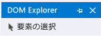
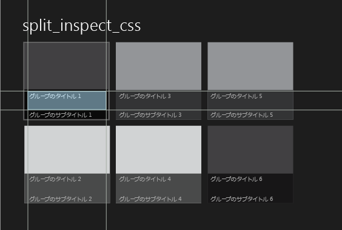
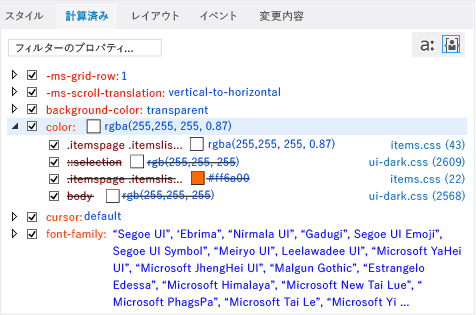

# DOM Explorer を使用した CSS スタイルのデバッグ
[!INCLUDE[vs2017banner](../code-quality/includes/vs2017banner.md)]

  
  
 Windows ストア アプリ、Windows Phone ストア アプリ、Visual Studio Tools for Apache Cordova を使用して作成されたアプリのデバッグ中に、選んだ DOM 要素と子要素に対する CSS 規則を表示および変更できます。  
  
 DOM Explorer の **\[スタイル\]** タブと **\[計算済み\]** タブに、選択した要素に適用される CSS ルールが表示されます。 規則は CSS の優先順位規則に従ったそれぞれの限定度の順に表示されます。 タブのセレクターまたはスタイルの上部に表示される規則 \(最も限定的な規則\) は選択した要素に最後に適用される規則であり、セレクターまたはスタイルの下部に表示される規則は最初に適用される規則です。 規則が適用されると、以前に適用された規則はオーバーライドされます。  
  
 **\[スタイル\]**、**\[計算済み\]**、**\[変更\]** の各タブには、それぞれ異なる形式でスタイル情報が表示されます。  
  
-   **\[スタイル\]** タブには、`html, body` などの CSS セレクターの名前別に整理して規則が表示されます。 このタブを使用して、特定のスタイルを有効または無効にすることや、手動で値を編集して、その変更結果を即座に確認することもできます。  
  
-   **\[計算済み\]** タブには、スタイルの計算値が表示されます。 たとえば、サイズを 1em に設定した場合、Internet Explorer での計算値は 16px になります。 このタブのスタイルは `height` などのスタイル名に基づいて整理されます。 このタブを使用して、特定のスタイルを有効または無効にすることや、手動で値を編集して、その変更結果を即座に確認することもできます。  
  
    > [!NOTE]
    >  Visual Studio 2013 Update 2 では、**\[トレース\]** タブで提供される情報は **\[計算済み\]** タブにマージされ、**\[Trace\]** タブは削除されました。  
  
-   **\[変更\]** タブ \(Windows ストア アプリおよび Windows Phone ストア アプリのみ\) では、デバッグ セッション中に変更した CSS スタイルを識別して追跡できます。  
  
> [!TIP]
>  **\[スタイル\]** タブと **\[計算済み\]** タブで行った変更は永続的ではありません。 それらは、デバッグを停止したときに失われます。 デバッガーを停止して再起動することなくソース コードの変更とページの再読み込みを行うには、**\[デバッグ\]** ツール バーの  ボタン \(**\[Windows アプリケーションの更新\]**\) を使用してアプリを更新します \(Windows ストア アプリおよび Windows Phone ストア アプリのみ\)。 詳細については、「[アプリの更新 \(JavaScript\)](../debugger/refresh-an-app-javascript.md)」を参照してください。  
  
## CSS 規則の修正例  
 この例では、CSS 規則を検査し、スタイルの問題をデバッグする方法を示します。 この例では、[!INCLUDE[win8_appname_long](../debugger/includes/win8_appname_long_md.md)] 分割アプリケーション テンプレートのグループ タイトルの表示に使用されるフォントの色を変更するとします。  
  
> [!NOTE]
>  この例は Windows ストア アプリの場合を示していますが、示されているすべての DOM Explorer 機能は Windows Phone ストア アプリにも適用されます。また、\[変更\] タブ以外は Visual Studio Tools for Apache Cordova を使用して作成されたアプリにも適用されます。  
  
#### CSS 規則を表示および変更するには  
  
1.  Visual Studio で、分割アプリケーション プロジェクト テンプレートで JavaScript と HTML を使用して、[!INCLUDE[win8_appname_long](../debugger/includes/win8_appname_long_md.md)] アプリを作成します。  
  
2.  **ソリューション エクスプローラー**で items.css を開きます  \(items.css はページ フォルダーにあります\)。  
  
3.  次の CSS コードを  
  
    ```css  
    .itemspage .itemslist .item { -ms-grid-columns: 1fr; -ms-grid-rows: 1fr 90px; display: -ms-grid; height: 250px; width: 250px; }  
    ```  
  
     以下に置き換えます。  
  
    ```css  
    .itemspage .itemslist .item { -ms-grid-columns: 1fr; -ms-grid-rows: 1fr 90px; display: -ms-grid; height: 250px; width: 250px; color: #ff6a00; }  
    ```  
  
     これは一覧の項目ごとに色 \#ff6a00 \(オレンジ色\) を指定するスタイルを追加します。 CSS セレクター、`.itemspage .itemslist .item` は、有効な DOM の入れ子になった要素として表示される、items.html 内の DIV 要素の一連のクラス名を示します。`item` DIV 要素は、一覧の項目を指定します。  
  
4.  **\[デバッグ\]** ツール バーのドロップダウン リストの **\[シミュレーター\]** を選択します \(既定値は **\[ローカル コンピューター\]** です\)。  
  
       
  
5.  F5 キーを押して、アプリをデバッグ モードで実行します。  
  
     アプリケーションの読み込みが完了したら、**\[グループ タイトル: 1\]** のようなリスト項目の見出しを確認します。 色は変更されていないため、タイトルにオレンジ色を適用するという変更は機能しませんでした。 何がうまくいかなかったのか確認し、DOM Explorer で CSS のタブを使用して修正します。  
  
    > [!TIP]
    >  アプリがシミュレーターに表示されたら、Visual Studio ウィンドウの真横にシミュレーターを配置します。こうすると CSS のスタイルに加えた変更と選択した結果をすぐに確認できます。  
  
6.  Visual Studio に切り替え、DOM Explorer で **\[要素の選択\]** をクリックします \(または Ctrl \+ B キーを押します\)。 これで選択モードが変更され、項目をクリックで選択できるようになります。同時に、アプリが前面に表示されます。 モードは、シングルクリックで元に戻ります。**\[要素の選択\]** ボタンを次に示します。  
  
    > [!TIP]
    >  HTML 要素は DOM Explorer で直接選択することもできます。 要素の選択の詳細については、「[クイック スタート: HTML および CSS のデバッグ](../debugger/quickstart-debug-html-and-css.md)」を参照してください。  
  
7.  シミューレーターで、ホーム ページの左パネルに表示されている一覧の最初の項目のタイトル \(**\[グループ タイトル: 1\]**\) をポイントします。 次に示すように、タイトルが反転表示されます。  
  
       
  
    > [!NOTE]
    >  Windows Phone エミュレーターは、マウス ポインターを置いたときの要素の強調表示を部分的にのみサポートします。  
  
8.  輪郭付きのタイトルをクリックします。 DOM Explorer によって対応する HTML 要素が自動的に選択され、次のように表示されます。  
  
    ```html  
    <h4 class="item-title">Group Title: 1</h4>  
    ```  
  
     DOM Explorer で H4 要素を選択すると、DOM Explorer のタブにその H4 要素に関連付けられた規則が表示されます。`color` プロパティが開かれた状態の **\[計算済み\]** タブを次に示します。  
  
       
  
     このビューから、`color` スタイルに関連付けられている規則について、次のような有益な情報が得られます。  
  
    -   items.css で変更した CSS セレクター、`.itemspage .itemslist .item` は最終的なスタイルの計算で使用されていません \(テキストに取り消し線が表示されます\)。 いくつかある他の `color` スタイルも使用されていません。  
  
        > [!TIP]
        >  セレクター名が長い場合、省略されていない名前はツールヒントに表示されます。  
  
    -   最後に計算された CSS 値、`rgba(255, 255, 255, 0.87)` は、`.itemspage .itemslist .item .item-overlay .item-title` という CSS セレクター用に設定されています。このセレクターは、items.css でも定義されています。  
  
        > [!TIP]
        >  タイトルの色がどこで設定されているかがわかったため、どこを変更するとよいかもわかりました。 ただし、残りの手順で示すように、アプリケーションを更新せずに DOM Explorer で変更をテストすることもできます。  
  
9. `color` スタイルの最初のチェック ボックスをオフにします。これは `.itemspage .itemslist .item .item-overlay .item-title` セレクター用です。 シミュレーターで、アイテムのタイトルの色がすべて意図したとおりにオレンジ色に変わることが確認できます。CSS で変更したセレクター、`.itemspage .itemslist .item` はもうオーバーライドされていません \(つまり、もうテキストに取り消し線が付いていません\)。 チェック ボックスをオフにした後の **\[計算済み\]** タブを次に示します。  
  
       
  
10. **\[変更\]** タブをクリックします。  
  
     デバッグ セッション中に変更したスタイルを識別して追跡するには、**\[変更\]** タブを使用します。 次の図は、**\[変更\]** タブのオーバーライドされた `.itemspage .itemslist .item .item-overlay .item-title` セレクターを示しています。  
  
       
  
11. **\[スタイル\]** タブで、CSS スタイルの値を手動で変更することもできます。結果はすぐに確認できます。  
  
12. **\[スタイル\]** タブをクリックします。  
  
13. `.itemspage .itemslist .item .item-overlay .item-title` スタイル セレクターを開きます。  
  
14. 最初に出現した `color` スタイルを選択し、プロパティ値 `rgb(255, 255, 255, 0.87)` をダブルクリックします。  
  
15. キーボードを使用してこの値を変更します。`rgb(255, 255, 0, 0.87)` に変更し、Enter キーを押します。 シミュレーターに表示されている項目のタイトルの色がすべて黄色に変更されます。  
  
16. ソースの CSS ファイルに変更を加えるには、**\[スタイル\]** タブの **\[items.css\]** リンクをクリックします。 これにより items.css が開き、アプリケーション コードの `color` スタイルの値を変更できます。 デバッガーを停止して再起動することなくアプリを更新するには、**\[デバッグ\]** ツール バーの  \(**\[Windows アプリケーションの更新\]**\) ボタンをクリックします。  
  
## 参照  
 [クイック スタート: HTML および CSS のデバッグ](../debugger/quickstart-debug-html-and-css.md)   
 [DOM Explorer を使用したレイアウトのデバッグ](../debugger/debug-layout-using-dom-explorer.md)   
 [DOM イベント リスナーの表示](../debugger/view-dom-event-listeners.md)   
 [製品のサポートとアクセシビリティ](http://go.microsoft.com/fwlink/?LinkId=253502)