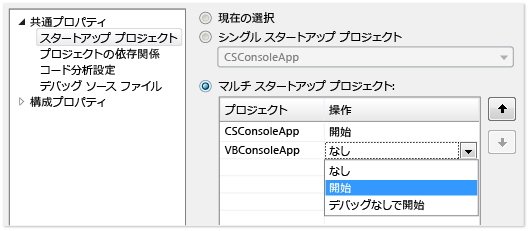
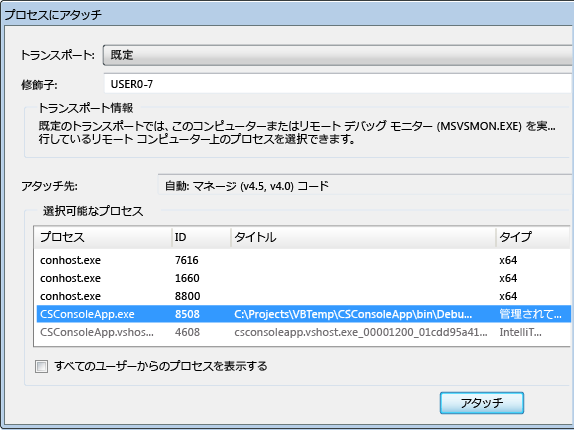
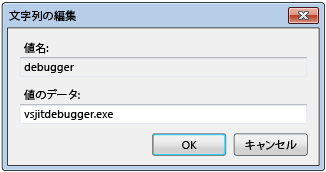
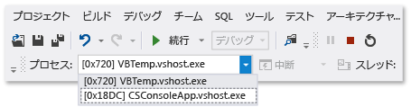
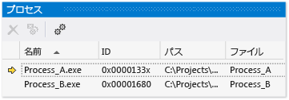

# 複数プロセスをデバッグする
プロセスのデバッグ開始、プロセス間の切り替え、中断し実行を続行、ソースのステップ、デバッグを停止して終了またはプロセスからデタッチする方法を次に示します。  
  
##   複数のプロセスの実行動作を構成します。  
 既定では、複数のプロセスがデバッガーで実行されているとき、デバッガーの中断、ステップ実行、停止のコマンドは通常、すべてのプロセスに影響を与えます。 たとえば、1 つのプロセスがブレークポイントで中断されると、他のすべてのプロセスの実行も一時停止されます。 コマンドの実行対象をより詳細に制御するために、この既定の動作を変更できます。  
  
1.  クリックして**デバッグ > オプションと設定**します。  
  
2.  **デバッグ**、**全般** ページで、クリア、 **1 つのプロセスがブレークするときに、すべてのプロセスをブレーク**チェック ボックスをオンします。  
  
##   ソースとシンボル (.pdb) ファイルを検索します。  
 プロセスのソース コードを処理するために、デバッガーにはプロセスのソース ファイルとシンボル ファイルへのアクセスが必要になります。 [シンボル (.pdb) ファイルとソース ファイルの指定](../debugger/specify-symbol-dot-pdb-and-source-files-in-the-visual-studio-debugger.md)に関する記事をご覧ください。  
  
 プロセスのファイルにアクセスできない場合は、逆アセンブル ウィンドウを使用して移動できます。 参照してください[方法: [逆アセンブル] ウィンドウの使用](../debugger/how-to-use-the-disassembly-window.md)  
  
##   VS ソリューション内の複数のプロセスを開始、プロセスにアタッチする、デバッガーでプロセスを自動的に開始  
  
-   [Visual Studio ソリューションで複数のプロセスのデバッグを開始します。](#BKMK_Start_debugging_multiple_processes_in_a_Visual_Studio_solution)  
  
-   [スタートアップ プロジェクトを変更します。](#BKMK_Change_the_startup_project)  
  
-   [ソリューション内の特定のプロジェクトを開始します。](#BKMK_Start_a_specific_project_in_a_solution)  
  
-   [ソリューション内の複数のプロジェクトを開始します。](#BKMK_Start_multiple_projects_in_a_solution)  
  
-   [プロセスにアタッチします。](#BKMK_Attach_to_a_process)  
  
-   [デバッガーでプロセスを自動的に開始します。](#BKMK_Automatically_start_an_process_in_the_debugger)  
  
> [!NOTE]
>  デバッガーは、子プロジェクトが同じソリューション内にある場合でも、デバッグ対象のプロセスによって開始された子プロセスに自動的にアタッチされません。 子プロセスをデバッグするには:   
>   
>  -   子プロセスが開始された後、そのプロセスにアタッチします。  
>   
>      - または -  
> -   デバッガーの新しいインスタンスで子プロセスが自動的に開始されるように Windows を構成します。  
  
###   Visual Studio ソリューションで複数のプロセスのデバッグを開始します。  
 Visual Studio ソリューション内に独立して実行できる複数のプロジェクト (個別のプロセスで実行されるプロジェクト) があるときは、デバッガーによって起動されるプロジェクトを選択できます。  
  
   
  
####   スタートアップ プロジェクトを変更します。  
 ソリューションのスタートアップ プロジェクトを変更するには、ソリューション エクスプ ローラーでプロジェクトを選択し、**スタートアップ プロジェクトとして設定**コンテキスト メニュー。  
  
####   ソリューション内の特定のプロジェクトを開始します。  
 既定のスタートアップ プロジェクトを変更することがなく、ソリューションのプロジェクトを開始するには、ソリューション エクスプ ローラーでプロジェクトを選択し、**デバッグ**コンテキスト メニュー。 選択できます**新しいインスタンスを開始**または**新しいインスタンスにステップ イン**します。  
  
  [VS ソリューション内の複数のプロセスを開始、プロセスにアタッチする、デバッガーでプロセスを自動的に開始](../debugger/debug-multiple-processes.md#BKMK_Start_multiple_processes_in_a_VS_solution__attach_to_a_process__automatically_start_a_process_in_the_debugger)  
  
####   ソリューション内の複数のプロジェクトを開始します。  
  
1.  ソリューション エクスプ ローラーでソリューションを選択し、**プロパティ**コンテキスト メニュー。  
  
2.  選択**共通プロパティ**、**スタートアップ プロジェクト**上、**プロパティ** ダイアログ ボックス。  
  
3.  選択を変更するプロジェクトごとに**開始**、**デバッグなしで開始**、または**None**します。  
  
  [VS ソリューション内の複数のプロセスを開始、プロセスにアタッチする、デバッガーでプロセスを自動的に開始](../debugger/debug-multiple-processes.md#BKMK_Start_multiple_processes_in_a_VS_solution__attach_to_a_process__automatically_start_a_process_in_the_debugger)  
  
###   プロセスにアタッチします。  
 デバッガーのことにも*アタッチ*リモート デバイスで実行されているプログラムを含む、Visual Studio の外部プロセスで実行されているプログラム。 プログラムにアタッチした後、デバッガーの実行コマンドを使用したり、プログラムの状態をチェックしたりできます。 プログラムのチェック機能は、デバッグ情報付きでビルドされたプログラムかどうか、プログラムのソース コードにアクセスできるかどうか、および共通言語ランタイムの JIT コンパイラがデバッグ情報を追跡しているかどうかによって限定される場合があります。  
  
 参照してください[実行中のプロセスにアタッチ](../debugger/attach-to-running-processes-with-the-visual-studio-debugger.md)詳細についてはします。  
  
 **ローカル コンピューターで実行されているプロセスにアタッチします。**  
  
 クリックして**デバッグ > プロセスにアタッチ**します。 **プロセスにアタッチ** ダイアログ ボックスからプロセスを選択、**選択可能なプロセス**一覧を選び、**アタッチ**します。  
  
   
  
###   デバッガーでプロセスを自動的に開始します。  
 場合によっては、別のプロセスで起動されたプログラムのスタートアップ コードをデバッグする必要があります。 たとえば、サービスやカスタムのセットアップ動作などです。 このような場合、アプリケーションの起動時にデバッガーを起動して自動的にアタッチできます。  
  
1.  レジストリ エディターを起動 (**regedit.exe**)。  
  
2.  移動し、 **hkey_local_machine \software\microsoft\windows nt \currentversion\image File Execution Options**フォルダー。  
  
3.  デバッガーで起動するアプリのフォルダーを選択します。  
  
     アプリの名前が子フォルダーとして表示されない場合は、選択**Image File Execution Options**選び、**新規**、**キー**コンテキスト メニュー。 新しいキーを選択し、選択**の名前を変更**ショートカット メニューにし、アプリの名前を入力します。  
  
4.  アプリ フォルダーのコンテキスト メニューで、次のように選択します。**新規**、**文字列値**します。  
  
5.  新しい値の名前を変更**新しい値**に`debugger`します。  
  
6.  デバッガー エントリのコンテキスト メニューで、次のように選択します。**変更**します。  
  
7.  [文字列の編集] ダイアログ ボックスで、次のように入力します。`vsjitdebugger.exe`で、**値データ**ボックス。  
  
       
  
   
  
##   プロセスの切り替え、break ステートメントと continue をソースをステップ実行します。  
  
-   [プロセス間の切り替え](#BKMK_Switch_between_processes)  
  
-   [中断、ステップ、および続行のコマンド](#BKMK_Break__step__and_continue_commands)  
  
###   プロセス間の切り替え  
 デバッグ中には複数のプロセスにアタッチできますが、デバッガーでアクティブになっているプロセスは常に 1 つだけです。 アクティブなを設定するまたは*現在*やデバッグの場所 ツールバーで、プロセス、**プロセス**ウィンドウ。 プロセス間で切り替えるには、両方のプロセスが中断モードであることが必要です。  
  
 **現在のプロセスを設定するには**  
  
-   [デバッグの場所] ツールバーで、選択**プロセス**を表示する、**プロセス**ボックスの一覧。 現在のプロセスとして指定するプロセスを選択します。  
  
       
  
     場合、**デバッグの場所**ツールバーが表示されていない、選択**ツール**、**カスタマイズ**します。 **ツールバー**  タブで、選択**デバッグの場所**します。  
  
-   開く、**プロセス**ウィンドウ (ショートカット**Ctrl + Alt + Z**) を現在のプロセスとして設定するプロセスを見つけて、それをダブルクリックします。  
  
       
  
     現在のプロセスが黄色の矢印でマークされます。  
  
 プロジェクトを切り替えると、そのプロジェクトがデバッグ対象の現在のプロセスに設定されます。 表示するすべてのデバッガー ウィンドウに、現在のプロセスの状態が表示され、すべてのステップ実行コマンドは現在のプロセスにのみ影響を与えます。  
  
  [プロセスを切り替え、break ステートメントと continue をソースをステップ実行します。](../debugger/debug-multiple-processes.md#BKMK_Switch_processes__break_and_continue_execution__step_through_source)  
  
###   中断、ステップ、および続行のコマンド  
  
> [!NOTE]
>  既定では、中断、続行、ステップ実行のコマンドはデバッグ中のすべてのプロセスに影響を与えます。 この動作を変更するを参照してください[複数のプロセスの実行動作を構成します。](#BKMK_Configure_the_execution_behavior_of_multiple_processes)  
  
|**コマンド**|**1 つのプロセスがブレークするときに、すべてのプロセスをブレークします。**   オンにした場合 (既定)|**1 つのプロセスがブレークするときに、すべてのプロセスをブレークします。**   オフにした場合|  
|-|-|-|  
|**デバッグ**メニュー。   -   **すべて中断します。**|すべてのプロセスが中断されます。|すべてのプロセスが中断されます。|  
|**デバッグ**メニュー。   -   **続行**|すべてのプロセスが再開されます。|一時停止中のすべてプロセスが再開されます。|  
|**デバッグ**メニュー。   -   **ステップ イン** -   **ステップ オーバー** -   **ステップ アウト**|現在のプロセスのステップ実行中にすべてのプロセスが実行されます。   その後、すべてのプロセスが中断されます。|現在のプロセスがステップ実行されます。   一時停止中のプロセスが再開されます。   実行中のプロセスが続行されます。|  
|**デバッグ**メニュー。   -   **現在のプロセスにステップ イン** -   **現在のプロセス経由での手順** -   **[ステップ アウト] 現在のプロセス**|N/A|現在のプロセスがステップ実行されます。   他のプロセスの既存の状態 (一時停止中または実行中) が維持されます。|  
|ソース ウィンドウ   -   **ブレークポイント**|すべてのプロセスが中断されます。|ソース ウィンドウのプロセスのみ中断されます。|  
|ソース ウィンドウのコンテキスト メニュー:    -   **カーソルまでを実行します。**   ソース ウィンドウのプロセスは現在のプロセスであることが必要です。|ソース ウィンドウのプロセスがカーソル位置まで実行されてから中断されている間に、すべてのプロセスが実行されます。   その後、他のすべてのプロセスが中断されます。|ソース ウィンドウのプロセスはカーソル位置まで実行されます。   他のプロセスの既存の状態 (一時停止中または実行中) が維持されます。|  
|**プロセス**ウィンドウ コンテキスト メニュー。   -   **プロセスをブレークします。**|N/A|選択したプロセスが中断されます。   他のプロセスの既存の状態 (一時停止中または実行中) が維持されます。|  
|**プロセス**ウィンドウ コンテキスト メニュー。   -   **プロセスを続行します。**|N/A|選択したプロセスが再開されます。   他のプロセスの既存の状態 (一時停止中または実行中) が維持されます。|  
  
  [プロセスを切り替え、break ステートメントと continue をソースをステップ実行します。](../debugger/debug-multiple-processes.md#BKMK_Switch_processes__break_and_continue_execution__step_through_source)  
  
##   デバッグを停止、終了、またはプロセスからデタッチします。  
  
-   [停止、終了、およびデタッチのコマンド](#BKMK_Stop__terminate__and_detach_commands)  
  
 既定で選択すると**デバッグ**、**デバッグの停止**複数のプロセスがデバッガーで開いているとき、デバッガーが終了またはでプロセスが開かれた方法に応じて、すべてのプロセスからデタッチされますが、デバッガー:  
  
-   現在のプロセスがデバッガーで開始された場合、そのプロセスは終了します。  
  
-   デバッガーを現在のプロセスにアタッチした場合、デバッガーはプロセスからデタッチされ、プロセスは実行中のままになります。  
  
 たとえば、Visual Studio ソリューションからのプロセスのデバッグを開始する場合、既に実行されている別のプロセスにアタッチし、[**デバッグの停止]**、デバッグ セッションが終了、Visual Studio で開始されたプロセス中に終了したアタッチしたプロセスが実行されたままです。 次の手順を使用してデバッグの停止方法を制御できます。  
  
> [!NOTE]
>  **1 つのプロセスがブレークするときに、すべてのプロセスをブレーク**オプションでは、デバッグ、終了やプロセスからのデタッチを停止は影響しません。  
  
 **デバッグの停止 と、個々 のプロセスにどのように影響する方法を変更するには**  
  
-   開く、**プロセス**ウィンドウ (ショートカット**Ctrl + Alt + Z**)。 プロセスを選択し、オンまたはオフ、**デバッグの停止時にデタッチ**チェック ボックスをオンします。  
  
###   停止、終了、およびデタッチのコマンド  
  
|**コマンド**|**説明**|  
|-|-| 
|**デバッグ**メニュー。   -   **デバッグを停止します。**|によって動作が変更されない限り**プロセス**ウィンドウ**デバッグの停止時にデタッチ**オプション。   1.デバッガーによって開始されたプロセスが終了します。 2.アタッチ中のプロセスがデバッガーからデタッチされます。|  
|**デバッグ**メニュー。   -   **[すべて中止]**|すべてのプロセスが終了します。|  
|**デバッグ**メニュー。   -   **すべてデタッチします。**|すべてのプロセスからデバッガーがデタッチされます。|  
|**プロセス**ウィンドウ コンテキスト メニュー。   -   **デタッチ (プロセス)**|選択したプロセスからデバッガーがデタッチされます。   他のプロセスの既存の状態 (一時停止中または実行中) が維持されます。|  
|**プロセス**ウィンドウ コンテキスト メニュー。   -   **プロセスが終了します。**|選択したプロセスが終了します。   他のプロセスの既存の状態 (一時停止中または実行中) が維持されます。|  
|**プロセス**ウィンドウ コンテキスト メニュー。   -   **デバッグの停止時にデタッチします。**|動作を切り替えます**デバッグ**、**デバッグの停止**選択したプロセス。   デバッガーがチェック: プロセスからデタッチされます。 -オフ: プロセスが終了します。|  
  
  [デバッグを停止、終了、またはプロセスからデタッチします。](../debugger/debug-multiple-processes.md#BKMK_Stop_debugging__terminate_or_detach_from_processes)  
  
## 関連項目  
 [シンボル (.pdb) を指定し、ソース ファイル](../debugger/specify-symbol-dot-pdb-and-source-files-in-the-visual-studio-debugger.md)   
 [実行中のプロセスをアタッチします。](../debugger/attach-to-running-processes-with-the-visual-studio-debugger.md)   
 [デバッガーでのコード間の移動](../debugger/navigating-through-code-with-the-debugger.md)   
 [ジャストイン タイムのデバッグ](../debugger/just-in-time-debugging-in-visual-studio.md)   
 [マルチ スレッド アプリケーションをデバッグします。](../debugger/debug-multithreaded-applications-in-visual-studio.md)