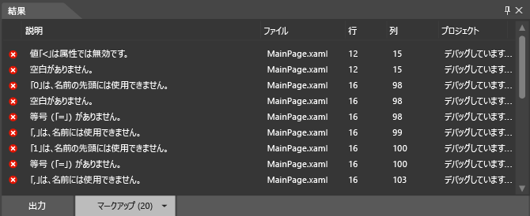

# <a name="debug-xaml-in-blend"></a>Blend での XAML のデバッグ
アプリの XAML をデバッグするために [!INCLUDE[blend_first](../debugger/includes/blend_first_md.md)] のツールを使用できます。 プロジェクトをビルドする場合、エラーは **[結果]** パネルに表示されます。 エラーをダブルクリックして、エラーに関連するマークアップを検索します。 作業領域を増やす必要がある場合は、F12 キーを押して **[結果]** パネルを非表示にできます。  

## <a name="syntax-errors"></a>構文エラー  
 構文エラーは、XAML または分離コード ファイルが言語のフォーマット規則に従っていない場合に発生します。 エラーの説明を参照すると、エラーの解決に役立ちます。 一覧では、エラーの発生しているファイルの名前と行番号も確認できます。 XAML エラーは **[結果]** パネルの **[マークアップ]** タブに一覧されます。  

> [!TIP]
>  XAML は XML に基づくマークアップ言語で、XML 構文規則に従っています。  

 XAML 構文エラーのよくある原因は次のとおりです。  

- キーワードのスペルまたは大文字の表記に誤りがある。  

- 属性またはテキスト文字列の両側に引用符がない。  

- XAML 要素に終了タグがない。  

- XAML 要素が許可されていない場所にある。  

  共通 XAML 構文の詳細については、「[Basic XAML syntax guide](http://go.microsoft.com/fwlink/?LinkId=329942)」 (基本的な XAML 構文のガイド) を参照してください。  

  また、[!INCLUDE[blend_subs](../debugger/includes/blend_subs_md.md)] での単純な分離コード構文エラー、コンパイル エラー、およびランタイム エラーを識別して、解決できます。 ただし、分離コード エラーは Visual Studio で識別して解決する方が簡単です。  

### <a name="debugging-sample-xaml-code"></a>サンプル XAML コードのデバッグ  
 次の例では、[!INCLUDE[blend_subs](../debugger/includes/blend_subs_md.md)] での単純な XAML デバッグ セッションを実行します。  

##### <a name="to-create-a-project"></a>プロジェクトを作成するには  

1. [!INCLUDE[blend_subs](../debugger/includes/blend_subs_md.md)] で、**[ファイル]** メニューを開き、**[新しいプロジェクト]** をクリックします。  

    **[新しいプロジェクト]** ダイアログ ボックスの左側に、プロジェクトの種類の一覧が表示されます。 プロジェクトの種類をクリックすると、その種類に関連付けられているプロジェクト テンプレートが右側に表示されます。  

2. プロジェクトの種類の一覧でクリックして**Windows ユニバーサル**します。  

3. プロジェクト テンプレートの一覧でクリックして**空のアプリ (ユニバーサル Windows)** します。  

4. **名前**テキスト ボックスに「`DebuggingSample`します。  

5. **[場所]** ボックスでプロジェクトの場所を確認します。  

6. **[言語]** ボックスの一覧で、**[Visual C#]** をクリックし、**[OK]** をクリックしてプロジェクトを作成します。  

7. デザイン サーフェイスを右クリックし、**[ソースの表示]** をクリックして **[分割]** ビューに切り替えます。  

8. コードの右上隅にある **[コピー]** リンクをクリックして、次のコードをコピーします。  

   ```xml
   <Grid HorizontalAlignment="Left" Height="222" VerticalAlignment="Top>  
        <Button content="Button" x:Mame="Home" HorizontalAlignment="Left" VerticalAlignment="Top"/>  
        <Button Content="Button" HorizontalAlignment="Left" VerticalAlignment="Top" Margin="0,38,0,0">  
        <Button Content="Button" HorizontalAlignment="Left" VerticalAlignment="Top" Margin="0,75,0,0"/>  
        <Button Content="Button" HorizontalAlignment="Left" VerticalAlignment="Top" Margin="0,112,0,0"/>  
        <Button Content="Button" HorizontalAlignment="Left" VerticalAlignment="Top Margin="0,149,0,0"/>  
   </Grid>  
   ```  

9. 既定の**グリッド**を探し、**Grid** の開始タグと終了タグの間にコードを貼り付けます。 完成したコードは次のようになります。  

    ```xml
    <Grid Background="{ThemeResource ApplicationPageBackgroundThemeBrush}">  
         <Grid HorizontalAlignment="Left" Height="222" VerticalAlignment="Top>  
              <Button content="Button" x:Mame="Home" HorizontalAlignment="Left" VerticalAlignment="Top"/>  
              <Button Content="Button" HorizontalAlignment="Left" VerticalAlignment="Top" Margin="0,38,0,0">  
              <Button Content="Button" HorizontalAlignment="Left" VerticalAlignment="Top" Margin="0,75,0,0"/>  
              <Button Content="Button" HorizontalAlignment="Left" VerticalAlignment="Top" Margin="0,112,0,0"/>  
              <Button Content="Button" HorizontalAlignment="Left" VerticalAlignment="Top Margin="0,149,0,0"/>  
         </Grid>  
    </Grid>  
    ```  

10. Ctrl キーと Shift キーを押しながら B キーを押してプロジェクトをビルドします。  

    プロジェクトをビルドできないことを警告するエラー メッセージが表示され、エラーを一覧表示した **[結果]** パネルがアプリの下部に表示されます。  

      

### <a name="resolving-xaml-errors"></a>XAML エラーの解決  
 XAML エラーが検出された場合、プロジェクトに無効なマークアップが含まれているという警告がデザイン サーフェスに表示されます。 エラーを解決すると、**[結果]** パネルのエラー リストが更新されます。 すべてのエラーを解決すると、デザイン サーフェスが有効になり、アプリがデザイン サーフェスに表示されます。  

##### <a name="to-resolve-the-xaml-errors"></a>XAML エラーを解決するには  

1. リストの最初のエラーをダブルクリックします。 説明は、"値 '<' は、属性では無効です" となります。 エラーをダブルクリックすると、ポインターがコード内の対応する場所を見つけます。 `<` の前の `Button` は有効で、エラー メッセージで指定された属性ではありません。 コードの前の行を見ると、属性 `Top` の終わりの引用符がないことがわかります。 終わりの引用符を入力します。 **[結果]** パネルのエラー リストが更新されて変更が反映されていることに注意してください。  

2. 説明をダブルクリックします"'0' が無効です、名前の先頭にある。"。 `Margin="0,149,0,0"` 正しい形式で表示されます。 ただし、`Margin` のカラー コーディングはコードの `Margin` の他のインスタンスと一致しないことに注意してください。 終わりの引用符が前の名前/値ペア (`VerticalAlignment="Top`) にないため、`Margin="` は前の属性の値の一部として読み込まれ、0 が名前/値ペアの先頭として読み込まれます。 `Top` の終わりの引用符を入力します。 **[結果]** パネルのエラー リストが更新されて変更が反映されます。  

3. 残りのエラーをダブルクリックします。"終わりの XML タグ 'Button' が一致しません。" ポインターは終わりの **Grid** タグ (`</Grid>`) にあり、エラーが `Grid` オブジェクトの内側にあることを示します。 2 番目の `Button` オブジェクトで終わりのタグがないことに注意してください。 終わりの `/` を追加すると、**[結果]** パネル リストが更新されます。 これら 2 つの最初のエラーが解決され、さらに 2 つのエラーが識別されました。  

4. "メンバー 'content' が認識されないか、アクセスできません。" をダブルクリックします。 `c` の `content` は大文字になります。 小文字の "c" を大文字の "c" に置き換えます。  

5. ダブルクリック"プロパティに 'Mame' が存在しません、'<http://schemas.microsoft.com/winfx/2006/xaml>' 名前空間"。 "Mame" の "M" は "N" でなければなりません。 "M" を "N" で置き換えます。 これで、XAML が解析でき、アプリがデザイン サーフェスに表示されます。  

      

    Ctrl + Shift + B キーを押してプロジェクトをビルドし、残っているエラーがないことを確認します。  

## <a name="debugging-in-visual-studio"></a>Visual Studio でのデバッグ  
 アプリ内のコードをさらに簡単にデバッグするために、Visual Studio で [!INCLUDE[blend_subs](../debugger/includes/blend_subs_md.md)] プロジェクトを開くことができます。 Visual Studio で [!INCLUDE[blend_subs](../debugger/includes/blend_subs_md.md)] プロジェクトを開くには、**[プロジェクト]** パネルでプロジェクトを右クリックし、次に **[Visual Studio で編集]** をクリックします。 Visual Studio でデバッグ セッションを完了したら、Ctrl + Shift + S キーを押してすべての変更を保存し、[!INCLUDE[blend_subs](../debugger/includes/blend_subs_md.md)] に戻ります。 プロジェクトの再読み込みを求めるメッセージが表示されます。 **[すべてはい]** をクリックして [!INCLUDE[blend_subs](../debugger/includes/blend_subs_md.md)] での作業を続けます。  

 アプリのデバッグの詳細については、次を参照してください。 [Visual Studio でのデバッグの UWP アプリ](http://go.microsoft.com/fwlink/?LinkId=329944)します。  

## <a name="getting-help"></a>ヘルプ情報の入手  
 デバッグのヘルプが必要な場合、[!INCLUDE[blend_subs](../debugger/includes/blend_subs_md.md)]アプリを検索できます、 [UWP アプリのコミュニティ フォーラム](http://go.microsoft.com/fwlink/?LinkId=280308)投稿、問題に関連の質問を投稿します。
