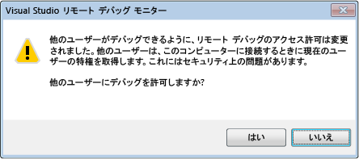

---
title: デバッガーのセキュリティ |Microsoft Docs
ms.date: 11/04/2016
ms.topic: conceptual
dev_langs:
- CSharp
- VB
- FSharp
- C++
helpviewer_keywords:
- debugging [Visual Studio], security
- debugger, security
- security [Visual Studio], debugging best practices
ms.assetid: d4fc3c43-e844-419c-8dbb-551cc2a9b09e
author: mikejo5000
ms.author: mikejo
manager: jillfra
ms.workload:
- multiple
ms.openlocfilehash: aa69e2af329d5066c97f5400db346b89a1549e41
ms.sourcegitcommit: 2193323efc608118e0ce6f6b2ff532f158245d56
ms.translationtype: MTE95
ms.contentlocale: ja-JP
ms.lasthandoff: 01/25/2019
ms.locfileid: "54937010"
---
# デバッガーのセキュリティ
別プロセスでデバッグする機能によって、リモート環境からのデバッグをはじめとした、さまざまな操作を行うことができます。 ただし、デバッガーに悪意があると、デバッグ対象のコンピューターに広範囲の損害を与える可能性があります。  
  
 一方で、セキュリティ上の脅威は逆方向にも当てはまることを認識している開発者は多くありません。 デバッグ対象のプロセスに悪意のあるコードがあると、デバッグを実行しているコンピューターのセキュリティにも悪影響が及ぶことがあります。対処が必要なセキュリティの攻略行為は数多くあります。  
  
## セキュリティに推奨される手順  
 デバッグ対象のコードとデバッガーの間には、暗黙的な信頼関係があります。 何かをデバッグするとき、当然のことながら実行することも考えます。 最終的に、デバッグ対象を信頼できる必要があります。 信頼できない場合は、デバッグしないか、セキュリティが侵害されてもかまわない、隔離された環境にあるコンピューターでデバッグする必要があります。  
  
 攻撃を受ける可能性を減らすには、運用コンピューターでのデバッグは無効にする必要があります。 同じ理由から、無期限にデバッグを有効にしないようにします。  
  
### マネージド デバッグのセキュリティ  
 すべてのマネージド デバッグに適用される全般的な推奨事項を次に示します。  
  
- 信頼関係のないユーザーのプロセスにアタッチするときは注意します。アタッチを実行するときに、信頼できるかどうかを判断します。 信頼関係のないユーザーのプロセスにアタッチするときに、セキュリティの警告ダイアログ ボックスが表示され、プロセスにアタッチするかどうかが確認されます。 "信頼関係のあるユーザー" には、自分と、.NET Framework をインストールしたコンピューターで一般的に定義されている標準のユーザーが含まれます。たとえば、 **aspnet**、 **localsystem**、 **networkservice**、および **localservice**です。 詳細については、次を参照してください。[セキュリティ警告。信頼されていないユーザーが所有するプロセスにアタッチするには危険が伴います。以下の情報に関して疑わしい点がある場合や、不明な場合は、このプロセスにアタッチしないでください](../debugger/security-warning-attaching-to-a-process-owned-by-an-untrusted-user.md)  
  
- プロジェクトをインターネットからダウンロードするとき、およびそのプロジェクトを [!INCLUDE[vsprvs](../code-quality/includes/vsprvs_md.md)]に読み込むときは注意します。 デバッグを実行しない場合でも、これはリスクの高い方法です。 この場合、含まれるプロジェクトとコードが信頼できるかどうかを判断します。  
  
  詳細については、「 [Debugging Managed Code](../debugger/debugging-managed-code.md)」を参照してください。  
  
### リモート デバッグのセキュリティ  
 ローカル デバッグは、リモート デバッグよりも一般に安全です。 リモート デバッグの場合、調査対象の領域は広範囲です。  
  
 Visual Studio リモート デバッグ モニター (msvsmon.exe) はリモート デバッグで使用されます。構成する場合、いくつかのセキュリティ上の推奨事項があります。 認証モードを構成するときは、Windows 認証が推奨されます。認証なしは安全ではありません。  
  
   
  
 Windows 認証モードを使用する場合、信頼関係のないユーザーに msvsmon に接続するアクセス許可を与えることは危険ですので、注意してください。そのユーザーにコンピューターに対するすべてのアクセス許可が付与されるためです。  
  
 リモート コンピューターでは未知のプロセスをデバッグしないでください。デバッガーを実行するコンピューターや msvsmon.exe (Visual Studio リモート デバッグ モニター) に悪影響を及ぼす攻略行為が行われる可能性があります。 それでも未知のプロセスをデバッグする必要がある場合は、ローカルでデバッグし、セキュリティ上の脅威をローカルの問題に抑えるためにファイアウォールを使用します。  
  
 詳細については、次を参照してください。[リモート デバッグ](../debugger/remote-debugging.md)します。  
  
### Web サービスをデバッグするときのセキュリティ  
 ローカルでデバッグする方が安全ですが、 [!INCLUDE[vsprvs](../code-quality/includes/vsprvs_md.md)] が Web サーバーにインストールされていない可能性があるため、ローカル デバッグを実行できない場合があります。 通常、Web サービスのデバッグは、開発時を除いてリモートで行われます。そのため、Web サービスのデバッグにも、リモート デバッグのセキュリティに関する推奨事項が適用されます。 次に、その他の推奨される手順を示します。 詳細については、「 [Debugging XML Web Services](https://msdn.microsoft.com/library/c900b137-9fbd-4f59-91b5-9c2c6ce06f00)」を参照してください。  
  
-   セキュリティに問題のある Web サーバーではデバッグを有効にしないでください。  
  
-   デバッグする前に、Web サーバーが安全であることを確認します。 安全かどうかが確認できない場合は、デバッグしないでください。  
  
-   インターネットに公開されている Web サービスをデバッグする場合は、特に注意が必要です。  
  
### 外部コンポーネント  
 プログラムが外部コンポーネントとやり取りする場合、特に、外部コンポーネントのコードを自分で記述していない場合は、そのコンポーネントの信頼ステータスに注意します。 また、 [!INCLUDE[vsprvs](../code-quality/includes/vsprvs_md.md)] またはデバッガーで使用する可能性のあるコンポーネントにも注意します。  
  
### シンボルとソース コード  
 次の 2 つの [!INCLUDE[vsprvs](../code-quality/includes/vsprvs_md.md)] ツールでは、セキュリティについて考慮する必要があります。  
  
- ソース サーバー。ソース コードのレポジトリからソース コードのバージョンを表示します。 最新バージョンのプログラム ソース コードを持っていないときに便利です。 [セキュリティ警告: デバッガーは信頼されないコマンドを実行する必要があります](../debugger/security-warning-debugger-must-execute-untrusted-command.md)。  
  
- シンボル サーバー。システム コール時のクラッシュをデバッグするときに必要な、シンボルを提供するときに使用されます。  
  
  [シンボル (.pdb) ファイルとソース ファイルの指定](../debugger/specify-symbol-dot-pdb-and-source-files-in-the-visual-studio-debugger.md)に関する記事をご覧ください。  
  
## 関連項目
 [デバッガーの設定と準備](../debugger/debugger-settings-and-preparation.md)   
 [デバッガーでのはじめ](../debugger/debugger-feature-tour.md)[セキュリティ警告。信頼されていないユーザーが所有するプロセスにアタッチするには危険が伴います。以下の情報に関して疑わしい点がある場合や、不明な場合は、このプロセスにアタッチしないでください](../debugger/security-warning-attaching-to-a-process-owned-by-an-untrusted-user.md)   
 [セキュリティ警告: デバッガーは信頼されないコマンドを実行する必要があります](../debugger/security-warning-debugger-must-execute-untrusted-command.md)
