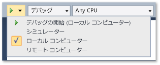

# Visual Studio から UWP アプリを展開する

Visual Studio の配置機能は、ビルドし、ターゲット デバイスに Visual Studio で作成された UWP アプリを登録します。 アプリの厳密な登録方法は、ターゲット デバイスがローカルかリモートかによって違います。

- ターゲットがローカルの Visual Studio コンピューターの場合、Visual Studio はアプリをビルド フォルダーから登録します。

- ターゲットがリモート デバイスの場合、Visual Studio は必要なファイルをリモート コンピューターにコピーしてから、そのデバイス上でアプリを登録します。

アプリのデバッグを、Visual Studio から [デバッグの開始]** オプション (キーボード:F5 キーを押して)、または**デバッグなしで開始**オプション (キーボード。CTRL + F5 アプリを手動で配置することも可能です。 次のシナリオでは、手動の配置は有効です。

- ローカル コンピューターまたはリモート コンピューターで行う臨時のテスト。

- デバッグ対象のアプリを起動するためのアプリを配置する場合。

- 別のアプリまたはメソッドによって起動される、デバッグ対象のアプリを配置します。

##   UWP アプリをデプロイする方法
 アプリを手動で配置する手順はシンプルです。

1.  リモート デバイスへ配置する場合は、アプリのスタートアップ プロジェクトのプロパティ プロジェクト ページに、デバイスの名前または IP アドレスを指定します。 (指定するステップはこのトピック内で後述)。

2.  デバッガーの Visual Studio ツールバーで、 **[デバッグの開始]** ボタンの横のドロップダウン リストから配置ターゲットを選択します。

     

3.  **[ビルド]** メニューで **[配置]** を選択

##   リモート デバイスの指定方法

**必須コンポーネント**

Windows 10 のリモート デバイスで有効にする必要があります[開発者モード](/windows/uwp/get-started/enable-your-device-for-development)します。 Creator の更新プログラムを実行する Windows 10 デバイスで以降、リモート ツールが自動的にインストールされているアプリを展開するときにします。 詳細については、次を参照してください。 [インストールされているアプリ パッケージをデバッグ](../debugger/debug-installed-app-package.md)します。

> [!NOTE]
> Windows 10 の以前の作成者の更新プログラムのバージョンでは、Remote Tools for Visual Studio は、リモート デバイスにインストールする必要があり、リモート デバッガーを実行する必要があります。

配置では、リモート デバッガーのネットワーク チャネルを使用して、アプリのファイルをリモート デバイスに送信します。

#### リモート デバイスを指定するには

1. スタートアップ プロジェクトのデバッグ プロパティ ページで、リモートの配置ターゲットの名前または IP アドレスを指定します。

2. デバッグ プロパティ ページを開くには、ソリューション エクスプローラーでプロジェクトを選択してから、ショートカット メニューで **[プロパティ]** を選択します。

3. 次に、プロパティ ページ ウィンドウで **[デバッグ]** ノードを選択します。

4. **ターゲット デバイス**、**リモート マシン**します。

5. [**リモート マシン**、] をクリックして**検索**します。

6. 名前またはリモート デバイスの IP アドレスを入力するか、デバイスを選択することができます、**リモート接続** ダイアログ ボックス。

    

    **リモート接続** ダイアログ ボックスでは、ローカル ネットワークのサブネットとイーサネット ケーブルによって Visual Studio コンピューターに直接接続されている任意のデバイスで、デバイスが表示されます。

   **JavaScript または Visual C++ のプロジェクト ページにあるリモート デバイスを指定**

   

7. **[起動するデバッガー]** ボックスの一覧の **[リモート デバッガー]** をクリックします。

8. **[コンピューター名]** ボックスのリモート デバイスにネットワーク名を入力します。 あるいはボックス内の下向き矢印をクリックして、[リモート デバッガー接続の選択] ダイアログ ボックスからデバイスを選択します。

   **Visual C# および Visual Basic のプロジェクト ページにあるリモート デバイスを指定**

   

9. **[ターゲット デバイス]** ボックスの一覧の **[リモート コンピューター]** をクリックします。

10. リモート デバイスのネットワーク名を **[リモート コンピューター]** ボックスに入力するか、 **[検索]** をクリックし、 **[リモート デバッガー接続の選択]** ダイアログ ボックスでデバイスを選択します。

##   配置オプション

次の配置オプションを、スタートアップ プロジェクトのデバッグ プロパティ ページに設定できます。

**ネットワーク ループバックの許可**

セキュリティ上の理由から、UWP、または[!INCLUDE[win8_appname_long](../debugger/includes/win8_appname_long_md.md)]にインストールされたデバイスへのネットワーク呼び出しを実行する標準的な方法でインストールされているアプリが許可されていません。 既定では、Visual Studio による配置では、配置されたアプリに対するこの規則の適用は免除されます。 この免除によって、1 台のコンピューター上で通信プロシージャをテストできます。 アプリを [!INCLUDE[win8_appstore_long](../debugger/includes/win8_appstore_long_md.md)]に送信する前に、アプリを適用除外せずにテストする必要があります。

アプリからネットワーク ループバックの適用除外を削除するには

- C#と Visual Basic のデバッグ プロパティ ページで、クリア、**を許可するネットワーク Loopback**チェック ボックスをオンします。

- JavaScript およびデバッグ プロパティ ページで、 **[ネットワーク ループバックの許可]** の値を **[いいえ]** に設定します。

**起動しないが、開始時に、コードをデバッグ (C#および Visual Basic)/アプリケーションを起動 (JavaScript および C++)**

アプリが起動した場合はデバッグ セッションを自動駅に開始するように、配置を構成するには

- C#と Visual Basic のデバッグ プロパティ ページで確認してください、**起動しないが、開始時に、コードをデバッグ**チェック ボックスをオンします。

- JavaScript およびデバッグ プロパティ ページで、 **[アプリケーションの起動]** の値を **[はい]** に設定します。

## 関連項目

- [高度なリモート配置オプション](/windows/uwp/debug-test-perf/deploying-and-debugging-uwp-apps#advanced-remote-deployment-options)
- [インストールされているアプリケーション パッケージをデバッグする](../debugger/debug-installed-app-package.md)
- [Visual Studio からアプリを実行](/visualstudio/debugger/debugging-windows-store-and-windows-universal-apps)
