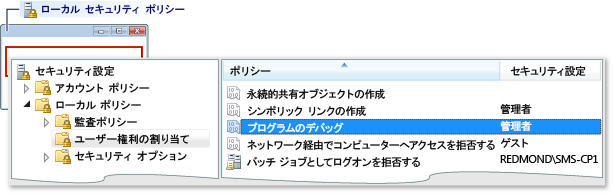
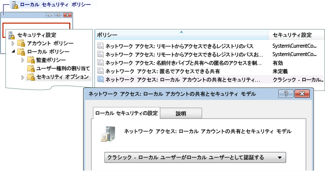

# エラー : ワークグループ リモート ログオン エラー
このエラーには、次のメッセージが表示されます。  
  
 ログオン エラー: 不明なユーザー名、または不適切なパスワードです。  
  
 **原因**  
  
 このエラーは、ワークグループのコンピューターからデバッグしているときにリモート コンピューターに接続しようとすると発生することがあります。 以下の原因が考えられます。  
  
-   名前とパスワードが一致するアカウントがリモート コンピューター上に存在しない。  
  
-   既定値によってこのエラーが発生する場合は、Visual Studio コンピューターとリモート コンピューターの両方がワークグループに、**ローカル セキュリティ ポリシー**リモート マシンで設定します。 既定の設定、**ローカル セキュリティ ポリシー**設定は**Guest のみ - ローカル ユーザーが Guest として認証**です。 このセットアップでデバッグするをリモート コンピューターで設定を変更する必要があります**クラシック - ローカル ユーザー自身として認証**です。  
  
> [!NOTE]
>  次のタスクを実行するには、管理者権限が必要です。  
  
### [ローカル セキュリティ ポリシー] ウィンドウを開くには  
  
1.  開始、 **secpol.msc** Microsoft 管理コンソール スナップインです。 Windows Search、[ファイル名を指定して実行] ボックス、またはコマンド プロンプトで「secpol.msc」と入力します。  
  
### ユーザー権限の割り当てを追加するには  
  
1.  開く、**ローカル セキュリティ ポリシー**ウィンドウです。  
  
2.  展開して、**ローカル ポリシー**フォルダーです。  
  
3.  をクリックして**ユーザー権利の割り当て**です。  
  
4.  **ポリシー**列をダブルクリックして**プログラムのデバッグ**を現在のローカル グループ ポリシーの割り当てを表示する、**ローカル セキュリティ ポリシーの設定** ダイアログ ボックス。  
  
       
  
5.  新しいユーザーを追加する] をクリックして、 **[ユーザーまたはグループ**ボタンをクリックします。  
  
### 共有とセキュリティ モデルを変更するには  
  
1.  開く、**ローカル セキュリティ ポリシー**ウィンドウです。  
  
2.  展開して、**ローカル ポリシー**フォルダーです。  
  
3.  をクリックして**セキュリティ オプション**です。  
  
4.  **ポリシー**列をダブルクリックして**ネットワーク アクセス: ローカル アカウントの共有とセキュリティ モデル**です。  
  
5.  **ネットワーク アクセス: ローカル アカウントの共有とセキュリティ モデル** ダイアログ ボックスで、値を変更**クラシック - ローカル ユーザー自身として認証** をクリックし、**適用**ボタンをクリックします。  
  
       
  
## 関連項目  
 [リモート デバッグ エラーとトラブルシューティング](../debugger/remote-debugging-errors-and-troubleshooting.md)   
 [Remote Debugging](../debugger/remote-debugging.md)