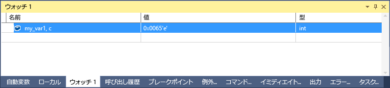

# <a name="format-specifiers-in-c-in-the-visual-studio-debugger"></a>C++ では、Visual Studio デバッガーでの書式指定子
書式指定子を使用して、 **ウォッチ** ウィンドウに表示される値の書式設定を変更することができます。  
  
 書式指定子を使用することも、**イミディ エイト** ウィンドウで、**コマンド**ウィンドウで、[トレース ポイント](../debugger/using-breakpoints.md#BKMK_Print_to_the_Output_window_with_tracepoints)、ソース ウィンドウ内でもです。 これらのウィンドウで式を一時停止する場合は、データヒントで、結果が表示されます。 [データヒント] の表示には、書式指定子が反映されます。  
  
> [!NOTE]
>  Visual Studio のネイティブ デバッガーが新しいデバッグ エンジンに変更されると、いくつかの新しい書式指定子が追加され、一部の古い構成が削除されました。 C++/CLI で相互運用 (ネイティブ コードとマネージ コードの混合) をデバッグする場合は、以前のデバッガーが引き続き使用されます。 このトピックの以降のセクションで、各デバッグ エンジンの書式指定子について説明します。
>   
>  -   [書式指定子](#BKMK_Visual_Studio_2012_format_specifiers) 」では、新しいデバッグ エンジンの書式指定子について説明します。  
> -   [C++/CLI での相互運用機能デバッグ用の書式指定子](#BKMK_Format_specifiers_for_interop_debugging_and_C___edit_and_continue) 」では、以前のデバッグ エンジンの書式指定子について説明します。  
  
## <a name="using-format-specifiers"></a>書式指定子の使用  
 次のようなコードがあるとします。  
  
```C++  
int main() {  
    int my_var1 = 0x0065;  
    int my_var2 = 0x0066;  
    int my_var3 = 0x0067;  
}  
```  
  
 追加、`my_var1`変数を**ウォッチ**ウィンドウ (デバッグ中に**デバッグ > Windows > ウォッチ > ウォッチ 1**)、表示を 16 進数に設定し (で、 **を視聴** ウィンドウでは、変数を右クリックし、選択**16 進表示**)。 これで、ウォッチ ウィンドウに、変数に値 0x0065 が格納されていることが示されます。 この値を整数ではなく文字として表示するには、[名前] 列で変数名の後に文字書式指定子 **c**を追加します。 これにより、 **[値]** 列に **101 'e'** と表示されるようになります。  
  
   
  
##  <a name="BKMK_Visual_Studio_2012_format_specifiers"></a> 書式指定子  
 次の表に、Visual Studio で使用できる書式指定子を記載します。 太字で示されている指定子は、C++/CLI での相互運用機能デバッグではサポートされていません。  
  
|指定子|形式|元の [ウォッチ] の値|表示される値|  
|---------------|------------|--------------------------|---------------------|  
|日|10 進整数|0x00000066|102|  
|o|符号なし 8 進整数。|0x00000066|000000000146|  
|x<br /><br /> **h**|16 進整数|102|0xcccccccc|  
|x<br /><br /> **H**|16 進整数|102|0xcccccccc|  
|c|単一文字|0x0065, c|101 'e'|  
|s|const char* 文字列|\<location> "hello world"|"hello world"|  
|**sb**|const char * 文字列 (引用符なし)|\<location> "hello world"|hello world|  
|s8|UTF-8 文字列|\<場所 >"This is utf-8 コーヒー ☕ です"|「これは、utf-8 コーヒー ☕」|
|**s8b**|Utf-8 文字列 (引用符なし)|\<location> "hello world"|hello world|  
|su|(UTF-16 エンコード) Unicode 文字列|\<位置 > L"hello world"|L"hello world"<br /><br /> u"hello world"|  
|sub|Unicode (utf-16 エンコーディング) 文字列 (引用符なし)|\<位置 > L"hello world"|hello world|  
|bstr|BSTR 文字列|\<位置 > L"hello world"|L"hello world"|  
|env|環境ブロック (2 つの null 終了文字列)|\<location> L"=::=::\\\\"|L"=::=::\\\\\\0=C:=C:\\\\windows\\\\system32\\0ALLUSERSPROFILE=...|
|**s32**|UTF-32 文字列|\<位置 > U"hello world"|u"hello world"|  
|**s32b**|UTF-32 文字列 (引用符なし)|\<位置 > U"hello world"|hello world|  
|**en**|enum|Saturday(6)|土曜日|  
|**hv**|ポインター型。検査されるポインター値が配列のヒープ割り当ての結果であることを意味します (たとえば、 `new int[3]`)。|\<location>{\<first member>}|\<位置 > {\<最初のメンバー >、 \<2 番目のメンバー >,…}|  
|**na**|オブジェクトのポインターのメモリ アドレスを非表示にします。|\<場所 >、{メンバーの値... の =}|{member=value...}|  
|**nd**|基底クラスの情報だけを表示し、派生クラスは無視します。|`(Shape*) square` には基底クラスおよび派生クラスの情報が含まれます。|基底クラスの情報だけを表示します。|  
|hr|HRESULT または Win32 エラー コード。 デバッガーが HRESULT を自動的にデコードする場合、この指定子は不要です。|S_OK|S_OK|  
|wc|Windows クラス フラグ|0x0010|WC_DEFAULTCHAR|  
|wm|Windows メッセージ番号|16|WM_CLOSE|  
|!|データ型の表示カスタマイズをすべて無視した、未処理の書式。|\<カスタマイズされた表現 >|4|  
  
> [!NOTE]
>  **hv** 書式指定子が存在する場合、デバッガーはバッファーの長さを判断して適切な数の要素を表示しようと試みます。 デバッガーは配列の正確なバッファー サイズを常に判断できるとは限らないため、可能な場合には必ずサイズ指定子 `(pBuffer,[bufferSize])` を使用してください。 **hv** 書式指定子は、バッファー サイズをすぐに入手できないシナリオ用に意図されています。  
  
###  <a name="BKMK_Size_specifiers_for_pointers_as_arrays_in_Visual_Studio_2012"></a> 配列としてのポインターのサイズ指定子  
 オブジェクトに対するポインターを配列として表示する場合、整数または式で配列要素数を指定できます。  
  
|指定子|形式|元の [ウォッチ] の値|表示される値|  
|---------------|------------|---------------------------|---------------------|  
|n|10 進数または **16 進数** の整数|pBuffer,[32]<br /><br /> pBuffer,**[0x20]**|`pBuffer` を 32 要素の配列として表示します。|  
|**[exp]**|整数に評価される有効な C++ 式|pBuffer,[bufferSize]|pBuffer を `bufferSize` 要素の配列として表示します。|  
|**expand(n)**|整数に評価される有効な C++ 式|pBuffer, expand(2)| `pBuffer`|  
  
##  <a name="BKMK_Format_specifiers_for_interop_debugging_and_C___edit_and_continue"></a> C++/CLI での相互運用機能デバッグ用の書式指定子  
 **太字** で示されている指定子は、ネイティブおよび C++/CLI コードをデバッグする場合にのみサポートされます。  
  
|指定子|形式|元の [ウォッチ] の値|表示される値|  
|---------------|------------|--------------------------|---------------------|  
|**d,i**|符号付き 10 進整数。|0xF000F065|-268373915|  
|**u**|符号なし 10 進整数。|0x0065|101|  
|o|符号なし 8 進整数。|0xF065|0170145|  
|x,X|16 進整数|61541|0x0000f065|  
|**l,h**|d、i、u、o、x、X の long 型または short 型のプレフィックス。|00406042|0x0c22|  
|**f**|符号付き浮動小数点数値。|(3./2.), f|1.500000|  
|**e**|符号付き指数表記。|(3.0/2.0)|1.500000e+000|  
|**g**|符号付き浮動小数点数値または符号付き指数表記の短い方。|(3.0/2.0)|1.5|  
|c|単一文字|\<場所 >|101 'e'|  
|s|const char*|\<場所 >|"hello world"|  
|su|const wchar_t*<br /><br /> const char16_t\*|\<場所 >|L"hello world"|  
|sub|const wchar_t*<br /><br /> const char16_t\*|\<場所 >|hello world|  
|s8|const char*|\<場所 >|"hello world"|  
|hr|HRESULT または Win32 エラー コード。 デバッガーが HRESULT を自動的にデコードする場合、この指定子は不要です。|S_OK|S_OK|  
|wc|Windows クラス フラグ。|0x00000040,|WC_DEFAULTCHAR|  
|wm|Windows メッセージ番号|0x0010|WM_CLOSE|  
|!|データ型の表示カスタマイズをすべて無視した、未処理の書式。|\<カスタマイズされた表現 >|4|  
  
###  <a name="BKMK_Format_specifiers_memory_locations_in_interop_debugging_and_C___edit_and_continue"></a> C++/CLI での相互運用機能デバッグでのメモリ位置の書式指定子  
 メモリ位置を表すために使われる書式シンボルを次の表に示します。 メモリ位置指定子は、任意の値、または位置を評価する式に使用できます。  
  
|シンボル|形式|元の [ウォッチ] の値|表示される値|  
|------------|------------|--------------------------|---------------------|  
|**ma**|64 ASCII 文字。|0x0012ffac|0x0012ffac .4...0...".0W&.......1W&.0.:W..1...."..1.JO&.1.2.."..1...0y....1|  
|**m**|16 バイトの 16 進数。16 文字の ASCII 文字が続きます。|0x0012ffac|0x0012ffac B3 34 CB 00 84 30 94 80 FF 22 8A 30 57 26 00 00 .4...0...".0W&amp;.|  
|**mb**|16 バイトの 16 進数。16 文字の ASCII 文字が続きます。|0x0012ffac|0x0012ffac B3 34 CB 00 84 30 94 80 FF 22 8A 30 57 26 00 00 .4...0...".0W&amp;.|  
|**mw**|8 ワード。|0x0012ffac|0x0012ffac 34B3 00CB 3084 8094 22FF 308A 2657 0000|  
|**md**|4 ダブルワード。|0x0012ffac|0x0012ffac 00CB34B3 80943084 308A22FF 00002657|  
|**mq**|2 クワドワード。|0x0012ffac|0x0012ffac 7ffdf00000000000 5f441a790012fdd4|  
|**mu**|2 バイト文字 (Unicode)|0x0012ffac|0x0012ffac 8478 77f4 ffff ffff 0000 0000 0000 0000|  
  
###  <a name="BKMK_Size_specifier_for_pointers_as_arrays_in_interop_debugging_and_C___edit_and_continue"></a> C + を使用して相互運用機能デバッグでの配列としてのポインターのサイズ指定子 + CLI  
 オブジェクトに対するポインターを配列として表示する場合、整数で配列要素数を指定できます。  
  
|指定子|形式|式|表示される値|  
|---------------|------------|----------------|---------------------|  
|いいえ|10 進整数|pBuffer[32]|`pBuffer` を 32 要素の配列として表示します。|
