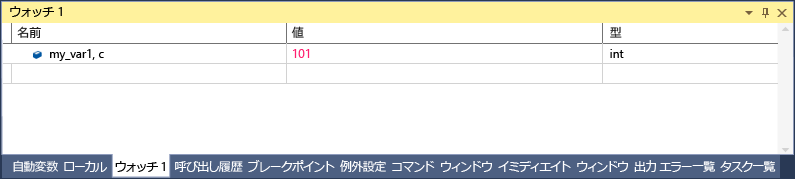

# <a name="format-specifiers-in-c-in-the-visual-studio-debugger"></a>C# の場合、Visual Studio デバッガーでの書式指定子
書式指定子を使用して、 **ウォッチ** ウィンドウに表示される値の書式設定を変更することができます。 書式指定子を使用することも、**イミディ エイト** ウィンドウで、**コマンド**ウィンドウで、[トレース ポイント](../debugger/using-breakpoints.md#BKMK_Print_to_the_Output_window_with_tracepoints)、ソース ウィンドウ内でもです。 これらのウィンドウで式の上にカーソルを合わせると、結果が [データヒント] に表示されます。 [データヒント] には、[データヒント] 表示の書式指定子が反映されます。  
  
 書式指定子を使用するには、式に続いてコンマを入力します。 コンマの後に、適切な指定子を追加します。  
  
## <a name="using-format-specifiers"></a>書式指定子の使用  
 次のようなコードがあるとします。  
  
```csharp  
{  
        int my_var1 = 0x0065;  
        int my_var2 = 0x0066;  
        int my_var3 = 0x0067;  
}  
```  
  
 追加、`my_var1`ウォッチ ウィンドウに変数 (デバッグ中に**デバッグ > Windows > ウォッチ > ウォッチ 1**) 表示を 16 進数に設定し、(で、**ウォッチ**ウィンドウで、変数を右クリックし、選択**16 進表示**)。 これで、 **ウォッチ** ウィンドウに値 "0x0065" が表示されます。 この値を 16 進数の整数ではなく 10 進数の整数で表示するには、[名前] 列で変数名の後に 10 進数の書式指定子 **, d**を追加します。 [値] 列には、10 進数の値 "101" が表示されるようになりました。  
  
   
  
## <a name="format-specifiers"></a>書式指定子  
 デバッガーで認識される C# の書式指定子を次の表に示します。  
  
|指定子|形式|元の [ウォッチ] の値|表示|  
|---------------|------------|--------------------------|--------------|  
|ac|式を強制的に評価します。 これは、プロパティの暗黙の評価および暗黙の関数呼び出しがオフの場合に便利です。|メッセージ"暗黙的な関数評価がオフ、ユーザーが"|\<value>|  
|d|10 進整数|0x0065|101|  
|dynamic|動的ビューを使用して、指定されたオブジェクトを表示します。|動的ビューを含む、オブジェクトのすべてのメンバーを表示します。|動的ビューのみが表示されます。|  
|h|16 進整数|61541|0x0000F065|  
|nq|引用符なしの文字列。|"My String"|My String|  
|hidden|パブリック メンバーとパブリックでないメンバーをすべて表示します。|パブリック メンバーを表示します。|すべてのメンバーを表示します。|  
|raw|未処理の項目ノードで表示されるように項目を表示します。 プロキシ オブジェクトのみで有効です。|ディクショナリ\<T >|ディクショナリの未加工ビュー\<T >|  
|results|IEnumerable または IEnumerable を実装する型の変数と共に使用\<T >、通常、式の結果をクエリします。 クエリ結果を含むメンバーのみを表示します。|すべてのメンバーを表示します。|クエリの条件に一致するメンバーを表示します。|  
  
## <a name="see-also"></a>関連項目  
 [ウォッチと [クイック ウォッチ] ウィンドウ](../debugger/watch-and-quickwatch-windows.md)   
 [[自動変数] ウィンドウと [ローカル] ウィンドウ](../debugger/autos-and-locals-windows.md)
