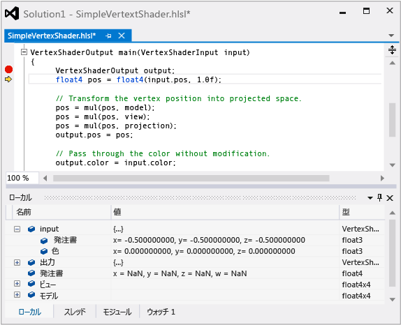

# HLSL シェーダーのデバッガー
[!INCLUDE[vs2017banner](../code-quality/includes/vs2017banner.md)]

Visual Studio Graphics Analyzer で HLSL デバッガーを使用すると、アプリの実際の条件下で、HLSL シェーダー コードの動作方法を理解できます。  
  
 HLSL デバッガーを次に示します。  
  
   
  
## HLSL デバッガーについて  
 HLSL デバッガーは、シェーダー コードで発生する問題を把握するのに役立ちます。  [!INCLUDE[vsprvs](../code-quality/includes/vsprvs_md.md)] における HLSL コードのデバッグは、C\+\+、C\#、Visual Basic などの他の言語で作成されたコードのデバッグと同様です。  他の言語のデバッグ時と同じように、変数の内容の確認、ブレークポイントの設定、コードのステップ実行、および呼び出し履歴の確認を行うことができます。  
  
 ただし、GPU では、シェーダー コードを数百のスレッドで同時に実行することによりハイ パフォーマンスを実現するため、HLSL デバッガーは、他の Graphics Analyzer と連動して理解しやすい方法でこの情報をすべて表示するように設計されています。  Graphics Analyzer では、グラフィックス ログに記録された情報を使用してキャプチャされたフレームを再生成します。HLSL デバッガーは、シェーダー コードの実行時にリアルタイムで GPU の実行を監視しません。  グラフィックス ログには出力の一部を再生成するために十分な情報が保持されているため、また Graphics Analyzer にはエラーが発生した正確なピクセルおよびイベントを特定することができるツールが用意されているため、HLSL デバッガーは目的のシェーダー スレッドをシミュレートするだけで済みます。  これは、シェーダーの処理を CPU 内でシミュレートし、内部の処理をすべて見ることができることを意味します。  HLSL デバッガーで CPU と同様のデバッグができるのはこのためです。  
  
 ただし、HLSL デバッガーには、現在次のような制限があります。  
  
-   HLSL デバッガーはエディット コンティニュをサポートしていませんが、シェーダーを変更し、結果を表示するフレームを再生成することができます。  
  
-   アプリケーションとシェーダー コードを同時にデバッグすることはできません。  ただし、アプリケーションとシェーダー コードを切り替えてデバッグすることはできます。  
  
-   ウォッチ ウィンドウに変数とレジスタを追加することはできますが、式はサポートされていません。  
  
 一方、HLSL デバッガーでは、他のデバッガーよりも優れた、より CPU に近いデバッグができます。  
  
## HLSL シェーダーの編集および適用機能  
 HLSL シェーダー デバッガーでは、CPU デバッガーのようなエディット コンティニュがサポートされていません。これは、GPU の実行モデルで、シェーダーの状態を元に戻す操作が許可されていないためです。  その代わりに、HLSL デバッガーでは、HLSL ソース ファイルを編集した後、**\[適用\]** を選択してフレームを再生成し、変更の効果を確認できる、編集および適用機能がサポートされています。  変更後のシェーダー コードは、プロジェクトの元の HLSL ソース ファイルの整合性を保持するために、別のファイルに保存されますが、変更後の状態に問題がない場合は、**\[コピー先\]** を選択して、変更をプロジェクト内にコピーできます。  この機能を使用すると、エラーを含むシェーダー コードをすばやく反復処理できるため、HLSL デバッグ ワークフローから、コストのかかるリビルドおよびキャプチャ手順を実行する必要がなくなります。  
  
## HLSL の逆アセンブル  
 HLSL シェーダー デバッガーでは、HLSL ソース コードの一覧の右側に、HLSL シェーダー アセンブリの一覧が表示されます。  
  
## HLSL コードのデバッグ  
 HLSL デバッガーには、\[パイプライン ステージ\] ウィンドウまたは \[ピクセル履歴\] ウィンドウからアクセスできます。  
  
#### \[グラフィックス パイプライン ステージ\] ウィンドウから HLSL デバッガーを起動するには  
  
1.  **\[グラフィックス パイプライン ステージ\]** ウィンドウで、デバッグするシェーダーに関連付けられているパイプライン ステージを見つけます。  
  
2.  パイプライン ステージのタイトルの下で、小さい緑色の矢印として表示される **\[デバッグの開始\]** をクリックします。  
  
    > [!NOTE]
    >  HLSL デバッガーへのこのエントリ ポイントでは、対応するステージの最初のシェーダー スレッドのみをデバッグします。つまり、処理する最初の頂点またはピクセルです。  \[ピクセル履歴\] を使用して、これらのシェーダー ステージの他のスレッドにアクセスできます。  
  
#### \[グラフィックス ピクセル履歴\] から HLSL デバッガーを起動するには  
  
1.  **\[グラフィックス ピクセル履歴\]** ウィンドウで、デバッグするシェーダーに関連付けられている描画呼び出しを展開します。  各描画呼び出しは、複数のプリミティブに対応していることがあります。  
  
2.  描画呼び出しの詳細で、結果の色の効果がシェーダー コードのバグを示しているプリミティブを展開します。  複数のプリミティブがバグを示している場合は、問題の診断をさらに難しくすることがあるエラー累積を回避できるように、そのバグを示す最初のプリミティブを選択します。  
  
3.  プリミティブの詳細で、**\[頂点シェーダー\]** をデバッグするか、**\[ピクセル シェーダー\]** をデバッグするかを選択します。  ピクセル シェーダーは正しいが、頂点シェーダーが正しくない定数を渡すために正しくない色の効果を生成していると思われる場合は、頂点シェーダーをデバッグします。  それ以外の場合は、ピクセル シェーダーをデバッグします。  
  
     選択したシェーダーの右側で、小さい緑色の矢印として表示される **\[デバッグの開始\]** をクリックします。  
  
    > [!NOTE]
    >  HLSL デバッガーへのこのエントリ ポイントでは、選択した描画呼び出し、プリミティブ、およびピクセルに対応するピクセル シェーダー スレッド、または選択した描画呼び出し、プリミティブ、およびピクセルによって結果が補間される頂点シェーダー スレッドをデバッグします。  頂点シェーダーの場合、頂点シェーダーの詳細を展開することで、特定の頂点へのエントリ ポイントを絞り込むことができます。  
  
 HLSL デバッガーを使用してシェーダーのエラーをデバッグする方法の例については、「[グラフィックス診断例](../debugger/graphics-diagnostics-examples.md)」、または「参照」セクションでリンク先のチュートリアルを参照してください。  
  
## 参照  
 [チュートリアル: 頂点の網かけによるオブジェクトの不足](../debugger/walkthrough-missing-objects-due-to-vertex-shading.md)   
 [チュートリアル: 網かけによるレンダリング エラーのデバッグ](../debugger/walkthrough-debugging-rendering-errors-due-to-shading.md)   
 [Walkthrough: Using Graphics Diagnostics to Debug a Compute Shader \(チュートリアル: 計算シェーダーをデバッグするためのグラフィックス診断の使用\)](../debugger/walkthrough-using-graphics-diagnostics-to-debug-a-compute-shader.md)