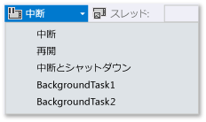
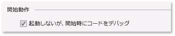

# Visual Studio で Windows ストア アプリの中断イベント、再開イベント、およびバックグラウンド イベントをトリガーする方法
[!INCLUDE[vs2017banner](../code-quality/includes/vs2017banner.md)]

デバッグが行われていないときは、Windows の **プロセス継続時間管理** \(PLM\) によってアプリの実行状態 \(ユーザー アクションに応じたアプリの開始、中断、再開、および終了\) とデバイスの状態が管理されます。 デバッグが行われているとき、これらのアクティブ化イベントは Windows によって無効にされます。 このトピックでは、デバッガーでこれらのイベントを発生させる方法について説明します。  
  
 このトピックでは、**バックグラウンド タスク**をデバッグする方法についても説明します。 バックグラウンド タスクは、アプリが実行されていない場合でもバックグラウンド プロセスで特定の操作を行うことを可能にします。 デバッガーを使用してアプリをデバッグ モードに変更した後、UI の起動なしでバックグラウンド タスクを開始してデバッグできます。  
  
 プロセス継続時間管理とバックグラウンド タスクの詳細については、「[Launching, resuming, and multitasking](http://msdn.microsoft.com/ja-jp/04307b1b-05af-46a6-b639-3f35e297f71b)」を参照してください。  
  
##   このトピックの内容  
 [プロセス継続時間管理イベントを発生させる](#BKMK_Trigger_Process_Lifecycle_Management_events)  
  
 [バックグラウンド タスクをトリガーする](#BKMK_Trigger_background_tasks)  
  
-   [標準デバッグ セッションからバックグラウンド タスク イベントをトリガーする](#BKMK_Trigger_a_background_task_event_from_a_standard_debug_session)  
  
-   [アプリが実行されていないときにバックグラウンド タスクをトリガーする](#BKMK_Trigger_a_background_task_when_the_app_is_not_running)  
  
 [インストール済みのアプリからプロセス継続時間管理イベントとバックグラウンド タスクをトリガーする](#BKMK_Trigger_Process_Lifetime_Management_events_and_background_tasks_from_an_installed_app)  
  
 [バックグラウンド タスクのアクティブ化エラーの診断](#BKMK_Diagnosing_background_task_activation_errors)  
  
##   プロセス継続時間管理イベントを発生させる  
 Windows では、ユーザーが他のアプリに切り替えた場合、または Windows が低電力状態に入った場合にアプリを中断できます。`Suspending` イベントに応答して、関連するアプリとユーザー データを永続ストレージに保存し、リソースを解放できます。**中断**状態から再開されたアプリは**実行**状態に入り、中断状態に入った時点の状態から実行を続行します。`Resuming` イベントに応答してアプリの状態を復元するか更新し、リソースを再要求できます。  
  
 Windows はできる限り多くの中断されたアプリをメモリに保持しようとしますが、十分なリソースが存在しない場合はアプリを終了できます。 ユーザーもアプリを明示的に閉じることができます。 ユーザーがアプリを閉じたことを示す特別なイベントはありません。  
  
 Visual Studio デバッガーでは、アプリを手動で中断、再開、および終了して、プロセスのライフサイクル イベントをデバッグできます。 プロセスのライフサイクル イベントをデバッグするには:  
  
1.  デバッグするイベントのハンドラーの中にブレークポイントを設定します。  
  
2.  **F5** キーを押してデバッグを開始します。  
  
3.  **\[デバッグの場所\]** ツール バーで、トリガーするイベントを選択します。  
  
       
  
     **\[Suspend and terminate\]** \(中断して終了\) は、アプリを閉じ、デバッグ セッションを終了します。  
  
##   バックグラウンド タスクをトリガーする  
 すべてのアプリは、アプリが実行されていない場合でも特定のシステム イベントに応答するためのバックグラウンド タスクを登録できます。 バックグラウンド タスクは、UI を直接更新するコードは実行できません。代わりに、タイルの更新、バッジの更新、およびトースト通知を使用して、ユーザーに情報を表示します。 詳細については、「[Supporting your app with background tasks](http://msdn.microsoft.com/ja-jp/4c7bb148-eb1f-4640-865e-41f627a46e8e)」を参照してください。  
  
 アプリのバックグラウンド タスクを開始するイベントをデバッガーからトリガーできます。  
  
> [!NOTE]
>  デバッガーは、データを含まないイベント \(デバイスの状態の変更を示すイベントなど\) だけをトリガーできます。 ユーザー入力やその他のデータを必要とするバックグラウンド タスクは手動でトリガーする必要があります。  
  
 バックグラウンド タスク イベントをトリガーするための最も現実的な方法は、アプリが実行されていない時点です。 ただし、標準デバッグ セッション中のイベントのトリガーもサポートされています。  
  
###   標準デバッグ セッションからバックグラウンド タスク イベントをトリガーする  
  
1.  デバッグするバックグラウンド タスク コードの中にブレークポイントを設定します。  
  
2.  **F5** キーを押してデバッグを開始します。  
  
3.  **\[デバッグの場所\]** ツール バーのイベントの一覧から、開始するバックグラウンド タスクを選択します。  
  
       
  
###   アプリが実行されていないときにバックグラウンド タスクをトリガーする  
  
1.  デバッグするバックグラウンド タスク コードの中にブレークポイントを設定します。  
  
2.  スタートアップ プロジェクトのデバッグ プロパティ ページを開きます。 ソリューション エクスプローラーでプロジェクトを選択します。**\[デバッグ\]** メニューの **\[プロパティ\]** をクリックします。  
  
     C\+\+ プロジェクトの場合は、**\[構成プロパティ\]** を展開し、**\[デバッグ\]** をクリックする必要があります。  
  
3.  次のいずれかの操作を行います。  
  
    -   Visual C\# プロジェクトと Visual Basic プロジェクトの場合は、**\[起動しないが、開始時にコードをデバッグ\]** をクリックします。  
  
           
  
    -   JavaScript プロジェクトと Visual C\+\+ プロジェクトの場合は、**\[アプリケーションの起動\]** の一覧の **\[No\]** をクリックします。  
  
           
  
4.  **F5** キーを押して、アプリをデバッグ モードにします。 デバッグ モードであることを示すために、**\[デバッグの場所\]** ツール バーの **\[プロセス\]** の一覧にアプリのパッケージ名が表示されます。  
  
       
  
5.  **\[デバッグの場所\]** ツール バーのイベントの一覧から、開始するバックグラウンド タスクを選択します。  
  
       
  
##   インストール済みのアプリからプロセス継続時間管理イベントとバックグラウンド タスクをトリガーする  
 \[インストールされているアプリケーション パッケージのデバッグ\] ダイアログ ボックスを使用して、既にインストールされているアプリをデバッガーに読み込みます。 たとえば、Windows ストアからインストールされたアプリや、ソース ファイルはあっても Visual Studio プロジェクトがないアプリをデバッグできます。 \[インストールされているアプリケーション パッケージのデバッグ\] ダイアログ ボックスを使用すると、Visual Studio のコンピューターまたはリモート デバイスで、アプリをデバッグ モードで起動できます。また、アプリを起動せずにデバッグ モードで実行するように設定することもできます。 詳細については、**JavaScript** バージョンまたは、[Visual C\+\+、Visual C\#、Visual Basic](../debugger/start-a-debugging-session-for-store-apps-in-visual-studio-javascript.md#BKMK_Start_an_installed_app_in_the_debugger) バージョンの「[デバッグ セッションを開始する方法](../debugger/start-a-debugging-session-for-a-store-app-in-visual-studio-vb-csharp-cpp-and-xaml.md#BKMK_Start_an_installed_app_in_the_debugger)」の「**デバッガーでインストール済みのアプリを起動する**」を参照してください。  
  
 アプリをデバッガーに読み込んだら、前の各手順を使用できます。  
  
##   バックグラウンド タスクのアクティブ化エラーの診断  
 バックグラウンド インフラストラクチャ用の Windows イベント ビューアーの診断ログには、バックグラウンド タスク エラーの診断とトラブルシューティングを行うために使用できる詳細情報が含まれています。 このログを表示するには:  
  
1.  イベント ビューアー アプリケーションを開きます。  
  
2.  **操作**ウィンドウで、**\[表示\]** をクリックし、**\[分析およびデバッグ ログの表示\]** がオンになっていることを確認します。  
  
3.  **イベント ビューアー \(ローカル\)** ツリーで、**\[Applications and Services Logs\]**\/**\[Microsoft\]**\/**\[Windows\]**\/**\[BackgroundTasksInfrastructure\]** ノードの順に展開します。  
  
4.  **診断**ログを選択します。  
  
## 参照  
 [Visual Studio でのストア アプリのテスト](../test/testing-store-apps-with-visual-studio.md)   
 [Visual Studio でのアプリのデバッグ](../debugger/debug-store-apps-in-visual-studio.md)   
 [Application lifecycle](http://msdn.microsoft.com/ja-jp/53cdc987-c547-49d1-a5a4-fd3f96b2259d)   
 [Launching, resuming, and multitasking](http://msdn.microsoft.com/ja-jp/04307b1b-05af-46a6-b639-3f35e297f71b)