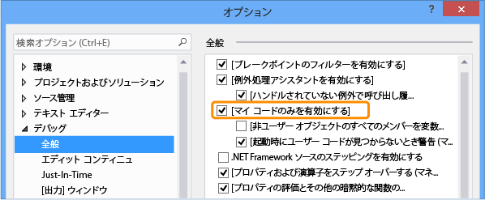

# Just My Code
[!INCLUDE[vs2017banner](../code-quality/includes/vs2017banner.md)]

.NET Framework 言語を使用する開発者は、システム、フレームワーク、およびその他の非ユーザー呼び出しをステップ オーバーし、呼び出し履歴ウィンドウでそれらの呼び出しを折りたたむ、"マイ コードのみ" デバッガー機能に習熟しています。  "マイ コードのみ" 機能は C\+\+ および JavaScript 言語に拡張されました。  このトピックでは、.NET Framework、ネイティブ C\+\+、および JavaScript のプロジェクトでの "マイ コードのみ" の使用について詳しく説明します。  
  
##  <a name="BKMK_Contents"></a> 内容  
 ["マイ コードのみ" の有効/無効の切り替え](#BKMK_Enable_or_disable_Just_My_Code)  
  
 [.NET Framework での "マイ コードのみ"](#BKMK__NET_Framework_Just_My_Code)  
  
 [C++ での "マイ コードのみ"](#BKMK_C___Just_My_Code)  
  
 [JavaScript での "マイ コードのみ"](#BKMK_JavaScript_Just_My_Code)  
  
##  <a name="BKMK_Enable_or_disable_Just_My_Code"></a> "マイ コードのみ" の有効\/無効の切り替え  
 "マイ コードのみ" を有効または無効にするには、**\[デバッグ\]** メニューの **\[オプションと設定\]** をクリックします。  **\[デバッグ\]** \/ **\[全般\]** ノードで、**\[マイ コードのみを有効にする\]** チェック ボックスをオンまたはオフにします。  
  
   
  
> [!NOTE]
>  **\[マイ コードのみを有効にする\]** の設定は、すべての言語のすべての Visual Studio プロジェクトに適用されるグローバルな設定です。  
  
###  <a name="BKMK_Override_call_stack_filtering"></a> 呼び出し履歴のフィルター処理のオーバーライド  
 "マイ コードのみ" が有効な場合は、\[呼び出し履歴\] ウィンドウや \[タスク\] ウィンドウなどの呼び出し履歴の表示で、非ユーザー コードは`[External Code]` というラベルの注釈付きフレームに折りたたまれます。  折りたたまれたフレームを表示するには、呼び出し履歴表示のコンテキスト メニューで **\[外部コードの表示\]** をクリックします。  
  
> [!NOTE]
>  **\[外部コードの表示\]** の設定は、現在のユーザーのプロファイラーに保存されます。  この設定は、ユーザーによって開かれたすべての言語のすべてのプロジェクトに適用されます。  
  
  [内容](#BKMK_Contents)  
  
##  <a name="BKMK__NET_Framework_Just_My_Code"></a> .NET Framework での "マイ コードのみ"  
 [ユーザー コードと非ユーザー コード](#BKMK_NET_User_and_non_user_code) **&#124;** [ステップ実行の動作](#BKMK_NET_Stepping_behavior) **&#124;** [ブレークポイントの動作](#BKMK_NET_Breakpoint_behavior) **&#124;** [例外の動作](#BKMK_NET_Exception_behavior)  
  
###  <a name="BKMK_NET_User_and_non_user_code"></a> ユーザー コードと非ユーザー コード  
 ユーザー コードと非ユーザー コードを区別するために、"マイ コードのみ" 機能はプロジェクト、シンボル \(.pdb\) ファイル、およびプログラム最適化をチェックします。  
  
1.  開いている Visual Studio プロジェクトからビルドされたバイナリは、常にユーザー コードと見なされます。  
  
2.  デバッガーは、バイナリが最適化されているか、.pdb ファイルが入手できないとき、コードがユーザー コードであると見なします。  
  
 以下の 3 つの属性も、デバッガーが何をマイ コードであると見なすかに影響を与えます。  
  
-   <xref:System.Diagnostics.DebuggerNonUserCodeAttribute> は、適用先のコードがマイ コードでないことをデバッガーに通知します。  
  
-   <xref:System.Diagnostics.DebuggerHiddenAttribute> は、"マイ コードのみ" がオフになっていても、コードをデバッガーから見えないようにするための属性です。  
  
-   <xref:System.Diagnostics.DebuggerStepThroughAttribute> は、それが適用されているコードを \(ステップ インではなく\) ステップ スルーするよう、デバッガーに伝える属性です。  
  
 他のすべてのコードはユーザー コードであると見なされます。  
  
  [内容](#BKMK_Contents) **&#124;** [.NET Framework での "マイ コードのみ"](#BKMK__NET_Framework_Just_My_Code)  
  
###  <a name="BKMK_NET_Stepping_behavior"></a> ステップ実行の動作  
 非ユーザー コードに **\[ステップ イン\]** \(キーボード ショートカット: F11\) すると、デバッガーはそのコードを次のユーザー ステートメントにステップ オーバーします。  **\[ステップ アウト\]** \(キーボード: Shift \+ F11\) すると、デバッガーはユーザー コードの次の行に進みます。  ユーザー コードが出現しない場合は、アプリケーションが終了するか、ブレークポイントにヒットするか、または例外が発生するまで実行が続けられます。  
  
  [内容](#BKMK_Contents) **&#124;** [.NET Framework での "マイ コードのみ"](#BKMK__NET_Framework_Just_My_Code)  
  
###  <a name="BKMK_NET_Breakpoint_behavior"></a> ブレークポイントの動作  
 "マイ コードのみ" が有効な場合は、**\[すべて中断\]** をクリックし \(キーボード: Ctrl \+ Alt \+ Break\)、表示するユーザー コードがない位置で実行を停止できます。  停止すると、\[No Source\] \(ソースがありません\) ウィンドウが表示されます。  次に \[ステップ\] をクリックすると、デバッガーによってユーザー コードの次の行に進められます。  
  
  [内容](#BKMK_Contents) **&#124;** [.NET Framework での "マイ コードのみ"](#BKMK__NET_Framework_Just_My_Code)  
  
###  <a name="BKMK_NET_Exception_behavior"></a> 例外の動作  
 ハンドルされない例外が非ユーザー コードで発生した場合、デバッガーはユーザー コードの例外が発生した行で停止します。  
  
 初回例外がその例外に対して有効になっている場合、ユーザー コード行は緑で強調表示されます。  呼び出し履歴に、**\[外部コード\]** というラベルの注釈付きフレームが表示されます。  
  
  [内容](#BKMK_Contents) **&#124;** [.NET Framework での "マイ コードのみ"](#BKMK__NET_Framework_Just_My_Code)  
  
##  <a name="BKMK_C___Just_My_Code"></a> C\+\+ での "マイ コードのみ"  
 [ユーザー コードと非ユーザー コード](#BKMK_CPP_User_and_non_user_code) **&#124;** [ステップ実行の動作](#BKMK_CPP_Stepping_behavior) **&#124;** [例外の動作](#BKMK_CPP_Exception_behavior) **&#124;** [ステップ実行の動作のカスタマイズ](#BKMK_CPP_Customize_stepping_behavior) **&#124;** [呼び出し履歴の動作のカスタマイズ](#BKMK_CPP_Customize_call_stack_behavior)  
  
###  <a name="BKMK_CPP_User_and_non_user_code"></a> ユーザー コードと非ユーザー コード  
 ステップ実行の動作が呼び出し履歴の動作に依存しないため、C\+\+ での "マイ コードのみ" は .NET Framework での "マイ コードのみ" および JavaScript での "マイ コードのみ" とは異なります。  
  
 **呼び出し履歴**  
  
 既定では、デバッガーは呼び出し履歴ウィンドウで以下の関数が非ユーザー コードであると見なします。  
  
-   シンボル ファイル内に除去されたソース情報がある関数。  
  
-   シンボル ファイルがスタック フレームに対応するソース ファイルがないことを示す関数。  
  
-   `%VsInstallDirectory%\Common7\Packages\Debugger\Visualizers` フォルダーの `*.natjmc` ファイルに指定された関数。  
  
 **ステップ実行**  
  
 既定では、`%VsInstallDirectory%\Common7\Packages\Debugger\Visualizers` フォルダーの `*.natstepfilter` ファイルに指定された関数だけが非ユーザー コードと見なされます。  
  
 `%USERPROFILE%\My Documents\Visual Studio 2015\Visualizers` に独自の `.natstepfilter` および `.natjmc` を作成して、ステップ実行と呼び出し履歴ウィンドウの動作をカスタマイズすることができます。  
  
  [内容](#BKMK_Contents) **&#124;** [C++ での "マイ コードのみ"](#BKMK_C___Just_My_Code)  
  
###  <a name="BKMK_CPP_Stepping_behavior"></a> ステップ実行の動作  
 ユーザー コードから非ユーザー コードに **\[ステップ イン\]** \(キーボード ショートカット: F11\) すると、デバッガーはそのコードをユーザー コードの次の行にステップ オーバーします。  **\[ステップ アウト\]** \(キーボード: Shift \+ F11\) すると、デバッガーはユーザー コードの次の行に進みます。  ユーザー コードが出現しない場合は、アプリケーションが終了するか、ブレークポイントにヒットするか、または例外が発生するまで実行が続けられます。  
  
 デバッガーが非ユーザー コードで実行を中断した場合 \(たとえば、\[すべて中断\] が非ユーザー コードで停止した場合\)、その非ユーザー コードでステップ実行が続けられます。  
  
  [内容](#BKMK_Contents) **&#124;** [C++ での "マイ コードのみ"](#BKMK_C___Just_My_Code)  
  
###  <a name="BKMK_CPP_Exception_behavior"></a> 例外の動作  
 デバッガーの実行中に例外が発生すると、デバッガーはユーザー コードを実行中か非ユーザー コードを実行中かに関係なくその例外で停止します。  **\[例外\]** ダイアログ ボックスの **\[ユーザーにハンドルされていないとき\]** オプションは無視されます。  
  
  [内容](#BKMK_Contents) **&#124;** [C++ での "マイ コードのみ"](#BKMK_C___Just_My_Code)  
  
###  <a name="BKMK_CPP_Customize_stepping_behavior"></a> ステップ実行の動作のカスタマイズ  
 `*.natstepfilter`  ファイルに関数を非ユーザー コードとして記述することで、それらの関数をステップ オーバーすることを指定できます。  
  
-   Visual Studio コンピューターのすべてのユーザーの非ユーザー コードを指定するには、  `%VsInstallDirectory%\Common7\Packages\Debugger\Visualizers` フォルダーに .natstepfilter ファイルを追加します。  
  
-   個々 のユーザーの非ユーザー コードを指定するには、  `%USERPROFILE%\My Documents\Visual Studio 2015\Visualizers` フォルダーに .natstepfilter ファイルを追加します。  
  
 .  natstepfilter ファイルは、次の構文を使用する xml ファイルです。  
  
```xml  
<?xml version="1.0" encoding="utf-8"?>  
<StepFilter xmlns="http://schemas.microsoft.com/vstudio/debugger/natstepfilter/2010">  
    <Function>  
        <Name>FunctionSpec</Name>  
        <Action>StepAction</Action>  
    </Function>  
    <Function>  
        <Name>FunctionSpec</Name>  
        <Module>ModuleSpec</Module>  
        <Action>StepAction</Action>  
    </Function>  
</StepFilter>  
  
```  
  
|要素|説明|  
|--------|--------|  
|関数|必ず指定します。  1 つ以上の関数を非ユーザー関数として指定します。|  
|`Name`|必須。  一致を照合する完全な関数名を指定する ECMA\-262 書式の正規表現。  例:<br /><br /> `<Name>MyNS::MyClass.*</Name>`<br /><br /> は、`MyNS::MyClass` のすべてのメソッドが非ユーザー コードと見なされることをデバッガーに知らせます。  一致照合では、大文字と小文字が区別されます。|  
|`Module`|省略可能です。  関数を含むモジュールへの完全パスを指定する ECMA\-262 書式の正規表現。  一致では、大文字と小文字を区別しません。|  
|`Action`|必須。  大文字と小文字が区別される以下のいずれかの値です。<br /><br /> -   `NoStepInto`  – 一致した関数をステップ オーバーすることをデバッガーに指示します。<br />-   `StepInto`  – 一致した関数にステップ インし、一致した関数のその他の `NoStepInto` をオーバーライドすることをデバッガーに指示します。|  
  
  [内容](#BKMK_Contents) **&#124;** [C++ での "マイ コードのみ"](#BKMK_C___Just_My_Code)  
  
###  <a name="BKMK_CPP_Customize_call_stack_behavior"></a> 呼び出し履歴の動作のカスタマイズ  
 モジュール、ソース ファイル、および関数を `*.natjmc` ファイルで指定することで、呼び出し履歴でそれらを非ユーザー コードとして扱うことを指定できます。  
  
-   Visual Studio コンピューターのすべてのユーザーの非ユーザー コードを指定するには、  `%VsInstallDirectory%\Common7\Packages\Debugger\Visualizers` フォルダーに .natjmc ファイルを追加します。  
  
-   個々 のユーザーの非ユーザー コードを指定するには、  `%USERPROFILE%\My Documents\Visual Studio 2015\Visualizers` フォルダーに .natjmc ファイルを追加します。  
  
 .  natjmc ファイルは、次の構文を使用する xml ファイルです。  
  
```xml  
<?xml version="1.0" encoding="utf-8"?>  
<NonUserCode xmlns="http://schemas.microsoft.com/vstudio/debugger/jmc/2015">  
  
  <!-- Modules -->  
  <Module Name="ModuleSpec" />  
  <Module Name="ModuleSpec" Company="CompanyName" />  
  
  <!-- Files -->  
  <File Name="FileSpec"/>  
  
  <!-- Functions -->  
  <Function Name="FunctionSpec" />  
  <Function Name="FunctionSpec" Module ="ModuleSpec" />  
  <Function Name="FunctionSpec" Module ="ModuleSpec" ExceptionImplementation="true" />  
  
</NonUserCode>  
  
```  
  
 **Module 要素の属性**  
  
|属性|説明|  
|--------|--------|  
|`Name`|必須。  モジュールの完全パス。  Windows のワイルドカード文字、`?` \(0 個または 1 個の文字\) および `*` \(0 個以上の文字\) を使用できます。  次に例を示します。<br /><br /> `<Module Name=”?:\3rdParty\UtilLibs\*” />`<br /><br /> は、ドライブの `\3rdParty\UtilLibs` 内のすべてのモジュールを外部コードとして扱うことをデバッガーに指示します。|  
|`Company`|省略可能です。  実行可能ファイルに埋め込まれているモジュールを発行する会社の名前。  この属性を使用して、モジュールのあいまいさを解消することができます。|  
  
 **File 要素の属性**  
  
|属性|説明|  
|--------|--------|  
|`Name`|必須。  外部コードとして扱うソース ファイルの完全パス。  パスを指定するときに Windows のワイルドカード文字、`?` および `*` を使用できます。|  
  
 **Function 要素の属性**  
  
|属性|説明|  
|--------|--------|  
|`Name`|必須。  外部コードとして扱う関数の完全修飾名。|  
|`Module`|省略可能です。  関数を含むモジュールの名前または完全パス。  この属性を使用して、同じ名前の関数のあいまいさを解消することができます。|  
|`ExceptionImplementation`|`true`  に設定すると、この関数ではなく、例外をスローした関数が呼び出し履歴に表示されます。|  
  
  [内容](#BKMK_Contents) **&#124;** [C++ での "マイ コードのみ"](#BKMK_C___Just_My_Code)  
  
##  <a name="BKMK_JavaScript_Just_My_Code"></a> JavaScript での "マイ コードのみ"  
 [ユーザー コードと非ユーザー コード](#BKMK_JS_User_and_non_user_code) **&#124;** [ステップ実行の動作](#BKMK_JS_Stepping_behavior) **&#124;** [ブレークポイントの動作](#BKMK_JS_Breakpoint_behavior) **&#124;** [例外の動作](#BKMK_JS_Exception_behavior) **&#124;** ["マイ コードのみ" のカスタマイズ](#BKMK_JS_Customize_Just_My_Code)  
  
###  <a name="BKMK_JS_User_and_non_user_code"></a> ユーザー コードと非ユーザー コード  
 **コードの分類**  
  
 JavaScript の "マイ コードのみ" は、以下のいずれかの方法でコードを分類することでステップ実行と呼び出し履歴表示を制御します。  
  
|||  
|-|-|  
|**MyCode**|ユーザーが所有および制御するユーザー コード。|  
|**LibraryCode**|ユーザーが通常使用し、アプリケーションが正しく機能するために必要なライブラリからの非ユーザー コード \(WinJS や jQuery など\)。|  
|**UnrelatedCode**|ユーザーのアプリケーションで実行することはできるが、ユーザーが所有せず、アプリケーションが正しく機能するために直接必要としない非ユーザー コード \(広告を表示する広告 SDK など\)。  Windows ストア プロジェクトでは、HTTP または HTTPS URI からアプリケーションに読み込まれるコードも UnrelatedCode と見なされます。|  
  
 JavaScript デバッガーは、以下のコードの種類を自動的に分類します。  
  
-   ホスト提供の `eval` 関数に文字列を渡すことで実行されるスクリプトは、**MyCode** として分類されます。  
  
-   `Function` コンストラクターに文字列を渡すことで実行されるスクリプトは、**LibraryCode** として分類されます。  
  
-   WinJS や Azure SDK など、フレームワーク参照に含まれるスクリプトは、**LibraryCode** として分類されます。  
  
-   `setTimeout`、`setImmediate`、または `setInterval` 関数に文字列を渡すことで実行されるスクリプトは、**UnrelatedCode** として分類されます。  
  
-   `%VSInstallDirectory%\JavaScript\JustMyCode\mycode.default.wwa.json` は、すべての Visual Studio JavaScript プロジェクトの他のユーザー コードと非ユーザー コードを指定します。  
  
 プロジェクトのルート フォルダーに `mycode.json` という名前の .json ファイルを追加することで、既定の分類を変更し、特定のファイルや URL を分類することができます。  
  
 他のすべてのコードは、**MyCode** として分類されます。  
  
  [内容](#BKMK_Contents) **&#124;** [JavaScript での "マイ コードのみ"](#BKMK_JavaScript_Just_My_Code)  
  
###  <a name="BKMK_JS_Stepping_behavior"></a> ステップ実行の動作  
  
-   関数がユーザー \(**MyCode**\) コードでない場合、**\[ステップ イン\]** \(キーボード ショートカット: F11\) は **\[ステップ オーバー\]** \(キーボード: F10\) として動作します。  
  
-   ステップが非ユーザー \(**LibraryCode** または **UnrelatedCode**\) コードで始まる場合、ステップ実行は一時的に "マイ コードのみ" が有効でないように動作します。  ステップがユーザー コードに戻ると、"マイ コードのみ" のステップ実行が再び有効になります。  
  
-   ユーザー コード内のステップが現在の実行コンテキストから出ることになると \(イベント ハンドラーの最後の行でのステップの実行など\)、ユーザー コードの次に実行される行でデバッガーが停止します。  たとえば、コールバックが **LibraryCode** コードで実行されると、デバッガーはユーザー コードの次の行が実行されるまで続行されます。  
  
-   **\[ステップ アウト\]** \(キーボード: Shift \+ F11\) を実行すると、ユーザー コードの次の行で停止します。  ユーザー コードが出現しない場合は、アプリケーションが終了するか、ブレークポイントにヒットするか、または例外が発生するまで実行が続けられます。  
  
  [内容](#BKMK_Contents) **&#124;** [JavaScript での "マイ コードのみ"](#BKMK_JavaScript_Just_My_Code)  
  
###  <a name="BKMK_JS_Breakpoint_behavior"></a> ブレークポイントの動作  
  
-   どのコードで設定されたブレークポイントでも、そのコードの分類とは無関係に常にヒットします。  
  
-   `debugger`  キーワードが、  
  
    -   **LibraryCode** コードに出現した場合、デバッガーは常に中断します。  
  
    -   **UnrelatedCode** コードに出現した場合、デバッガーは停止しません。  
  
  [内容](#BKMK_Contents) **&#124;** [JavaScript での "マイ コードのみ"](#BKMK_JavaScript_Just_My_Code)  
  
###  <a name="BKMK_JS_Exception_behavior"></a> 例外の動作  
 ハンドルされていない例外が、  
  
-   **MyCode** または **LibraryCode** コードで発生した場合、デバッガーは常に中断します。  
  
-   **UnrelatedCode** コードで発生し、呼び出し履歴に **MyCode** または **LibraryCode** コードがある場合、デバッガーは中断します。  
  
 \[例外\] ダイアログ ボックスで初回例外がその例外に対して有効になっている場合に、例外が **LibraryCode** または **UnrelatedCode** コードでスローされた場合、  
  
-   例外が処理される場合、デバッガーは中断しません。  
  
-   例外が処理されない場合、デバッガーは中断します。  
  
  [内容](#BKMK_Contents) **&#124;** [JavaScript での "マイ コードのみ"](#BKMK_JavaScript_Just_My_Code)  
  
###  <a name="BKMK_JS_Customize_Just_My_Code"></a> "マイ コードのみ" のカスタマイズ  
 単一の Visual Studio プロジェクトのユーザー コードと非ユーザー コードを分類するには、プロジェクトのルート フォルダーに `mycode.json` という名前の .json ファイルを追加します。  
  
 分類は次の順序で行われます。  
  
1.  既定の分類  
  
2.  `%VSInstallDirectory%\JavaScript\JustMyCode\mycode.default.wwa.json` ファイルでの分類  
  
3.  現在のプロジェクトの `mycode. json` ファイルでの分類。  
  
 分類の各手順で、前の手順はオーバーライドされます。  .json ファイルでは、すべてのキーと値のペアを示す必要はなく、**MyCode**、**Libraries**、および **Unrelated** の値は空の配列にすることもできます。  
  
 マイ コードの .json ファイルでは、次の構文を使用します。  
  
```json  
{  
    "Eval" : "Classification",  
    "Function" : "Classification",  
    "ScriptBlock" : "Classification",  
    "MyCode" : [  
        "UrlOrFileSpec”,  
        . . .  
        "UrlOrFileSpec”  
    ],  
    "Libraries" : [  
        "UrlOrFileSpec”,  
        . .  
        "UrlOrFileSpec”  
    ],  
    "Unrelated" : [  
        "UrlOrFileSpec”,  
        . . .  
        "UrlOrFileSpec”  
    ]  
}  
  
```  
  
 **Eval、Function、および ScriptBlock**  
  
 **Eval**、**Function**、および **ScriptBlock** のキーと値のペアで、動的に生成されたコードを分類する方法が決まります。  
  
|||  
|-|-|  
|**Eval**|ホスト提供の `eval` 関数に文字列を渡すことで実行されるスクリプト。  既定では、Eval スクリプトは **MyCode** として分類されます。|  
|**関数**|`Function` コンストラクターに文字列を渡すことで実行されるスクリプト。  既定では、Function スクリプトは **LibraryCode** として分類されます。|  
|**ScriptBlock**|`setTimeout`、`setImmediate`、または `setInterval` 関数に文字列を渡すことで実行されるスクリプト。  既定では、ScriptBlock スクリプトは **UnrelatedCode** として分類されます。|  
  
 以下のいずれかのキーワードに値を変更できます。  
  
-   `MyCode`  は、スクリプトを **MyCode** として分類します。  
  
-   `Library`  は、スクリプトを **LibraryCode** として分類します。  
  
-   `Unrelated`  は、スクリプトを **UnrelatedCode** として分類します。  
  
 **MyCode、Libraries、および Unrelated**  
  
 **MyCode**、**Libraries**、および **Unrelated** のキーと値のペアは、分類に含める URL またはファイルを指定します。  
  
|||  
|-|-|  
|**MyCode**|**MyCode**として分類される URL またはファイルの配列。|  
|**ライブラリ**|**LibraryCode**として分類される URL またはファイルの配列。|  
|**Unrelated**|**UnrelatedCode**として分類される URL またはファイルの配列。|  
  
 URL またはファイルの文字列には、0 個以上の文字に一致する `*` 文字を 1 つ以上含めることができます。  `*` は、正規表現 `.*` と同等です。  
  
  [内容](#BKMK_Contents) **&#124;** [JavaScript での "マイ コードのみ"](#BKMK_JavaScript_Just_My_Code)