# Visual Studio Enterprise でのデバッグ中に呼び出し履歴のビジュアル マップを作成します。
デバッグ中に呼び出し履歴を視覚的にトレース コード マップを作成します。 コメントをマップに追加することでバグの発見に重点を置いてコードの動作を追跡できます。

 要件:

-   [Visual Studio Enterprise](https://visualstudio.microsoft.com/downloads/?utm_medium=microsoft&utm_source=docs.microsoft.com&utm_campaign=button+cta&utm_content=download+vs2017)

-   Visual c#、Visual Basic、C++、JavaScript、または x++ など、デバッグできるコード

コード マップの概要を次に示します。

 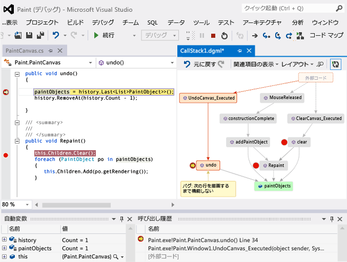

 参照トピック

- [ビデオ: は、コード マップ デバッガーの統合 (チャネル 9) で視覚的にデバッグします。](http://go.microsoft.com/fwlink/?LinkId=293418)

- [呼び出し履歴でマップします。](#MapStack)

- [コードに関するメモを作成します。](#MakeNotes)

- [次の呼び出し履歴でマップを更新](#UpdateMap)

- [マップに関連するコードを追加します。](#AddRelatedCode)

- [マップを使用してバグを見つける](#FindBugs)

- [Q &AMP; A](#QA)

  コマンドとコード マップを使用する場合に使用できる操作の詳細については、次を参照してください。[参照およびコード マップの再配置](../modeling/browse-and-rearrange-code-maps.md)します。

##   呼び出し履歴でマップします。

1.  デバッグを開始します。 (キーボード: **F5**)

2.  アプリが中断モードになるか、関数にステップ イン、選択**コード マップ**します。 (キーボード: **Ctrl** + **Shift** + **`**)

     

     現在の呼び出し履歴は新しいコード マップ上にオレンジ色で表示されます。

     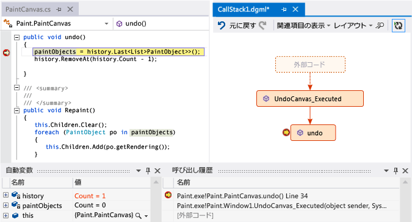

     デバッグを継続している間、マップは自動的に更新されます。 参照してください[次の呼び出し履歴でマップを更新](#UpdateMap)します。

##   コードに関するメモを作成します。
 コードで何が起こっているかを追跡するためにコメントを追加します。 コメントで新しい行を追加するキーを押して**shift + return**します。

 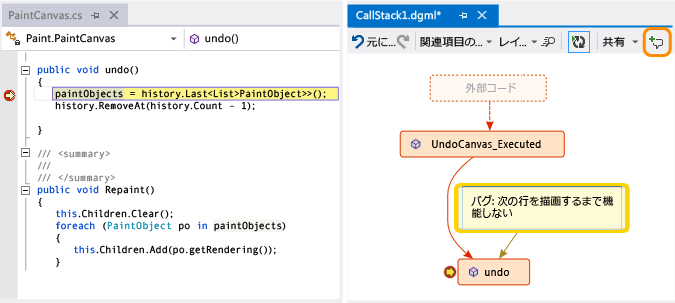

##   次の呼び出し履歴でマップを更新
 アプリを次のブレークポイントまで実行するか、関数にステップ インします。 マップに新しい呼び出し履歴が追加されます。

 ![[次へ] のコール スタックで更新プログラムのコード マップ](../debugger/media/debuggermap_addclearcallstack.png "DebuggerMap_AddClearCallStack")

##   マップに関連するコードを追加します。
 作成できたマップ - どのような横でしょうか。 Visual c# または Visual Basic で作業している場合は、フィールド、プロパティ、およびコードで何が起こっているかを追跡するために、他の方法などの項目を追加します。

 メソッドのコード定義を表示するには、そのメソッドをダブルクリックするか、そのメソッドのショートカット メニューを使用します。 (キーボード: マップとキーを押してでメソッドを選択**F12**)

 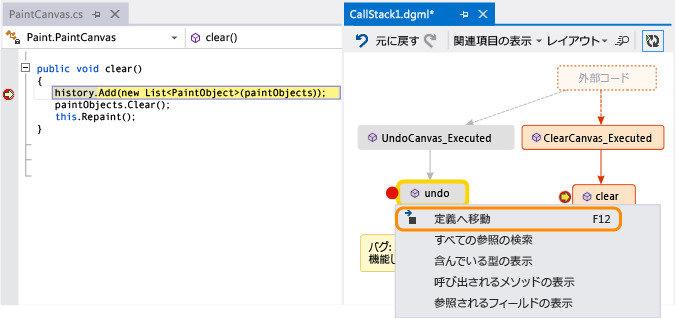

 マップで追跡する項目を追加します。

 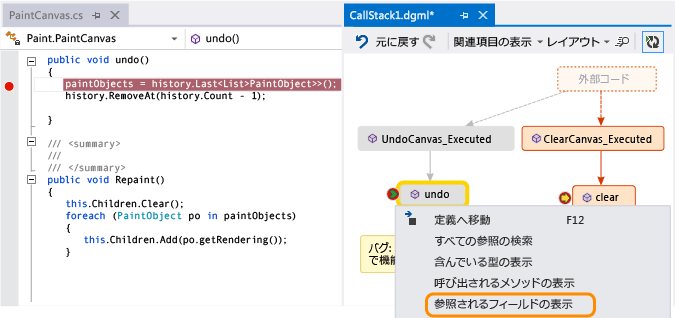

> [!NOTE]
>  既定では、マップに項目を追加すると、クラス、名前空間、アセンブリなどの親グループのノードも追加されます。 便利ですが、おくと、マップ単純な機能を使用してこの機能をオフに、**親を含める**マップのツールバー、またはキーを押してボタン**CTRL**項目を追加するとします。

 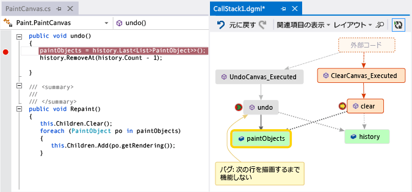

 ここでは、同じフィールドを使用するメソッドを簡単に表示できます。 追加された最新の項目は緑色で表示されます。

 コードのさらに多くの項目を表示するには、マップの作成を続けます。

 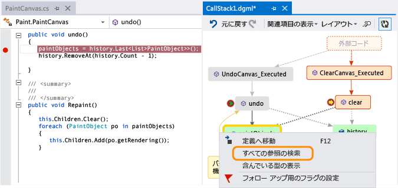

 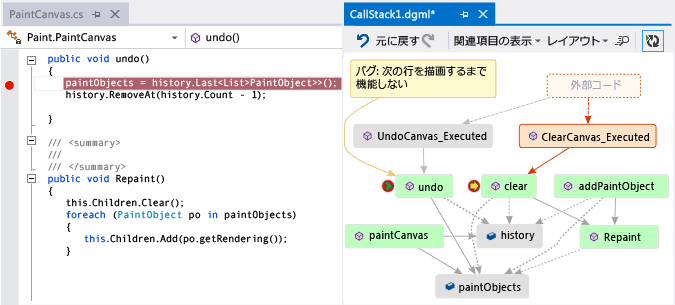

##   マップを使用してバグを見つける
 コードの視覚化はバグをよりすばやく見つけるために役立ちます。 たとえば、描画プログラムでバグを調査するいるとします。 直線を描画して元に戻そうとしても、別の直線を描画するまで何も起こりません。

 そのため、`clear`、`undo`、および `Repaint` メソッドにブレークポイントを設定し、デバッグを開始して、次のようなマップを作成します。

 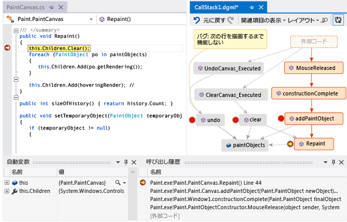

 マップ上のすべてのユーザー ジェスチャーが、`Repaint` を除いて、`undo` を呼び出していることがわかります。 これは、理由を説明することがあります`undo`すぐに機能しません。

 バグを修正してプログラムの実行を続けると、マップに `undo` から `Repaint` への新しい呼び出しが追加されます。

 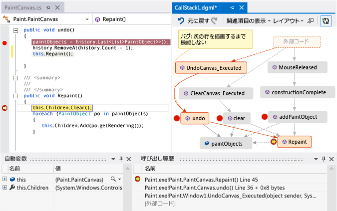

##   Q & A

- **すべての呼び出しは、マップに表示されます。その理由を教えてください。**

   既定では、ユーザー自身のコードだけがマップに表示されます。 外部コードを表示するで有効にする、**呼び出し履歴**ウィンドウ。

   

   オフにするか**マイ コードのみを有効にする**Visual studio のデバッグ オプション。

   ![[オプション] ダイアログを使用して外部コードの表示](../debugger/media/debuggermap_debugoptions.png "DebuggerMap_DebugOptions")

- **マップを変更するコードに影響しますか。**

   マップを変更すると、任意の方法でコードに影響しません。 マップでの名前変更、移動、削除は自由に行うことができます。

- **このメッセージの意味:「ダイアグラムは、コードの古いバージョンに基づく可能性があります」でしょうか。**

   マップを最後に更新してからコードが変更されている可能性があります。 たとえば、マップ上の呼び出しがコードに存在しなくなった可能性があります。 メッセージを閉じてから、マップを再び更新する前にソリューションをリビルドしてみます。

- **マップのレイアウトを制御する方法は?**

   開く、**レイアウト**マップのツールバー メニュー。

  -   既定のレイアウトを変更します。

  -   オフにする、マップを自動的に再配置を停止する**デバッグ時に自動レイアウト**します。

  -   項目を追加するときに、できるだけ少なくのマップを再配置、オフにする。**インクリメンタル レイアウト**します。

- **マップを他のユーザーと共有できますか。**

   マップをエクスポートし、Microsoft Outlook があれば、他のユーザーに送信できます。または、マップを独自のソリューションに保存し、Team Foundation バージョン管理にチェックインできます。

   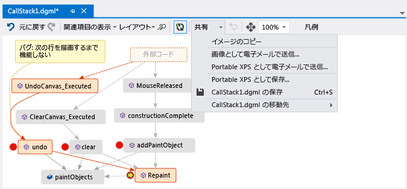

- **新しい呼び出し履歴を自動的に追加することから、マップを停止するにはどうすればよいですか。**

   選択マップのツールバー。 マップを現在の呼び出し履歴を手動で追加するには、キーを押して**Ctrl** + **Shift** + **`** します。

   デバッグ中に、マップ上の既存の呼び出し履歴を強調表示、マップが続行されます。

- **項目のアイコンと矢印の意味**

   項目に関する詳細情報を取得するには、上にマウス ポインターを移動し、項目のツールヒントを確認します。 検索することも、**凡例**に各アイコンの意味について説明します。

   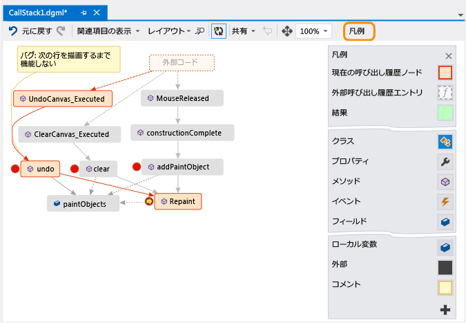

  参照トピック

- [呼び出し履歴でマップします。](#MapStack)

- [コードに関するメモを作成します。](#MakeNotes)

- [次の呼び出し履歴でマップを更新](#UpdateMap)

- [マップに関連するコードを追加します。](#AddRelatedCode)

- [マップを使用してバグを見つける](#FindBugs)

## 関連項目
 [ソリューション間の依存関係をマップする](../modeling/map-dependencies-across-your-solutions.md)[コード マップをアプリケーションのデバッグ](../modeling/use-code-maps-to-debug-your-applications.md)[検索潜在的な問題のコードを使用してマップ アナライザー](../modeling/find-potential-problems-using-code-map-analyzers.md) [参照およびコード マップの再配置](../modeling/browse-and-rearrange-code-maps.md)