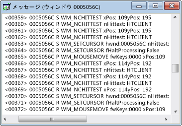

# メッセージ ビュー
各ウィンドウには、関連付けられたメッセージ ストリームがあります。 メッセージ ビュー ウィンドウでは、このメッセージ ストリームを表示します。 ウィンドウ ハンドル、メッセージ コード、およびメッセージが表示されます。 スレッドまたはプロセスにもメッセージ ビューを作成することができます。 これにより、特定のプロセスまたはスレッドはウィンドウの初期化メッセージをキャプチャするために特に便利ですが、所有するすべてのウィンドウに送信されるメッセージを表示できます。  
  
 一般的なメッセージ ビュー ウィンドウでは、以下が表示されます。 最初の列を含む、ウィンドウ ハンドルで、2 番目の列にはメッセージ コードが含まれています (「[メッセージ コード](../debugger/message-codes.md))。 デコードされたメッセージをパラメーターと戻り値が右にします。  
  
   
Spy++ メッセージ ビュー  
  
## 手順  
  
#### ウィンドウ、プロセス、またはスレッドのメッセージ ビューを開く  
  
1.  フォーカスを移動する、[ウィンドウ ビュー](../debugger/windows-view.md)、[プロセス ビュー](../debugger/processes-view.md)、または[スレッド ビュー](../debugger/threads-view.md)ウィンドウです。  
  
2.  確認するメッセージが含まれる項目のノードを検索し、それを選択します。  
  
3.  **スパイ**] メニューの [選択**ログ メッセージ**です。  
  
     [メッセージ オプション ダイアログ ボックス](../debugger/message-options-dialog-box.md)が開きます。  
  
4.  メッセージを表示するためのオプションを選択します。  
  
5.  キーを押して**OK**をメッセージのログ記録を開始します。  
  
     ビュー ウィンドウが開き、メッセージと**メッセージ**spy++ ツールバーにメニューが追加されます。 選択したオプションによっては、メッセージは、アクティブなメッセージ ビュー ウィンドウにストリーミングを開始します。  
  
6.  十分なメッセージを使用する場合は、選択**ログの停止**から、**メッセージ**メニュー。  
  
## このセクションの内容  
 [メッセージ ビューを制御します。](../debugger/how-to-control-messages-view.md)  
 メッセージ ビューを管理する方法について説明します。  
  
 [[検索] ウィンドウからメッセージ ビューを開く](../debugger/how-to-open-messages-view-from-find-window.md)  
 [ウィンドウ検索] ダイアログ ボックスからメッセージ ビューを開く方法について説明します。  
  
 [メッセージ ビューでメッセージの検索](../debugger/how-to-search-for-a-message-in-messages-view.md)  
 メッセージ ビューで、特定のメッセージを検索する方法について説明します。  
  
 [開始および停止メッセージ ログの表示](../debugger/how-to-start-and-stop-the-message-log-display.md)  
 起動し、メッセージのログ記録を停止する方法について説明します。  
  
 [メッセージ コード](../debugger/message-codes.md)  
 メッセージのメッセージ ビュー一覧のコードを定義します。  
  
 [メッセージのプロパティを表示します。](../debugger/how-to-display-message-properties.md)  
 詳細については、メッセージを表示する方法です。  
  
## 関連項目  
 [Spy++ ビュー](../debugger/spy-increment-views.md)  
 Windows、メッセージ、プロセス、およびスレッドの spy++ ツリー ビューについて説明します。  
  
 [Spy++ の使用](../debugger/using-spy-increment.md)  
 Spy++ ツールを紹介し、使用方法について説明します。  
  
 [[メッセージ オプション] ダイアログ ボックス](../debugger/message-options-dialog-box.md)  
 どのメッセージがアクティブなメッセージ ビューで一覧表示を選択するために使用します。  
  
 [[メッセージ検索] ダイアログ ボックス](../debugger/message-search-dialog-box.md)  
 メッセージ ビューで特定のメッセージのノードを検索するために使用します。  
  
 [[メッセージ プロパティ] ダイアログ ボックス](../debugger/message-properties-dialog-box.md)  
 メッセージ ビューで選択したメッセージのプロパティを表示するために使用します。  
  
 [Spy++ リファレンス](../debugger/spy-increment-reference.md)  
 各 spy++ メニューおよびダイアログ ボックスについて説明するセクションが含まれます。