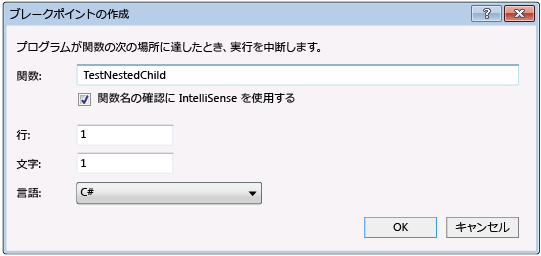

# <a name="navigate-through-code-with-the-visual-studio-debugger"></a>Visual Studio デバッガーでコード内を移動します。

Visual Studio デバッガーでは、アプリの状態を検査し、その実行フローを表示するコード内を移動できます。 キーボード ショートカット、デバッグ コマンド、ブレークポイント、およびその他の機能を使用するを簡単に確認するコードを取得します。 デバッガー ナビゲーション コマンドとショートカットの知識は、高速かつ簡単に見つけ、アプリの問題を解決します。  
  
## <a name="basic-debugging"></a>デバッグの基本  

アプリをアタッチされたデバッガーを開始するキーを押します**F5**を選択します**デバッグ** > **デバッグの開始**、または Visual Studio のツールバーで緑色の矢印を選択します。  
  
   
  
デバッグ中には、黄色の枠は、[次へ] を実行するコード行を示します。  
  
   
  
最もデバッガー ウィンドウのような**モジュール**と**ウォッチ**windows では、デバッガーが実行中にのみ使用可能な。 デバッガーで変数の値を表示するなどの機能の一部、**ローカル**ウィンドウまたはで式を評価、**ウォッチ**ウィンドウとも呼ばれる、ブレークポイントでデバッガーが一時停止中にのみ使用できます。*中断モード*します。 

中断モードでは、関数、変数、中にアプリの実行が中断され、オブジェクトはメモリに残ります。 要素の位置と状態を確認して違反やバグを確認することができます。 プロジェクトの種類によっては、中断モードでアプリの調整をこともできます。 これらの機能を示すビデオについては、次を参照してください。[デバッガーの概要](https://www.youtube.com/watch?v=FtGCi5j30YU&list=PLReL099Y5nRfw6VNvzMkv0sabT2crbSpK&index=6)します。

ソースまたはシンボルがないコードで中断するかどうか (*.pdb*) 読み込まれているファイル、デバッガーの表示、**ソース ファイルが見つかりません**または**シンボルが見つかりません**するのに役立つページ検索して、ファイルを読み込みます。 参照してください[シンボル (.pdb) ファイルとソース ファイルを指定](../debugger/specify-symbol-dot-pdb-and-source-files-in-the-visual-studio-debugger.md)します。 アセンブリ命令はデバッグできますシンボルやソース ファイルを読み込めない場合、**逆アセンブル**ウィンドウ。 

常に、先頭にアプリを起動してデバッグを開始する必要はありません。 押すことも**F11**に[コードにステップ イン](#BKMK_Step_into__over__or_out_of_the_code)、キーを押して**F10**に[ステップ オーバー](#BKMK_Step_over_Step_out)、または[特定の場所に実行または関数](#BKMK_Break_into_code_by_using_breakpoints_or_Break_All)します。    

##  <a name="step-through-code"></a>コードのステップ実行

デバッガー ステップのコマンドでは、アプリの状態を検査またはその実行フローの詳細を確認できます。 

アプリ内のエントリ ポイントを検索する必要がある場合で開始**F10**または**F11**します。  

### <a name="BKMK_Step_into__over__or_out_of_the_code"></a> 1 行ずつコードにステップ イン  

コードまたはデバッグ中のステートメントの行ごとに停止する**デバッグ** > **ステップ イン**、またはキーを押します**F11**します。  

コードのステートメント、物理行をデバッガーのステップします。 たとえば、`if`句は、1 つの行に記述することができます。  
  
  ```csharp  
  int x = 42;  
  string s = "Not answered";  
  if( int x == 42) s = "Answered!";  
  ```  
  
  ```vb  
  Dim x As Integer = 42  
  Dim s As String = "Not answered"  
  If x = 42 Then s = "Answered!"  
  ```  

ただし、この行にステップ インするときに、デバッガーは条件を 1 つのステップと別の結果として扱います。 前の例では、条件は true です。  
  
入れ子になった関数呼び出しの場合は、 **[ステップ イン]** をクリックすると、一番内側にある入れ子になった関数にステップ インします。 たとえば、**ステップ イン**のような呼び出しで`Func1(Func2())`、デバッガーが関数にステップ`Func2`。  

>[!TIP]
>その値を表示または使用する変数をポイントする各コード行を実行すると、[ローカル](autos-and-locals-windows.md)と[ウォッチ](watch-and-quickwatch-windows.md)の値の変化を監視する windows。 関数にステップ イン中に呼び出し履歴を視覚的にトレースできます。 参照してください[デバッグ中に呼び出し履歴に対するメソッドのマップ](../debugger/map-methods-on-the-call-stack-while-debugging-in-visual-studio.md)します。 

###  <a name="BKMK_Step_over_Step_out"></a> コードをステップ実行し、一部の関数をスキップ  

デバッグ中に、関数の詳細について配慮しませんかわかって、動作などのライブラリを十分にテストされたコード。 次のコマンドを使用して、コードをスキップすることができます。 関数がまだ実行しますが、デバッガーがスキップします。  
  
|キーボード コマンド|メニュー コマンドをデバッグします。|説明|  
|----------------------|------------------|-----------------|  
|**F10**|**[ステップ オーバー]**|現在の行には、関数の呼び出しが含まれている場合**ステップ オーバー**コードを実行し、コードの最初の行に、呼び出された関数で返された後に実行を中断します。|  
|**Shift** + **F11**|**[ステップ アウト]**|**ステップ アウト**コードの実行を継続し、現在の関数が戻るときに実行を中断します。 デバッガーは、現在の関数をスキップします。|  
  
##  <a name="BKMK_Break_into_code_by_using_breakpoints_or_Break_All"></a> 特定の場所または関数まで実行するには  

を検査するコードを正確にわかっている場合に、特定の位置または関数を直接実行することもできます。 またはデバッグを開始することがわかっています。  
  
### <a name="run-to-a-breakpoint-in-code"></a>コードのブレークポイントまでを実行します。  
  
コードで単純なブレークポイントを設定するには、実行を中断するコードの行の横にある左端の余白をクリックします。 キーを押して、行を選択することも**F9**を選択します**デバッグ** > **ブレークポイントの切り替え**、または右クリックし、選択**ブレークポイント** > **ブレークポイントの挿入**します。 コード行の横にある左余白に赤い点として、ブレークポイントが表示されます。 デバッガーでは、行が実行する前に、実行が中断します。
  
  
  
Visual Studio でのブレークポイントには、条件付きブレークポイントやトレースポイントなど、さまざまな追加の機能が用意されています。 詳細については、次を参照してください。[ブレークポイントを使用して](../debugger/using-breakpoints.md)します。  
  
### <a name="run-to-a-function-breakpoint"></a>関数のブレークポイントまでを実行します。  

指定された関数に達するまでを実行するデバッガーを設定できます。 関数を指定するには、名前で、または呼び出し履歴から選択することができます。  
  
**名前によって関数のブレークポイントを指定するには**

1. 選択**デバッグ** > **新しいブレークポイント** > **関数のブレークポイント**
   
1. **新しい関数のブレークポイント**ダイアログ ボックスで、関数の名前を入力し、言語を選択します。
   
     
   
1. **[OK]** を選択します。 

関数がオーバー ロードするか、1 つ以上の名前空間内で目的の 1 つを選択できる場合、**ブレークポイント**ウィンドウ。  

  
  
**呼び出し履歴から関数のブレークポイントを選択するには** 
  
1. デバッグ中に、開く、**呼び出し履歴**ウィンドウを選択して**デバッグ** > **Windows** > **呼び出し履歴**します。 
   
1. **呼び出し履歴**ウィンドウでは、関数を右クリックし、選択**カーソルまで実行**、またはキーを押します**Ctrl**+**F10**します。  

呼び出し履歴を視覚的にトレースするには、次を参照してください。[デバッグ中に呼び出し履歴に対するメソッドのマップ](../debugger/map-methods-on-the-call-stack-while-debugging-in-visual-studio.md)します。  
  
### <a name="run-to-a-cursor-location"></a>カーソル位置までを実行するには  

ソース コード内のカーソル位置まで実行する、または**呼び出し履歴**ウィンドウで、ブレークポイントを右クリックし、選択する行を選択します**カーソルまで実行**、またはキーを押します**Ctrl** 。+**F10**します。 選択**カーソルまで実行**は一時的なブレークポイントの設定に似ています。

### <a name="run-to-click"></a>[Run To Click (クリックで実行)] 

ソース コード内のステートメントをポイントすると、デバッガーで一時停止中、または**逆アセンブル**ウィンドウ、および選択、**ここまで実行**緑色の矢印アイコン。 使用して**クリックで実行**一時的なブレークポイントを設定する必要がなくなります。

 

> [!NOTE]
> **クリックで実行**新[!include[vs_dev15](../misc/includes/vs_dev15_md.md)]します。
  
### <a name="manually-break-into-code"></a>コードを手動で中断する  
  
を実行中のアプリのコードの使用可能な次の行で解除する選択**デバッグ** > **すべて中断**、またはキーを押します**Ctrl**+**Alt** +**中断**します。 
  
##  <a name="BKMK_Set_the_next_statement_to_execute"></a> 実行フローを変更するポインターを移動します。  

デバッガーが一時停止中にソース コードのマージンに黄色の矢印または**逆アセンブル**ウィンドウが実行される次のステートメントの位置を示します。 この矢印を移動して実行する次のステートメントを変更することができます。 コードの部分をスキップまたは前の行を返すことができます。 ポインターを移動することは、既知のバグを含むコードのセクションをスキップするなどの場合に便利です。  

 
  
実行する次のステートメントを変更するに、デバッガーは、中断モードである必要があります。 ソース コードまたは**逆アセンブリ**ウィンドウで、別の行に黄色の矢印をドラッグします。 または次に実行を選択する行を右クリック**次のステートメントの設定**します。 

プログラム カウンターは、ポイントは実行されず、新旧の実行の間で、新しい場所、および手順に直接ジャンプします。 ただし、実行ポイントを後方に移動する場合、介在する指示が元に戻すされません。  

>[!CAUTION]
>- 次に実行するステートメントを別の関数やスコープに移動すると、一般に呼び出し履歴が破損し、実行時エラーや例外が発生する原因になります。 次に実行するステートメントを別のスコープに移動しようとすると、デバッガーの警告ダイアログ ボックスが表示され、操作をキャンセルできます。 
>- Visual Basic では、次に実行するステートメントを別のスコープや関数に移動できません。  
>- ネイティブ C++ でランタイム チェックを有効にしている場合、次に実行されるステートメントを設定すると、実行がメソッドの最後に到達したときに例外がスローされる可能性があります。  
>- エディット コンティニュが有効になっている場合、エディット コンティニュが即座にマップし直すことができない編集が行われると、 **[次のステートメントの設定]** でエラーが発生します。 これは、たとえば、catch ブロック内でコードを編集している場合に発生します。 この場合は、操作がサポートされていないことを知らせるエラー メッセージが表示します。  
>- 場合は、マネージ コードで、次のステートメントを移動できません。  
>   - 次のステートメントが現在のステートメントとは別のメソッドに含まれている場合。  
>   - ジャスト イン タイムで開始されたデバッグ デバッグします。  
>   - 呼び出しスタックのアンワインドが進行中です。  
>   - System.StackOverflowException 例外または System.Threading.ThreadAbortException 例外がスローされた場合。  
  
## <a name="BKMK_Restrict_stepping_to_Just_My_Code"></a>非ユーザー コードをデバッグします。  

既定では、デバッガーがという設定を有効にすると、アプリのコードのみをデバッグしよう*マイ コードのみ*します。 別のプロジェクトの種類と言語、この機能のしくみし、カスタマイズ方法の詳細については、次を参照してください。[マイ コードのみ](../debugger/just-my-code.md)します。 

見るとフレームワーク コードやサード パーティ製のライブラリ コードは、システム コールのデバッグ中に、マイ コードのみを無効にできます。 **ツール**(または**デバッグ**) >**オプション** > **デバッグ**チェック ボックスをオフ、**を有効にする マイ コードのみ**チェック ボックスをオンします。 マイ コードのみが無効になっているし、デバッガー ウィンドウで非ユーザー コードが表示されます、デバッガーが非ユーザー コードにステップ インできます。  

> [!NOTE]
> "マイ コードのみ" デバッグは、デバイス プロジェクトではサポートされません。  
  
### <a name="debug-system-code"></a>システム コードをデバッグします。

Microsoft のシステム コードのデバッグ シンボルが読み込まれて、マイ コードのみを無効にしている場合、他の呼び出しと同様にシステム コールにステップできます。  
  
Microsoft のシンボルを読み込むには、次を参照してください。[シンボルの場所を構成し、オプションの読み込み](specify-symbol-dot-pdb-and-source-files-in-the-visual-studio-debugger.md#configure-symbol-locations-and-loading-options)します。  
  
**特定のシステム コンポーネントのシンボルを読み込めません。**

1. デバッグ中には、開く、**モジュール**ウィンドウを選択して**デバッグ** > **Windows** > **モジュール**、キーを押して**Ctrl**+**Alt**+**U**します。  
  
1. **モジュール**ウィンドウで、ことがわかりますモジュールに読み込まれたシンボルがある、**シンボルの状態**列。 シンボルを読み込むし、選択するモジュールを右クリックして**シンボルの読み込み**します。  
  
##  <a name="BKMK_Step_into_properties_and_operators_in_managed_code"></a> マネージド コード内のプロパティと演算子にステップ インする  
 既定で、デバッガーをステップ オーバー プロパティおよび演算子ではマネージ コードです。 通常のプロパティおよび演算子をステップ実行デバッグ エクスペリエンスの向上を提供します。 プロパティと演算子にステップ インを有効にする**ツール**(または**デバッグ**) >**オプション** > **デバッグ** > **全般**チェック ボックスをオフ、**プロパティおよび演算子 (マネージドのみ) をステップ オーバー**チェック ボックスをオンします。