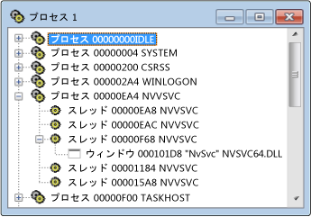

# プロセス ビュー
プロセス ビューには、システム上のすべてのアクティブなプロセスのツリーが表示されます。 プロセス ID とモジュール名が表示されます。 通常、実行中のプログラムに対応する特定のシステム プロセスを確認する場合は、プロセス ビューを使用します。 プロセスが、モジュール名で識別されるか、「システム プロセス」を指定します。  
  
 Microsoft Windows では、複数のプロセスをサポートします。 各プロセスは、1 つまたは複数のスレッドを持つことができ、各スレッドは 1 つを持つことができます。 または最上位のウィンドウが関連付けられている詳細します。 各トップレベル ウィンドウには、一連のウィンドウを所有できます。 A + 記号は、レベルが折りたたまれていることを示します。 折りたたまれたビューは、プロセスごとに 1 行で構成されます。 クリックして、+ 記号をレベルを展開します。  
  
 通常、実行中のプログラムに対応する特定のシステム プロセスを確認する場合は、プロセス ビューを使用します。 プロセスが、モジュール名で識別されるか、「システム プロセス」を指定します。 プロセスを検索するには、ツリーを折りたたむし、一覧を検索します。  
  
## 手順  
  
#### プロセス ビューを開く  
  
1.  **スパイ**] メニューの [選択**プロセス**です。  
  
   
Spy++ プロセス ビュー  
  
 上記の図は、展開プロセスとスレッドのノードを持つプロセス ビューを示しています。  
  
### このセクションの内容  
 [[プロセス] ビューでのプロセスの検索](../debugger/how-to-search-for-a-process-in-processes-view.md)  
 [プロセス] ビューで特定のプロセスを検索する方法について説明します。  
  
 [プロセスのプロパティを表示します。](../debugger/how-to-display-process-properties.md)  
 詳細については、メッセージを表示する方法について説明します。  
  
### 関連項目  
 [Spy++ ビュー](../debugger/spy-increment-views.md)  
 Windows、メッセージ、プロセス、およびスレッドの spy++ ツリー ビューについて説明します。  
  
 [Spy++ の使用](../debugger/using-spy-increment.md)  
 Spy++ ツールを紹介し、使用方法について説明します。  
  
 [[プロセス検索] ダイアログ ボックス](../debugger/process-search-dialog-box.md)  
 [プロセス] ビューで特定のプロセスのノードを検索するために使用します。  
  
 [[プロセス プロパティ] ダイアログ ボックス](../debugger/process-properties-dialog-box.md)  
 [プロセス] ビューで選択したプロセスのプロパティを表示します。  
  
 [Spy++ リファレンス](../debugger/spy-increment-reference.md)  
 各 spy++ メニューおよびダイアログ ボックスについて説明するセクションが含まれます。