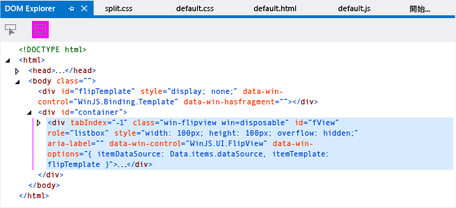
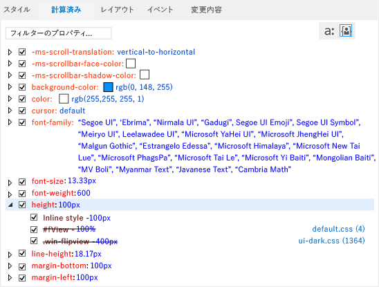

# <a name="debug-html-and-css-in-uwp-apps-in-visual-studio"></a>Visual Studio で UWP アプリの HTML および CSS をデバッグします。
  
 Visual Studio では、JavaScript アプリに総合的なデバッグ機能が用意されており、Internet Explorer および Visual Studio の開発者には使い慣れた機能が含まれています。 これらの機能は、および Apache Cordova の Visual Studio Tools を使用して作成されたアプリの UWP アプリ用にサポートされます。  
  
 DOM 検査ツールが提供する対話式のデバッグ モデルを使用すると、レンダリングされる HTML および CSS のコードを表示および変更できます。 これらはすべてデバッガーを停止して再起動することなく実行できます。
  
 その他の JavaScript のデバッグ、JavaScript コンソール ウィンドウを使用して、ブレークポイントの設定などの機能の詳細についてを参照してください。[クイック スタート。JavaScript のデバッグ](../debugger/quickstart-debug-javascript-using-the-console.md)と[Visual Studio でアプリをデバッグ](/visualstudio/debugger/debugging-windows-store-and-windows-universal-apps)します。  
  
##  <a name="InspectingDOM"></a> ライブ DOM の検査  
 DOM Explorer ではレンダリングされるページのビューが示され、DOM Explorer を使用すると値を変更して結果をすぐに確認できます。 これにより、デバッガーを停止して再起動することなく変更をテストできます。 この方法でページと対話するときはプロジェクトのソース コードは変更されないので、必要なコード修正が見つかったら、ソース コードを変更します。  
  
> [!TIP]
>  ソース コードを変更する際、デバッガーの停止や再起動を避けるために、[デバッグ] ツール バーの **[Windows アプリケーションの更新]** ボタンを使用して (または F4 キーを押して) アプリケーションを更新できます。 詳細については、次を参照してください。[アプリの更新 (JavaScript)](../debugger/refresh-an-app-javascript.md)します。  
  
 DOM Explorer を使用すると次のことができます。  
  
- DOM 要素のサブツリー内を移動し、レンダリングされる HTML、CSS、および JavaScript コードを調査します。  
  
- レンダリングされる要素の属性および CSS スタイルを動的に編集し、結果をすぐに確認します。  
  
- CSS スタイルがページ要素に適用される方法を調査し、適用されたルールをトレースします。  
  
  アプリケーションをデバッグするときは、しばしば DOM Explorer で要素を選択する必要があります。 要素を選択すると、DOM Explorer の右側のタブに表示される値が、DOM Explorer での要素の選択を反映して自動的に更新されます。 これは、ようなタブ。**スタイル**、**計算**、**レイアウト**します。 UWP アプリをサポートしても、**イベント**と**変更**タブ。 要素の選択の詳細については、「 [Selecting elements](#SelectingElements)」を参照してください。  
  
> [!TIP]
>  閉じた DOM Explorer ウィンドウを再び開くには、 **[デバッグ]**>**[ウィンドウ]** > **[DOM Explorer]** の順に選びます。 このウィンドウは、スクリプトのデバッグ セッション中にのみ表示されます。  
  
 次の手順では、DOM Explorer を使用してアプリを対話的にデバッグするプロセスを実行します。 `FlipView` コントロールを使用するアプリケーションを作成した後、それをデバッグします。 アプリケーションには複数のエラーが含まれています。  
  
> [!WARNING]
>  次のサンプル アプリは、UWP アプリです。 Cordova でも同じ機能がサポートされていますが、アプリは異なります。  
  
#### <a name="to-debug-by-inspecting-the-live-dom"></a>次の方法で、ライブ DOM を検査することによってデバッグします。  
  
1. Visual Studio で **[ファイル]** > **[新しいプロジェクト]**」を参照してください。  
  
2. 選択**JavaScript** > **Windows ユニバーサル**を選び、 **WinJS アプリ**します。  
  
3. `FlipViewApp`などのプロジェクトの名前を入力し、 **[OK]** を選んでアプリを作成します。  
  
4. Index.html の BODY 要素では、このコードを追加します。  
  
   ```html  
   <div id="flipTemplate" data-win-control="WinJS.Binding.Template"  
            style="display:none">  
       <div class="fixedItem" >  
             
       </div>  
   </div>  
   <div id="fView" style="width:100px;height:100px"  
       data-win-control="WinJS.UI.FlipView" data-win-options="{  
       itemDataSource: Data.items.dataSource, itemTemplate: flipTemplate }">  
   </div>  
   ```  
  
5. default.css を開き、次の CSS を追加します。  
  
   ```css  
   #fView {  
       background-color:#0094ff;  
       height: 100%;  
       width: 100%;  
       margin: 25%;  
   }  
   ```  
  
6. default.js のコードを、次のコードに置き換えます。  
  
   ```javascript  
   (function () {  
       "use strict";  
  
       var app = WinJS.Application;  
       var activation = Windows.ApplicationModel.Activation;  
  
       var myData = [];  
       for (var x = 0; x < 4; x++) {  
           myData[x] = { flipImg: "/images/logo.png" }  
       };  
  
       var pages = new WinJS.Binding.List(myData, { proxy: true });  
  
       app.onactivated = function (args) {  
           if (args.detail.kind === activation.ActivationKind.launch) {  
               if (args.detail.previousExecutionState !==  
               activation.ApplicationExecutionState.terminated) {  
                   // TODO: . . .  
               } else {  
                   // TODO: . . .  
               }  
               args.setPromise(WinJS.UI.processAll());  
  
               updateImages();  
           }  
       };  
  
       function updateImages() {  
  
           pages.setAt(0, { flipImg: "http://public-domain-photos.com/free-stock-photos-1/flowers/cactus-76.jpg" });  
           pages.setAt(1, { flipImg: "http://public-domain-photos.com/free-stock-photos-1/flowers/cactus-77.jpg" });  
           pages.setAt(2, { flipImg: "http://public-domain-photos.com/free-stock-photos-1/flowers/cactus-78.jpg" });  
       };  
  
       app.oncheckpoint = function (args) {  
       };  
  
       app.start();  
  
       var publicMembers = {  
           items: pages  
       };  
  
       WinJS.Namespace.define("Data", publicMembers);  
  
   })();  
   ```  
  
    次の図は、このアプリで実行するを示します。 ただし、アプリをこの状態にするには、まず、多数のバグを修正する必要があります。  
  
      
  
7. 選択**ローカル マシン**横にドロップダウン リストからリスト、**デバッグの開始**のボタンでは、**デバッグ**ツールバー。  
  
      
  
8.  **[デバッグ]** > **Start [デバッグ]ging**の順にクリックするか、F5 キーを押して、デバッグ モードでアプリを実行します。  
  
    アプリが実行されますが、スタイル、いくつかのバグのあるため、ほとんど空の画面が表示されます。 最初の `FlipView` のイメージが、画面の中央の小さい四角形に表示されます。  
  
9. Visual Studio に切り替え、 **[DOM Explorer]** タブをクリックします。  
  
   > [!TIP]
   >  Alt + Tab キーまたは F12 キーを押すと、Visual Studio と実行中のアプリを切り替えることができます。  
  
10. DOM Explorer ウィンドウで、ID が `"fView"`であるセクションの DIV 要素を選択します。 方向キーを使用して、正しい DIV 要素を表示して選択します。 (右方向キーを使うと、要素の子を表示することができます。)  
  
       
  
    > [!TIP]
    >  また、>> 入力プロンプトで `select(fView)` を入力して Enter キーを押すと、JavaScript コンソール ウィンドウの左下隅の DIV 要素を選べます。  
  
     DOM Explorer ウィンドウの右側のタブに表示される値が、DOM Explorer での現在の要素選択を反映して自動的に更新されます。  
  
11. 右側の **[計算済み]** タブをクリックします。  
  
     このタブは、選択した DOM 要素の各プロパティの、計算済みまたは最終の値を示します。  
  
12. 高さの CSS 規則を開きます。 インライン スタイルが 100px に設定されており、`#fView` CSS セレクターで 100% に設定されている高さの値と矛盾しているように見えることに注意してください。 `#fView` セレクターの取り消し線テキストは、インライン スタイルがこのスタイルよりも優先されることを示しています。  
  
     **[計算済み]** タブを次の図に示します。  
  
       
  
13. DOM Explorer のメイン ウィンドウで、 `fView` DIV 要素の高さと幅のインライン スタイルをダブルクリックします。 ここで値を編集することができます。 このシナリオでは、これらを完全に削除する必要があります。  
  
14. メイン ウィンドウでダブルクリック`width: 100px;height: 100px;`、キーを押して、**削除**キーを押します **」と入力**。 Enter を押すと、新しい値はすぐに反映されますアプリでは、デバッグ セッションを停止していますが。  
  
    > [!IMPORTANT]
    >  DOM Explorer ウィンドウで属性を更新できるように、 **[スタイル]**、 **[計算済み]**、 **[レイアウト]** の各タブに表示される値も更新できます。 詳細については、次を参照してください。 [DOM Explorer を使用してデバッグの CSS スタイル](../debugger/debug-css-styles-using-dom-explorer.md)と[DOM Explorer を使用してデバッグ レイアウト](../debugger/debug-layout-using-dom-explorer.md)します。  
  
15. これを選択するか、Alt キーを押しながら Tab キーを使用して、アプリケーションに切り替えます。  
  
     これで、 `FlipView` コントロールがシミュレーターまたは Phone エミュレーターの画面を超えるサイズで表示されます。 これは意図した結果ではありません。 Visual Studio に戻って、調査します。  
  
16. DOM Explorer で、 **[計算済み]** タブを再度クリックし、高さの規則を開きます。 FView 要素は 100% の値を CSS から予想されるように示したままですが、計算値は、アプリの画面の高さと等しく (たとえば、800 px 667.67 px、またはその他の値)、避けるべきですこのアプリであります。 幅と高さを削除しましたを調べるには、次の手順で、 `fView` DIV 要素です。  
  
17. **[スタイル]** タブで、 `#fView` CSS セレクターの高さと幅のプロパティのチェックボックスをオフにします。  
  
     **[計算済み]** タブでは、高さは 400px と表示されています。 これによると、この値が、プラットフォーム CSS ファイルである ui-dark.css で指定された .win-flipview セレクターによるものであることを示しています。  
  
18. アプリケーションに切り替えます。  
  
     これで状況は改善されました。 しかし、なお修正する必要がある問題があります。それは余白が大きすぎることです。  
  
19. 調査のため、Visual Studio に切り替え、**[レイアウト]** タブを選び、要素のボックス モデルを確認します。  
  
     **レイアウト** タブで、次を確認します。  
  
    - 255px (オフセット) および 255px (余白) またはデバイスの解像度によって、同様の値。 
  
      次の図は、どのように**レイアウト** タブでは、100 px オフセットおよび余白でエミュレーターを使用している場合は次になります)。  
  
      ![DOM Explorer の [レイアウト] タブ](../debugger/media/js_dom_explorer_layout.png "JS_DOM_Explorer_Layout")  
  
      これは正しくありません。 **[計算済み]** タブでも、同じ余白の値が表示されます。  
  
20. **[スタイル]** タブをクリックし、 `#fView` CSS セレクターを検索します。 ここでは、 **"余白"** プロパティに 25% の値が表示されます。  
  
21. 25% を選択して、それを 25px に変更し、Enter キーを押します。  
  
22. また、 **[スタイル]** タブで .win-flipview セレクターの高さの規則をクリックして、400px を 500px に変更し、Enter キーを押します。  
  
23. アプリケーションに戻ると、要素の配置が正しい状態で表示されます。 デバッガーを停止したり再起動したりせずに、ソースを修正してアプリケーションを再表示するには、次の手順を参照してください。  
  
#### <a name="to-refresh-your-app-while-debugging"></a>デバッグ中にアプリを更新するには  
  
1.  アプリケーションがまだ実行している間に、Visual Studio に切り替えます。  
  
2.  default.html を開き、 `"fView"` DIV 要素の高さと幅を 100% に変更して、ソース コードを変更します。  
  
3.  [デバッグ] ツール バーの **[Windows アプリケーションの更新]** ボタンをクリックします (または、F4 キーを押します)。 このボタンは次のように表示されます。します。  
  
     アプリのページが再読み込みされ、シミュレーターまたは Phone エミュレーターが前面に戻ります。  
  
     更新機能に関する詳細については、次を参照してください。[アプリの更新 (JavaScript)](../debugger/refresh-an-app-javascript.md)します。  
  
##  <a name="SelectingElements"></a> Selecting elements  
 アプリケーションをデバッグするときに、次の 3 種類の方法で DOM 要素を選択できます。  
  
- 直接 DOM エクスプローラー ウィンドウの要素をクリックする (または方向キーを使用)。  
  
- **[要素の選択]** ボタン (Ctrl + B キー) を使用する。  
  
- 使用して、`select`は 1 つのコマンドの[JavaScript Console commands](../debugger/javascript-console-commands.md)します。  
  
  DOM Explorer のウィンドウを使用して要素を選択するときに、要素にマウス ポインターを置くと、対応する要素が実行しているアプリで強調表示されます。 これを行うには、DOM Explorer の要素をクリックして選択する必要があります。または、方向キーを使用して、要素を強調表示して選択できます。 **[要素の選択]** ボタンを使用して DOM Explorer の要素を選択することもできます。 次の図は、 **[要素の選択]** ボタンを示しています。  
  
    
  
  **[要素の選択]** をクリックする (または Ctrl + B キーを押す) と、実行しているアプリの項目をクリックすることにより、DOM Explorer で項目を選択できるように選択モードが変更されます。 1 回クリックすると、通常の選択モードに戻ります。 **[要素の選択]** をクリックすると、アプリが前面に表示され、カーソルが新しい選択モードを反映した形状に変わります。 アウトラインが表示された要素をクリックすると、DOM Explorer が前面に戻り、指定した要素が選択されています。  
  
  **[要素の選択]** をクリックする前に、 **[Display web page highlights] (Web ページの強調表示を表示)** を切り替えて実行しているアプリの要素を強調表示するかどうかを指定できます。 次の図は、このボタンを示しています。 強調表示は、既定で表示されます。  
  
    
  
  強調表示する要素を選択する場合、シミュレーターでマウス ポインターを置く要素が強調表示されます。 強調表示された要素の色は、DOM Explorer の **[レイアウト]** タブに表示されるボックス モデルと一致します。  
  
> [!NOTE]
>  Windows Phone エミュレーターは、マウス ポインターを置くことによる要素の強調表示を部分的にサポートします。  
  
## <a name="see-also"></a>「  
 [Debug apps in Visual Studio](/visualstudio/debugger/debugging-windows-store-and-windows-universal-apps)   
 [アプリの更新 (JavaScript)](../debugger/refresh-an-app-javascript.md)   
 [WebView コントロールのデバッグ](../debugger/debug-a-webview-control.md)   
 [キーボード ショートカット](../debugger/keyboard-shortcuts-html-and-javascript.md)   
 [JavaScript Console commands](../debugger/javascript-console-commands.md)   
 [HTML、CSS、および JavaScript サンプル コードのデバッグ](../debugger/debug-html-css-and-javascript-sample-code.md)   
 [製品のサポートとユーザー補助](https://msdn.microsoft.com/library/tzbxw1af(VS.120).aspx)