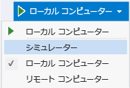
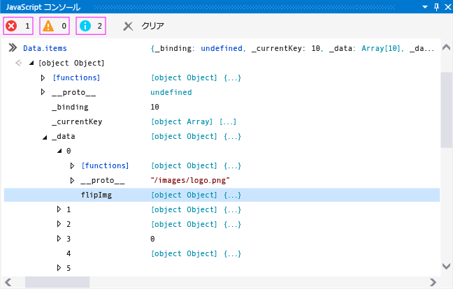

# <a name="quickstart-debug-javascript-using-the-console"></a>クイックスタート: コンソールを使用した JavaScript のデバッグ
  
  
 JavaScript コンソール ウィンドウは、JavaScript を使用して構築された UWP アプリのデバッグを対話的に使用できます。 これらの機能はサポートされて[!INCLUDE[win8_appname_long](../debugger/includes/win8_appname_long_md.md)]アプリ、Windows Phone アプリ、および Apache Cordova の Visual Studio Tools を使用して作成されたアプリ。 コンソール コマンドのリファレンスの詳細については、「 [JavaScript Console commands](../debugger/javascript-console-commands.md)」を参照してください。  
  
 JavaScript コンソール ウィンドウを使うと次の作業ができます。  
  
-   アプリから、オブジェクト、値、メッセージをコンソール ウィンドウへ送信します。  
  
-   実行中のアプリのローカル変数とグローバル変数の値の表示と修正を行います。  
  
-   オブジェクトのビジュアライザーを表示します。  
  
-   現在のスクリプト コンテキスト内で実行される JavaScript コードを実行します。  
  
-   ドキュメント オブジェクト モデル (DOM) と Windows ランタイムの例外に加えて、JavaScript のエラーと例外も表示されます。  
  
-   画面のクリアなどの他のタスクを実行します。 コマンドの詳細については、「 [JavaScript Console commands](../debugger/javascript-console-commands.md) 」を参照してください。  
  
 このトピックの内容:  
  
-   [JavaScript コンソール ウィンドウを使用したデバッグ](#InteractiveConsole)  
  
-   [対話形式のデバッグと中断モード](#InteractiveDebuggingBreakMode)  
  
-   [JavaScript コンソール ウィンドウの単一行モードと複数行モード](#SinglelineMultilineMode)  
  
-   [スクリプトの実行コンテキストの切り替え](#Switching)  
  
> [!TIP]
>  閉じた JavaScript コンソール ウィンドウを再び開くには、 **[デバッグ]**>**[ウィンドウ]** > **JavaScript コンソール** の順に選びます。 このウィンドウは、スクリプトのデバッグ セッション中にのみ表示されます。  
  
 JavaScript コンソール ウィンドウを使用すると、デバッガーを停止/再起動することなくアプリと対話することができます。 詳細については、次を参照してください。[アプリを更新する (JavaScript)](../debugger/refresh-an-app-javascript.md)です。 他の JavaScript のデバッグ、DOM Explorer を使用して、ブレークポイントの設定などの機能の詳細については「[クイック スタート: デバッグ HTML および CSS](../debugger/quickstart-debug-html-and-css.md)と[Visual Studio でアプリのデバッグ](../debugger/debug-store-apps-in-visual-studio.md)です。  
  
##  <a name="InteractiveConsole"></a> JavaScript コンソール ウィンドウを使用したデバッグ  
 次の手順では、 `FlipView` アプリを作成し、JavaScript のコード エラーを対話的にデバッグする方法を示します。  
  
> [!CAUTION]
>  このサンプル アプリは、UWP アプリです。 ただし、ここで説明するコンソール機能は、Visual Studio Tools for Apache Cordova を使用して作成されたアプリにも適用されます。  
  
#### <a name="to-debug-javascript-code-in-the-flipview-app"></a>FlipView アプリの JavaScript コードをデバッグするには  
  
1.  Visual Studio で **[ファイル]** > **[新しいプロジェクト]**」を参照してください。  
  
2.  選択**JavaScript** > **ストア アプリ**、いずれかを選択**Windows アプリ**または**Windows Phone アプリ**をクリックして**空のアプリ**です。  
  
3.  `FlipViewApp`などのプロジェクトの名前を入力し、 **[OK]** を選んでアプリを作成します。  
  
4.  default.html の BODY 要素で、既存の HTML コードを次のコードで置き換えます。  
  
    ```html  
    <div id="flipTemplate" data-win-control="WinJS.Binding.Template"  
             style="display:none">  
        <div class="fixedItem" >  
              
        </div>  
    </div>  
    <div id="fView" data-win-control="WinJS.UI.FlipView" data-win-options="{  
        itemDataSource: Data.items.dataSource, itemTemplate: flipTemplate }">  
    </div>  
    ```  
  
5.  default.css を開き、次の `#fView` セレクターの CSS を追加します。  
  
    ```css  
    #fView {  
        background-color:#0094ff;  
        height: 500px;  
        margin: 25px;  
    }  
    ```  
  
6.  default.js を開き、コードを次の JavaScript コードで置き換えます。  
  
    ```javascript  
    (function () {  
        "use strict";  
  
        var app = WinJS.Application;  
        var activation = Windows.ApplicationModel.Activation;  
  
        var myData = [];  
        for (var x = 0; x < 4; x++) {  
            myData[x] = { flipImg: "/images/logo.png" }  
        };  
  
        var pages = new WinJS.Binding.List(myData, { proxy: true });  
  
        app.onactivated = function (args) {  
            if (args.detail.kind === activation.ActivationKind.launch) {  
                if (args.detail.previousExecutionState !==  
                activation.ApplicationExecutionState.terminated) {  
                    // TODO: . . .  
                } else {  
                    // TODO: . . .  
                }  
                args.setPromise(WinJS.UI.processAll());  
  
                updateImages();  
            }  
        };  
  
        function updateImages() {  
  
            pages.push(0, { flipImg: "http://go.microsoft.com/fwlink/?LinkID=223195" });  
            pages.push(1, { flipImg: "http://go.microsoft.com/fwlink/?LinkID=223196" });  
            pages.push(2, { flipImg: "http://go.microsoft.com/fwlink/?LinkID=223197" });  
  
        };  
  
        app.oncheckpoint = function (args) {  
        };  
  
        app.start();  
  
        var publicMembers = {  
            items: pages  
        };  
  
        WinJS.Namespace.define("Data", publicMembers);  
  
    })();  
    ```  
  
7.  デバッグ対象がまだ選択されていない場合は、 **[シミュレーター]** をクリックします。または、Windows Phone 用の場合は、 **[デバッグ]** ツール バーの **[デバイス]** ボタンの横にあるドロップダウン リストの **[エミュレーター 8.1 WVGA 4 インチ 512 MB]** をクリックします。  
  
       
  
8.  F5 キーを押して、デバッガーを開始します。  
  
     アプリが実行されますが、イメージがありません。 JavaScript コンソール ウィンドウの APPHOST のエラーは、イメージがないことを示します。  
  
9. `FlipView`アプリがシミュレーターまたは Phone エミュレーター、型で実行されている`Data.items`コンソール ウィンドウの入力プロンプト (横に、">>"シンボル) し、Enter キーを押します。  
  
     `items` オブジェクトのビジュアライザーがコンソール ウィンドウに表示されます。 これは、 `items` オブジェクトがインスタンス化されて、現在のスクリプト コンテキストで使用できることを示します。 コンソール ウィンドウでは、オブジェクトのノードをクリックしてプロパティの値を表示できます (方向キーを使用します)。 `items._data` オブジェクトをクリックすると、次の図に示すように、イメージ ソースの参照が正しくないことがわかります。 既定のイメージ (logo.png) がまだオブジェクト内に存在し、不明のイメージと予期されるイメージが混在しています。  
  
       
  
     `items._data` オブジェクトには、想像より多くの項目があることにも注意してください。  
  
10. プロンプトで `Data.items.push` を入力し、Enter キーを押します。 コンソール ウィンドウは `push` のプロジェクト ファイルで実装される [!INCLUDE[winjs_long](../debugger/includes/winjs_long_md.md)] 関数のビジュアライザーを示します。 このアプリでは、正しい項目を追加するために `push` を使用しています。 IntelliSense を使用して少し調査すると、 `setAt` を使用して既定のイメージを置き換える必要があることがわかります。  
  
11. デバッグ セッションを停止せずにこの問題を対話形式で修正するには、default.js を開き、 `updateImages` 関数から次のコードを選択します。  
  
    ```javascript  
    pages.push(0, { flipImg: "http://go.microsoft.com/fwlink/?LinkID=223195" });  
    pages.push(1, { flipImg: "http://go.microsoft.com/fwlink/?LinkID=223196" });  
    pages.push(2, { flipImg: "http://go.microsoft.com/fwlink/?LinkID=223197" });  
    ```  
  
     次のコードをコピーし、JavaScript コンソールの入力プロンプトに貼り付けます。  
  
    > [!TIP]
    >  JavaScript コンソール入力プロンプトに複数行のコードを貼り付けると、コンソールの入力プロンプトは自動的に複数行モードに切り替わります。 Ctrl + Alt + M キーを押して複数行モードのオンとオフを切り替えることができます。 複数行モードでスクリプトを実行するには、Ctrl + Enter キーを押すか、またはウィンドウの右下隅の矢印を選びます。 詳細については、「 [JavaScript コンソール ウィンドウの単一行モードと複数行モード](#SinglelineMultilineMode)」を参照してください。  
  
12. `push` を `pages.push` で置き換えて、プロンプトの `Data.items.setAt`関数呼び出しを修正します。 修正後のコードは次のようになります。  
  
    ```javascript  
    Data.items.setAt(0, { flipImg: "http://go.microsoft.com/fwlink/?LinkID=223195" });  
    Data.items.setAt(1, { flipImg: "http://go.microsoft.com/fwlink/?LinkID=223196" });  
    Data.items.setAt(2, { flipImg: "http://go.microsoft.com/fwlink/?LinkID=223197" });  
    ```  
  
    > [!TIP]
    >  `pages` の代わりに `Data.items`オブジェクトを使用する場合は、コードにブレークポイントを設定して `pages` オブジェクトをスコープ内に保持する必要があります。  
  
13. スクリプトを実行するには、緑色の矢印をクリックします。  
  
14. Ctrl + Alt + M にコンソール入力プロンプトを単一行モードに切り替えてを選択し、キーを押して**入力のクリア**(赤い"X")、入力プロンプトからコードを削除します。  
  
15. プロンプトで `Data.items.length = 3` を入力し、Enter キーを押します。 これにより、データから余分な要素が削除されます。  
  
16. シミュレーターまたは Phone エミュレーターを再び確認すると、正しいイメージが正しい `FlipView` ページに表示されていることがわかります。  
  
17. DOM Explorer では、更新された DIV 要素を確認でき、サブツリーに移動すると予期される IMG 要素が表示されます。  
  
18. **[デバッグ]** > **Stop [デバッグ]ging** の順にクリックするか、または Shift + F5 キーを押してデバッグを停止し、ソース コードを修正します。  
  
     サンプル コードを修正、完全なを含む default.html ページを参照してください[デバッグ HTML、CSS、および JavaScript サンプル コード](../debugger/debug-html-css-and-javascript-sample-code.md)です。  
  
##  <a name="InteractiveDebuggingBreakMode"></a> 対話形式のデバッグと中断モード  
 JavaScript コンソール ウィンドウなどの JavaScript デバッグ ツールの使用中は、ブレークポイントを使用し、コードにステップ インできます。 デバッガーで実行しているプログラムがブレークポイントに達すると、デバッガーは一時的にプログラムの実行を中断します。 実行が中断されると、プログラムは実行モードから中断モードに切り替わります。 いつでも実行を再開できます。  
  
 プログラムが中断モードのときでも、JavaScript コンソール ウィンドウを使用して、現在のスクリプトの実行コンテキストで有効なコマンドおよびスクリプトを実行できます。 この手順では、既に作成してあった `FlipView` アプリの最終版を使用して、中断モードの使用をデモします。  
  
#### <a name="to-set-a-breakpoint-and-debug-the-app"></a>ブレークポイントを設定してアプリをデバッグするには  
  
1.  前に作成した `FlipView` アプリの default.html ファイルで、 `updateImages()` 関数のショートカット メニューを開き、 **[ブレークポイント]** > **[ブレークポイントの挿入]**」を参照してください。  
  
2.  **[デバッグ]** ツール バーの **[デバッグの開始]** ボタンの横にあるドロップダウン リストの **[ローカル コンピューター]** または **[エミュレーター 8.1 WVGA 4 インチ 512 MB]** をクリックします。  
  
3.  **[デバッグ]** > **Start [デバッグ]ging**の順にクリックするか、または F5 キーを押します。  
  
     実行が `updateImages()` 関数に達するとアプリは中断モードになり、プログラム実行の現在行が黄色で強調表示されます。  
  
       
  
     現在のデバッグ セッションを終了することなく、変数の値を変更してプログラムの状態にすぐに反映できます。  
  
4.  プロンプトで `updateImages` を入力し、Enter キーを押します。 関数のビジュアライザーがコンソール ウィンドウに表示されます。  
  
5.  コンソール ウィンドウで関数を選択し、関数の実装を表示します。  
  
     次の図は、この時点でのコンソール ウィンドウを示します。  
  
       
  
6.  関数の 1 行を出力ウィンドウから入力プロンプトにコピーし、インデックス値を 3 に変更します。  
  
    ```javascript  
    pages.setAt(3, { flipImg: "http://go.microsoft.com/fwlink/?LinkID=223197" });  
    ```  
  
7.  Enter キーを押してコード行を実行します。  
  
     コードを 1 行ずつステップ実行する場合は、F11 キーを押します。または、F5 キーを押してプログラムの実行を続行します。  
  
8.  F5 キーを押してプログラムの実行を続行します。 `FlipView` アプリが表示され、4 ページすべてに既定以外のイメージの 1 つが表示されます。  
  
     Visual Studio に戻るには、F12 キーまたは Alt + Tab キーを押します。  
  
##  <a name="SinglelineMultilineMode"></a> JavaScript コンソール ウィンドウの単一行モードと複数行モード  
 JavaScript コンソール ウィンドウの入力プロンプトでは、単一行モードと複数行モードの両方がサポートされます。 このトピックの対話形式デバッグ手順では、両方のモードを使用する例を示します。 これらのモードは、Ctrl + Alt + M キーを押して切り替えることができます。  
  
 単一行モードでは入力履歴が提供されます。 上方向キーと下方向キーを使用して、入力履歴内を移動できます。 単一行モードでは、スクリプトを実行すると入力プロンプトがクリアされます。 単一行モードでスクリプトを実行するには、Enter キーを押します。  
  
 複数行モードでは、スクリプトを実行しても入力プロンプトはクリアされません。 複数行モードから単一行モードに切り替えると、キーを押して、入力行をクリアできます**入力のクリア**(赤い"X") です。 複数行モードでスクリプトを実行するには、Ctrl + Enter キーを押すか、またはウィンドウの右下隅の矢印を選びます。  
  
##  <a name="Switching"></a> スクリプトの実行コンテキストの切り替え  
 JavaScript コンソール ウィンドウを使用すると、1 回につき、Web プラットフォーム ホスト (WWAHost.exe) の単一インスタンスを表す 1 つの実行コンテキストと対話することができます。 一部のシナリオでは (たとえば `iframe`、共有コントラクト、Web ワーカー、 `WebView` コントロールなどを使用する場合)、アプリがホストの別のインスタンスを起動することがあります。 ホストの別のインスタンスが実行中の場合は、 **[ターゲット]** リストから実行コンテキストを選択すると、アプリを実行したまま、別の実行コンテキストを選択できます。  
  
 次の図は、JavaScript コンソール ウィンドウのターゲット リストを示します。  
  
   
  
 `cd` コマンドを使用して実行コンテキストを切り替えることもできますが、別の実行コンテキストの名前を知っている必要があります。また、使用する参照がスコープ内になければなりません。 **[ターゲット]** リストを使用すると、別の実行コンテキストに簡単にアクセスできます。  
  
##  <a name="BrowserSupport"></a> ブラウザーとプラットフォームのサポート  
 JavaScript コンソール ウィンドウは、次のプラットフォームでサポートされています。  
  
-   [!INCLUDE[win8_appname_long](../debugger/includes/win8_appname_long_md.md)]Windows Phone アプリの JavaScript と HTML を使った  
  
-   [!INCLUDE[win81](../debugger/includes/win81_md.md)]  
  
-   [!INCLUDE[win8](../debugger/includes/win8_md.md)]  
  
## <a name="see-also"></a>参照  
 [Debug apps in Visual Studio](../debugger/debug-store-apps-in-visual-studio.md)   
 [JavaScript コンソール コマンド](../debugger/javascript-console-commands.md)   
 [アプリを更新する (JavaScript)](../debugger/refresh-an-app-javascript.md)   
 [キーボード ショートカット](../debugger/keyboard-shortcuts-html-and-javascript.md)   
 [HTML、CSS、および JavaScript サンプル コードをデバッグします。](../debugger/debug-html-css-and-javascript-sample-code.md)   
 [クイック スタート: HTML および CSS をデバッグします。](../debugger/quickstart-debug-html-and-css.md)   
 [WebView コントロールをデバッグします。](../debugger/debug-a-webview-control.md)   
 [製品のサポートとアクセシビリティ](http://msdn.microsoft.com/library/tzbxw1af\(VS.120\).aspx)