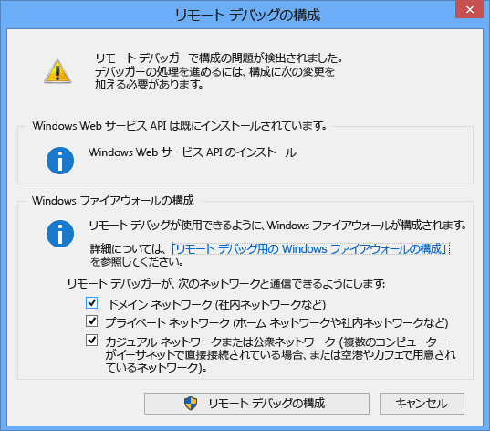
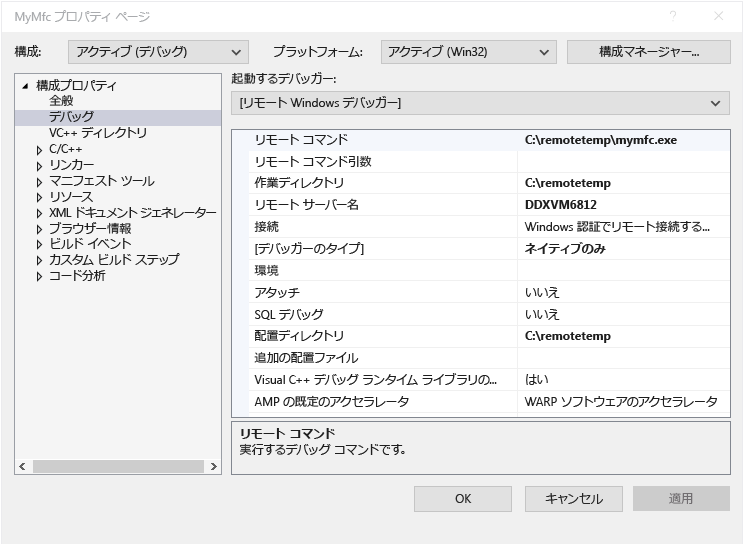
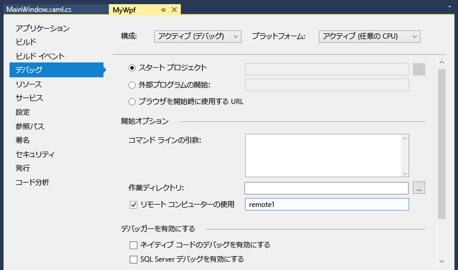

# リモート デバッグ
[!INCLUDE[vs2017banner](../code-quality/includes/vs2017banner.md)]

別のコンピューターに配置されている Visual Studio アプリケーションをデバッグすることができます。  このデバッグを行うには、Visual Studio リモート デバッガーを使用します。  
  
 ここに記載された情報は、Windows デスクトップ アプリケーションと ASP.NET アプリケーションに適用されます。  Windows ストア アプリと Azure アプリのリモート デバッグについては、「[Windows ストア アプリおよび Azure アプリに関するリモート デバッグ](#bkmk_winstoreAzure)」を参照してください。  
  
## リモート ツールのダウンロードおよびインストール  
 デバッグ用のリモート ツールは、「[Remote Tools for Visual Studio 2015](https://www.microsoft.com/en-us/download/details.aspx?id=48155)」でダウンロードできます。 x86、x64、および ARM の各バージョンのツールを選択できます。 実行可能ファイルのダウンロードが完了したら、アプリケーションをリモート コンピューターにインストールするための指示に従います。  
  
 リモート ツールの Update 1 バージョンは、「[Remote Tools for Visual Studio 2015 Update 1](https://www.microsoft.com/en-us/download/details.aspx?id=49986&44F86079-8679-400C-BFF2-9CA5F2BCBDFC=1)」でダウンロードできます。  
  
> [!IMPORTANT]
>  Visual Studio のインストールのバージョンと一致するリモート ツールのバージョンをインストールする必要があります。 一致しないバージョンはサポートされていません。 また、デバッグするアプリケーションと同じアーキテクチャを持つリモート ツールをインストールする必要もあります。 つまり、64 ビット アプリケーションをデバッグする場合は、64 ビット バージョンのリモート ツールをインストールする必要があります。  
  
 リモート コンピューターに Visual Studio 2015 の Community、Professional、または Enterprise が既にインストールされていて、リモート デバッガー \(**msvsmon.exe**\) が既にインストールされている場合は、リモート デバッガーを次のディレクトリから起動することができます。  
  
 **\<Visual Studio のインストール ディレクトリ\>\\Common7\\IDE\\Remote Debugger\\\(x64、x86、Appx\)\\msvsmon.exe**  
  
 ただし、ツールをダウンロードしてインストールしていた場合にのみ、**リモート デバッガー構成ウィザード** \(**rdbgwiz.exe**\) がインストールされ、後で構成のために使用することが必要になること \(特にリモート デバッガーをサービスとして実行する場合\) があります。 詳細については、下記の「[サービスとしてのリモート デバッガーの構成](#bkmk_configureService)」を参照してください。  
  
## サポートされているオペレーティング システム  
 リモート コンピューターで次のいずれかのオペレーティング システムが実行されている必要があります。  
  
-   Windows 10  
  
-   Windows 8 または 8.1  
  
-   Windows 7 Service Pack 1  
  
-   Windows Server 2012 または Windows Server 2012 R2  
  
-   Windows Server 2008 Service Pack 2、Windows Server 2008 R2 Service Pack 1  
  
## サポートされているハードウェア構成  
  
-   1.6 GHz 以上の高速プロセッサ  
  
-   1 GB の RAM \(仮想マシン上で実行されている場合は 1.5 GB\)  
  
-   1 GB のハード ディスク空き容量  
  
-   5400 RPM のハード ドライブ  
  
-   1024 x 768 以上のディスプレイ解像度の DirectX 9 対応ビデオ カード  
  
## ネットワーク構成  
 リモート コンピューターと Visual Studio コンピューターは、ネットワーク、ワークグループ、またはホームグループを介して接続されているか、あるいはイーサネット ケーブルによって直接接続されている必要があります。 インターネットを介したデバッグはサポートされません。  
  
## リモート デバッガーのセットアップ  
 リモート コンピューターに対する管理アクセス許可が必要です。  
  
1.  リモート デバッガー アプリケーションを探します。**リモート デバッガー**は **\[スタート\]** メニューで検索できます。  
  
2.  リモート ツールを初めて \(またはその構成を完了する前に\) 開始すると、**\[リモート デバッグの構成\]** ダイアログ ボックスが表示されます。  
  
       
  
3.  Windows サービス API がインストールされていない場合 \(これは、Windows Server 2008 R2 でのみ発生します\) は、**\[インストール\]** ボタンをクリックします。  
  
4.  リモート ツールで利用される、使用するネットワークの種類を選択します。 少なくとも 1 つのネットワークの種類を選択する必要があります。 コンピューターがドメインを介して接続されている場合は、最初の項目を選択する必要があります。 コンピューターがワークグループまたはホーム グループを介して接続されている場合は、必要に応じて、2 番目または 3 番目の項目を選択する必要があります。  
  
5.  **\[リモート デバッグの構成\]** を選択して、ファイアウォールを構成し、ツールを開始します。  
  
6.  構成が完了すると、リモート デバッガーのウィンドウが表示されます。  
  
       
  
 リモート デバッガーを停止するには、このウィンドウで **\[ファイル\] \/ \[終了\]** をクリックします。 リモート デバッガーを再起動するには、**\[スタート\]** メニュー、またはコマンド ラインから次のコマンドを実行します。  
  
 **\<Visual Studio のインストール ディレクトリ\>\\Common7\\IDE\\Remote Debugger\\\<x86、x64、または Appx\\msvsmon.exe**。  
  
## リモート デバッガーの構成  
 リモート デバッガーを初めて起動した後、リモート デバッガーの構成の一部を変更できます。  
  
-   他のユーザーがリモート デバッガーに接続できるようにするには、**\[ツール\] \/ \[アクセス許可\]** の順にクリックします。 アクセス許可を付与または拒否するには、管理者特権が必要です。  
  
-   認証モードまたはポート番号を変更したり、リモート ツールのタイムアウト値を指定したりするには、\[ツール\] \/ \[オプション\] の順に選択します。  
  
     既定で使用されるポート番号の一覧については、「[リモート デバッガーのポートの割り当て](../debugger/remote-debugger-port-assignments.md)」を参照してください。  
  
> [!WARNING]
>  リモート ツールを \[認証なし\] モードで実行することも選択できますが、このモードの使用は避けることを強く推奨します。 このモードで実行した場合、ネットワーク セキュリティはまったく提供されません。 \[認証なし\] モードは、ネットワークに悪意のあるコードや悪意のあるトラフィックのリスクがないことが確実である場合にのみ選択してください。  
  
##   サービスとしてのリモート デバッガーの構成  
 ASP.NET および他のサーバー環境でのデバッグの場合、リモート デバッガーをサービスとして実行する必要があります。  
  
1.  **リモート デバッガー構成ウィザード** \(rdbgwiz.exe\) を見つけます  \(このアプリケーションは、リモート デバッガーとは別のアプリケーションです\)。 このアプリケーションは、リモート ツールをインストールした場合にのみ入手でき、 Visual Studio と共にはインストールされません。  
  
2.  構成ウィザードの実行を開始します。 最初のページが表示されたら、**\[次へ\]** をクリックします。  
  
3.  **\[Visual Studio 2015 リモート デバッガー サービスを実行する\]** チェック ボックスをオンにします。  
  
4.  ユーザー アカウントの名前とパスワードを追加します。  
  
     このアカウントに、**\[サービスとしてログオン\]** のユーザー権限を追加することが必要になる場合があります。 \(**ローカル セキュリティ ポリシー** \(secpol.msc\) を **\[スタート\]** ページまたはウィンドウで、あるいはコマンド プロンプトに「**secpol**」と入力して見つけます。 ウィンドウが表示されたら、**\[ユーザー権利の割り当て\]** をダブルクリックし、右ペインで **\[サービスとしてログオン\]** を見つけます。 これをダブルクリックします。 ユーザー アカウントを **\[プロパティ\]** ウィンドウに追加して **\[OK\]** をクリックします。\)**\[次へ\]** をクリックします。  
  
5.  リモート ツールが通信するネットワークの種類を選択します。 少なくとも 1 つのネットワークの種類を選択する必要があります。 コンピューターがドメインを介して接続されている場合は、最初の項目を選択する必要があります。 コンピューターがワークグループまたはホーム グループを介して接続されている場合は、2 番目または 3 番目の項目を選択する必要があります。**\[次へ\]** をクリックします。  
  
6.  サービスを開始できた場合は、「**Visual Studio リモート デバッガー構成ウィザードは正常に完了しました**」と表示されます。 サービスを開始できなかった場合は、「**Visual Studio リモート デバッガー構成ウィザードを完了できませんでした**」と表示されます。 このページには、サービスを開始するために従う必要があるヒントもいくつか提供されます。  
  
7.  **\[完了\]** をクリックします。  
  
 この時点で、リモート デバッガーはサービスとして実行されています。 これを確認するには、**\[コントロール パネル\] \/ \[サービス\]** に移動して **\[Visual Studio 2015 リモート デバッガー\]** を探します。  
  
 リモート デバッガー サービスは、**\[コントロール パネル\] \/ \[サービス\]** で停止してから開始することができます。  
  
## 異なるユーザー アカウントを使用したリモート デバッガーの実行  
 リモート デバッガーは、Visual Studio コンピューターに対して使用しているユーザー アカウントとは別のユーザー アカウントで実行できますが、その場合、リモート デバッガーのアクセス許可に別のユーザー アカウントを追加する必要があります。  
  
-   リモート デバッガーは、コマンド ラインで **\/allow \<username\>** パラメーターの **msvsmon \/allow \<username@computer\>** を使用して開始できます。  
  
-   リモート デバッガーのウィンドウで \(**\[ツール\] \/ \[アクセス許可\]**\)、リモート デバッガーのアクセス許可にユーザーを追加できます。  
  
## Visual C\+\+ プロジェクトのリモート デバッグ  
 次の手順では、プロジェクトの名前とパスは C:\\remotetemp\\MyMfc で、リモート コンピューターの名前は **remote1** です。  
  
1.  **mymfc** という名前の MFC アプリケーションを作成します。  
  
2.  ブレークポイントを、アプリケーション内の達しやすい任意の箇所 \(たとえば、`CMainFrame::OnCreate` の開始時の **MainFrm.cpp**\) に設定します。  
  
3.  Visual Studio の **\[プロジェクト\]** メニューで、**\[プロパティ\]** を選択します。**\[デバッグ\]** タブを開きます。  
  
4.  **\[起動するデバッガー\]** を **\[リモート Windows デバッガー\]** に設定します。  
  
       
  
5.  プロパティに次の変更を適用します。  
  
    |||  
    |-|-|  
    |**設定**|**値**|  
    |リモート コマンド|C:\\remotetemp\\mymfc.exe|  
    |作業ディレクトリ|C:\\remotetemp|  
    |リモート サーバー名|remote1|  
    |接続|Windows 認証でリモート接続する|  
    |デバッガーの種類|ネイティブのみ|  
    |配置ディレクトリ|C:\\remotetemp|  
    |追加の配置ファイル|C:\\data\\mymfcdata.txt|  
  
6.  ツール バーで、**\[ソリューション構成\]** ドロップダウン メニューを開き、**\[構成マネージャー\]** をクリックします。  
  
7.  **\[デバッグ\]** 構成の **\[配置\]** チェック ボックスをオンにします。  
  
       
  
8.  デバッグを開始します \(**\[デバッグ\] \/ \[デバッグの開始\]**、または **F5** キー\)。  
  
9. 実行可能ファイルが、リモート コンピューターに自動的に配置されます。  
  
10. Visual Studio コンピューターで、実行がブレークポイントで停止したことを確認できるはずです。  
  
    > [!TIP]
    >  また、これらのファイルは別の手順でも配置できます。**ソリューション エクスプローラー**で、**\[mymfc\]** ノードを右クリックして **\[配置\]** を選択します。  
  
 アプリケーションで使用する必要がある、コード以外のファイルがある場合は、Visual Studio プロジェクトに含める必要があります。 追加のファイル用のプロジェクト フォルダーを作成します \(**ソリューション エクスプローラー**で、**\[追加\] \/ \[新しいフォルダー\]** をクリックします\)。 次にファイルをそのフォルダーに追加します \(**ソリューション エクスプローラー**で、**\[追加\] \/ \[既存の項目\]** の順にクリックしてからファイルを選択します\)。 ファイルごとの **\[プロパティ\]** ページで、**\[出力ディレクトリにコピー\]** を **\[常にコピーする\]** に設定します。  
  
## Visual C\# プロジェクトまたは Visual Basic プロジェクトのリモート デバッグ  
 デバッガーでは、Visual C\# または Visual Basic のデスクトップ アプリケーションをリモート コンピューターに配置できませんが、次のようにリモートからそれらのデスクトップ アプリケーションをデバッグすることはできます。 次の手順では、**\[remote1\]** という名前のコンピューターでこのようなデスクトップ アプリケーションをデバッグすることを想定しています。  
  
1.  **MyWpf** という名前の WPF プロジェクトを作成します。  
  
2.  ブレークポイントをコード内の達しやすい任意の箇所に設定します。 たとえば、ブレークポイントをボタン ハンドラーに設定できます。  
  
3.  **\[プロジェクト\]** メニューの **\[プロパティ\]** をクリックします。  
  
4.  **\[プロパティ\]** ページで、**\[デバッグ\]** タブをクリックします。  
  
       
  
5.  **\[作業ディレクトリ\]** テキスト ボックスが空であることを確認してください。  
  
6.  **\[リモート コンピューターを使用する\]** をオンにして、テキスト ボックスに「**remote1**」と入力します。  
  
7.  **\[ネイティブ コードのデバッグを有効にする\]** がオフであることを確認します。  
  
8.  プロジェクトをビルドします。  
  
9. Visual Studio コンピューター上の **\[Debug\]** フォルダー \(**\<ソース パス\>\\MyWPF\\MyWPF\\bin\\Debug**\) と同じパスのフォルダーをリモート コンピューター上に作成します。  
  
10. 上で作成した実行可能ファイルを、Visual Studio コンピューターから、リモート コンピューター上の新しく作成したフォルダーにコピーします。  
  
    > [!CAUTION]
    >  このコードに変更を加えたり、この手順の前に再ビルドしたりしないでください。 リモート コンピューターにコピーした実行可能ファイルは、ローカルのソースとシンボルに正確に一致している必要があります。  
  
11. Visual Studio でデバッグを開始します \(**\[デバッグ\] \/ \[デバッグの開始\]**、または **F5** キー\)。  
  
12. ブレークポイントを確認します。 ブレークポイントがアクティブになっていることを確認できるはずです。 ブレークポイントがアクティブでない場合、アプリケーションのシンボルが読み込まれていません。 シンボルの読み込みと、それらのトラブルシューティング方法については、「[シンボル ファイルおよび Visual Studio のシンボルの設定について](http://blogs.msdn.com/b/visualstudioalm/archive/2015/01/05/understanding-symbol-files-and-visual-studio-s-symbol-settings.aspx)」を参照してください。  
  
13. WPF アプリケーションのメイン ウィンドウがリモート コンピューター上で開いていることを確認できるはずです。 ブレークポイントにヒットさせるアクションを実行します。  
  
14. Visual Studio コンピューターで、実行がブレークポイントで停止したことを確認できるはずです。  
  
 アプリケーションで使用する必要がある、コード以外のファイルがある場合は、Visual Studio プロジェクトに含める必要があります。 追加のファイル用のプロジェクト フォルダーを作成します \(**ソリューション エクスプローラー**で、**\[追加\] \/ \[新しいフォルダー\]** をクリックします\)。 次にファイルをそのフォルダーに追加します \(**ソリューション エクスプローラー**で、**\[追加\] \/ \[既存の項目\]** の順にクリックしてからファイルを選択します\)。 ファイルごとの **\[プロパティ\]** ページで、**\[出力ディレクトリにコピー\]** を **\[常にコピーする\]** に設定します。  
  
## ASP.NET アプリケーションのリモート デバッグ  
 IIS が実行されているリモート コンピューターに ASP.NET アプリケーションを配置する手順は、オペレーティング システムと IIS のバージョンによって異なります。 IIS 8 \(またはそれ以降\) がインストールされている、Windows 8 以降または Windows Server 2012 オペレーティング システムが実行されているリモート コンピューターについては、「[IIS への公開](https://docs.asp.net/en/latest/publishing/iis.html)」を参照してください。  
  
 IIS 7.5 がインストールされている、Windows 7 または Windows Server 2008 が実行されているリモート コンピューターについては、「[リモートの IIS 7.5 コンピューター上の ASP.NET のリモート デバッグ](../debugger/remote-debugging-aspnet-on-a-remote-iis-7-5-computer.md)」を参照してください。  
  
## リモート シンボルを使用したデバッグのセットアップ  
 Visual Studio コンピューターで生成したシンボルを使用して、コードをデバッグすることができます。 リモート デバッガーのパフォーマンスは、ローカル シンボルを使用すると大幅に向上します。 リモート シンボルを使用する必要がある場合、リモート コンピューター上のシンボルを検索するように、リモート デバッグ モニターに指示する必要があります。  
  
 Visual Studio 2013 Update 2 以降では、msvsmon コマンド ライン スイッチの `Msvsmon / /FallbackLoadRemoteManagedPdbs`  を使用して、マネージ コードにリモート シンボルを使用できます。  
  
 詳細については、リモート デバッグのヘルプ \(リモート デバッガーのウィンドウで **F1** キーを押すか、または **\[ヘルプ\] \/ \[使い方\]** の順にクリックします\) を参照してください。 詳細については、「[Visual Studio 2012 および 2013 における .NET のリモート シンボルの読み込みの変更](http://blogs.msdn.com/b/visualstudioalm/archive/2013/10/16/net-remote-symbol-loading-changes-in-visual-studio-2012-and-2013.aspx)」を参照してください。  
  
##   Windows ストア アプリおよび Azure アプリに関するリモート デバッグ  
 Windows ストア アプリのリモート デバッグについては、「[リモート デバイスでの Visual Studio からの Windows ストア アプリのデバッグおよびテスト](http://msdn.microsoft.com/library/windows/apps/hh441469.aspx)」を参照してください。  
  
 Azure でのデバッグ方法の詳細については、次のトピックのいずれかを参照してください。  
  
-   [Visual Studio でのクラウド サービスまたは仮想マシンのデバッグ](http://msdn.microsoft.com/library/azure/ff683670.aspx)  
  
-   [Visual Studio での .NET バックエンドのデバッグ](http://blogs.msdn.com/b/azuremobile/archive/2014/03/14/debugging-net-backend-in-visual-studio.aspx)  
  
-   Azure Web サイト上でのリモート デバッグの概要 \([パート 1](http://azure.microsoft.com/blog/2014/05/06/introduction-to-remote-debugging-on-azure-web-sites/), [パート 2](http://azure.microsoft.com/blog/2014/05/07/introduction-to-remote-debugging-azure-web-sites-part-2-inside-remote-debugging/), [パート 3](http://azure.microsoft.com/blog/2014/05/08/introduction-to-remote-debugging-on-azure-web-sites-part-3-multi-instance-environment-and-git/)\)。  
  
## 参照  
 [Visual Studio でのデバッグ](../debugger/debugging-in-visual-studio.md)   
 [Windows ファイアウォールをリモート デバッグ用に構成する](../debugger/configure-the-windows-firewall-for-remote-debugging.md)   
 [リモート デバッガーのポートの割り当て](../debugger/remote-debugger-port-assignments.md)   
 [リモートの IIS 7.5 コンピューター上の ASP.NET のリモート デバッグ](../debugger/remote-debugging-aspnet-on-a-remote-iis-7-5-computer.md)   
 [リモート デバッグ エラーとトラブルシューティング](../debugger/remote-debugging-errors-and-troubleshooting.md)