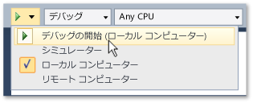

# Visual Studio からのストア アプリの実行
[!INCLUDE[vs2017banner](../code-quality/includes/vs2017banner.md)]

ストア アプリは幅広いデバイスで実行されますが、Visual Studio ではそれらのアプリを実行して対話するためのさまざまな方法を提供しています。  「F5」の拡張機能では、開発時にアプリのデバッグ、プロファイル、およびテストが簡単に行えるようになっています。  
  
   
  
## このセクションの内容  
  
|||  
|-|-|  
|[ローカル コンピューターでの Windows ストア アプリの実行](../debugger/run-windows-store-apps-on-the-local-machine.md)|Windows ストア アプリを Visual Studio デバイスで実行。|  
|[シミュレーターでの Windows ストア アプリの実行](../debugger/run-windows-store-apps-in-the-simulator.md)|タッチやオリエンテーションなど [!INCLUDE[win8_appname_long](../debugger/includes/win8_appname_long_md.md)] 機能をシミュレートするデスクトップ ウィンドウで Windows ストア アプリを実行。|  
|[リモート コンピューターでの Windows ストア アプリの実行](../debugger/run-windows-store-apps-on-a-remote-machine.md)|ネットワーク経由またはイーサネット ケーブルによって Visual Studio コンピューターに直接接続されたデバイスで Windows ストア アプリを配置および実行。|  
|[エミュレーターにおける Windows Phone アプリの実行](../debugger/run-windows-phone-apps-in-the-emulator.md)|Windows Phone をシミュレートしたデスクトップ ウィンドウで Windows ストア アプリを実行。|  
|[Visual Studio からの Windows ストア アプリの配置](../debugger/deploy-windows-store-apps-from-visual-studio.md)|アドホック テスト用に Windows ストア アプリをデバイスに配置および登録。|