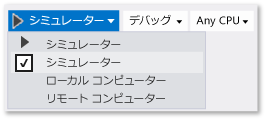

# シミュレーターでの Windows ストア アプリの実行
[!INCLUDE[vs2017banner](../code-quality/includes/vs2017banner.md)]

Windows ストア アプリ用の Visual Studio シミュレーターは、Windows ストア アプリをシミュレートするデスクトップ アプリケーションです。 開発者は、アプリケーションの実行と、一般的なタッチと回転イベントのシミュレーションを開発用コンピューター上で行うことができます。 また、エミュレートする物理的な画面サイズと解像度を選択したり、ネットワーク接続のプロパティをシミュレートしたりすることもできます。  
  
 シミュレーターは、Windows ストア アプリを設計、開発、デバッグ、テストできる環境を提供します。 ただし、Windows ストアにアプリを公開する前に、実際のデバイスでアプリをテストする必要があります。  
  
 Windows ストア アプリ用の Visual Studio シミュレーターは、ローカル コンピューターの分離環境では実行されません。 したがって、シミュレーターで発生したエラー \(回復できないシステム エラーなど\) がコンピューター全体に影響を与える場合があります。  
  
 Windows Phone について詳しくは、「[エミュレーターにおける Windows Phone アプリの実行](../debugger/run-windows-phone-apps-in-the-emulator.md)」を参照してください。  
  
> [!IMPORTANT]
>  Visual Studio 2015 シミュレーターには、位置情報ボタンがありません。 これは、Windows 10 シミュレーターに位置情報シミュレーションが含まれていないためです。 この種のシミュレーションを行う必要がある場合は、Windows 8.1 以前のオペレーティング システム上で Visual Studio 2013 シミュレーターを使用できます。  
  
##   シミュレーターをターゲットとして設定する  
 Windows ストア アプリをシミュレーターで実行するには、デバッガーの**標準**ツールバーの **\[デバッグの開始\]** ボタンの横にあるドロップダウン リストの **\[シミュレーター\]** をクリックします。  
  
   
  
##   対話モードを選択する  
 次の対話モードを選択できます。  
  
-    マウス モード: 対話モードをマウス ジェスチャに設定します。 マウス ジェスチャには、クリック、ダブルクリック、およびドラッグがあります。  
  
-    タッチ エミュレーションを開始: 対話モードを 1 本の指によるタッチ ジェスチャに設定します。 1 本指のイベントには、タップ、ドラッグ、およびスワイプがあります。  
  
      シングル ターゲット アイコンは、シミュレーター内のイベントの位置を示します。 ポインターを配置するには、マウスを使用します。  
  
      タッチ モードをアクティブにするには、マウスの左ボタンを押します。 たとえば、タップをシミュレートする場合はボタンをクリックし、ドラッグまたはスワイプする場合はボタンを長押しします。  
  
## ピンチとズーム  
 対話モードを、2 本の指によるピンチ ジェスチャとズーム ジェスチャに設定します。  
  
-     
  
     ダブル ターゲット アイコンは、デバイス画面上の 2 本の指の位置を示します。  
  
    -   デバイス画面上のオブジェクトの上にアイコンを配置するには、マウスを移動します。  
  
    -   ピンチまたはズームを実行する前の 2 本の指のシミュレートされる距離を変更するは、マウス ホイールを前方または後方に回転させます。  
  
-   -     
  
         縮小 \(ピンチ\) する場合は、左ボタンを押し、ホイールを後方 \(手前\) に回転させます。  
  
    -   拡大 \(ズーム\) する場合は、左ボタンを押し、マウス ホイールを前方 \(奥\) に回転させます。  
  
## オブジェクトの回転  
 **\[タッチ エミュレーションの回転\]** ボタンは、対話モードを、2 本の指による回転ジェスチャに設定します。  
  
-   -   デバイス画面上のオブジェクトの上にアイコンを配置するには、マウスを移動します。  
  
    -   オブジェクトの回転を実行する前の 2 本の指のシミュレートされる方向を変更するは、マウス ホイールを前方または後方に回転させます。  
  
-   -   オブジェクトを反時計回りに回転させる場合は、左ボタンを押し、ホイールを後方 \(手前\) に回転させます。 マウス ホイールを回転させると、回転の相対サイズを示すために、2 つのターゲット アイコンのいずれかが他方のアイコンを中心として回転します。  
  
    -   オブジェクトを時計回りに回転させる場合は、左ボタンを押し、マウス ホイールを前方 \(奥\) に回転させます。  
  
##   \[常に手前に表示\] モードを有効または無効にする  
 シミュレーター ウィンドウが常に他のウィンドウの上に表示されるように設定できます。**\[最前面に表示するウィンドウの切り替え\]** ボタンは、シミュレーター ウィンドウの **\[常に手前に表示\]** モードを有効または無効にします。  
  
##   デバイスの方向を変更する  
 シミュレーターを任意の方向に 90 度回転させることで、デバイスの方向を縦長と横長の間で切り替えることができます。  
  
> [!NOTE]
>  シミュレーターでは、プロジェクトのプロパティ [DisplayProperties.AutoRotationPreferences](http://go.microsoft.com/fwlink/?LinkId=249460) は考慮されません。 たとえば、プロジェクトで方向が `Landscape` に設定されている場合でも、シミュレーターの方向を回転させて縦向きにすると、シミュレーターに表示されるイメージも回転され、サイズが変更されます。 実際のデバイスでこれらの設定をテストしてください。  
  
> [!NOTE]
>  シミュレーターを回転させたときに、シミュレーターの 1 つの辺がシミュレーターを表示している画面よりも大きくなる場合、シミュレーターのサイズは画面に収まるように自動的に変更されます。 シミュレーターは、再度回転させた場合でも、元のサイズに戻ることはありません。  
  
##   シミュレートされる画面のサイズと解像度を変更する  
 シミュレートされる画面のサイズと解像度を変更するには、パレットの **\[解像度の変更\]** ボタンをクリックし、一覧から新しいサイズと解像度を選択します。  
  
 画面サイズと解像度は *画面の幅 \(インチ\)、ピクセル幅 X ピクセル高さ* で一覧表示されます。 画面のサイズと解像度の両方がシミュレートされます。 シミュレーター上の位置座標は、選択したデバイスのサイズと解像度の座標に変換されます。  
  
> [!NOTE]
>  ビットマップ イメージのスケーリングされたバージョンをアプリに保存できます。Windows は、現在のスケールで正しいイメージを読み込みます。 詳細については、「[レスポンシブ デザイン 101](https://msdn.microsoft.com/en-us/library/windows/apps/dn958435.aspx)」をご覧ください。 ただし、Windows によって解像度に合ったイメージが選択されるようにシミュレーターの解像度を変更した場合、新しいイメージを表示するにはデバッグ セッションを停止して再度開始する必要があります。  
  
##   Windows ストアに送信するアプリのスクリーンショットをキャプチャする  
 Windows アプリ ストアにアプリを送信するときは、アプリのスクリーンショットを含める必要があります。  
  
> [!NOTE]
>  スクリーンショットは、シミュレーターの現在の解像度で保存されます。 解像度を変更するには、**\[解像度の変更\]** ボタンをクリックします。  
  
-   シミュレーターからアプリのスクリーンショットを作成するには、**\[クリップボードにスクリーンショットをキャプチャします\]** ボタンをクリックします。  
  
-   スクリーンショットの配置場所を設定するには、**\[スクリーンショットの設定\]** ボタンをクリックし、ショートカット メニューから場所を選択します。  
  
       
  
##   ネットワーク接続のプロパティをシミュレートする  
 アプリケーションのユーザーがネットワーク接続コストやデータ プランの状態の変化を認識し、アプリケーションがその情報を使用して、ローミングや指定されたデータ転送の制限の超過による追加コストの発生を避けることにより、アプリケーションのユーザーが従量制課金接続のコストを管理できるようにします。[Windows.Networking.Connectivity](https://msdn.microsoft.com/en-us/library/windows/apps/windows.networking.connectivity.aspx) API を使用すると、[NetworkStatusChanged](https://msdn.microsoft.com/en-us/library/windows/apps/windows.networking.connectivity.networkinformation.networkstatuschanged.aspx) および署名を行うイベント [TriggerType](https://msdn.microsoft.com/en-us/library/windows/apps/windows.applicationmodel.background.systemtrigger.triggertype.aspx) に応答できます。 「[従量制課金接続のコスト制約を管理する方法 \(HTML\)](http://msdn.microsoft.com/library/windows/apps/Hh750310.aspx)」をご覧ください。  
  
 ネットワーク コストを認識するコードをデバッグまたはテストするには、シミュレーターを使って、[GetInternetConnectionProfile](https://msdn.microsoft.com/en-us/library/windows/apps/windows.networking.connectivity.networkinformation.getinternetconnectionprofile.aspx) によって返される [ConnectionProfile](https://msdn.microsoft.com/en-us/library/windows/apps/windows.networking.connectivity.connectionprofile.aspx) オブジェクトを通じて公開されるネットワークのプロパティを模倣します。  
  
 ネットワークのプロパティをシミュレートするには、次のようにします。  
  
1.  シミュレーターのツール バーの **\[ネットワーク プロパティの変更\]** ボタンをクリックします。  
  
2.  **\[ネットワーク プロパティの設定\]** ダイアログ ボックスの **\[シミュレートされたネットワーク プロパティの使用\]** をクリックします。  
  
     チェック ボックスをオフにしてシミュレーションを削除し、現在接続されているインターフェイスのネットワーク プロパティに戻ります。  
  
3.  シミュレートされたネットワークの **\[プロファイル名\]** を入力します。[ConnectionProfile](https://msdn.microsoft.com/en-us/library/windows/apps/windows.networking.connectivity.connectionprofile.aspx) オブジェクトの [ProfileName](https://msdn.microsoft.com/en-us/library/windows/apps/windows.networking.connectivity.connectionprofile.profilename.aspx) プロパティでシミュレーションを識別するために使用できる一意の名前を使用することをお勧めします。  
  
4.  **\[ネットワーク コストの種類\]** の一覧からプロファイルの [NetworkCostType](https://msdn.microsoft.com/en-us/library/windows/apps/windows.networking.connectivity.networkcosttype.aspx) 値を選択します。  
  
5.  **\[データの限度の状態フラグ\]** の一覧から、[ApproachingDataLimit](https://msdn.microsoft.com/en-us/library/windows/apps/windows.networking.connectivity.connectioncost.approachingdatalimit.aspx) プロパティまたは [OverDataLimit](https://msdn.microsoft.com/en-us/library/windows/apps/windows.networking.connectivity.connectioncost.overdatalimit.aspx) プロパティを true に設定できます。または、**\[データの限度を下回っています\]** を選択すると、両方の値を false に設定できます。  
  
6.  **\[ローミングの状態\]** の一覧から、[Roaming](https://msdn.microsoft.com/en-us/library/windows/apps/windows.networking.connectivity.connectioncost.roaming.aspx) プロパティを設定します。  
  
7.  **\[プロパティの設定\]** をクリックして、前景の [NetworkStatusChanged](https://msdn.microsoft.com/en-us/library/windows/apps/windows.networking.connectivity.networkinformation.networkstatuschanged.aspx) イベントおよび **NetworkStateChange** 型の背景の [SystemTrigger](https://msdn.microsoft.com/en-us/library/windows/apps/windows.applicationmodel.background.systemtrigger.aspx) をトリガーして、ネットワーク プロパティをシミュレートします。  
  
 **ネットワーク接続の管理の詳細について**  
  
 [従量制課金接続のコスト制約を管理する方法 \(HTML\)](http://msdn.microsoft.com/library/windows/apps/Hh750310.aspx)  
  
 [ネットワーク情報のサンプル](http://code.msdn.microsoft.com/windowsapps/Network-Information-Sample-63aaa201)  
  
 [エネルギー使用の分析](../profiling/analyze-energy-use-in-store-apps.md)  
  
 [Windows.Networking.Connectivity](https://msdn.microsoft.com/en-us/library/windows/apps/windows.networking.connectivity.aspx)  
  
 [バックグラウンド タスクでシステム イベントに応答する方法](http://msdn.microsoft.com/ja-jp/f7c86e86-a7ae-4abb-a923-76b03337a80a)  
  
 [Windows ストア アプリの中断イベント、再開イベント、およびバックグラウンド イベントをトリガーする方法](http://msdn.microsoft.com/library/windows/apps/hh974425.aspx)  
  
##   キーボードを使用してシミュレーター内を移動する  
 **Ctrl \+ Alt \+ 上矢印キー**を押してシミュレーター ウィンドウからシミュレーター ツールバーにフォーカスを切り替えて、シミュレーター ツールバーをナビゲートできます。 ツール バーのボタンの間を移動するには、**上向きの矢印**と**下向きの矢印**を使用します。  
  
 シミュレーターを終了するには、**CTRL\+ALT\+F4** キーを押します。  
  
## 参照  
 [Visual Studio からのアプリの実行](../debugger/run-store-apps-from-visual-studio.md)