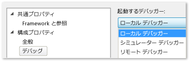

# ローカル コンピューターでの Windows ストア アプリの実行
[!INCLUDE[vs2017banner](../code-quality/includes/vs2017banner.md)]

  
  
 Windows ストア アプリのパフォーマンス分析のデバッグ、テスト、実行を行う場合、Visual Studio をホストする同じコンピューター上でアプリを実行することができます。  デバイスのディスプレイがタッチ対応である場合は、アプリの全機能を実施できますが、そうでない場合の操作はマウスとキーボードに限定されます。  
  
##   このトピックの内容  
 以下を学習できます。  
  
 [ローカル コンピューター上での実行方法](#BKMK_How_to_run_on_a_local_machine)  
  
 [1 つのモニターで Windows ストア アプリと Visual Studio を切り替える方法](#BKMK_How_to_switch_between_a_Windows_Store_app_and_Visual_Studio_on_a_single_monitor)  
  
##   ローカル コンピューター上での実行方法  
 ローカル コンピューター上でアプリを実行するには、デバッガーの **\[標準\]** ツール バーの デバッグの開始ボタンの横にあるドロップダウン リストから **\[ローカル コンピューター\]** を選択します。  
  
   
  
 **\[標準\]** ツールバーが表示されない場合は、**\[表示\]** メニューをクリックして **\[ツール バー\]** をポイントし、さらに **\[標準\]** をクリックします。  
  
 ドロップダウン リストでの選択はプロジェクトのプロパティ ファイルに残され、既定の実行ターゲットとなります。  
  
 実行ターゲットは、プロジェクトのプロパティ ファイルに直接設定することもできます。  **\[ソリューション エクスプローラー\]** でプロジェクト名を右クリックし、**\[プロパティ\]** をクリックします。  次に、以下のいずれかを実行します。  
  
-   C\# と Visual Basic のプロジェクトから、**\[デバッグ\]** をクリックして、次に **\[ターゲット デバイス\]** ドロップダウン リストから **\[ローカル コンピューター\]** を選択します。  
  
       
  
-   C\+\+ と JavaScript のプロジェクトから、**\[構成プロパティ\]** ノードを展開して **\[デバッグ\]** をクリックし、次に **\[起動するデバッガー\]** リストから **\[ローカル デバッガー\]** を選択します。  
  
       
  
##   1 つのモニターで Windows ストア アプリと Visual Studio を切り替える方法  
 **Windows ストア アプリの実行中のインスタンスから Visual Studio へ切り替えるには**  
  
 ローカル コンピューターで Windows ストア アプリを実行する際に 1 つのモニターだけを使用する場合は、アプリを実行したまま Visual Studio へ切り替えるといいでしょう。  たとえば、イベント待ちだったり長いループや無限ループにトラップされるなど、アプリがブレークポイントに到達できない状態にある可能性があります。  Visual Studio に戻るには、Alt \+ Tab キーを押します。