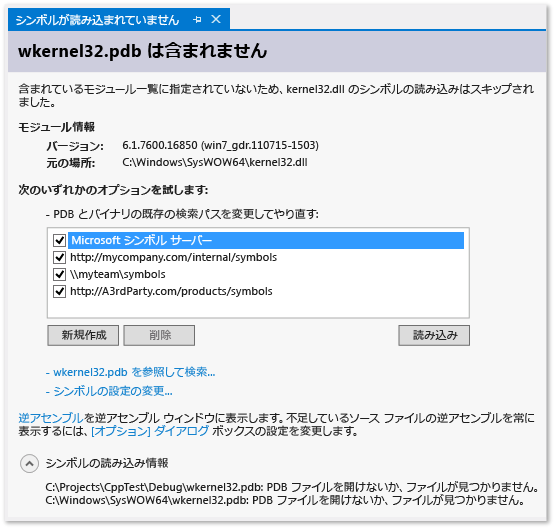

# シンボル (.pdb) ファイル、ソース ファイル、およびバイナリ ファイルの検索
プログラム データベース (.pdb) ファイル、シンボル ファイルとも呼ばれます。 は、クラス、メソッド、およびプロジェクトのコンパイル済み実行可能ファイルで使用される識別子には、他のコードのソース コードで作成した識別子をマップします。 また .pdb ファイルは、ソース コード内のステートメントを実行可能ファイル内の実行命令に対応付けます。 デバッガーでは、この情報を使って、2 つの重要な情報を決定します。

* Visual Studio IDE に表示されるソース ファイルと行番号の名前
* ブレークポイントを設定するときに停止する実行可能ファイルの場所

また、シンボル ファイルにはソース ファイルの元の場所、および必要に応じてソース ファイルを取得できるソース サーバーの場所が格納されています。
  
> [!TIP]
> プロジェクト ソース コードの外部のコードをデバッグする場合は、Windows コードやサード パーティのコードなど、プロジェクトから呼び出す必要がある .pdb ファイル (および必要に応じて、外部コードのソース ファイル) の場所を指定して、それらのファイルは、t のビルドと正確に一致する必要があります。彼の実行可能ファイルです。  
 
##   デバッガーは、シンボル ファイルを検索しますか。 
  
1.  DLL または実行可能ファイル内で指定されている場所。  
  
     (DLL または実行可能ファイルをコンピューター上でビルドした場合、既定では、リンカーは DLL または実行可能ファイル内で対応付けられた .pdb ファイルの完全なパスとファイル名を特定します。 デバッガーはまず、DLL または実行可能ファイル内で指定された場所にシンボル ファイルが存在するかどうかをチェックします。 これが便利なのは、コンピューター上でコンパイルしたコードでシンボルが常に使用できるためです。)  
  
2.  DLL または実行可能ファイルと同じフォルダーに存在する .pdb ファイル。

3. 任意の場所[デバッガー オプションで指定された](#BKMK_Specify_symbol_locations_and_loading_behavior)シンボル ファイル。 
  
    * 任意のローカル シンボル キャッシュ フォルダー。  
  
    * 任意のネットワーク、インターネットまたはローカル シンボル サーバーや Microsoft シンボル サーバー (有効になっている) 場合など、指定された場所。 

> [!NOTE]
> Visual Studio 2012 より前では、リモート デバイスでマネージド コードをデバッグしたとき、リモート コンピューターにシンボル ファイルを置く必要がありました。 Visual Studio 2012 以降では、すべてのシンボル ファイルがあります、ローカル コンピューターまたは場所にある[デバッガー オプションで指定された](#BKMK_Specify_symbol_locations_and_loading_behavior)します。  
  
##   シンボル ファイルを実行可能ファイルに正確に対応付ける必要がある理由  
デバッガーは、実行可能ファイルがビルドされたときに作成された .pdb ファイルと正確に一致する実行可能ファイルの .pdb ファイルのみ読み込みます (つまり .pdb ファイルはオリジナルまたはオリジナルのコピーであることが必要)。 コンパイラがコンパイル速度だけでなく、正確で効率的なコードを作成する主要なタスクに対しても最適化されるため、コード自体が変更されていない場合でも、実行可能ファイルの実際のレイアウトが変更されることがあります。 詳細については、「 [Why does Visual Studio require debugger symbol files to exactly match the binary files that they were built with?](https://blogs.msdn.microsoft.com/jimgries/2007/07/06/why-does-visual-studio-require-debugger-symbol-files-to-exactly-match-the-binary-files-that-they-were-built-with/)
  
##   デバッガーがシンボル ファイルとシンボルの読み込み動作を検索する場所を構成します。
 Visual Studio IDE でプロジェクトをデバッグするときに、デバッガーでプロジェクト ディレクトリに配置されているシンボル ファイルが自動的に読み込まれます。 Microsoft、Windows、またはサード パーティ製のコンポーネントのシンボル サーバーと別の検索パスを指定できます**ツール > オプション > デバッグ > シンボル**します。 特定のモジュールのシンボルを自動的にロードするデバッガーをすることを指定することもできます。 これらの設定はデバッグ中に手動でも変更できます。  
  
1.  Visual Studio で開く、**ツール > オプション > デバッグ > シンボル**ページ。  
  
       
  
2.  フォルダーを選択してアイコン。 編集可能なテキストが **[シンボル ファイル (.pdb) の場所]** ボックスに表示されます。  
  
3.  シンボル サーバーまたはシンボルの場所の URL またはディレクトリ パスを入力します。 ステートメント入力候補により、正しい形式を確認できます。

    使用することができます**Ctrl + Up キー**と**Ctrl + Down**シンボルの場所の読み込み順序を変更します。 キーを押して**F2** URL を編集またはディレクトリ パス。
  
4.  シンボルの読み込みパフォーマンスを向上させるには、シンボル サーバーによってシンボルをコピー可能なローカル ディレクトリのパスを **[このディレクトリにシンボルをキャッシュ]** に入力します。  
  
    > [!NOTE]
    >  Windows フォルダーなどの保護されたフォルダー (C:\Windows フォルダーまたはそのいずれかのサブフォルダーなど) にシンボル キャッシュを配置しないでください。 読み取り/書き込みフォルダーを使用してください。  
  
    > [!NOTE]
    >  C++ プロジェクトでは、_NT_SYMBOL_PATH 環境変数セットを持つ場合、値がオーバーライドされますで設定**このディレクトリにシンボルをキャッシュ**します。

### シンボルの読み込み動作を指定する 
  
デバッグの開始時に **[シンボル ファイル (.pdb) の場所]** ボックスに指定された場所から自動的に読み込まれるファイルを指定できます。 プロジェクト ディレクトリ内のシンボル ファイルは常に読み込まれます。  
  
1.  **[除外されていないすべてのモジュール]** を選択すると、 **[除外されるモジュールの指定]** リンクをクリックして指定したモジュール以外のすべてのモジュールのすべてのシンボルが読み込まれます。  
  
2.  **[指定したモジュールのみ]** オプションを選択して **[モジュールの指定]** をクリックすると、シンボル ファイルが自動的に読み込まれるモジュールを指定できます。 その他のモジュールのシンボル ファイルは無視されます。  
  
### その他のシンボル オプションを指定する 
  
次のオプションを設定することも、**ツール > オプション > デバッグ > 全般**ページ。  
  
**DLL のエクスポート (ネイティブのみ) を読み込む**  
  
オンにすると、DLL エクスポート テーブルを読み込みます。 DLL エクスポート テーブルのシンボル情報は、対応するシンボルのない Windows メッセージ、Windows プロシージャ (WindowProc)、COM オブジェクト、マーシャリング、または DLL を操作する場合に役立ちます。 DLL エクスポート情報を読み取ると、オーバーヘッドがある程度発生します。 そのため、既定ではこの機能はオフになっています。  
  
DLL のエクスポート テーブル内で使用できるシンボルを調べるには、 `dumpbin /exports`を使用します。 シンボルは、任意の 32 ビット システムの DLL に使用できます。 `dumpbin /exports` の出力を参照すると、英数字以外の文字を含む、正確な関数名を確認できます。 この情報は、関数にブレークポイントを設定するときに使用します。 DLL エクスポート テーブルの関数名は、デバッガーの他の場所で表示されるときは、切り捨てられることがあります。 関数は呼び出し順に表示され、現在の関数 (入れ子の一番内側) が先頭に表示されます。 詳細については、「 [dumpbin /exports](/cpp/build/reference/dash-exports)」を参照してください。  
  
###   シンボル サーバーを使用してローカル コンピューター上にないシンボル ファイルを検索する  
 [!INCLUDE[vsprvs](../code-quality/includes/vsprvs_md.md)] では、symsrv プロトコルを実装するシンボル サーバーからデバッグ シンボル ファイルをダウンロードできます。 [Visual Studio Team Foundation Server](http://msdn.microsoft.com/Library/bd6977ca-e30a-491a-a153-671d81222ce6) と [Debugging Tools for Windows](http://msdn.microsoft.com/library/windows/hardware/ff551063\(v=VS.85\).aspx) は、シンボル サーバーを実装できる 2 つのツールです。 使用するシンボル サーバーは VS の **[オプション]** ダイアログ ボックスで指定します。  
  
 以下のシンボル サーバーを使用できます。  
  
 **Microsoft パブリック シンボル サーバー**  
  
 システム DLL やサードパーティのライブラリの呼び出し中に発生するクラッシュをデバッグするには、多くの場合、Windows DLL、EXE、およびデバイス ドライバー用のシンボルが格納されているシステム .pdb ファイルが必要です。 これらのシンボルは Microsoft パブリック シンボル サーバーから取得できます。 Microsoft パブリック シンボル サーバーは、MDAC、IIS、ISA、および [!INCLUDE[dnprdnshort](../code-quality/includes/dnprdnshort_md.md)]のほか、Windows オペレーティング システムのシンボルを提供します。  
  
 Microsoft シンボル サーバーを使用するには、 **[デバッグ]** メニューの **[オプションと設定]** をクリックし、 **[シンボル]** をクリックします。 **[Microsoft シンボル サーバー]** を選択します。  
  
 **内部ネットワーク上またはローカル コンピューター上のシンボル サーバー**  
  
 チームや会社で独自の製品用にシンボル サーバーを作成して、外部ソースのシンボルのキャッシュとして使用できます。 自分のコンピューター上にシンボル サーバーを作成することもできます。 VS の **[オプション]**/**[シンボル]** / **[シンボル]**」 (Visual Studio においてデバッガー シンボル ファイルがビルド時のバイナリ ファイルと正確に一致することが求められる理由) を参照してください。  
  
 **サード パーティのシンボル サーバー**  
  
 Windows アプリケーションおよびライブラリのサード パーティ プロバイダーがインターネット上のシンボル サーバーへのアクセスを用意していることがあります。 これらのシンボル サーバーの URL を **[オプション]**/**[シンボル]** ページで入力することもできます。  
  
> [!NOTE]
>  Microsoft パブリック シンボル サーバー以外のシンボル サーバーを使用する場合は、シンボル サーバーとそのパスが信頼できることを確認してください。 シンボル ファイルには任意の実行可能コードを含めることができるため、このファイルによりセキュリティ上の脅威にさらされる可能性があります。  
  
###   デバッグ中にシンボルを検索して読み込む  
 デバッガーが中断モードになっているときはいつでも、デバッガー オプションによって以前に除外されたモジュールのシンボル、またはコンパイラによって見つからなかったモジュールのシンボルを読み込むことができます。 シンボルは [呼び出し履歴]、[モジュール]、[ローカル]、[自動変数]、[ウォッチ] のウィンドウのショートカット メニューから読み込むことができます。 シンボルやソース ファイルが使用できないコードでデバッガーが実行を中断した場合、ドキュメント ウィンドウが表示されます。 このウィンドウで、不足しているファイルに関する情報を検索し、それらのファイルを特定して読み込むための操作を実行できます。
  
 **[シンボルが読み込まれていません] ドキュメント ページでシンボルを検索する**  
  
 シンボルを使用できないコードでデバッガーが実行を中断するようにするには、多くの方法があります。  
  
1.  コードにステップ インする。  
  
2.  ブレークポイントまたは例外でコードを中断する。  
  
3.  別のスレッドに切り替える。  
  
4.  [呼び出し履歴] ウィンドウのスタック フレームをダブルクリックして、スタック フレームを変更する。  
  
 これらのイベントのいずれかが発生すると、デバッガーによって **[シンボルが読み込まれていません]** ページが表示されて、このページから必要なシンボルを検索して読み込むことができます。  
  
   
  
-   検索パスを変更するには、選択されていないパスを選択するか、 **[新規作成]** を選択して新しいパスを入力します。 **[読み込み]** をクリックしてパスを再び検索し、見つかった場合はシンボル ファイルが読み込まれます。  
  
-   選択**参照して探す**_実行可能ファイル名_**.** シンボル オプションをすべてをオーバーライドし、検索パスを再試行してください。 シンボル ファイルが見つかった場合は読み込まれるか、ファイル エクスプローラーが表示されて手動でシンボル ファイルを選択できます。  
  
-   選択**シンボルの設定を変更しています.** を表示する、**デバッグ** > **シンボル**VS オプション ダイアログ ボックスのページ。  
  
-   **[逆アセンブルの表示]** を選択すると、逆アセンブルが新しいウィンドウに一度に表示されます。  
  
-   ソースまたはシンボル ファイルが見つからないときに逆アセンブルが常に表示されるようにするには、 **[[オプション] ダイアログ ボックス]** リンクをクリックし、 **[アドレス レベルのデバッグを有効にする]** と **[ソースがない場合は逆アセンブリの表示]** の両方をオンにします。  
  
       
  
 **ショートカット メニューからシンボル オプションを変更する**  
  
 中断モードになっている状態で、[呼び出し履歴]、[モジュール]、[ローカル]、[自動変数]、[ウォッチ] のウィンドウに表示されている項目のシンボルを検索して読み込むことができます。 ウィンドウで項目を選択し、ショートカット メニューを開いて、次のいずれかのオプションを選択します。  
  
|オプション|説明|  
|------------|-----------------|  
|**シンボルの読み込み**|指定した場所からシンボルを読み込もうと、**デバッグ**/**シンボル**のページ、**オプション** ダイアログ ボックス。 シンボル ファイルが見つからない場合は、ファイル エクスプローラーが起動され、検索する新しい場所を指定できるようになります。|  
|**シンボルの読み込み情報**|読み込まれたシンボル ファイルの場所、またはデバッガーがファイルを見つけることができない場合は検索した場所を示す情報が表示されます。|  
|**シンボルの設定...**|開く、**デバッグ**/**シンボル**VS のページ**オプション** ダイアログ ボックス。|  
|**常に自動的に読み込む**|デバッガーによって自動的に読み込まれるファイルの一覧にシンボル ファイルを追加します。|  
  
###   シンボル ファイルのコンパイラ オプションを設定する  
 VS IDE からプロジェクトをビルドし、標準の **[デバッグ]** ビルド構成を使用すると、C++ およびマネージド コンパイラによってコードの適切なシンボル ファイルが作成されます。 コマンド ラインでコンパイラ オプションを設定しても、シンボル ファイルを作成できます。  
  
 **C++ のオプション**  
  
 プログラム データベース (.pdb) ファイルは、デバッグとプロジェクト状態情報を保持します。この情報により、プログラムのデバッグ構成のインクリメンタル リンクが可能になります。 [/ZI または /Zi](/cpp/build/reference/z7-zi-zi-debug-information-format) (C/C++ 用) を使用して構築すると、.pdb ファイルが作成されます。  
  
 [!INCLUDE[vcprvc](../code-quality/includes/vcprvc_md.md)]では、コンパイラにより作成される .pdb ファイルを [/Fd](/cpp/build/reference/fd-program-database-file-name) オプションで指定します。 [!INCLUDE[vsprvs](../code-quality/includes/vsprvs_md.md)] でウィザードを使ってプロジェクトを作成する場合は、 **/Fd** オプションが *project*.pdb という名前の .pdb ファイルを作成するように設定されます。  
  
 メイクファイルを使って C/C++ アプリケーションをビルドするときに、 **/ZI** または **/Zi** を指定して **/Fd**を指定しない場合は、次の 2 つの .pdb ファイルが作成されます。  
  
-   VC*x*.pdb。 *x* は Visual C++ のバージョン (VC11.pdb など) を表します。 このファイルには、個別の OBJ ファイルのあらゆるデバッグ情報が格納されます。このファイルは、プロジェクトのメイクファイルと同じディレクトリに配置されます。  
  
-   project.pdb。このファイルには、.exe ファイルのあらゆるデバッグ情報が格納されます。 C/C++ の場合は、\debug サブディレクトリに配置されます。  
  
 OBJ ファイルが作成されるたびに、C/C++ コンパイラはデバッグ情報を VC*x*.pdb に挿入します。 挿入される情報には、型情報が含まれますが、関数定義などのシンボル情報は含まれません。 などすべてのソース ファイルに共通のヘッダー ファイルが含まれている場合でもその\<windows.h >、これらのヘッダーの typedef は、すべて OBJ ファイルではなく 1 回だけ格納されます。  
  
 リンカーは project.pdb を作成します。このファイルには、プロジェクトの EXE ファイルのデバッグ情報が格納されます。 project.pdb ファイルには、VC*x*.pdb に含まれる型情報だけでなく、関数プロトタイプをはじめとするあらゆるデバッグ情報が格納されます。 どちらの .pdb ファイルもインクリメンタル更新が可能です。 またリンカーも、作成する .exe ファイルや .dll ファイルに .pdb ファイルへのパスを埋め込みます。  
  
 [!INCLUDE[vsprvs](../code-quality/includes/vsprvs_md.md)] デバッガーでは、EXE ファイルまたは DLL ファイルの .pdb ファイルへのパスを使用して、project.pdb ファイルを検索します。 指定された場所に .pdb ファイルが見つからないか、(プロジェクトが別のコンピューターに移動されたなど) パスが無効である場合は、EXE ファイルが格納されているパスを検索します。このパスは、 **[オプション]** ダイアログ ボックス (**[デバッグ]** フォルダー/ **[シンボル]** ノード) で指定されたシンボル パスです。 デバッガーはデバッグ対象の実行可能ファイルに対応付けられている .pdb ファイルのみ読み込みます。 デバッガーで .pdb ファイルが見つからない場合、 **[シンボル検索]** ダイアログ ボックスが表示されます。このダイアログ ボックスで、シンボルを検索したり、検索パスに新しい場所を追加したりできます。  
  
 **.NET Framework のオプション**  
  
 プログラム データベース (.pdb) ファイルは、デバッグとプロジェクト状態情報を保持します。この情報により、プログラムのデバッグ構成のインクリメンタル リンクが可能になります。 .pdb ファイルは、 **/debug**でビルドすると作成されます。 **/debug:full** または **/debug:pdbonly**でアプリケーションをビルドできます。 **/debug:full** でビルドすると、デバッグできるコードが生成されます。 **/debug:pdbonly** でビルドすると .pdb ファイルは生成されますが、JIT コンパイラにデバッグ情報が使用できることを示す `DebuggableAttribute` は生成されません。 デバッグが必要ないリリース ビルドで .pdb ファイルを生成する場合は **/debug:pdbonly** を使用します。 詳細については、「 [/debug (C# Compiler Options)](/dotnet/csharp/language-reference/compiler-options/debug-compiler-option) 」または「 [/debug (Visual Basic)](/dotnet/visual-basic/reference/command-line-compiler/debug)」を参照してください。  
  
 [!INCLUDE[vsprvs](../code-quality/includes/vsprvs_md.md)] デバッガーでは、EXE ファイルまたは DLL ファイルの .pdb ファイルへのパスを使用して、project.pdb ファイルを検索します。 その場所に .pdb ファイルが見つからない場合、またはパスが無効な場合は、EXE ファイルが格納されているパスを検索した後に、 **[オプション]** ダイアログ ボックスで指定されたシンボル パスを検索します。 通常、このパスは **シンボル** ノードの **デバッグ** フォルダーです。 デバッガーはデバッグ対象の実行可能ファイルに対応付けられている .pdb ファイルのみ読み込みます。 デバッガーで .pdb ファイルが見つからない場合、 **[シンボル検索]** ダイアログ ボックスが表示されます。このダイアログ ボックスで、シンボルを検索したり、検索パスに新しい場所を追加したりできます。  
  
 **Web アプリケーション**  
  
 アプリケーションの構成ファイル (Web.config) をデバッグ モードに設定する必要があります。 デバッグ モードの ASP.NET では、動的に生成されたファイル用のシンボルが生成され、デバッガーの ASP.NET アプリケーションへのアタッチが可能になります。 Visual Studio これが自動的に設定を Web プロジェクト テンプレートからプロジェクトを作成した場合に、デバッグを開始するとします。  
  
##   ソース ファイルを検索する  
  
###   デバッガーがソース ファイルを検索する場所  
 デバッガーは次の場所でソース ファイルを検索します。  
  
1.  デバッガーを起動した Visual Studio インスタンスの IDE で開いているファイル。  
  
2.  Visual Studio インスタンスで開いているソリューション内のファイル。  
  
3.  指定されたディレクトリを**共通プロパティ**/**デバッグ ソース ファイル**ソリューションのプロパティ ページ。 **ソリューション エクスプローラー**で、ソリューション ノードを選択し、右クリックし、 **[プロパティ]** を選択します。 )  
  
4.  モジュールの .pdb のソース情報。 場合によって、モジュールがビルドされたソース ファイルの場所またはソース サーバーへのコマンドです。  
  
###   検索していいえ Source/No のシンボルが読み込まれるページのソース ファイルを読み込む  
 ソース ファイルを使用できない場所でデバッガーが実行を中断した場合、 **[ソースが読み込まれていません]** または **[シンボルが読み込まれていません]** ページが表示されます。 **[シンボルが読み込まれていません]** が表示されたときは、デバッガーは実行可能ファイルのシンボル (.pdb) ファイルを見つけることができず、その検索を完了できません。 [シンボルが読み込まれていません] には、ファイルを検索するオプションが表示されています。 いずれかのオプションを実行した後、.pdb が見つかり、デバッガーがシンボル ファイル内の情報を使用してソース ファイルを取得できた場合は、ソースが表示されます。 それ以外の場合、 **[ソースが読み込まれていません]** ページが表示され、問題が説明されます。 このページには、問題解決のための操作を実行できるオプションのリンクが表示されています。  
  
###   ソース ファイルの検索パスをソリューションに追加する  
 ソース ファイルを検索するネットワークまたはローカルのディレクトリを指定できます。  
  
1.  ソリューション エクスプローラーでソリューションを選択し、ショートカット メニューの **[プロパティ]** をクリックします。  
  
2.  **[共通プロパティ]** ノードの下の **[デバッグ ソース ファイル]** をクリックします。  
  
3.  フォルダーをクリックしますアイコン。 編集可能なテキストが **[ソース コードを含んでいるディレクトリ]** ボックスの一覧に表示されます。  
  
4.  検索するパスを追加します。  
  
 指定したディレクトリのみ検索されることに注意してください。 検索するすべてのサブディレクトリのエントリを追加する必要があります。  
  
###   ソース サーバーを使用する  
 ローカル コンピューターにソース コードがない場合、または .pdb ファイルがソース コードと一致しない場合、ソース サーバーを使用して、アプリケーションのデバッグに役立てることができます。 ソース サーバーは、ファイルの要求を受け取り、実際のファイルを返します。 ソース サーバーは、srcsrv.dll という名前の DLL ファイルを使用して実行されます。 ソース サーバーでは、ソース コードのレポジトリへのポインターを含むアプリケーションの .pdb ファイルだけでなく、レポジトリからソース コードを取得するときに使用するコマンドも読み取ります。 アプリケーションの .pdb ファイルから実行できるコマンドは、制限できます。この場合、srcsrv.ini というファイルに許可するコマンドを列挙し、srcsrv.dll および devenv.exe と同じディレクトリに配置します。  
  
> [!IMPORTANT]
>  アプリケーションの .pdb ファイルには任意のコマンドを埋め込むことができるため、srcsrv.ini ファイルには実行するコマンドのみ配置するようにします。 srcsvr.ini ファイルにないコマンドを実行しようとすると、確認のダイアログ ボックスが表示されます。 詳細については、「 [Security Warning: Debugger Must Execute Untrusted Command](../debugger/security-warning-debugger-must-execute-untrusted-command.md)」を参照してください。 コマンド パラメーターでは何も検証されないため、コマンドを信頼するときは注意してください。 たとえば、cmd.exe を信頼した場合、悪意のあるユーザーが危険な動作を実行するようにコマンドにパラメーターを指定する可能性があります。  
  
 **ソース サーバーの使用を有効にするには**  
  
1.  前のセクションで説明したセキュリティ手法で、コンパイルを完了します。  
  
2.  **[ツール]** メニューの **[オプション]** をクリックします。  
  
     **[オプション]** ダイアログ ボックスが表示されます。  
  
3.  **[デバッグ]** ノードで、 **[全般]** を選択します。  
  
4.  **[ソース サーバー サポートを有効にする]** チェック ボックスをオンにします。  
  
       
  
5.  (省略可能) 必要な子オプションを選択します。  
  
     **[部分信頼アセンブリのソース サーバーを許可する (マネージドのみ)]** と **[信頼されていないソース サーバー コマンドを常に確認なしで実行する]** のいずれを選択した場合も、前述のセキュリティ リスクが高くなる可能性があることに注意してください。  
  
## 関連項目  
[シンボル ファイルおよび Visual Studio のシンボルの設定を理解します。](https://blogs.msdn.microsoft.com/visualstudioalm/2015/01/05/understanding-symbol-files-and-visual-studios-symbol-settings/)

[Visual Studio 2012 および 2013 における .NET のリモート シンボル ローディングの変更](http://blogs.msdn.com/b/visualstudioalm/archive/2013/10/16/net-remote-symbol-loading-changes-in-visual-studio-2012-and-2013.aspx)
