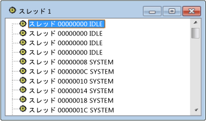

# Threads View
[!INCLUDE[vs2017banner](../code-quality/includes/vs2017banner.md)]

スレッド ビューには、システム上のウィンドウに関連付けられているすべてのスレッドが一覧表示されます。  スレッドごとにスレッド ID とモジュール名が表示されます。  プロセスは含まれませんが、選択したスレッドを所有するプロセスを簡単に特定できます。  
  
## 手順  
  
#### スレッド ビューを開くには  
  
1.  \[スパイ\] メニューの \[スレッド\] をクリックします。  
  
   
Spy\+\+ のスレッド ビュー  
  
 上の図はスレッド ビューを示しています。  
  
## このセクションの内容  
 [スレッド ビューでのスレッドの検索](../debugger/how-to-search-for-a-thread-in-threads-view.md)  
 スレッド ビューで特定のスレッドを検索する方法について説明します。  
  
 [スレッド プロパティの表示](../Topic/How%20to:%20Display%20Thread%20Properties.md)  
 スレッドの詳細情報を表示する方法について説明します。  
  
## 関連項目  
 [Spy\+\+ ビュー](../debugger/spy-increment-views.md)  
 ウィンドウ、メッセージ、プロセス、およびスレッドの Spy\+\+ ツリー ビューについて説明します。  
  
 [Spy\+\+ の使用](../debugger/using-spy-increment.md)  
 Spy\+\+ ツールとその使用方法について説明します。  
  
 [&#91;スレッド検索&#93; ダイアログ ボックス](../debugger/thread-search-dialog-box.md)  
 スレッド ビューで特定のスレッドのノードを検索するために使用します。  
  
 [&#91;スレッド プロパティ&#93; ダイアログ ボックス](../debugger/message-properties-dialog-box.md)  
 スレッド ビューまたはメッセージ ビューで選択したスレッドのプロパティを表示します。  
  
 [Spy\+\+ リファレンス](../debugger/spy-increment-reference.md)  
 Spy\+\+ の各メニューとダイアログ ボックスについて説明するセクションが含まれます。