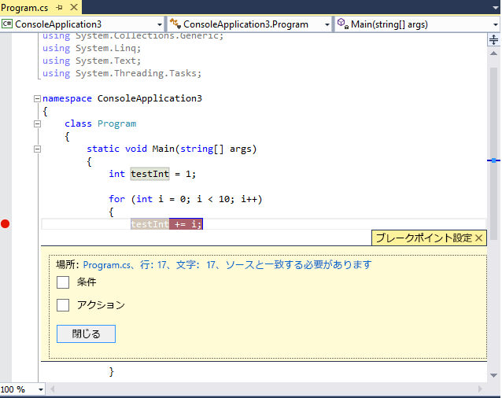
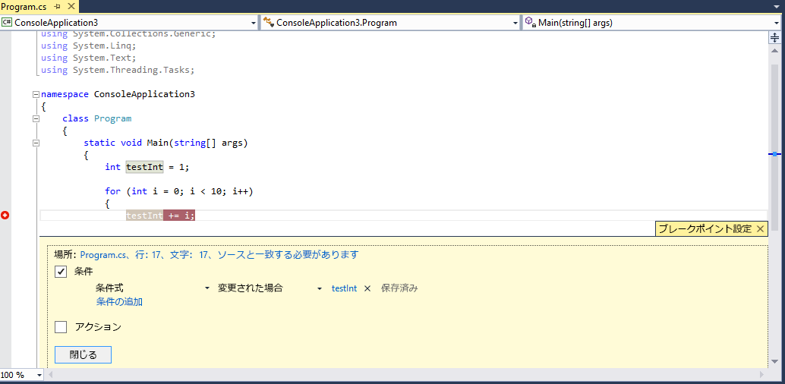
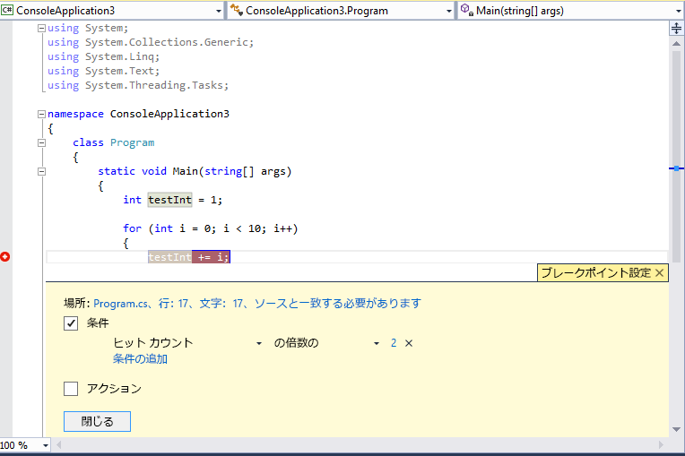

# <a name="use-breakpoints-in-the-visual-studio-debugger"></a>Visual Studio デバッガーでブレークポイントを使用します。
コードの変数の状態や呼び出し履歴の確認などのために、デバッガーの実行を停止するときにブレークポイントを設定できます。 ブレークポイントは、開発者が利用できる重要なデバッグ手法の 1 つです。  
  
##  <a name="BKMK_Overview"></a> ソース コード内の行のブレークポイントの設定  
 ソース コード ファイルでは、左余白をクリックして、またはコードの行にカーソルを設定し、f9 キーを押して、ソース コードで行のブレークポイントを設定します。 ブレークポイントの印として左側の余白に赤い点が表示され、コードの行にも色が設定されます。  
  
   
  
 デバッガーでこのコードを実行してブレークポイントに達すると、ブレークポイントの行のコードが実行される前に、実行は停止されます。 ソース コードの行は黄色で表示されます。  
  
   
  
 この時点で、 `testInt` の値は 1 のままです。  
  
 変数の値や呼び出し履歴など、アプリケーションの現在の状態を確認できます。 呼び出し履歴の詳細については、「 [How to: Use the Call Stack Window](../debugger/how-to-use-the-call-stack-window.md)」を参照してください。  
  
 ブレークポイントは、実行可能ファイルの任意のコード行に設定できます。 たとえば、上記の C# コードでは、変数の宣言、 `for` ループ、または `for` ループ内の任意のコードにブレークポイントを設定できますが、名前空間またはクラスの宣言、またはメソッドのシグネチャにはブレークポイントを設定できません。  
  
##  <a name="BKMK_Set_a_breakpoint_in_a_source_file"></a> 関数のブレークポイントを設定  
  関数が呼び出されたときに、実行を中断することができます。
  
1. 開く、**ブレークポイント**ウィンドウを選択して**新規 > 関数のブレークポイント**です。

2. 関数の名前を入力、**関数名**ボックス。 

   関数の仕様を絞り込むには。
   
   完全修飾関数名を使用します。 
   例: Namespace1.ClassX.MethodA()
   
   オーバー ロードされた関数のパラメーターの型を追加します。 
   例: MethodA (int, string)
   
   使用して、'!' 記号、モジュールを指定します。
   例: App1.dll!MethodA
   
   ネイティブ C++ では、コンテキスト演算子を使用します。
   {関数で、[モジュール]}[+&lt;メソッドの先頭からの行のオフセット&gt;] 例: {MethodA、, App1.dll}+2

3. **言語**ドロップダウン リストにブレークポイントを設定関数の特定の言語を選択します。
  
##  <a name="BKMK_Set_a_breakpoint_in_a_function"></a> その他のブレークポイントのを設定  
 データの条件またはメモリ アドレスによっては、呼び出し履歴、[逆アセンブリ] ウィンドウ、およびネイティブ C++ コードにもブレークポイントを設定できます。  
  
## <a name="BKMK_Set_a_breakpoint_in_the_call_stack_window"></a> [呼び出し履歴] ウィンドウでブレークポイントを設定する  
 **[呼び出し履歴]** ウィンドウでブレークポイントを設定することで、呼び出し元の関数が返す命令または行で実行を中断できます。 呼び出し履歴の詳細については、「 [How to: Use the Call Stack Window](../debugger/how-to-use-the-call-stack-window.md)」を参照してください。 デバッガーの実行は停止している必要があります。  
  
1.  アプリケーションのデバッグを開始し、(ブレークポイントの位置などで) 実行が停止するまで待ちます。 開く、**呼び出し履歴**ウィンドウ (**デバッグ > Windows > 呼び出し履歴**、または**CTRL + ALT + C**)。  
  
2.  呼び出し元の関数を右クリックし、**ブレークポイント > ブレークポイントの挿入**、ショートカット キーを使用または**F9**です。  
  
3.  関数呼び出し名の左側の余白にブレークポイント シンボルが表示されます。  
  
 **[ブレークポイント]** ウィンドウには、関数内の次に実行可能な命令に対応するメモリ位置に設定されたアドレスとして、呼び出し履歴のブレークポイントが表示されます。 デバッガーはその命令で実行を中断します。  
  
 視覚的にブレークポイントをトレースするコードの実行中に、次を参照してください。[デバッグ中に、呼び出し履歴に対するメソッドのマップ](../debugger/map-methods-on-the-call-stack-while-debugging-in-visual-studio.md)です。  
  
## <a name="setting-a-breakpoint-in-the-disassembly-window"></a>[逆アセンブリ] ウィンドウでブレークポイントを設定する  
 アセンブリ命令にブレークポイントを設定するには、デバッガーが中断モードになっている必要があります。  
  
1.  アプリケーションのデバッグを開始し、(ブレークポイントの位置などで) 実行が停止するまで待ちます。 開く、**逆アセンブル**ウィンドウ (**デバッグ > Windows > 逆アセンブル**、または**Ctrl + Alt + D**)。  
  
2.  中断する命令の左側の余白をクリックするか、命令をポイントして **F9**キーを押します。  
  
## <a name="BKMK_set_a_data_breakpoint_native_cplusplus_only"></a>データ ブレークポイントの設定 (ネイティブ C++ のみ)  
 データ ブレークポイントを使用すると、指定したメモリ位置に格納された値が変更されたときに、実行が中断されます。 値が読み取られても変更されていなければ、実行は中断されません。 データ ブレークポイントを設定するには、デバッガーが中断モードになっている必要があります。  
  
1.  アプリケーションのデバッグを開始し、ブレークポイントに到達するまで待ちます。 **デバッグ**] メニューの [選択**新しいブレークポイント > データ ブレークポイント**(を開いたり、**ブレークポイント**ウィンドウを選択し、**新規 > データ ブレークポイント**.  
  
2.  **[アドレス]** ボックスに、メモリ アドレス、またはメモリ アドレスを表す式を入力します。 たとえば、「 `&avar` 」と入力すると、変数 `avar` の値が変更されたときに中断します。  
  
3.  **[バイト数]** ドロップダウンで、デバッガーがウォッチするバイト数を選択します。 たとえば、 **[4]**を選択すると、 `&avar` で始まる 4 バイトがウォッチされ、そのバイト値のいずれかが変更されると中断します。  
  
 データ ブレークポイントは、特定のメモリ アドレスの適用範囲に依存している点に注意してください。  
  
-   変数のアドレスは、デバッグ セッションごとに変わります。 データ ブレークポイントは、デバッグ セッションが終了すると自動的に無効になります。  
  
-   ローカル変数にデータ ブレークポイントを設定すると、関数が終了してもブレークポイントは有効なままですが、メモリ アドレスは変更されるので、ブレークポイントは予測どおりに機能しなくなります。 データ ブレークポイントをローカル変数に設定した場合は、関数が終了する前にブレークポイントを削除するか無効にすることをお勧めします。  
  
 データ ブレークポイントは次の条件では機能しません。  
  
-   デバッグ対象外のプロセスがメモリ位置に書き込む場合  
  
-   メモリ位置が複数のプロセス間で共有されている場合  
  
-   メモリ位置がカーネル内で更新される場合 たとえば、32 ビット Windows の `ReadFile` 関数にメモリが渡された場合、メモリはカーネル モードから更新されるので、メモリの書き込み時にもデバッガーは中断されません。  
  
## <a name="setting-a-breakpoint-with-a-memory-address-native-c-only"></a>メモリ アドレス (ネイティブ C++ のみ) を使用したブレークポイントの設定  
 オブジェクトのアドレスを使用して、クラスの特定のインスタンスで呼び出したメソッドにブレークポイントを設定することもできます。  次に例を示します。  
  
 たとえば、アドレスを使用して型 `my_class` のオブジェクトを指定する場合、そのインスタンスから呼び出される `my_method` という名前のメソッドに関数のブレークポイントを設定できます。  
  
1.  クラスのそのインスタンスがインスタンス化された後のどこかにブレークポイントを設定します。  
  
2.  インスタンスのアドレスを見つけます (ここでは `0xcccccccc`)。  
  
3.  をクリックして**デバッグ > 新しいブレークポイント > 関数のブレークポイント**(または**ALT + F9, B**)。  
  
4.  次のテキストを **[関数名]** ボックスに追加します。  
  
    ```C++  
    ((my_class *) 0xcccccccc)->my_method  
    ```  
  
##  <a name="BKMK_Specify_advanced_properties_of_a_breakpoint_"></a> ブレークポイントを管理する  
 使用することができます、**ブレークポイント**ウィンドウ (**デバッグ > Windows > ブレークポイント**、または**CTRL + ALT + B**)、ソリューション内のすべてのブレークポイントを設定しました。  
  
 ![[ブレークポイント] ウィンドウ](../debugger/media/breakpointswindow.png "BreakpointsWindow")  
  
 **[ブレークポイント]** ウィンドウでは、すべてのブレークポイントを一元的に管理できるます。ブレークポイントが重要な大規模なソリューションや複雑なデバッグ シナリオで、このウィンドウは特に役立ちます。 一連のブレークポイントの状態と位置を保存または共有する必要がある場合、 **[ブレークポイント]** ウィンドウからのみ、ブレークポイントをエクスポートおよびインポートできます。  
  
##  <a name="BKMK_Specify_a_breakpoint_condition_using_a_code_expression"></a> 高度なブレークポイント  
  
## <a name="breakpoint-conditions"></a>ブレークポイント条件  
 条件を設定して、ブレークポイントを実行するタイミングと場所を制御することができます。  
  
1.  ブレークポイントを右クリックするか、ブレークポイントをポイントして設定アイコンをクリックします。  
  
2.  コンテキスト メニューで **[条件]**を選択します。 **[ブレークポイント設定]** ウィンドウが開きます。  
  
   
  
 **[条件]** ボックスをオンにすると、ウィンドウが展開され、さまざまな種類の条件が表示されます。  
  
 **条件式:** [条件式] を選択すると、 **[true の場合]** と **[変更された場合]**という 2 つの条件を選択できます。 式の条件を満たす場合に中断するときは **[true の場合]** をオンにし、式の値が変更されたときに中断するときは **[変更された場合]** をオンにします。  
  
 次の例では、 `testInt` の値が **4**の場合にのみ、ブレークポイントがヒットするように設定します。  
  
   
  
 次の例では、 `testInt` の値が変更された場合にのみ、ブレークポイントがヒットするように設定します。  
  
   
  
 [変更された場合] フィールドの動作は、プログラミング言語によって異なります。 ネイティブ コードに対して **[変更された場合]** をオンにしている場合、デバッガーは条件の最初の評価を変更と見なさないため、最初の評価でブレークポイントはヒットしません。 選択した場合**変更されたときに**、マネージ コードの後に最初の評価でブレークポイントにヒット**変更されたときに**が選択されています。  
  
 無効な構文でブレークポイント条件を設定すると、警告メッセージが表示されます。 有効な構文でブレークポイント条件を指定しても、セマンティクスが無効な場合は、ブレークポイントに初めて達したときに警告メッセージが表示されます。 どちらの場合でも、無効なブレークポイントに達すると実行が中断されます。 ブレークポイント条件が有効で、評価結果が `false`の場合にのみ、ブレークポイントはスキップされます。  
  
 条件には、デバッガーによって認識される有効な式を指定できます。 有効な式の詳細については、「 [Expressions in the Debugger](../debugger/expressions-in-the-debugger.md)」を参照してください。  

> [!NOTE]
> 使用することができます**CTRL + Enter**を閉じる、**ブレークポイントの設定**ウィンドウです。
  
## <a name="using-object-ids-in-breakpoint-conditions-c-and-f"></a>ブレークポイント条件 (C# および F#) でのオブジェクト ID の使用  
 特定のオブジェクトの動作を確認することが必要になる場合があります。たとえば、オブジェクトがコレクションに複数回挿入された理由を確認することが必要になる場合があります。 C# と F# では、 [参照型](/dotnet/csharp/language-reference/keywords/reference-types) の特定のインスタンスのオブジェクト ID を作成し、それらの ID をブレークポイントの条件で使用できます。 オブジェクト ID は、共通言語ランタイム (CLR) のデバッグ サービスで生成されて、オブジェクトに関連付けられます。  オブジェクト ID を作成するには、次の手順を実行します。  
  
1.  コードで、オブジェクトが作成されてからしばらく経った時点にブレークポイントを設定します。  
  
2.  デバッグを開始し、ブレークポイントで実行が停止したら、 **[ローカル]** ウィンドウで対象のブレークポイントを見つけて右クリックし、 **[オブジェクト ID の作成]**を選択します。  
  
     **$** ウィンドウに、 **[ローカル]** ウィンドウでブレークポイントを設定することで、呼び出し元の関数が返す命令または行で実行を中断できます。 これが、オブジェクト ID です。  
  
3.  オブジェクトがコレクションに追加されるときなど、調査が必要となるポイントに、新しい条件付きブレークポイントを追加します。  
  
4.  [条件式] フィールドでは、オブジェクト ID を使用します。 たとえば、コレクションに追加するオブジェクトを参照する変数 `item` が存在する場合、「 **item == $n**」と入力します。ここで、 **n** はオブジェクト ID 番号です。  
  
     そのオブジェクトがコレクションに追加されると、実行が停止します。  
  
 後でオブジェクト ID を削除する場合は、 **[ローカル]** ウィンドウで変数を右クリックして、 **[オブジェクト ID の削除]**を選択します。  
  
 オブジェクト ID によって作成される参照は弱い参照であり、これにより、オブジェクトがガベージ コレクションの対象から除外されることはないことに注意してください。 オブジェクト ID は、現在のデバッグ セッションでのみ有効です。  
  
## <a name="hit-count"></a>ヒット カウント  
 指定したヒット カウントを繰り返し押しますに強制されているのではなく、コードの関連する行を超える数の後に実行を停止するブレークポイントを設定するには、コード内のループが、特定のイテレーションの数の後に誤動作を起動すると思われる場合**f5 キーを押します**イテレーション レベルに到達します。  
  
 **[ブレークポイントの設定]** ウィンドウで、 **[ヒット カウント]**に条件を設定します。 次に、イテレーション回数を指定できます。 次の例では、イテレーションごとにヒットするようにブレークポイントを設定します。  
  
   
  
## <a name="filter"></a>フィルター  
 指定されたデバイスでのみ、または指定されたプロセスとスレッドでのみ、ブレークポイントが発生するように制限できます。  
  
 **[ブレークポイントの設定]**ウィンドウで、 **[フィルター]**に条件を設定します。 次の式のうち 1 つ以上を入力します。  
  
-   MachineName = "name"  
  
-   ProcessId = value  
  
-   ProcessName = "name"  
  
-   ThreadId = value  
  
-   ThreadName = "name"  
  
 文字列の値を二重引用符で囲みます。 句は、 `&` (AND)、 `||` (OR)、 `!` (NOT)、およびかっこを使用して結合できます。  
  
##  <a name="BKMK_Print_to_the_Output_window_with_tracepoints"></a> ブレークポイント アクションとトレースポイント  
 トレースポイントは、[出力] ウィンドウにメッセージを出力するブレークポイントです。 トレースポイントはプログラミング言語の一時的なトレース ステートメントのように機能できます。  
  
 **[ブレークポイントの設定]** ウィンドウで、 **[アクション]** ボックスをオンにします。 **[アクション]** グループの **[出力ウィンドウにメッセージを記録する]** を選択します。 **"これはテストです"**など、汎用文字列を出力することができます。 変数または式の値を含めるには、中かっこで囲みます。  書式指定子を使用することもできます ([c#](../debugger/format-specifiers-in-csharp.md)と[C++](../debugger/format-specifiers-in-cpp.md)) のトレース ポイントに含まれる値。
  
 トレースポイントがヒットしときに実行を中断するには、 **[続けて実行する]** チェック ボックスをオフにします。 **[続けて実行する]** をオンにすると、実行は停止しません。 どちらの場合も、メッセージが出力されます。  
  
 次の特別なキーワードを **[メッセージ]**に使用できます。  
  
|||  
|-|-|  
|**$ADDRESS**|現在の命令|  
|**$CALLER**|関数名の呼び出し|  
|**$CALLSTACK**|[呼び出し履歴]|  
|**$FUNCTION**|現在の関数名|  
|**$PID**|プロセス ID|  
|**$PNAME**|プロセス名|  
|**$TID**|スレッド ID|  
|**$TNAME**|スレッド名|  
|**$TICK**||  
|**$TNAME**||  
  
##  <a name="BKMK_Set_a_breakpoint_at_a_function_return_in_the_Call_Stack_window"></a> ブレークポイントのラベル  
 ブレークポイントのラベルは、 **[ブレークポイント]** ウィンドウでブレークポイントの一覧の並べ替えとフィルターにのみ使用します。 ブレークポイントにラベルを追加するには、ブレークポイントの行を選択し、コンテキスト メニューの **[ラベル]** をクリックします。  
  
## <a name="export-and-import-breakpoints"></a>ブレークポイントをエクスポートおよびインポートする  
 XML ファイルにブレークポイントをエクスポートするには、ブレークポイントを右クリックし、 **[エクスポート]**を選択します。 既定で、ファイルはソリューション ディレクティブに保存されます。 ブレークポイントをインポートするには、 **[ブレークポイント]** ウィンドウを開き (**CTRL + ALT + B**キー)、ツールバーの右向き矢印をクリックします (ツールヒントは **[ファイルからブレークポイントをインポートします]**です)。  
  
## <a name="see-also"></a>関連項目  
[Visual Studio デバッガーでブレークポイントをトラブルシューティングします。](../debugger/troubleshooting-breakpoints.md)  
[デバッガーでのコード間の移動](../debugger/navigating-through-code-with-the-debugger.md)
