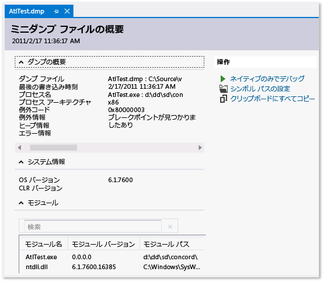

# ダンプ ファイルを使用したアプリのクラッシュとハングのデバッグ
[!INCLUDE[vs2017banner](../code-quality/includes/vs2017banner.md)]

ヒープ情報あり\/なしのダンプ ファイル、ダンプ ファイルを作成する、ダンプ ファイルを開く、ダンプ ファイルのバイナリ、PDB、ソース ファイルを検索する  
  
##   内容  
 [ダンプ ファイルとは](#BKMK_What_is_a_dump_file_)  
  
 [ヒープ情報あり/なしのダンプ ファイル](#BKMK_Dump_files__with_or_without_heaps)  
  
 [要件と制限](#BKMK_Requirements_and_limitations)  
  
 [ダンプ ファイルを作成する](#BKMK_Create_a_dump_file)  
  
 [ダンプ ファイルを開く](#BKMK_Open_a_dump_file)  
  
 [バイナリ、シンボル (.pdb) ファイル、ソース ファイルを検索する](#BKMK_Find_binaries__symbol___pdb__files__and_source_files)  
  
##   ダンプ ファイルとは  
 *ダンプ ファイル*は、ダンプの作成時におけるアプリのスナップショットです。  ダンプ ファイルには、実行されたプロセスと読み込まれたモジュールが示されます。  ダンプがヒープ情報と共に保存された場合、ダンプ ファイルにはその時点におけるアプリのメモリの内容のスナップショットも含まれています。  Visual Studio でヒープ情報ありのダンプ ファイルを開くのは、デバッグ セッションのブレークポイントで実行を中断するようなものです。  実行を続行することはできませんが、ダンプの作成時におけるアプリのスタック、スレッド、変数値を調べることができます。  
  
 ダンプが主に使用されるのは、開発者がアクセスできないコンピューター上で発生する問題をデバッグする場合です。  たとえば、顧客のクラッシュやハングアップの状況を自分のコンピューターで再現できないときは、顧客のコンピューターからのダンプ ファイルを使用できます。  ダンプはテスターによっても作成されてクラッシュまたはハングアップ データの保存に使用されるため、テスト コンピューターを使用してより多くのテストを行えるようになります。  Visual Studio デバッガーでは、マネージまたはネイティブ コードのダンプ ファイルを保存できます。  デバッガーでは、Visual Studio によって作成されたダンプ ファイルも、他のプログラムによって作成されて*ミニダンプ*形式で保存されたダンプ ファイルも読み込むことができます。  
  
  [内容](#BKMK_Contents)  
  
##   ヒープ情報あり\/なしのダンプ ファイル  
 ヒープ情報あり\/なしのダンプ ファイルを作成できます。  
  
-   **ヒープ情報ありのダンプ ファイル**には、アプリのメモリのスナップショットが含まれています。  ダンプの作成時における変数値も含まれています。  ヒープ情報と共に保存されたダンプ ファイルを読み込む場合、Visual Studio はアプリケーション バイナリが見つからなくてもシンボルを読み込むことができます。  また、Visual Studio は、読み込まれたネイティブ モジュールのバイナリをダンプ ファイルに保存するため、デバッグが大幅に簡単になります。  
  
-   **ヒープ情報なしのダンプ ファイル**は、ヒープ情報ありのダンプよりも、サイズがはるかに小さくなります。  ただし、デバッガーはアプリのバイナリを読み込んでシンボル情報を見つける必要があります。  バイナリはダンプの作成時に使用されたバイナリと完全に一致する必要があります。  ヒープ情報なしのダンプ ファイルには、スタック変数の値のみ保存されます。  
  
  [内容](#BKMK_Contents)  
  
##   要件と制限  
  
-   最適化されたコードのダンプ ファイルをデバッグすると、混乱が生じることがあります。  たとえば、コンパイラによる関数のインライン展開により、予期しない呼び出し履歴になっていたり、その他の最適化により、変数の有効期間が変更されていたりします。  
  
-   64 ビット コンピューターからのダンプ ファイルは、64 ビット コンピューター上で実行される Visual Studio のインスタンス上でデバッグする必要があります。  
  
-   VS 2013 より前の Visual Studio のバージョンでは、一部のツール \(タスク マネージャーや 64 ビット WinDbg など\) によって収集された 64 ビット コンピューター上で実行する 32 ビット アプリケーションのダンプは Visual Studio で開くことができませんでした。  VS 2013 ではこの制限はありません。  
  
-   Visual Studio では、ARM デバイスからのネイティブ アプリのダンプ ファイルをデバッグできます。  また、ARM デバイスからのマネージ アプリのダンプ ファイルもデバッグできますが、これはネイティブ デバッガーでのみ可能です。  
  
-   [カーネル モード](http://msdn.microsoft.com/library/windows/hardware/ff551880.aspx) ダンプ ファイルを Visual Studio 2013 でデバッグするには、[Windows 8.1 バージョンの Windows 対応デバッグ ツール](http://msdn.microsoft.com/windows/hardware/gg463009)をダウンロードします。  「[Visual Studio でのカーネル デバッグ](http://msdn.microsoft.com/library/windows/hardware/jj149675.aspx)」を参照してください。  
  
-   Visual Studio では、[フル ユーザー モード ダンプ](http://msdn.microsoft.com/library/windows/hardware/ff545506.aspx)という以前のダンプ形式で保存されたダンプ ファイルをデバッグすることはできません。  フル ユーザー モード ダンプがヒープ情報ありのダンプとは異なることに注意してください。  
  
-   Visual Studio の [SOS.dll \(SOS デバッガー拡張\)](../Topic/SOS.dll%20\(SOS%20Debugging%20Extension\).md) でデバッグするには、Windows ドライバー キット \(WDK\) の一部である Windows 対応のデバッグ ツールをインストールする必要があります。  「[Windows 8.1: キットとツールのダウンロード](http://msdn.microsoft.com/library/windows/hardware/bg127147.aspx)」を参照してください。  
  
  [内容](#BKMK_Contents)  
  
##   ダンプ ファイルを作成する  
 Visual Studio でダンプ ファイルを作成するには:  
  
-   Visual Studio でのプロセスのデバッグ中、デバッガーが例外またはブレークポイントで停止するときに、ダンプ ファイルを保存できます。  **\[名前を付けてダンプを保存\]**、**\[デバッグ\]** の順にクリックします。  **\[名前を付けてダンプを保存\]** ダイアログ ボックスの **\[ファイルの種類\]** ボックスの一覧で、**\[ミニ ダンプ\]** または **\[ヒープ付きミニダンプ\]** \(既定\) を選択できます。  
  
-   [Just\-In\-Time デバッグ](../debugger/just-in-time-debugging-in-visual-studio.md) を有効にすると、デバッガーの外部で実行中のクラッシュしたプロセスにデバッガーをアタッチし、ダンプ ファイルを保存できます。  「[実行中のプロセスへのアタッチ](../debugger/attach-to-running-processes-with-the-visual-studio-debugger.md)」を参照してください  
  
 Windows ミニダンプ形式をサポートするプログラムでもダンプ ファイルを作成できます。  たとえば、[Windows Sysinternals](http://technet.microsoft.com/sysinternals/default) の **Procdump** コマンド ライン ユーティリティでは、トリガーまたは必要に応じてプロセスのクラッシュ ダンプ ファイルを作成できます。  その他のツールの使用したダンプ ファイルの作成の詳細については、このトピックの「[要件と制限](../debugger/using-dump-files.md#BKMK_Requirements_and_limitations)」を参照してください。  
  
  [内容](#BKMK_Contents)  
  
##   ダンプ ファイルを開く  
  
1.  Visual Studio で **\[ファイル\]**、**\[開く\]**、**\[ファイル\]** の順にクリックします。  
  
2.  **\[ファイルを開く\]** ダイアログ ボックスで、ダンプ ファイルを探して選択します。  通常は拡張子 .dmp が付いています。  次に、**\[OK\]** をクリックします。  
  
3.  **\[ダンプ ファイルの概要\]** ウィンドウが表示されます。  このウィンドウでは、ダンプ ファイルのデバッグに関する概要情報を確認し、シンボル パスを設定したりデバッグを開始したりすることができます。概要情報をクリップボードにコピーすることもできます。  
  
       
  
4.  デバッグを開始するには、**\[アクション\]** セクションに移動し、**\[ネイティブのみでデバッグ\]** または **\[混合でデバッグ\]** を選択します。  
  
##   バイナリ、シンボル \(.pdb\) ファイル、ソース ファイルを検索する  
 Visual Studio でダンプ ファイルのデバッグ機能をすべて使用するには、次のファイルにアクセスできる必要があります。  
  
-   ダンプの作成に使用した .exe ファイルと、ダンプ プロセスで使用したその他のファイルおよびバイナリ \(DLL など\)。  
  
     ヒープ情報ありのダンプをデバッグする場合、Visual Studio は、一部のモジュールにバイナリ ファイルが欠落している状況にも対処できますが、有効な呼び出し履歴を生成できる十分なモジュールのバイナリがあることが必要です。  Visual Studio は、ネイティブ モジュールのバイナリをヒープ情報ありのダンプ ファイルに保存します。  
  
-   .exe およびその他のバイナリのシンボル \(.pdb\) ファイル。  
  
-   目的のモジュールのソース ファイル。  
  
     実行可能ファイルと .pdb ファイルは、ダンプの作成時に使用したものと、バージョンおよびビルドが正確に一致している必要があります。  
  
     ソース ファイルを見つけることができない場合は、モジュールの逆アセンブルを使用してデバッグできます。  
  
 **実行可能ファイルの既定の検索パス**  
  
 Visual Studio では、ダンプ ファイルに含まれていない実行可能ファイルが次の場所で自動的に検索されます。  
  
1.  ダンプ ファイルが格納されているディレクトリ。  
  
2.  ダンプ ファイルで指定されたモジュールのパス。  これは、ダンプが収集されたコンピューター上のモジュール パスです。  
  
3.  Visual Studio の **\[ツール\]**\/**\[オプション\]** ダイアログ ボックスの **\[デバッグ\]**\/**\[オプション\]**\/**\[シンボル\]** ページで指定されたシンボル パス。  検索する複数の場所をこのページで追加できます。  
  
 **\[バイナリが見つかりません\]、\[シンボルが見つかりません\]、\[ソースが見つかりません\] のページの使用**  
  
 Visual Studio でダンプ内のモジュールをデバッグするために必要なファイルが見つからない場合は、該当するページ \(**\[バイナリが見つかりません\]**、**\[シンボルが見つかりません\]**、または **\[ソースが見つかりません\]**\) が表示されます。  これらのページでは、問題の原因に関する詳細な情報が表示され、ファイルの正しい場所を特定するために役立つアクション リンクも表示されます。  「[シンボルとソース コードの管理](../debugger/specify-symbol-dot-pdb-and-source-files-in-the-visual-studio-debugger.md)」を参照してください。  
  
  [内容](#BKMK_Contents)  
  
## 参照  
 [Just\-In\-Time デバッグ](../debugger/just-in-time-debugging-in-visual-studio.md)   
 [シンボルとソース コードの管理](../debugger/specify-symbol-dot-pdb-and-source-files-in-the-visual-studio-debugger.md)   
 [IntelliTrace の使用](../debugger/intellitrace.md)