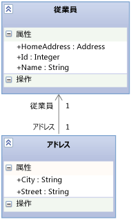

# <a name="using-the-intellitrace-stand-alone-collector"></a>IntelliTrace スタンドアロン コレクターを使用する
**IntelliTrace スタンドアロン コレクター** を使用すると、対象コンピューターに Visual Studio をインストールしたり、対象システムの環境を変更したりすることなく、運用サーバーまたは他の環境でアプリの IntelliTrace 診断データを収集できます。 IntelliTrace スタンドアロン コレクターは、Web、SharePoint、WPF、および Windows フォーム アプリで動作します。 データを収集したら、コレクターを削除して、アンインストールします。  
  
 「 [デバッグ用に稼働中のデータを収集して分析する (Channel 9 ビデオ)](http://go.microsoft.com/fwlink/?LinkID=251851)」で IntelliTrace の機能をご覧ください。  
  
> [!NOTE]
>  **Microsoft Monitoring Agent** を **トレース** モードで使用して、リモート マシン上で実行されている Web および SharePoint アプリの同じ IntelliTrace データを収集することもできます。  
>   
>  IntelliTrace データ内のパフォーマンス関連イベントを収集するには、エージェントを **モニター** モードで実行します。 **モニター** モードは、 **トレース** モードや **IntelliTrace スタンドアロン コレクター**よりもパフォーマンスに及ぼす影響が少なくなります。 Microsoft Monitoring Agent がインストールされている場合、対象システムの環境が変更されます。 参照してください[Microsoft Monitoring Agent を使用して](../debugger/using-the-microsoft-monitoring-agent.md)です。  
  
 **Requirements**  
  
-   .NET Framework 3.5、4、または 4.5  
  
-   .iTrace ファイルを開くための、開発用コンピューターまたは別のコンピューター上の Visual Studio Enterprise (Professional Edition でも Community Edition でもなく)  
  
    > [!NOTE]
    >  必ずシンボル (.pdb) ファイルを保存してください。 IntelliTrace でデバッグおよびコードのステップ実行を行うには、対応するソース ファイルとシンボル ファイルが必要です。 参照してください[配置後の問題の診断](../debugger/diagnose-problems-after-deployment.md)です。  
  
 **FAQ**  
  
-   [コレクターで使用できるアプリ](#WhatApps)  
  
-   [開始方法](#GetStarted)  
  
-   [アプリのパフォーマンスの低下なしにほとんどのデータを取得する方法](#Minimizing)  
  
-   [IntelliTrace データを取得できるその他の場所](#WhereElse)  
  
##  <a name="WhatApps"></a> コレクターで使用できるアプリ  
  
-   インターネット インフォメーション サービス (IIS) Version 7.0、7.5、および 8.0 によってホストされる ASP.NET アプリ  
  
-   SharePoint 2010 アプリケーションと SharePoint 2013 アプリケーション  
  
-   Windows Presentation Foundation (WPF) および Windows フォーム アプリ。  
  
##  <a name="GetStarted"></a> 開始方法  
  
1.  [コレクターのインストール](#BKMK_Install_the_IntelliTrace_Stand_Alone_Collector)  
  
2.  [コレクター ディレクトリのアクセス許可を設定する](#ConfigurePermissionsRunningCollector)  
  
3.  [Web アプリまたは SharePoint アプリケーションのデータを収集するための IntelliTrace PowerShell コマンドレットをインストールする](#BKMK_Set_up_the_IntelliTrace_PowerShell_commandlets)  
  
4.  [.iTrace ファイル ディレクトリのアクセス許可を設定する](#BKMK_Create_and_Configure_a_Log_File_Directory)  
  
5.  [Web アプリまたは SharePoint アプリケーションからデータを収集する](#BKMK_Collect_Data_from_IIS_Application_Pools)  
  
     または  
  
     [マネージ アプリからのデータの収集](#BKMK_Collect_Data_from_Executables)  
  
6.  [Visual Studio Enterprise で .iTrace ファイルを開く](#BKMK_View_IntelliTrace_Log_Files)  
  
##  <a name="BKMK_Install_the_IntelliTrace_Stand_Alone_Collector"></a> コレクターのインストール  
  
1.  アプリのサーバーの場合は、たとえば、コレクター ディレクトリを作成します: **C:\IntelliTraceCollector**  
  
2.  Microsoft ダウンロード センターから、または Visual Studio 2013 Update 3 インストール フォルダーからコレクターを入手します。 [IntelliTrace Collector for Visual Studio 2013 Update 4](https://www.microsoft.com/en-us/download/details.aspx?id=44909)::  
  
    -   **Microsoft ダウンロード センター**:  
  
        1.  **IntelliTraceCollector.exe**の横の **[ダウンロード]**を選択します。  
  
        2.  IntelliTraceCollector.exe をコレクター ディレクトリ (たとえば、 **C:\IntelliTraceCollector**) に保存します。  
  
        3.  IntelliTraceCollector.exe を実行します。 IntelliTraceCollection.cab ファイルが抽出されます。  
  
         \- または  
  
    -   **Visual Studio インストール フォルダー**:  
  
        1.  次のフォルダーから IntelliTraceCollection.cab をコピーします。  
  
             **..\Microsoft visual Studio 12.0\Common7\IDE\CommonExtensions\Microsoft\IntelliTrace\12.0.0**  
  
        2.  IntelliTraceCollection.cab をコレクター ディレクトリ (たとえば、 **C:\IntelliTraceCollector**) に保存します。  
  
3.  IntelliTraceCollection.cab を展開します。  
  
    1.  アプリのサーバーでは、管理者としてコマンド プロンプト ウィンドウを開きます。  
  
    2.  コレクター ディレクトリ (たとえば、 **C:\IntelliTraceCollector**) を参照します。  
  
    3.  末尾のピリオド ( **.** ) も含めて**expand**コマンドを使用して、IntelliTraceCollection.cab を展開します。  
  
         `expand  /f:* IntelliTraceCollection.cab .`  
  
        > [!NOTE]
        >  ピリオド (**.**) を指定することにより、ローカライズされた収集計画を含むサブフォルダーが保持されます。  
  
##  <a name="ConfigurePermissionsRunningCollector"></a> コレクター ディレクトリのアクセス許可を設定する  
  
1.  アプリのサーバーでは、管理者としてコマンド プロンプト ウィンドウを開きます。  
  
2.  Windows の **icacls** コマンドを使用して、サーバー管理者に、コレクター ディレクトリに対する完全なアクセス許可を与えます。 例:  
  
     `icacls "C:\IntelliTraceCollector" /grant "` *\<Domain\AdministratorID >*`":F`  
  
3.  Web アプリまたは SharePoint アプリケーションのデータを収集するには:  
  
    1.  IntelliTrace PowerShell コマンドレットを実行するユーザーに、コレクター ディレクトリに対する完全なアクセス許可を与えます。  
  
         例:  
  
         `icacls "C:\IntelliTraceCollector" /grant "`*\<ドメイン >*`":F`  
  
    2.  Web アプリまたは SharePoint アプリケーションのアプリケーション プールに、コレクター ディレクトリに対する読み取りおよび実行アクセス許可を与えます。  
  
         次に例を示します。  
  
        -   **DefaultAppPool** アプリケーション プールの Web アプリの場合:  
  
             `icacls "C:\IntelliTraceCollector" /grant "IIS APPPOOL\DefaultAppPool":RX`  
  
        -   **SharePoint - 80** アプリケーション プールの SharePoint アプリケーションの場合:  
  
             `icacls "C:\IntelliTraceCollector" /grant "IIS APPPOOL\SharePoint - 80":RX`  
  
##  <a name="BKMK_Set_up_the_IntelliTrace_PowerShell_commandlets"></a> Web アプリまたは SharePoint アプリケーションのデータを収集するための IntelliTrace PowerShell コマンドレットをインストールする  
  
1.  アプリのサーバーで PowerShell が有効になっていることを確認します。 Windows Server のほとんどのバージョンでは、 **サーバー マネージャー** 管理ツールを使用してこの機能を追加できます。  
  
       
  
2.  IntelliTrace PowerShell コマンドレットをインストールします。  
  
    1.  管理者として PowerShell コマンド ウィンドウを開きます。  
  
        1.  **[スタート]**、 **[すべてのプログラム]**、 **[アクセサリ]**、 **[Windows PowerShell]**の順に選択します。  
  
        2.  次のいずれかの操作を実行します。  
  
            -   64 ビット オペレーティング システムでは、 **[Windows PowerShell]**のショートカット メニューを開きます。 **[管理者として実行]**を選択します。  
  
            -   32 ビット オペレーティング システムでは、 **[Windows PowerShell (x86)]**のショートカット メニューを開きます。 **[管理者として実行]**を選択します。  
  
    2.  PowerShell コマンド ウィンドウで、 **Import-Module** コマンドを使用して **Microsoft.VisualStudio.IntelliTrace.PowerShell.dll**をインポートします。  
  
         次に例を示します。  
  
         `Import-Module "C:\IntelliTraceCollector\Microsoft.VisualStudio.IntelliTrace.PowerShell.dll"`  
  
##  <a name="BKMK_Create_and_Configure_a_Log_File_Directory"></a> .iTrace ファイル ディレクトリのアクセス許可を設定する  
  
1.  アプリのサーバーの場合は、たとえば、.iTrace ファイル ディレクトリを作成します: **C:\IntelliTraceLogFiles**  
  
    > [!NOTE]
    >  -   アプリのパフォーマンスの低下を回避するのには非常にアクティブでないローカルの高速なディスク上の場所を選択します。  
    > -   .iTrace ファイルとコレクター ファイルは同じ場所に配置できます。 ただし、Web アプリまたは SharePoint アプリケーションがある場合は、この場所がアプリケーションをホストするディレクトリの外部にあることを確認します。  
  
    > [!IMPORTANT]
    >  -   .iTrace ファイル ディレクトリへのアクセスを、コレクターを使用する必要がある ID のみに制限します。 IntelliTrace はメソッド パラメーターに渡されるデータや戻り値として渡されるデータを記録できるため、ユーザー、データベース、その他のソースの場所、および接続文字列のデータなどの重要情報が .iTrace ファイルに含まれることがあります。  
    > -   .iTrace ファイルを開くことができるユーザーが、重要情報を表示する権限が与えられているユーザーであることを確認します。 .iTrace ファイルを共有する場合は注意してください。 他のユーザーがアクセスを必要とするときは、安全な共有の場所にファイルをコピーします。  
  
2.  Web アプリまたは SharePoint アプリケーションのアプリケーション プールに、.iTrace ファイル ディレクトリに対する完全なアクセス許可を与えます。 Windows の **icacls** コマンドまたはエクスプローラー (またはファイル エクスプローラー) を使用できます。  
  
     次に例を示します。  
  
    -   Windows の **icacls** コマンドを使用してアクセス許可を設定するには:  
  
        -   **DefaultAppPool** アプリケーション プールの Web アプリの場合:  
  
             `icacls "C:\IntelliTraceLogFiles" /grant "IIS APPPOOL\DefaultAppPool":F`  
  
        -   **SharePoint - 80** アプリケーション プールの SharePoint アプリケーションの場合:  
  
             `icacls "C:\IntelliTraceLogFiles" /grant "IIS APPPOOL\SharePoint - 80":F`  
  
         または  
  
    -   エクスプローラー (またはファイル エクスプローラー) を使用してアクセス許可を設定するには:  
  
        1.  .iTrace ファイル ディレクトリの **[プロパティ]** を開きます。  
  
        2.  **[セキュリティ]** タブで、 **[編集]**、 **[追加]**を順に選択します。  
  
        3.  **[オブジェクトの種類を選択してください]** ボックスに **[ビルトイン セキュリティ プリンシパル]** が表示されることを確認します。 選択していない場合**オブジェクトの種類**に追加します。  
  
        4.  ローカル コンピューターが **[場所の指定]** ボックスに表示されることを確認します。 選択していない場合**場所**を変更します。  
  
        5.  **[選択するオブジェクト名を入力してください]** ボックスに、Web アプリまたは SharePoint アプリケーションのアプリケーション プールを追加します。  
  
        6.  **[名前の確認]** を選択して名前を解決します。 **[OK]**をクリックします。  
  
        7.  アプリケーション プールに対して **フル コントロール**のアクセス許可が設定されていることを確認します。  
  
##  <a name="BKMK_Collect_Data_from_IIS_Application_Pools"></a> Web アプリまたは SharePoint アプリケーションからデータを収集する  
  
1.  データの収集を開始するには、PowerShell のコマンド ウィンドウを管理者として開き、次のコマンドを実行します。  
  
     `Start-IntelliTraceCollection``"`  *\<ApplicationPool >* `"`  *\<PathToCollectionPlan >*  *\<FullPathToITraceFileDirectory >*  
  
    > [!IMPORTANT]
    >  このコマンドを実行した後、「 **Y** 」と入力してデータ収集を開始することを確認します。  
  
     たとえば、 **SharePoint - 80** アプリケーション プールの SharePoint アプリケーションからデータを収集するには、次のように入力します。  
  
     `Start-IntelliTraceCollection "SharePoint - 80" "C:\IntelliTraceCollector\collection_plan.ASP.NET.default.xml" "C:\IntelliTraceLogFiles"`  
  
    |||  
    |-|-|  
    |*ApplicationPool*|アプリケーションが実行されるアプリケーション プールの名前|  
    |*PathToCollectionPlan*|収集計画 (コレクターの設定を構成する .xml ファイル) へのパス。<br /><br /> コレクターに付属する計画を指定できます。 次の計画は、Web アプリと SharePoint アプリケーションに対して動作します。<br /><br /> -collection_plan.ASP.NET.default.xml<br />     例外、データベース呼び出し、および Web サーバー要求を含む IntelliTrace イベントと SharePoint イベントのみを収集します。<br />-collection_plan.ASP.NET.trace.xml<br />     関数呼び出しと、collection_plan.ASP.NET.default.xml のすべてのデータを収集します。 この計画は詳細な分析に適していますが、collection_plan.ASP.NET.default.xml よりもアプリの速度が低下する場合があります。<br /><br /> アプリの速度が低下するのを回避するには、これらの計画をカスタマイズするか、独自に計画を作成します。 セキュリティのために、コレクター ファイルと同じ安全な場所にカスタム計画を配置します。 「 [IntelliTrace 収集計画の作成およびカスタマイズ](http://go.microsoft.com/fwlink/?LinkId=227871) および「 [アプリのパフォーマンスの低下なしにほとんどのデータを取得する方法](#Minimizing) **注:**既定では、.iTrace ファイルの最大サイズは 100 MB です。 .iTrace ファイルがこの制限に達すると、ファイル中の最も古いエントリが削除され、新しいエントリを記録する場所が確保されます。 この制限を変更するには、収集計画の `MaximumLogFileSize` 属性を編集します。 <br /><br /> *これらの収集計画のローカライズ バージョンはどこで見つけられますか。*<br /><br /> ローカライズされた計画は、コレクターのサブフォルダーに格納されています。|  
    |*FullPathToITraceFileDirectory*|.iTrace ファイル ディレクトリへの完全パス。 **セキュリティに関する注意:**完全パス、相対パスではないを指定します。|  
  
     コレクターがアプリケーション プールにアタッチされ、データ収集が開始されます。  
  
     *この時点で .iTrace ファイルを表示できますか。* いいえ。データ収集中はファイルがロックされます。  
  
2.  問題を再現します。  
  
3.  .iTrace ファイルのスナップショットを取得するには、次の構文を使用します。  
  
     `Checkpoint-IntelliTraceCollection``"`  *\<ApplicationPool >*`"`  
  
4.  コレクションの実行状態を確認するには、次の構文を使用します。  
  
     `Get-IntelliTraceCollectionStatus`  
  
5.  データ収集を停止するには、次の構文を使用します。  
  
     `Stop-IntelliTraceCollection``"`  *\<ApplicationPool >*`"`  
  
    > [!IMPORTANT]
    >  このコマンドを実行した後、「 **Y** 」と入力してデータ収集を停止することを確認します。 この操作を行わないと、コレクターはデータを収集し続けます。iTrace ファイルはロックされたままになり、ファイルに有用なデータが含まれなくなる可能性があります。  
  
6.  [Visual Studio Enterprise で .iTrace ファイルを開く](#BKMK_View_IntelliTrace_Log_Files)  
  
##  <a name="BKMK_Collect_Data_from_Executables"></a> マネージ アプリからのデータの収集  
  
1.  アプリを起動すると同時にデータの収集を開始するには、次の構文を使用します。  
  
     *\<FullPathToIntelliTraceCollectorExecutable >* `\IntelliTraceSC.exe launch /cp:`  *\<PathToCollectionPlan >* `/f:`  *\<FullPathToITraceFileDirectoryAndFileName >*  *\<PathToAppExecutableFileAndFileName >*  
  
     たとえば、 **MyApp**という名前のアプリからデータを収集するには、次のように入力します。  
  
     `C:IntelliTraceCollectorIntelliTraceSC.exe launch /cp:"C:IntelliTraceCollectorcollection_plan.ASP.NET.default.xml" /f:"C:IntelliTraceLogFilesMyApp.itrace" "C:MyAppMyApp.exe"`  
  
    |||  
    |-|-|  
    |*FullPathToIntelliTraceCollectorExecutable*|コレクターの実行可能ファイルである IntelliTraceSC.exe への完全パス。|  
    |*PathToCollectionPlan*|収集計画 (コレクターの設定を構成する .xml ファイル) へのパス。<br /><br /> コレクターに付属する計画を指定できます。 次の計画は、マネージ アプリに対して動作します。<br /><br /> -collection_plan.ASP.NET.default.xml<br />     例外、データベース呼び出し、および Web サーバー要求を含む IntelliTrace イベントのみを収集します。<br />-collection_plan.ASP.NET.trace.xml<br />     関数呼び出しと、collection_plan.ASP.NET.default.xml のすべてのデータを収集します。 この計画は詳細な分析に適していますが、collection_plan.ASP.NET.default.xml よりもアプリの速度が低下する場合があります。<br /><br /> アプリの速度が低下するのを回避するには、これらの計画をカスタマイズするか、独自に計画を作成します。 セキュリティのために、コレクター ファイルと同じ安全な場所にカスタム計画を配置します。 「 [IntelliTrace 収集計画の作成およびカスタマイズ](http://go.microsoft.com/fwlink/?LinkId=227871) および「 [アプリのパフォーマンスの低下なしにほとんどのデータを取得する方法](#Minimizing) **注:**既定では、.iTrace ファイルの最大サイズは 100 MB です。 .iTrace ファイルがこの制限に達すると、ファイル中の最も古いエントリが削除され、新しいエントリを記録する場所が確保されます。 この制限を変更するには、収集計画の `MaximumLogFileSize` 属性を編集します。 <br /><br /> *これらの収集計画のローカライズ バージョンはどこで見つけられますか。*<br /><br /> ローカライズされた計画は、コレクターのサブフォルダーに格納されています。|  
    |*FullPathToITraceFileDirectoryAndFileName*|.iTrace ファイル ディレクトリへの完全パスと、拡張子 **.itrace** を含む .iTrace ファイル名。 **セキュリティに関する注意:**完全パス、相対パスではないを指定します。|  
    |*PathToAppExecutableFileAndFileName*|マネージ アプリのパスとファイル名。|  
  
2.  アプリを終了し、データ収集を停止します。  
  
3.  [Visual Studio Enterprise で .iTrace ファイルを開く](#BKMK_View_IntelliTrace_Log_Files)  
  
##  <a name="BKMK_View_IntelliTrace_Log_Files"></a> Visual Studio Enterprise で .iTrace ファイルを開く  
  
> [!NOTE]
>  IntelliTrace でデバッグおよびコードのステップ実行を行うには、対応するソース ファイルとシンボル ファイルが必要です。 参照してください[配置後の問題の診断](../debugger/diagnose-problems-after-deployment.md)です。  
  
1.  Visual Studio Enterprise (Professional Edition でも Community Edition でもなく) がインストールされたコンピューターに、.iTrace ファイルを移動またはコピーします。  
  
2.  Visual Studio の外部で .iTrace ファイルをダブルクリックするか、Visual Studio 内からファイルを開きます。  
  
     Visual Studio に **[IntelliTrace の概要]** ページが表示されます。 ほとんどのセクションにおいて、イベントまたは他の項目を確認したうえで項目を選択し、イベントが発生したポイントで IntelliTrace を使用してデバッグを開始できます。 参照してください[保存された IntelliTrace データを使用する](../debugger/using-saved-intellitrace-data.md)です。  
  
    > [!NOTE]
    >  IntelliTrace でデバッグおよびコードのステップ実行を行うには、対応するソース ファイルとシンボル ファイルが開発コンピューターに必要です。 参照してください[配置後の問題の診断](../debugger/diagnose-problems-after-deployment.md)です。  
  
##  <a name="Minimizing"></a> アプリのパフォーマンスの低下なしにほとんどのデータを取得する方法  
 IntelliTrace では大量のデータを収集できます。そのため、アプリのパフォーマンスへの影響は、IntelliTrace で収集するデータの種類、および分析するコードの種類によって決まります。 「 [運用サーバーでの IntelliTrace 収集の最適化](http://go.microsoft.com/fwlink/?LinkId=255233)」を参照してください。  
  
 アプリのパフォーマンスが低下することなく、ほとんどのデータを取得する方法を次に示します。  
  
-   問題があると思われる場合にのみ、または、問題を再現することができます、コレクターを実行します。  
  
     収集を開始し、問題を再現し、収集を停止します。 Visual Studio Enterprise で .iTrace ファイルを開き、データを確認します。 「 [Visual Studio Enterprise で .iTrace ファイルを開く](#BKMK_View_IntelliTrace_Log_Files)よりもパフォーマンスに及ぼす影響が少なくなります。  
  
-   Web アプリおよび SharePoint アプリケーションの場合、コレクターは、指定されたアプリケーション プールを共有するすべてのアプリのデータを記録します。 そのため、収集計画で指定できるのは 1 つのアプリのモジュールのみであるにもかかわらず、同じアプリケーション プールを共有するすべてのアプリの速度が低下する可能性があります。  
  
     コレクターによって他のアプリの速度が低下するのを回避するためには、それぞれのアプリを専用のアプリケーション プールでホストします。  
  
-   IntelliTrace がデータを収集する計画のイベントを確認します。 関連性のない、または希望しないイベントを無効にするよう、収集計画を編集します。  
  
     イベントを無効にするには、次のように `enabled` 要素の `<DiagnosticEventSpecification>` 属性を `false`に設定します。  
  
     `<DiagnosticEventSpecification enabled="false">`  
  
     `enabled` 属性がない場合、イベントが有効になります。  
  
     *これにより、どのようにパフォーマンスが向上しますか。*  
  
    -   アプリに関連しないイベントを無効にすると、起動時間を短縮できます。 たとえば、Windows Workflow を使用しないアプリの Windows Workflow イベントを無効にします。  
  
    -   レジストリにアクセスするアプリのレジストリ イベントを無効にすると、起動およびランタイムのパフォーマンスは向上し、レジストリ設定に関する問題は見られません。  
  
-   IntelliTrace がデータを収集する収集計画のモジュールを確認します。 目的のモジュールのみ含めるように収集計画を編集します。  
  
    1.  収集計画を開きます。 `<ModuleList>` 要素を検索します。  
  
    2.  `<ModuleList>`で、 `isExclusionList` 属性を `false`に設定します。  
  
    3.  `<Name>` 要素を使用して、ファイル名、文字列が名前を含まれるモジュールを含む文字列値、または公開キーのいずれかで各モジュールを指定します。  
  
     たとえば、Fabrikam Fiber Web アプリの通常のメイン Web モジュールからデータを収集するには、次のようなリストを作成します。  
  
    ```xml  
    <ModuleList isExclusionList="false">  
       <Name>FabrikamFiber.Web.dll</Name>  
    </ModuleList>  
  
    ```  
  
     名前に "Fabrikam" が含まれるモジュールからデータを収集するには、次のようなリストを作成します。  
  
    ```xml  
    <ModuleList isExclusionList="false">  
       <Name>Fabrikam</Name>  
    </ModuleList>  
  
    ```  
  
     公開キー トークンを指定してモジュールからデータを収集するには、次のようなリストを作成します。  
  
    ```xml  
    <ModuleList isExclusionList="false">  
       <Name>PublicKeyToken:B77A5C561934E089</Name>  
       <Name>PublicKeyToken:B03F5F7F11D50A3A</Name>  
       <Name>PublicKeyToken:31BF3856AD364E35</Name>  
       <Name>PublicKeyToken:89845DCD8080CC91</Name>  
       <Name>PublicKeyToken:71E9BCE111E9429C</Name>  
    </ModuleList>  
  
    ```  
  
     *これにより、どのようにパフォーマンスが向上しますか。*  
  
     これにより、メソッド呼び出し情報、およびアプリの開始時と実行時に IntelliTrace が収集するその他のインストルメンテーション データの量が減少します。 このデータにより、次のことができます。  
  
    -   データ収集後にコードをステップ実行します。  
  
    -   関数呼び出しとの間で受け渡しされる値を確認します。  
  
     *なぜ代わりにモジュールを除外しないのですか。*  
  
     既定では、収集計画は `isExclusionList` 属性を `true`に設定してモジュールを除外します。 ただし、モジュールを除外しても、リストの条件を満たさないモジュール、必要がない可能性があるサードパーティまたはオープン ソース モジュールなどのモジュールからのデータを収集してしまう可能性があります。  
  
-   *IntelliTrace が収集しないデータはありますか。*  
  
     はい。パフォーマンスへの影響を抑えるために、IntelliTrace は、データ収集を、メソッドと受け渡しをするプリミティブ データ型の値、およびメソッドと受け渡しをする最上位レベルのオブジェクトのフィールドのプリミティブ データ型の値に制限しています。  
  
     たとえば、次のように整数の `AlterEmployee` と `id` オブジェクトの `Employee` を受け取る `oldemployee`メソッド シグネチャがあるとします。  
  
     `public Employee AlterEmployee(int id, Employee oldemployee)`  
  
     `Employee` の型には、 `Id`、 `Name`、および `HomeAddress`の各属性が含まれます。 `Employee` の型と `Address` の型との間に、アソシエーション リレーションシップの関係が存在します。  
  
       
  
     コレクターは、 `id`メソッドから返された、 `Employee.Id`、 `Employee.Name` 、 `Employee` 、および `AlterEmployee` の各オブジェクトの値を記録します。 ただし、null であるかどうかの情報を除き、 `Address` オブジェクトについての情報は記録しません。 コレクターは、メソッド パラメーターとして記録される時点のパラメーターとしてそれらのローカル変数を他のメソッドが使用する場合を除き、 `AlterEmployee` メソッドのローカル変数に関するデータは記録しません。  
  
##  <a name="WhereElse"></a> IntelliTrace データを取得できるその他の場所  
  
-   IntelliTrace デバッグ セッションを Visual Studio Enterprise から、次を参照してください。 [IntelliTrace 機能の](../debugger/intellitrace-features.md)します。  
  
-   Microsoft Test Manager のテスト セッションからの場合は、「 [方法: 困難な問題をデバッグするのに役立つ IntelliTrace データを収集する](http://msdn.microsoft.com/Library/02b6716f-569e-4961-938a-e790a0c74b5c)」を参照します。  
  
## <a name="where-can-i-get-more-information"></a>情報の入手方法  
 [保存された IntelliTrace データの使用](../debugger/using-saved-intellitrace-data.md)  
  
 [IntelliTrace](../debugger/intellitrace.md)  
  
### <a name="blogs"></a>ブログ  
 [Using the IntelliTrace Standalone Collector Remotely (リモートで IntelliTrace スタンドアロン コレクターを使用する)](http://go.microsoft.com/fwlink/?LinkId=262277)  
  
 [IntelliTrace 収集計画の作成およびカスタマイズ](http://go.microsoft.com/fwlink/?LinkId=227871)  
  
 [運用サーバーでの IntelliTrace 収集の最適化](http://go.microsoft.com/fwlink/?LinkId=255233)  
  
 [Visual Studio ALM + TFS Blog (Visual Studio ALM および TFS に関するブログ)](http://go.microsoft.com/fwlink/?LinkID=201340)  
  
### <a name="forums"></a>フォーラム  
 [Visual Studio デバッガー](http://go.microsoft.com/fwlink/?LinkId=262263)  
  
### <a name="videos"></a>ビデオ  
 [Channel 9 ビデオ: IntelliTrace データを収集して分析する](http://go.microsoft.com/fwlink/?LinkID=251851)
