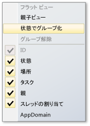
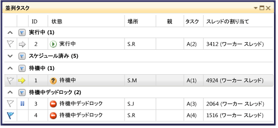
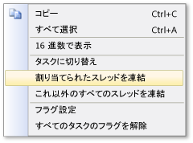

# [タスク] ウィンドウの使用
[!INCLUDE[vs2017banner](../code-quality/includes/vs2017banner.md)]

**\[タスク\]** ウィンドウは **\[スレッド\]** ウィンドウに似ていますが、このウィンドウには、各スレッドではなく、<xref:System.Threading.Tasks.Task?displayProperty=fullName>、[task\_handle](../Topic/task_group%20Class.md)、または [WinJS.Promise](http://msdn.microsoft.com/library/windows/apps/br211867.aspx) オブジェクトに関する情報が表示されます。  スレッドと同様、タスクは、同時に実行できる非同期操作を表します。ただし、複数のタスクが同じスレッドで実行される場合もあります。  詳細については、「[JavaScript での非同期プログラミング \(Windows ストア アプリ\)](http://msdn.microsoft.com/library/windows/apps/hh700330.aspx)」を参照してください。  
  
 マネージ コードでは、<xref:System.Threading.Tasks.Task?displayProperty=fullName> オブジェクトを操作するときや、**await** および **async** \(VisualBasic では **Await** および **Async**\) キーワードを操作するとき、**\[タスク\]** ウィンドウを使用できます。  マネージ コードでのタスクの詳細については、「[Parallel Programming](../Topic/Parallel%20Programming%20in%20the%20.NET%20Framework.md)」を参照してください。  
  
 ネイティブ コードでは、**タスク グループ**、[並列アルゴリズム](/visual-cpp/parallel/concrt/task-parallelism-concurrency-runtime)、[非同期エージェント](/visual-cpp/parallel/concrt/parallel-algorithms)、および[軽量タスク](/visual-cpp/parallel/concrt/asynchronous-agents)を操作するときに [&#91;タスク&#93;](/visual-cpp/parallel/concrt/task-scheduler-concurrency-runtime) ウィンドウを使用できます。  ネイティブ コードのタスクの詳細については、「[同時実行ランタイム](/visual-cpp/parallel/concrt/concurrency-runtime)」を参照してください。  
  
 JavaScript では、promise.then コードを操作するときに \[タスク\] ウィンドウを使用できます。  
  
 **\[タスク\]** ウィンドウは、デバッガーを中断するといつでも使用できます。  アクセスするには、**\[デバッグ\]** メニューの **\[ウィンドウ\]** をクリックし、**\[タスク\]** をクリックします。  次の図は、既定のモードの **\[タスク\]** ウィンドウを示しています。  
  
   
  
> [!NOTE]
>  マネージ コードでは、マネージ スレッドがスリープ状態または結合状態のとき、状態が <xref:System.Threading.Tasks.Task>、<xref:System.Threading.Tasks.TaskStatus>、または <xref:System.Threading.Tasks.TaskStatus> の <xref:System.Threading.Tasks.TaskStatus> は \[タスク\] ウィンドウに表示されないことがあります。  
  
## \[タスク\] ウィンドウの列の情報  
 **\[タスク\]** ウィンドウの列には、次の情報が表示されます。  
  
|列名|説明|  
|--------|--------|  
|**フラグ**|どのタスクにフラグが設定されているかを示します。タスクのフラグを設定または解除することができます。|  
|**アイコン**|黄色の矢印は現在のタスクを示します。  現在のタスクは、現在のスレッドの最上位のタスクです。   白い矢印は中断しているタスク、つまりデバッガーを呼び出したときに現在のタスクだったタスクを示します。   一時停止アイコンはユーザーによって凍結されているタスクを示します。  一覧でタスクを右クリックして、タスクを凍結したり凍結解除したりすることができます。|  
|**ID**|タスクに対してシステムで指定された番号です。  ネイティブ コードでは、タスクのアドレスになります。|  
|**状態**|タスクの現在の状態 \(スケジュール、アクティブ、デッドロック、待機中、または完了\) です。  スケジュール状態のタスクは、まだ実行されていないため、まだ呼び出し履歴、割り当てられたスレッド、関連情報がないタスクです。   アクティブなタスクは、デバッガーを中断する前にコードを実行していたタスクです。   待機中のタスクは、イベントがシグナル状態になるか、ロックが解放されるか、別のタスクが終了するのを待機しているためにブロックされているタスクです。   デッドロック状態のタスクは、スレッドが別のスレッドでデッドロックされた待機中のタスクです。   ブロックに関する詳細情報を表示するには、デッドロック状態または待機中のタスクの **\[状態\]** 列のセルの上にカーソルを置きます。 **Warning:**  **\[タスク\]** ウィンドウでは、待機チェーン トラバーサル \(WCT\) でサポートされる同期プリミティブを使用する、ブロックされているタスクに関してのみ、デッドロックが報告されます。  たとえば、WCT を使用するデッドロック状態の <xref:System.Threading.Tasks.Task> オブジェクトに対して、デバッガーは **"待機中デッドロック"** を報告します。  同時実行ランタイムによって管理されるデッドロック状態のタスクに対して、デバッガーは **"待機中"** を報告します。  WCT の詳細については、「[待機チェーン トラバーサル](http://msdn.microsoft.com/library/ms681622\(VS.85\).aspx)」を参照してください。|  
|**開始時刻**|タスクがアクティブになった時間です。|  
|**期間**|タスクがアクティブになっている秒数です。|  
|**完了時間**|タスクが完了した時間です。|  
|**場所**|タスクの呼び出し履歴内の現在の位置です。  タスクのすべての呼び出し履歴を表示するには、このセルの上にカーソルを置きます。  スケジュール状態のタスクについては、このセルには値が表示されません。|  
|**タスク**|最初のメソッドと、作成時にタスクに渡された引数です。|  
|**親**|このタスクを作成したタスクの ID です。  この列が空白のタスクには親はありません。  これは、マネージ プログラムの場合にのみ適用されます。|  
|**スレッドの割り当て**|タスクを実行しているスレッドの ID と名前です。|  
|**リターン状態**|タスクが完了したときのステータスです。  リターン状態の値は **\[成功\]**、**\[取り消し\]**、**\[エラー\]** です。|  
|**AppDomain**|マネージ コード用の情報で、タスクを実行しているアプリケーション ドメインを示します。|  
|**task\_group**|ネイティブ コード用の情報で、タスクのスケジュールを設定した [task\_group](../Topic/task_group%20Class.md) オブジェクトのアドレスを示します。  非同期エージェントおよび軽量タスクでは、この列は 0 に設定されます。|  
|プロセス|タスクが実行されているプロセスの ID です。|  
|Async State \(非同期状態\)|タスクの状態です \(マネージ コードの場合\)。  既定では、この列は非表示になっています。  この列を表示するには、いずれかの列ヘッダーのコンテキスト メニューを開きます。  **\[列\]**、**\[AsyncState\]** の順にクリックします。|  
  
 ビューに列を追加するには、列見出しを右クリックし、追加する列を選択します  \(列を削除するには選択を解除します\)。 また、列を左右にドラッグして列の順序を変更することもできます。  列のショートカット メニューを次の図に示します。  
  
   
  
## タスクの並べ替え  
 列を基準にタスクを並べ替えるには、列ヘッダーをクリックします。  たとえば、**\[ID\]** 列の列ヘッダーをクリックすると、タスクをタスク ID 順 \(1、2、3、4、5...\) に並べ替えることができます。  並べ替え順序を逆にするには、もう一度列ヘッダーをクリックします。  現在の並べ替え列と並べ替え順序は、列に矢印で示されます。  
  
## タスクのグループ化  
 リスト ビューの任意の列に基づいてタスクをグループ化することができます。  たとえば、**\[状態\]** 列の列ヘッダーを右クリックして **\[状態でグループ化\]** をクリックすると、状態が同じすべてのタスクをグループ化できます。  このようにすると、たとえば待機中のタスクをすばやく表示して、ブロックされている理由を集中的に確認することができます。  また、デバッグ セッションでは関係のないグループを折りたたむこともできます。  他の列を基準にしても、同じようにしてグループ化できます。  グループに対しては、グループ ヘッダーの横にあるボタンをクリックするだけで、まとめてフラグを設定したり解除したりすることができます。  次の図は、グループ化されたモードの **\[タスク\]** ウィンドウを示しています。  
  
   
  
## 親子ビュー  
 このビューは、マネージ コードの場合のみ使用できます。 列見出しを右クリックして **\[親子ビュー\]** をクリックすると、タスクの一覧を階層ビューに切り替えることができます。階層ビューでは、すべての子タスクが、表示と非表示を切り替えることができるサブノードとして親の下に表示されます。  次の図は、親子ビューでのタスクの表示を示しています。  
  
   
  
## タスクに対するフラグの設定  
 タスクが実行中のスレッドにフラグを設定できます。そのためには、タスク一覧の項目を選択し、コンテキスト メニューの **\[フラグ設定\]** をクリックするか、最初の列のフラグ アイコンをクリックします。  複数のタスクにフラグを設定してそれらだけを集中して確認する場合、フラグ列で並べ替えを行うことで、フラグを設定したすべてのタスクが上に表示されるようにすることができます。  **\[並列スタック\]** ウィンドウを使用して、フラグを設定したタスクだけを表示することもできます。  これにより、デバッグには関係のないタスクを除外することができます。  フラグはデバッグ セッション間で保持されません。  
  
## タスクの凍結と凍結解除  
 タスク一覧の項目を右クリックして **\[割り当てられたスレッドを凍結\]** をクリックすると、タスクを実行しているスレッドを凍結することができます  \(タスクが既に凍結されている場合は、コマンドは **\[割り当てられたスレッドの凍結を解除\]** になります\)。 スレッドを凍結すると、現在のブレークポイントの後のコードのステップ実行でそのスレッドが実行されなくなります。  **\[これ以外のすべてのスレッドを凍結\]** を使用すると、タスク一覧の項目を実行しているスレッドを除くすべてのスレッドが凍結されます。  
  
 各タスクのその他のメニュー項目を次の図に示します。  
  
   
  
## 参照  
 [デバッガーの基本事項](../debugger/debugger-basics.md)   
 [マネージ コードのデバッグ](../debugger/debugging-managed-code.md)   
 [Parallel Programming](../Topic/Parallel%20Programming%20in%20the%20.NET%20Framework.md)   
 [同時実行ランタイム](/visual-cpp/parallel/concrt/concurrency-runtime)   
 [\[並列スタック\] ウィンドウの使用](../Topic/Using%20the%20Parallel%20Stacks%20Window.md)   
 [チュートリアル: 並行アプリケーションのデバッグ](../debugger/walkthrough-debugging-a-parallel-application.md)