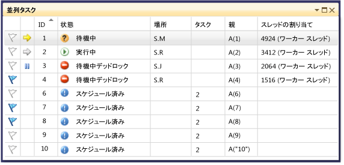

# [タスク] ウィンドウの使用

**タスク**ウィンドウに似ています、**スレッド**ウィンドウには、it に関する情報が表示されます<xref:System.Threading.Tasks.Task?displayProperty=fullName>、 [task_handle](/cpp/parallel/concrt/reference/task-group-class)、または[WinJS.Promise](/previous-versions/windows/apps/br211867(v=win.10))各スレッドではなくオブジェクト。 スレッドと同様、タスクは、同時に実行できる非同期操作を表します。ただし、複数のタスクが同じスレッドで実行される場合もあります。

マネージ コードで使用することができます、**タスク**を操作するときにウィンドウ<xref:System.Threading.Tasks.Task?displayProperty=fullName>オブジェクト、または、 **await**と**非同期**キーワード (**のAwait**と**Async** visual Basic で)。 マネージ コードでタスクの詳細については、次を参照してください。[並列プログラミング](/dotnet/standard/parallel-programming/index)します。

ネイティブ コードで使用することができます、**タスク**を操作するときにウィンドウ[タスク グループ](/cpp/parallel/concrt/task-parallelism-concurrency-runtime)、[並列アルゴリズム](/cpp/parallel/concrt/parallel-algorithms)、[非同期エージェント](/cpp/parallel/concrt/asynchronous-agents)と[軽量タスク](/cpp/parallel/concrt/task-scheduler-concurrency-runtime)します。 ネイティブ コードでタスクの詳細については、次を参照してください。[同時実行ランタイム](/cpp/parallel/concrt/concurrency-runtime)します。

JavaScript では、promise を使用する場合、タスク ウィンドウを使用できます`.then`コード。 参照してください[JavaScript (UWP アプリ) での非同期プログラミング](/previous-versions/windows/apps/hh700330(v=win.10))詳細についてはします。

使用することができます、**タスク**デバッガーを中断する場合は、常にします。 上でアクセスできる、**デバッグ**メニューをクリックして**Windows**  をクリックし、**タスク**します。 次の図は、**タスク**ウィンドウの既定のモードにします。

> [!NOTE]
> マネージ コードで、<xref:System.Threading.Tasks.Task>の状態を持つ[TaskStatus.Created](<xref:System.Threading.Tasks.TaskStatus.Created>)、 [TaskStatus.WaitingForActivation](<xref:System.Threading.Tasks.TaskStatus.WaitingForActivation>)、または[TaskStatus.WaitingToRun](<xref:System.Threading.Tasks.TaskStatus.WaitingToRun>)できない可能性があります表示される、**タスク**マネージ スレッドがスリープ状態または結合状態である場合は、ウィンドウ。

## [タスク] ウィンドウの列の情報

内の列、**タスク**ウィンドウは、次の情報を表示します。

|列名|説明|
|-----------------|-----------------|
|**フラグ**|どのタスクにフラグが設定されているかを示します。タスクのフラグを設定または解除することができます。|
|**アイコン**|黄色の矢印は現在のタスクを示します。 現在のタスクは、現在のスレッドの最上位のタスクです。   白い矢印は中断しているタスク、つまりデバッガーを呼び出したときに現在のタスクだったタスクを示します。   一時停止アイコンはユーザーによって凍結されているタスクを示します。 一覧でタスクを右クリックして、タスクを凍結したり凍結解除したりすることができます。|
|**ID**|タスクに対してシステムで指定された番号です。 ネイティブ コードでは、タスクのアドレスになります。|
|**状態**|タスクの現在の状態 (スケジュール済み、アクティブ、ブロックされている、デッドロック、待機中、または完了した)。 スケジュール状態のタスクは、まだ実行されていないため、まだ呼び出し履歴、割り当てられたスレッド、関連情報がないタスクです。   アクティブなタスクは、デバッガーを中断する前にコードを実行していたタスクです。   待機中またはブロックされているタスクは、シグナル状態になるイベントや、ロックを解除するには、別のタスクが終了するを待機しているためにブロックされています。   デッドロック状態のタスクは、スレッドが別のスレッドでデッドロックされた待機中のタスクです。   ポインターを合わせる、**状態**ブロックに関する詳細を表示、デッドロック状態または待機中タスクのセル。 **警告:** 、**タスク**ウィンドウのみ待機チェーン トラバーサル (WCT) でサポートされる同期プリミティブを使用するブロックされているタスクのデッドロックが報告されます。 デッドロック状態の例では、<xref:System.Threading.Tasks.Task>オブジェクトで、デバッガーの報告、WCT を使用して**待機中デッドロック**します。 WCT を使用しない、同時実行ランタイムによって管理されるデッドロック状態のタスクについて、デバッガーの報告**待機している**します。 WCT の詳細については、次を参照してください。 [Wait Chain Traversal](/windows/desktop/Debug/wait-chain-traversal)します。|
|**開始時刻**|タスクがアクティブになった時間です。|
|**期間**|タスクがアクティブになっている秒数です。|
|**完了時刻**|タスクが完了した時間です。|
|**場所**|タスクの呼び出し履歴内の現在の位置です。 タスクのすべての呼び出し履歴を表示するには、このセルの上にカーソルを置きます。 スケジュール状態のタスクについては、このセルには値が表示されません。|
|**Task**|最初のメソッドと、作成時にタスクに渡された引数です。|
|**AsyncState**|タスクの状態です (マネージド コードの場合)。 既定では、この列は非表示になっています。 この列を表示するには、いずれかの列ヘッダーのコンテキスト メニューを開きます。 選択**列**、 **AsyncState**します。|
|**Parent**|このタスクを作成したタスクの ID です。 この列が空白のタスクには親はありません。 これは、マネージド プログラムの場合にのみ適用されます。|
|**スレッドの割り当て**|タスクを実行しているスレッドの ID と名前です。|
|**AppDomain**|マネージド コード用の情報で、タスクを実行しているアプリケーション ドメインを示します。|
|**task_group**|ネイティブ コードのアドレスに対して、 [task_group](/cpp/parallel/concrt/reference/task-group-class)タスクがスケジュールされているオブジェクト。 非同期エージェントおよび軽量タスクでは、この列は 0 に設定されます。|
|**Process**|タスクが実行されているプロセスの ID です。|

 ビューに列を追加するには、列見出しを右クリックし、追加する列を選択します (列を削除するには選択を解除します)。また、列を左右にドラッグして列の順序を変更することもできます。 列のショートカット メニューを次の図に示します。

 ![[タスク] ウィンドウのショートカット ビュー メニュー](../debugger/media/parallel_tasks_contextmenu.png "Parallel_Tasks_ContextMenu")

## タスクの並べ替え
 列を基準にタスクを並べ替えるには、列ヘッダーをクリックします。 たとえばをクリックして、 **ID**列ヘッダーをタスクをタスク ID を並べ替えることができます: 1,2,3,4,5 という具合です。 並べ替え順序を逆にするには、もう一度列ヘッダーをクリックします。 現在の並べ替え列と並べ替え順序は、列に矢印で示されます。

## タスクのグループ化
 リスト ビューの任意の列に基づいてタスクをグループ化することができます。 などを右クリックし、**状態**列ヘッダーをクリックし、**でグループ化** > **[*状態*]**、することができます状態が同じすべてのタスクをグループ化します。 たとえば、でしたをすばやく表示するブロックされている理由に集中することができるように、タスクを待機しています。 また、デバッグ セッションでは関係のないグループを折りたたむこともできます。 他の列を基準にしても、同じようにしてグループ化できます。 グループに対しては、グループ ヘッダーの横にあるボタンをクリックするだけで、まとめてフラグを設定したり解除したりすることができます。 次の図は、**タスク**グループ化されたモードでのウィンドウ。

 ![[タスク] ウィンドウのグループ化されたモード](../debugger/media/parallel_tasks_groupedmode.png "Parallel_Tasks_GroupedMode")

## 親子ビュー
 このビューは、マネージド コードの場合のみ使用できます。右クリックし、**状態**列ヘッダーをクリックし、**でグループ化** > **親**での階層ビューにタスクの一覧を変更することができますすべての子タスクは、サブ ノードを表示したり、その親では非表示です。

## タスクに対するフラグの設定
 項目を選択して、タスクを選択して、タスクが実行されるタスクを一覧表示するスレッドのフラグを設定することができます**割り当てられているスレッドにフラグ**コンテキスト メニューから、または最初の列でフラグ アイコンをクリックします。 複数のタスクにフラグを設定してそれらだけを集中して確認する場合、フラグ列で並べ替えを行うことで、フラグを設定したすべてのタスクが上に表示されるようにすることができます。 使用することも、**並列スタック**を表示するウィンドウのタスクのみフラグが設定されます。 これにより、デバッグには関係のないタスクを除外することができます。 フラグはデバッグ セッション間で保持されません。

## タスクの凍結と凍結解除
 タスク一覧の項目を右クリックし、をクリックして、タスクが実行されているスレッドを凍結する**割り当てられたスレッドを凍結**します。 (タスクが既に固定されている場合、コマンドは**割り当てられたスレッドの凍結解除**)。スレッドを凍結すると、現在のブレークポイントの後のコードのステップ実行でそのスレッドが実行されなくなります。 **固定すべてのスレッドが、この 1 つ**コマンドは、タスク一覧の項目を実行している 1 つを除くすべてのスレッドを凍結します。

 各タスクのその他のメニュー項目を次の図に示します。

 ![[タスク] ウィンドウのショートカット スレッド メニュー](../debugger/media/parallel_tasks_contextmenu2.png "Parallel_Tasks_ContextMenu2")

## アクティブなタスクまたはフレームの切り替え

**タスクに切り替える**のコマンドは、現在のタスク、アクティブなタスク。 **フレームに切り替え**のコマンドは、選択したスタック フレームのアクティブなスタック フレーム。 デバッガー コンテキストは、現在のタスクまたは選択したスタック フレームに切り替えられます。

## 関連項目

- [デバッガーの基本事項](../debugger/getting-started-with-the-debugger.md)
- [マネージド コードをデバッグする](../debugger/debugging-managed-code.md)
- [並列プログラミング](/dotnet/standard/parallel-programming/index)
- [同時実行ランタイム](/cpp/parallel/concrt/concurrency-runtime)
- [[並列スタック] ウィンドウの使用](../debugger/using-the-parallel-stacks-window.md)
- [チュートリアル: 並行アプリケーションのデバッグ](../debugger/walkthrough-debugging-a-parallel-application.md)