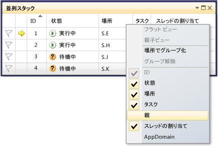

# チュートリアル: 並行アプリケーションのデバッグ
[!INCLUDE[vs2017banner](../code-quality/includes/vs2017banner.md)]

このチュートリアルでは、**\[並列タスク\]** ウィンドウと **\[並列スタック\]** ウィンドウを使用して並行アプリケーションをデバッグする方法について説明します。  これらのウィンドウは、[Task Parallel Library \(TPL\)](../Topic/Task%20Parallel%20Library%20\(TPL\).md)または[同時実行ランタイム](/visual-cpp/parallel/concrt/concurrency-runtime)を使用するコードの実行時の動作の把握や確認に役立ちます。  このチュートリアルには、ブレークポイントが組み込まれたサンプル コードが用意されています。  ブレークポイントでコードの実行が中断されたら、**\[並列タスク\]** ウィンドウと **\[並列スタック\]** ウィンドウを使用してコードを調べます。  
  
 このチュートリアルでは、次の作業について説明します。  
  
-   すべてのスレッドの呼び出し履歴を 1 つのビューに表示する方法  
  
-   アプリケーションで作成された `System.Threading.Tasks.Task` インスタンスの一覧を表示する方法  
  
-   スレッドではなくタスクの実際の呼び出し履歴を表示する方法  
  
-   **\[並列タスク\]** ウィンドウや **\[並列スタック\]** ウィンドウからコードに移動する方法  
  
-   グループ化やズームなどの機能を使用してウィンドウの表示を調整する方法  
  
## 必須コンポーネント  
 このチュートリアルは、**\[マイ コードのみ\]** が有効になっていることを前提としています。  **\[ツール\]** メニューの **\[オプション\]** をクリックし、**\[デバッグ\]** ノードを展開して **\[全般\]** を選択し、**\['マイ コードのみ' 設定を有効にする\]** を選択してください。  この機能が設定されていなくてもこのチュートリアルを使用できますが、図と異なる結果になる可能性があります。  
  
## C\# のサンプル  
 C\# のサンプルを使用する場合は、外部コードが非表示になっていることも前提になります。  外部コードの表示と非表示を切り替えるには、**\[呼び出し履歴\]** ウィンドウの **\[名前\]** テーブル ヘッダーを右クリックし、**\[外部コードの表示\]** をオンまたはオフにします。  この機能が設定されていなくてもこのチュートリアルを使用できますが、図と異なる結果になる可能性があります。  
  
## C\+\+ のサンプル  
 C\+\+ のサンプルを使用する場合は、このトピックの外部コードに関する記述は無視してかまいません。  外部コードに関する記述が当てはまるのは C\# のサンプルだけです。  
  
## 図  
 このトピックの図は、C\# のサンプルを実行するクアッド コア コンピューターで記録されたものです。  他の構成を使用してこのチュートリアルを実行することもできますが、画面の表示が図と同じにならない場合があります。  
  
## サンプル プロジェクトの作成  
 このチュートリアルのサンプル コードは、何もしないアプリケーションのコードです。  ここでの目的は、ツール ウィンドウを使用して並行アプリケーションをデバッグする方法を理解することだけです。  
  
#### サンプル プロジェクトを作成するには  
  
1.  Visual Studio で、**\[ファイル\]** メニューの **\[新規作成\]** をポイントし、**\[プロジェクト\]** をクリックします。  
  
2.  **\[インストールされたテンプレート\]** ペインで、Visual C\#、Visual Basic、または Visual C\+\+ を選択します。  マネージ言語については、フレームワークのボックスに [!INCLUDE[net_v40_short](../debugger/includes/net_v40_short_md.md)] が表示されていることを確認します。  
  
3.  **\[コンソール アプリケーション\]** を選択し、**\[OK\]** をクリックします。  既定のデバッグ構成をそのまま使用します。  
  
4.  プロジェクトで .cpp、.cs、または .vb コード ファイルを開きます。  その内容を削除して、空のコード ファイルを作成します。  
  
5.  空のコード ファイルに、選択した言語の次のコードを貼り付けます。  
  
 [!code-cs[Debugger#1](../debugger/codesnippet/CSharp/walkthrough-debugging-a-parallel-application_1.cs)]
 [!code-cpp[Debugger#1](../debugger/codesnippet/CPP/walkthrough-debugging-a-parallel-application_1.cpp)]
 [!code-vb[Debugger#1](../debugger/codesnippet/VisualBasic/walkthrough-debugging-a-parallel-application_1.vb)]  
  
1.  **\[ファイル\]** メニューの **\[すべてを保存\]** をクリックします。  
  
2.  **\[ビルド\]** メニューの **\[ソリューションのリビルド\]** をクリックします。  
  
     このコードには、`Debugger.Break` の呼び出しが 4 つあります \(C\+\+ サンプルの場合は `DebugBreak`\)。したがって、ブレークポイントを挿入する必要はありません。そのまま実行するだけで、デバッガーでアプリケーションの実行が 4 回中断されます。  
  
## \[並列スタック\] ウィンドウの使用: スレッド ビュー  
 **\[デバッグ\]** メニューの **\[デバッグ開始\]** をクリックします。  1 つ目のブレークポイントにヒットするまで待ちます。  
  
#### 1 つのスレッドの呼び出し履歴を表示するには  
  
1.  **\[デバッグ\]** メニューの **\[ウィンドウ\]** をポイントし、**\[スレッド\]** をクリックします。  **\[スレッド\]** ウィンドウを Visual Studio の下部にドッキングします。  
  
2.  **\[デバッグ\]** メニューの **\[ウィンドウ\]** をポイントし、**\[呼び出し履歴\]** をクリックします。  **\[呼び出し履歴\]** ウィンドウを Visual Studio の下部にドッキングします。  
  
3.  **\[スレッド\]** ウィンドウのスレッドをダブルクリックして、そのスレッドを現在のスレッドにします。  現在のスレッドには黄色の矢印が表示されます。  現在のスレッドを変更すると、そのスレッドの呼び出し履歴が **\[呼び出し履歴\]** ウィンドウに表示されます。  
  
#### \[並列スタック\] ウィンドウを調べるには  
  
1.  **\[デバッグ\]** メニューの **\[ウィンドウ\]** をポイントし、**\[並列スタック\]** をクリックします。  左上隅のボックスで **\[スレッド\]** が選択されていることを確認します。  
  
     **\[並列スタック\]** ウィンドウを使用すると、複数の呼び出し履歴を 1 つのビューに同時に表示できます。  次の図では、**\[呼び出し履歴\]** ウィンドウの上に **\[並列スタック\]** ウィンドウが表示されています。  
  
       
  
     一方のボックスにはメイン スレッドの呼び出し履歴が表示され、もう一方のボックスには他の 4 つのスレッドの呼び出し履歴がグループ化されて表示されています。  4 つのスレッドがグループ化されているのは、これらのスレッドのスタック フレームが同じメソッド コンテキストを共有している \(`A`、`B`、`C` という同じメソッドにある\) からです。  同じボックスを共有しているスレッドのスレッド ID と名前を表示するには、ヘッダー \(**"4 個のスレッド"**\) をポイントします。  次の図のように、現在のスレッドが太字で表示されます。  
  
       
  
     黄色の矢印は、現在のスレッドのアクティブなスタック フレームを示します。  そこをポイントすると、詳細情報が表示されます。  
  
       
  
     表示するスタック フレームの詳細情報 \(**\[モジュール名\]**、**\[パラメーターの型\]**、**\[パラメーター名\]**、**\[パラメーター値\]**、**\[行番号\]**、および **\[バイト オフセット\]** を設定するには、**\[呼び出し履歴\]** ウィンドウを右クリックします。  
  
     ボックスを囲む青の強調表示は、そのボックスに現在のスレッドが含まれていることを示します。  現在のスレッドは、ツールヒントで太字のスタック フレームによっても示されます。  \[スレッド\] ウィンドウでメイン スレッドをダブルクリックすると、それに応じて **\[並列スタック\]** ウィンドウの青の強調表示が移動します。  
  
       
  
#### 2 つ目のブレークポイントまで実行を再開するには  
  
1.  2 つ目のブレークポイントにヒットするまで実行を再開するには、**\[デバッグ\]** メニューの **\[続行\]** をクリックします。  次の図は、2 つ目のブレークポイントのスレッド ツリーを示しています。  
  
       
  
     1 つ目のブレークポイントでは、4 つのスレッドのすべてが、S.A メソッド、S.B メソッド、S.C メソッドの順に進んでいました。  その情報もまだ **\[並列スタック\]** ウィンドウに表示されていますが、4 つのスレッドはさらに先に進んでいます。  そのうちの 1 つは、S.D、S.E の順に進んでいます。  また別のスレッドは、S.F、S.G、S.H の順に進んでいます。  残りの 2 つは、S.I、S.J の順に進み、そこから一方は S.K に進み、もう一方は非ユーザー外部コードに進んでいます。  
  
     **"1 個のスレッド"**、**"2 個のスレッド"** などのボックス ヘッダーをポイントすると、スレッドのスレッド ID が表示されます。  スタック フレームをポイントすると、スレッド ID とフレームのその他の詳細が表示されます。  青の強調表示は現在のスレッドを示し、黄色の矢印は現在のスレッドのアクティブなスタック フレームを示します。  
  
     より糸のアイコン \(青と赤の波線が重なったアイコン\) は、現在のスレッドではないスレッドのアクティブなスタック フレームを示します。  **\[呼び出し履歴\]** ウィンドウで S.B をダブルクリックしてフレームを切り替えます。  **\[並列スタック\]** ウィンドウで、現在のスレッドの現在のスタック フレームが緑色の曲線矢印のアイコンによって示されます。  
  
     **\[スレッド\]** ウィンドウでスレッドを切り替えて、**\[並列スタック\]** ウィンドウのビューが更新されることを確認します。  
  
     別のスレッドに切り替えたり、別のスレッドの別のフレームに切り替えたりするには、**\[並列スタック\]** ウィンドウのショートカット メニューを使用することもできます。  たとえば、S.J を右クリックし、**\[フレームに切り替え\]** をポイントして、いずれかのコマンドをクリックします。  
  
       
  
     S.C を右クリックし、**\[フレームに切り替え\]** をポイントします。  チェック マークが付いているコマンドがあります。これは、現在のスレッドのスタック フレームを示します。  その同じスレッドのフレームに切り替えることも \(緑色の矢印のみが移動します\)、他のスレッドに切り替えることもできます \(青の強調表示も移動します\)。  次の図は、このサブメニューを示しています。  
  
       
  
     メソッド コンテキストに関連付けられているスタック フレームが 1 つしかない場合は、ボックス ヘッダーに **"1 個のスレッド"** と表示されます。この場合は、メソッド コンテキストをダブルクリックするだけでそのフレームに切り替えることができます。  複数のフレームが関連付けられているメソッド コンテキストをダブルクリックすると、自動的にメニューがポップアップ表示されます。  メソッド コンテキストをポイントすると右側に表示される黒い三角形を  クリックして、このショートカット メニューを表示することもできます。  
  
     多数のスレッドを持つ大規模なアプリケーションでは、一部のスレッドのみに焦点を絞ることもできます。  **\[並列スタック\]** ウィンドウでは、フラグが設定されたスレッドの呼び出し履歴のみを表示することができます。  ツール バーで、リスト ボックスの横にある **\[フラグが設定されたもののみを表示\]** ボタンをクリックします。  
  
       
  
     次に、**\[スレッド\]** ウィンドウでスレッドに 1 つずつフラグを設定し、それらの呼び出し履歴が **\[並列スタック\]** ウィンドウに表示されることを確認します。  スレッドにフラグを設定するには、ショートカット メニューを使用するか、スレッドの最初のセルを使用します。  ツール バーの **\[フラグが設定されたもののみを表示\]** ボタンをもう一度クリックして、すべてのスレッドを表示します。  
  
#### 3 つ目のブレークポイントまで実行を再開するには  
  
1.  3 つ目のブレークポイントにヒットするまで実行を再開するには、**\[デバッグ\]** メニューの **\[続行\]** をクリックします。  
  
     同じメソッドに複数のスレッドがあるが、そのメソッドが呼び出し履歴の先頭にない場合、そのメソッドは複数のボックスに表示されます。  たとえば、現在のブレークポイントの S.L がこれに当たります。このメソッドは 3 つのスレッドを持ち、3 つのボックスに表示されています。  S.L をダブルクリックします。  
  
       
  
     他の 2 つのボックスで S.L が太字になっていることに注目してください。これにより、このメソッドが他にどこにあるのかがわかります。  S.L がどのフレームから呼び出され、どのフレームを呼び出すのかを確認するには、ツール バーの **\[メソッド ビューの切り替え\]** ボタンをクリックします。  次の図は、**\[並列スタック\]** ウィンドウのメソッド ビューを示しています。  
  
       
  
     選択したメソッドを中心とする図が表示されます。選択したメソッドが固有のボックスに入れられて、ビューの中心に配置されます。  その上下には、呼び出し先と呼び出し元が表示されます。  もう一度 **\[メソッド ビューの切り替え\]** ボタンをクリックして、このモードを終了します。  
  
     **\[並列スタック\]** ウィンドウのショートカット メニューには、次のような項目も含まれています。  
  
    -   **\[16 進数で表示\]**: ツールヒントの数値を 10 進数または 16 進数に切り替えます。  
  
    -   **\[シンボル読み込み情報\]** および **\[シンボルの設定\]**: それぞれのダイアログ ボックスを開きます。  
  
    -   **\[ソース コードへ移動\]** および **\[逆アセンブルを表示\]**: エディターで、選択したメソッドに移動します。  
  
    -   **\[外部コードの表示\]**: ユーザー コード以外のものも含めてすべてのフレームを表示します。  この項目を選択し、図に追加のフレームが表示されることを確認してください \(シンボルがないために選択不可になっている可能性があります\)。  
  
     大きな図がある場合は、次のブレークポイントにステップするときに、現在のスレッド \(最初にブレークポイントにヒットしたスレッド\) のアクティブなスタック フレームまでビューが自動的にスクロールするようにすることができます。  **\[並列スタック\]** ウィンドウで、ツール バーの **\[現在のスタック フレームに自動スクロール\]** ボタンがオンになっていることを確認します。  
  
       
  
2.  次に進む前に、**\[並列スタック\]** ウィンドウを一番左の一番下までスクロールしておきます。  
  
#### 4 つ目のブレークポイントまで実行を再開するには  
  
1.  4 つ目のブレークポイントにヒットするまで実行を再開するには、**\[デバッグ\]** メニューの **\[続行\]** をクリックします。  
  
     ビューが適切な位置まで自動的にスクロールすることに注目してください。  **\[スレッド\]** ウィンドウでスレッドを切り替えたり、**\[呼び出し履歴\]** ウィンドウでスタック フレームを切り替えたりして、ビューが常に適切なフレームまで自動的にスクロールすることを確認します。  さらに、**\[現在のツール フレームに自動スクロール\]** オプションをオフにして違いを確認します。  
  
     **\[並列スタック\]** ウィンドウに大きな図がある場合は、**バード アイ ビュー** も便利です。  **バード アイ ビュー** を表示するには、次の図に示すように、ウィンドウの右下のスクロール バーの間にあるボタンをクリックします。  
  
       
  
     四角形の枠を移動することにより、図のさまざまな場所をすばやく表示できます。  
  
     図を任意の方向に移動するには、図の空白の領域をクリックして目的の方向にドラッグすることもできます。  
  
     図を拡大\/縮小するには、Ctrl キーを押しながらマウス ホイールを動かします。  または、ツール バーの \[ズーム\] ボタンをクリックしてズーム ツールを使用します。  
  
       
  
     スタックを下から上の方向ではなく上から下の方向で表示することもできます。**\[ツール\]** メニューの **\[オプション\]** をクリックし、**\[デバッグ\]** ノードのオプションをオンまたはオフにします。  
  
2.  次に進む前に、**\[デバッグ\]** メニューの **\[デバッグの停止\]** をクリックして実行を終了します。  
  
## \[並列タスク\] ウィンドウと、\[並列スタック\] ウィンドウのタスク ビューの使用  
 先に進む前に前の手順を完了することをお勧めします。  
  
#### 1 つ目のブレークポイントにヒットするまでアプリケーションの実行を再開するには  
  
1.  **\[デバッグ\]** メニューの **\[デバッグ開始\]** をクリックし、1 つ目のブレークポイントにヒットするまで待ちます。  
  
2.  **\[デバッグ\]** メニューの **\[ウィンドウ\]** をポイントし、**\[スレッド\]** をクリックします。  **\[スレッド\]** ウィンドウを Visual Studio の下部にドッキングします。  
  
3.  **\[デバッグ\]** メニューの **\[ウィンドウ\]** をポイントし、**\[呼び出し履歴\]** をクリックします。  **\[呼び出し履歴\]** ウィンドウを Visual Studio の下部にドッキングします。  
  
4.  **\[スレッド\]** ウィンドウのスレッドをダブルクリックして、そのスレッドを現在のスレッドにします。  現在のスレッドには黄色の矢印が表示されます。  現在のスレッドを変更すると、他のウィンドウが更新されます。  次に、タスクについて調べます。  
  
5.  **\[デバッグ\]** メニューの **\[ウィンドウ\]** をポイントし、**\[並列タスク\]** をクリックします。  次の図は、**\[並列タスク\]** ウィンドウを示しています。  
  
       
  
     実行中の各タスクについて、タスクの ID \(同名のプロパティから返されます\)、そのタスクを実行しているスレッドの ID と名前、およびタスクの場所 \(ここをポイントすると、ツールヒントに呼び出し履歴全体が表示されます\) が表示されます。  また、**\[タスク\]** 列には、そのタスクに渡されたメソッド \(開始点\) が表示されます。  
  
     この一覧は、任意の列で並べ替えることができます。  並べ替えグリフにより、並べ替えの列と方向が示されます。  列を左右にドラッグして列の順序を変更することもできます。  
  
     黄色の矢印は現在のタスクを示します。  タスクを切り替えるには、タスクをダブルクリックするか、ショートカット メニューを使用します。  タスクを切り替えると、基になるスレッドが現在のスレッドになり、他のウィンドウが更新されます。  
  
     タスクを手動で切り替えると黄色の矢印が移動しますが、デバッガーが中断されたタスクは引き続き白の矢印によって示されます。  
  
#### 2 つ目のブレークポイントまで実行を再開するには  
  
1.  2 つ目のブレークポイントにヒットするまで実行を再開するには、**\[デバッグ\]** メニューの **\[続行\]** をクリックします。  
  
     先ほどは、**\[状態\]** 列ですべてのタスクが "実行中" になっていましたが、現在は 2 つのタスクが "待機中" になっています。  タスクがブロックされるのにはさまざまな理由があります。  **\[状態\]** 列で待機中のタスクをポイントすると、タスクがブロックされている理由を確認できます。  たとえば、次の図では、タスク 3 はタスク 4 を待機しています。  
  
       
  
     一方、タスク 4 は、タスク 2 に割り当てられているスレッドが所有するモニターを待機しています。  
  
       
  
     **\[並列タスク\]** ウィンドウの最初の列のフラグをクリックすると、タスクにフラグを設定できます。  
  
     フラグを設定することにより、同じデバッグ セッションの異なるブレークポイントの間でタスクを追跡したり、**\[並列スタック\]** ウィンドウに呼び出し履歴を表示するタスクをフィルター選択したりすることができます。  
  
     先ほど **\[並列スタック\]** ウィンドウを使用したときにはアプリケーションのスレッドを表示しましたが、  今度は **\[並列スタック\]** ウィンドウでアプリケーションのタスクを表示します。  そのためには、左上のボックスで **\[タスク\]** を選択します。  次の図は、タスク ビューを示しています。  
  
       
  
     **\[並列スタック\]** ウィンドウのタスク ビューには、現在タスクを実行していないスレッドは表示されません。  タスクを実行するスレッドについても、タスクに関連しないスタック フレームはスタックの上下からフィルターで除外されます。  
  
     再び **\[並列タスク\]** ウィンドウを表示します。  任意の列ヘッダーを右クリックして、その列のショートカット メニューを表示します。  
  
       
  
     ショートカット メニューを使用して、列を追加したり削除したりすることができます。  たとえば、\[AppDomain\] 列は選択されていないため、一覧に表示されていません。  **\[Parent\]** をクリックします。  **\[Parent\]** 列が表示されますが、4 つのタスクのいずれにもこの列の値はありません。  
  
#### 3 つ目のブレークポイントまで実行を再開するには  
  
1.  3 つ目のブレークポイントにヒットするまで実行を再開するには、**\[デバッグ\]** メニューの **\[続行\]** をクリックします。  
  
     新しいタスク \(タスク 5\) が実行中になり、タスク 4 は待機中になっています。  **\[状態\]** 列でこの待機中のタスクをポイントすると、理由が表示されます。  **\[Parent\]** 列を見ると、タスク 4 はタスク 5 の親であることがわかります。  
  
     この親子関係をわかりやすく表示するために、**\[Parent\]** 列の列ヘッダーを右クリックし、**\[親子ビュー\]** をクリックします。  次の図のような画面が表示されます。  
  
       
  
     タスク 4 とタスク 5 が同じスレッドで実行されていることに注目してください。  この情報は、**\[スレッド\]** ウィンドウには表示されません。この情報を表示できるのも、**\[並列タスク\]** ウィンドウの利点の 1 つです。  この情報を確認するために、**\[並列スタック\]** ウィンドウを表示します。  ビューが **\[タスク\]** になっていることを確認します。  タスク 4 とタスク 5 を見つけるには、**\[並列タスク\]** ウィンドウでそれらをダブルクリックします。  これにより、**\[並列スタック\]** ウィンドウの青の強調表示が更新されます。  **\[並列スタック\]** ウィンドウでツールヒントを調べてタスク 4 とタスク 5 を見つけることもできます。  
  
       
  
     **\[並列スタック\]** ウィンドウで、S.P を右クリックし、**\[スレッドに移動\]** をクリックします。  ウィンドウがスレッド ビューに切り替わり、対応するフレームが表示されます。  両方のタスクが同じスレッドにあることがわかります。  
  
       
  
     これもまた、**\[スレッド\]** ウィンドウにはない、**\[並列スタック\]** ウィンドウのタスク ビューならではの利点です。  
  
#### 4 つ目のブレークポイントまで実行を再開するには  
  
1.  4 つ目のブレークポイントにヒットするまで実行を再開するには、**\[デバッグ\]** メニューの **\[続行\]** をクリックします。  **\[ID\]** 列の列ヘッダーをクリックして ID で並べ替えます。  次の図のような画面が表示されます。  
  
       
  
     タスク 5 は完了したため、もう表示されません。  お使いのコンピューターでそうならず、デッドロックが表示されていない場合は、F11 キーを押して 1 回ステップ実行してください。  
  
     タスク 3 とタスク 4 は互いを待機しており、デッドロックの状態になっています。  また、5 つの新しいタスクがあります。これらはタスク 2 の子で、現在スケジュールされているタスクです。  スケジュールされたタスクとは、コードで開始されているがまだ実行されていないタスクです。  したがって、**\[場所\]** 列と **\[スレッドの割り当て\]** 列が空になっています。  
  
     再び **\[並列スタック\]** ウィンドウを表示します。  各ボックスのヘッダーをポイントすると、ツールヒントにスレッドの ID と名前が表示されます。  **\[並列スタック\]** ウィンドウのタスク ビューに切り替えます。  次の図のようにヘッダーをポイントして、タスクの ID、名前、および状態を確認します。  
  
       
  
     タスクを列でグループ化することもできます。  **\[並列タスク\]** ウィンドウで、**\[状態\]** 列の列ヘッダーを右クリックし、**\[状態でグループ化\]** をクリックします。  次の図は、状態でグループ化された **\[並列タスク\]** ウィンドウを示しています。  
  
       
  
     ほかにも任意の列でグループ化できます。  タスクをグループ化すると、一部のタスクに焦点を絞ることができます。  各グループは折りたたみ可能で、それぞれにグループ化されている項目の数が表示されます。  また、**\[折りたたみ\]** ボタンの右にある **\[フラグ設定\]** ボタンをクリックすることで、グループ内のすべての項目にすばやくフラグを設定できます。  
  
       
  
     最後に、**\[並列タスク\]** ウィンドウでタスクを右クリックすると表示されるショートカット メニューを確認します。  
  
       
  
     このショートカット メニューに表示されるコマンドは、タスクの状態によって異なります。  たとえば、**\[コピー\]**、**\[すべて選択\]**、**\[16 進数で表示\]**、**\[タスクに切り替え\]**、**\[割り当てられたスレッドを凍結\]**、**\[これ以外のすべてのスレッドを凍結\]**、**\[割り当てられたスレッドの凍結を解除\]**、**\[フラグ設定\]** などのコマンドが表示されます。  
  
     1 つまたは複数のタスクの基になるスレッドを凍結したり、割り当てられたスレッド以外のすべてのスレッドを凍結したりすることができます。  凍結されたスレッドは、**\[並列タスク\]** ウィンドウでも、**\[スレッド\]** ウィンドウと同じように青の*一時停止*のアイコンで表されます。  
  
## 概要  
 このチュートリアルでは、デバッガーの **\[並列タスク\]** ウィンドウと **\[並列スタック\]** ウィンドウについて説明しました。  マルチスレッド コードを使用する実際のプロジェクトでこれらのウィンドウを使用してみてください。  C\+\+、C\#、または Visual Basic で記述された並列コードを調べることができます。  
  
## 参照  
 [Debugging Multithreaded Applications](../debugger/walkthrough-debugging-a-parallel-application.md)   
 [デバッガーの基本事項](../debugger/debugger-basics.md)   
 [マネージ コードのデバッグ](../debugger/debugging-managed-code.md)   
 [Parallel Programming](../Topic/Parallel%20Programming%20in%20the%20.NET%20Framework.md)   
 [同時実行ランタイム](/visual-cpp/parallel/concrt/concurrency-runtime)   
 [\[並列スタック\] ウィンドウの使用](../Topic/Using%20the%20Parallel%20Stacks%20Window.md)   
 [\[タスク\] ウィンドウの使用](../Topic/Using%20the%20Tasks%20Window.md)