# チュートリアル: Visual Studio での並行アプリケーションのデバッグ
このチュートリアルで使用する方法、**並列タスク**と**並列スタック**並列アプリケーションをデバッグする windows です。 これらの windows のヘルプを把握し、使用するコードの実行時の動作を確認する、[タスク並列ライブラリ (TPL)](/dotnet/standard/parallel-programming/task-parallel-library-tpl)または[同時実行ランタイム](/cpp/parallel/concrt/concurrency-runtime)です。 このチュートリアルには、ブレークポイントが組み込まれたサンプル コードが用意されています。 コードが中断されたら、チュートリアルで使用する方法、**並列タスク**と**並列スタック**を調査する windows です。  
  
 このチュートリアルでは、次のタスクについて説明します。  
  
-   すべてのスレッドの呼び出し履歴を 1 つのビューに表示する方法  
  
-   アプリケーションで作成された `System.Threading.Tasks.Task` インスタンスの一覧を表示する方法  
  
-   スレッドではなくタスクの実際の呼び出し履歴を表示する方法  
  
-   コードに移動する方法、**並列タスク**と**並列スタック**windows です。  
  
-   グループ化やズームなどの機能を使用してウィンドウの表示を調整する方法  
  
## 必須コンポーネント  
 このチュートリアルの前提条件を**マイ コードのみ**が有効になっている (これはより新しいバージョンの Visual Studio で既定で有効) です。 **ツール**] メニューのをクリックして**オプション**、展開、**デバッグ**ノード、[**全般**、し、[**を有効にします。マイ コードのみ] (マネージのみ)**です。 この機能が設定されていなくてもこのチュートリアルを使用できますが、図と異なる結果になる可能性があります。  
  
## C# のサンプル  
 C# のサンプルを使用する場合は、外部コードが非表示になっていることも前提になります。 外部コードが表示されるかどうかを切り替えるを右クリックして、**名前**のテーブルのヘッダー、**呼び出し履歴** ウィンドウで、オンまたはオフ**外部コードの表示**です。 この機能が設定されていなくてもこのチュートリアルを使用できますが、図と異なる結果になる可能性があります。  
  
## C++ のサンプル  
 C++ のサンプルを使用する場合は、このトピックの外部コードに関する記述は無視してかまいません。 外部コードに関する記述が当てはまるのは C# のサンプルだけです。  
  
## 図  
 このトピックの図は、C# のサンプルを実行するクアッド コア コンピューターで記録されたものです。 他の構成を使用してこのチュートリアルを実行することもできますが、画面の表示が図と同じにならない場合があります。  
  
## サンプル プロジェクトの作成  
 このチュートリアルのサンプル コードは、何もしないアプリケーションのコードです。 ここでの目的は、ツール ウィンドウを使用して並行アプリケーションをデバッグする方法を理解することだけです。  
  
#### サンプル プロジェクトを作成するには  
  
1.  Visual Studio で、**[ファイル]** メニューの **[新規作成]** をポイントし、**[プロジェクト]** をクリックします。  
  
2.  **インストールされたテンプレート** ウィンドウで、Visual c#、Visual Basic、または Visual C を選択します。 マネージ言語については、フレームワークのボックスに [!INCLUDE[net_v40_short](../code-quality/includes/net_v40_short_md.md)] が表示されていることを確認します。  
  
3.  選択**コンソール アプリケーション** をクリックし、 **OK**です。 既定のデバッグ構成をそのまま使用します。  
  
4.  プロジェクトで .cpp、.cs、または .vb コード ファイルを開きます。 その内容を削除して、空のコード ファイルを作成します。  
  
5.  空のコード ファイルに、選択した言語の次のコードを貼り付けます。  
  
 [!code-csharp[Debugger#1](../debugger/codesnippet/CSharp/walkthrough-debugging-a-parallel-application_1.cs)]
 [!code-cpp[Debugger#1](../debugger/codesnippet/CPP/walkthrough-debugging-a-parallel-application_1.cpp)]
 [!code-vb[Debugger#1](../debugger/codesnippet/VisualBasic/walkthrough-debugging-a-parallel-application_1.vb)]  
  
1.  **ファイル** メニューのをクリックして**すべて保存**です。  
  
2.  **ビルド** メニューのをクリックして**ソリューションのリビルド**です。  
  
     このコードには、`Debugger.Break` の呼び出しが 4 つあります (C++ サンプルの場合は `DebugBreak`)。したがって、ブレークポイントを挿入する必要はありません。そのまま実行するだけで、デバッガーでアプリケーションの実行が 4 回中断されます。  
  
## [並列スタック] ウィンドウの使用: スレッド ビュー  
 **[デバッグ]** メニューの **[デバッグの開始]** をクリックします。 1 つ目のブレークポイントにヒットするまで待ちます。  
  
#### 1 つのスレッドの呼び出し履歴を表示するには  
  
1.  **デバッグ** メニューのをポイント**Windows**  をクリックし、**スレッド**です。 ドック、**スレッド**Visual Studio の下部にあるウィンドウです。  
  
2.  **デバッグ** メニューのをポイント**Windows**  をクリックし、**呼び出し履歴**です。 ドック、**呼び出し履歴**ウィンドウを Visual Studio の下部にします。  
  
3.  内のスレッドをダブルクリックして、**スレッド**を現在のウィンドウ。 現在のスレッドには黄色の矢印が表示されます。 現在のスレッドを変更すると、その呼び出し履歴に表示される、**呼び出し履歴**ウィンドウです。  
  
#### [並列スタック] ウィンドウを調べるには  
  
1.  **デバッグ** メニューのをポイント**Windows**  をクリックし、**並列スタック**です。 確認して**スレッド**左上隅にあるボックスで選択されています。  
  
     使用して、**並列スタック**ウィンドウで、1 つのビューで同時に複数の呼び出し履歴を表示することができます。 次の図は、**並列スタック**ウィンドウの上部、**呼び出し履歴**ウィンドウです。  
  
     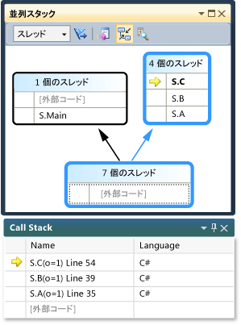  
  
     一方のボックスにはメイン スレッドの呼び出し履歴が表示され、もう一方のボックスには他の 4 つのスレッドの呼び出し履歴がグループ化されて表示されています。 4 つのスレッドがグループ化されているのは、これらのスレッドのスタック フレームが同じメソッド コンテキストを共有している (`A`、`B`、`C` という同じメソッドにある) からです。 スレッドの Id と同じボックスを共有しているスレッドの名前は、ヘッダーにマウスのビューに (**4 個のスレッド**)。 次の図のように、現在のスレッドが太字で表示されます。  
  
       
  
     黄色の矢印は、現在のスレッドのアクティブなスタック フレームを示します。 そこをポイントすると、詳細情報が表示されます。  
  
     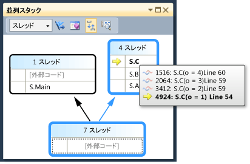  
  
     スタック フレームを表示する詳細度を設定することができます (**モジュール名**、**パラメーターの型**、**パラメーター名**、**パラメーター値**、**行番号**と**バイト オフセット**) 内を右クリックして、**呼び出し履歴**ウィンドウです。  
  
     ボックスを囲む青の強調表示は、そのボックスに現在のスレッドが含まれていることを示します。 現在のスレッドは、ツールヒントで太字のスタック フレームによっても示されます。 [スレッド] ウィンドウでメイン スレッドをダブルクリックすると場合を確認する、青の強調表示、**並列スタック**ウィンドウが適切に移動します。  
  
       
  
#### 2 つ目のブレークポイントまで実行を再開するには  
  
1.  実行を再開する 2 つ目のブレークポイントがヒットするまで、**デバッグ** メニューのをクリックして**続行**です。 次の図は、2 つ目のブレークポイントのスレッド ツリーを示しています。  
  
     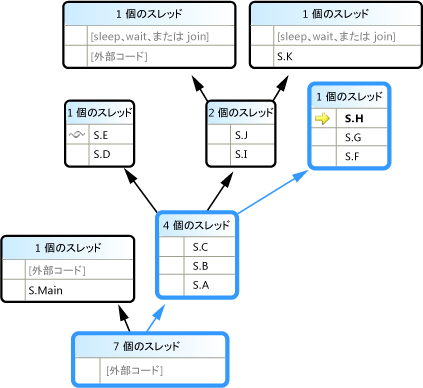  
  
     1 つ目のブレークポイントでは、4 つのスレッドのすべてが、S.A メソッド、S.B メソッド、S.C メソッドの順に進んでいました。 情報がでまだ表示されている、**並列スタック**ウィンドウが 4 つのスレッドがさらに進行しています。 そのうちの 1 つは、S.D、S.E の順に進んでいます。 また別のスレッドは、S.F、S.G、S.H の順に進んでいます。 残りの 2 つは、S.I、S.J の順に進み、そこから一方は S.K に進み、もう一方は非ユーザー外部コードに進んでいます。  
  
     たとえば、ボックス ヘッダーをポイントする**1 スレッド**または**2 つのスレッド**スレッドのスレッドの Id を参照してください。 スタック フレームをポイントすると、スレッド ID とフレームのその他の詳細が表示されます。 青の強調表示は現在のスレッドを示し、黄色の矢印は現在のスレッドのアクティブなスタック フレームを示します。  
  
     より糸のアイコン (青と赤の波線が重なったアイコン) は、現在のスレッドではないスレッドのアクティブなスタック フレームを示します。 **呼び出し履歴**ウィンドウで、フレームを切り替えるには S.B をダブルクリックします。 **並列スタック**ウィンドウは、緑色の曲線矢印アイコンを使用して、現在のスレッドの現在のスタック フレームを示します。  
  
     **スレッド**ウィンドウで、スレッド間で切り替えるし、されることを確認のビュー、**並列スタック**ウィンドウを更新します。  
  
     ショートカット メニューを使用して、別のスレッドまたは別のフレームを別のスレッドを切り替えることができます、**並列スタック**ウィンドウです。 たとえば、S.J を右クリックし、順にポイント**フレームに切り替え**、コマンドをクリックします。  
  
     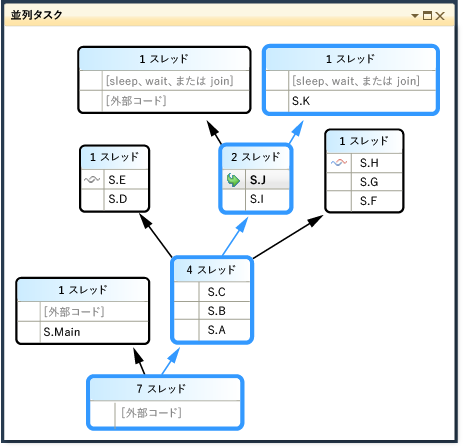  
  
     S.C を右クリックし、順にポイント**フレームに切り替え**です。 チェック マークが付いているコマンドがあります。これは、現在のスレッドのスタック フレームを示します。 その同じスレッドのフレームに切り替えることも (緑色の矢印のみが移動します)、他のスレッドに切り替えることもできます (青の強調表示も移動します)。 次の図は、このサブメニューを示しています。  
  
       
  
     メソッドのコンテキストが 1 つのスタック フレームに関連付けられている場合は、ボックス ヘッダーを表示**1 スレッド**をダブルクリックして切り替えることができます。 複数のフレームが関連付けられているメソッド コンテキストをダブルクリックすると、自動的にメニューがポップアップ表示されます。 メソッド コンテキストをポイントすると右側に表示される黒い三角形を クリックして、このショートカット メニューを表示することもできます。  
  
     多数のスレッドを持つ大規模なアプリケーションでは、一部のスレッドのみに焦点を絞ることもできます。 **並列スタック**ウィンドウのみのフラグが設定されたスレッドの呼び出し履歴を表示できます。 ツールバーで、をクリックして、**表示のみにフラグが設定された**リスト ボックスの横にあるボタンをクリックします。  
  
     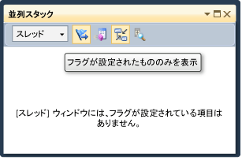  
  
     次に、**スレッド**ウィンドウで、フラグのスレッドでその呼び出し履歴の表示方法を表示する 1 つずつ、**並列スタック**ウィンドウです。 スレッドにフラグを設定するには、ショートカット メニューを使用するか、スレッドの最初のセルを使用します。 クリックして、**表示のみにフラグが設定された**ツールバーの すべてのスレッドを表示するには、もう一度です。  
  
#### 3 つ目のブレークポイントまで実行を再開するには  
  
1.  実行を再開するの 3 つ目のブレークポイントにヒットするまで、**デバッグ** メニューのをクリックして**続行**です。  
  
     同じメソッドに複数のスレッドがあるが、そのメソッドが呼び出し履歴の先頭にない場合、そのメソッドは複数のボックスに表示されます。 たとえば、現在のブレークポイントの S.L がこれに当たります。このメソッドは 3 つのスレッドを持ち、3 つのボックスに表示されています。 S.L をダブルクリックします。  
  
       
  
     他の 2 つのボックスで S.L が太字になっていることに注目してください。これにより、このメソッドが他にどこにあるのかがわかります。 クリックして、どのフレーム S.L への呼び出しと、どのフレームを表示する場合、**メソッド ビューの切り替え**ツールバーのボタンをクリックします。 次の図は、メソッド ビューの**並列スタック**ウィンドウです。  
  
     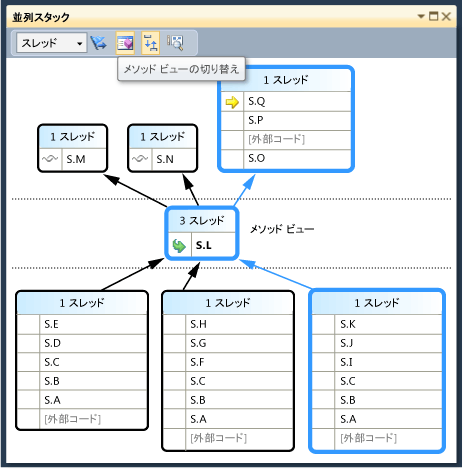  
  
     選択したメソッドを中心とする図が表示されます。選択したメソッドが固有のボックスに入れられて、ビューの中心に配置されます。 その上下には、呼び出し先と呼び出し元が表示されます。 クリックして、**メソッド ビューの切り替え**ボタンをもう一度このモードのままにします。  
  
     ショートカット メニュー、**並列スタック**ウィンドウにも、次の他の項目。  
  
    -   **16 進表示**10 進数と 16 進数の間でツールヒントの数値を切り替えます。  
  
    -   **シンボルの読み込み情報**と**シンボル設定**それぞれのダイアログ ボックスを開きます。  
  
    -   **ソース コードへ移動**と**アセンブルを**選択したメソッドをエディター内を移動します。  
  
    -   **外部コードの表示**ユーザー コードには存在しない場合でも、すべてのフレームが表示されます。 この項目を選択し、図に追加のフレームが表示されることを確認してください (シンボルがないために選択不可になっている可能性があります)。  
  
     大きな図がある場合は、次のブレークポイントにステップするときに、現在のスレッド (最初にブレークポイントにヒットしたスレッド) のアクティブなスタック フレームまでビューが自動的にスクロールするようにすることができます。 **並列スタック**ウィンドウ、ことを確認して、**現在のスタック フレームに自動スクロール**ツールバーのボタンがオン。  
  
     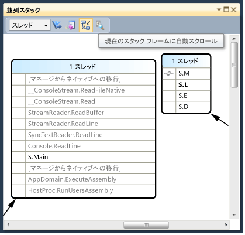  
  
2.  続行する前で、**並列スタック**ウィンドウで、スクロールおよび左側に一番下のすべての方法です。  
  
#### 4 つ目のブレークポイントまで実行を再開するには  
  
1.  実行を再開する 4 つ目のブレークポイントがヒットするまで、**デバッグ** メニューのをクリックして**続行**です。  
  
     ビューが適切な位置まで自動的にスクロールすることに注目してください。 内のスレッドを切り替える、**スレッド**でウィンドウまたはスイッチのスタック フレーム、**呼び出し履歴**ウィンドウと通知方法ビュー適切なフレームを切り替えたり常にします。 オフにする**現在のツール フレームに自動スクロール**オプションし、の差異を表示します。  
  
     **バード アイ ビュー**に大きな図にも役立ちます、**並列スタック**ウィンドウです。 表示することができます、**バード アイ ビュー**次の図に示すように、ウィンドウの右下隅にあるスクロール バーのボタンをクリックしています。  
  
     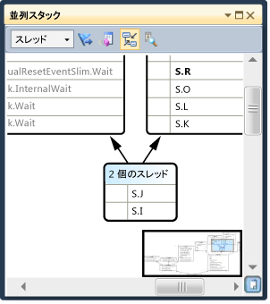  
  
     四角形の枠を移動することにより、図のさまざまな場所をすばやく表示できます。  
  
     図を任意の方向に移動するには、図の空白の領域をクリックして目的の方向にドラッグすることもできます。  
  
     図を拡大/縮小するには、Ctrl キーを押しながらマウス ホイールを動かします。 または、ツール バーの [ズーム] ボタンをクリックしてズーム ツールを使用します。  
  
     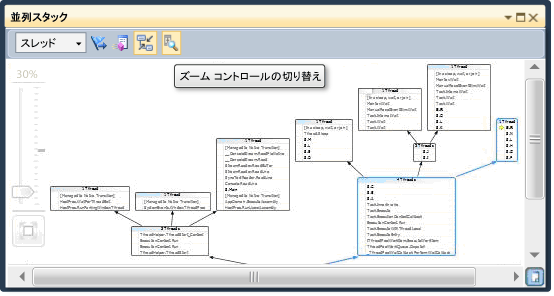  
  
     クリックして、下から順には、代わりに、上から下方向にスタックを表示することも、**ツール**] メニューの [**オプション**を選択するか、下のオプションをオフに、**デバッグ**ノード。  
  
2.  続行する前に、、**デバッグ** メニューのをクリックして**デバッグの停止**実行を終了します。  
  
## [並列タスク] ウィンドウと、[並列スタック] ウィンドウのタスク ビューの使用  
 先に進む前に前の手順を完了することをお勧めします。  
  
#### 1 つ目のブレークポイントにヒットするまでアプリケーションの実行を再開するには  
  
1.  **デバッグ** メニューのをクリックして**デバッグの開始**最初のブレークポイントにヒットするまで待機します。  
  
2.  **デバッグ** メニューのをポイント**Windows**  をクリックし、**スレッド**です。 ドック、**スレッド**Visual Studio の下部にあるウィンドウです。  
  
3.  **デバッグ** メニューのをポイント**Windows**  をクリック**呼び出し履歴**です。 ドック、**呼び出し履歴**ウィンドウを Visual Studio の下部にします。  
  
4.  内のスレッドをダブルクリックして、**スレッド**ウィンドウでは、現在します。 現在のスレッドには黄色の矢印が表示されます。 現在のスレッドを変更すると、他のウィンドウが更新されます。 次に、タスクについて調べます。  
  
5.  **デバッグ** メニューのをポイント**Windows**  をクリックし、**並列タスク**です。 次の図は、**タスク**ウィンドウです。  
  
     ![[タスク] ウィンドウのタスクを実行している 4](../debugger/media/pdw_walkthrough_6.png "PDW_Walkthrough_6")  
  
     実行中の各タスクについて、タスクの ID (同名のプロパティから返されます)、そのタスクを実行しているスレッドの ID と名前、およびタスクの場所 (ここをポイントすると、ツールヒントに呼び出し履歴全体が表示されます) が表示されます。 また、下、**タスク**列で確認できますのタスクに渡されたメソッド。 つまり、スタート地点です。  
  
     この一覧は、任意の列で並べ替えることができます。 並べ替えグリフにより、並べ替えの列と方向が示されます。 列を左右にドラッグして列の順序を変更することもできます。  
  
     黄色の矢印は現在のタスクを示します。 タスクを切り替えるには、タスクをダブルクリックするか、ショートカット メニューを使用します。 タスクを切り替えると、基になるスレッドが現在のスレッドになり、他のウィンドウが更新されます。  
  
     タスクを手動で切り替えると黄色の矢印が移動しますが、デバッガーが中断されたタスクは引き続き白の矢印によって示されます。  
  
#### 2 つ目のブレークポイントまで実行を再開するには  
  
1.  実行を再開する 2 つ目のブレークポイントがヒットするまで、**デバッグ** メニューのをクリックして**続行**です。  
  
     以前は、**ステータス**列では、実行されているすべてのタスクを示しましたが、2 つのタスクが待機しています。 タスクがブロックされるのにはさまざまな理由があります。 **ステータス**列でブロックされている理由については、待機中のタスクをポイントします。 たとえば、次の図では、タスク 3 はタスク 4 を待機しています。  
  
     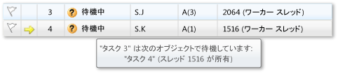  
  
     一方、タスク 4 は、タスク 2 に割り当てられているスレッドが所有するモニターを待機しています。  
  
       
  
     最初の列でフラグをクリックして、タスクにフラグを設定することができます、**タスク**ウィンドウです。  
  
     フラグが設定されるを使用するには、同じデバッグ セッションでの異なるブレークポイントの間のタスクを追跡するために、タスクが呼び出し履歴を表示したり、**並列スタック**ウィンドウです。  
  
     使用したときに、**並列スタック**ウィンドウはアプリケーションのスレッドを表示する前に、します。 ビュー、**並列スタック**ウィンドウを再び、今度は、アプリケーションのタスクを表示します。 これを選択すると**タスク**ボックスの左上でします。 次の図は、タスク ビューを示しています。  
  
       
  
     現在のタスクを実行していないスレッドのタスク ビューに表示されません、**並列スタック**ウィンドウです。 タスクを実行するスレッドについても、タスクに関連しないスタック フレームはスタックの上下からフィルターで除外されます。  
  
     ビュー、**タスク**ウィンドウをもう一度です。 任意の列ヘッダーを右クリックして、その列のショートカット メニューを表示します。  
  
     ![[タスク] ウィンドウのショートカット ビュー メニュー](../debugger/media/pdb_walkthrough_8a.png "PDB_Walkthrough_8A")  
  
     ショートカット メニューを使用して、列を追加したり削除したりすることができます。 たとえば、[AppDomain] 列は選択されていないため、一覧に表示されていません。 をクリックして**親**です。 **親**4 つのタスクのいずれかの値を使用しない列が表示されます。  
  
#### 3 つ目のブレークポイントまで実行を再開するには  
  
1.  実行を再開するの 3 つ目のブレークポイントにヒットするまで、**デバッグ** メニューのをクリックして**続行**です。  
  
     新しいタスク (タスク 5) が実行中になり、タスク 4 は待機中になっています。 表示する理由で待機中のタスク ポインターを置いた、**ステータス**ウィンドウです。 **親**列には、そのタスク 4 タスク 5 の親であるに注意してください。  
  
     親子リレーションシップをよりよく視覚化するを右クリックして、**親**列ヘッダーをクリック**親子ビュー**です。 次の図のような画面が表示されます。  
  
     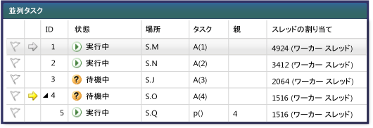  
  
     タスク 4 とタスク 5 が同じスレッドで実行されていることに注目してください。 この情報は表示されません、**スレッド**ウィンドウ; 参照の利点の 1 つをここでは、**タスク**ウィンドウです。 これを確認するには表示、**並列スタック**ウィンドウです。 表示されていることを確認**タスク**です。 タスク 4 と 5 を見つけるでそれらをダブルクリックして、**タスク**ウィンドウです。 ときに、青の強調表示の場合、**並列スタック**ウィンドウを更新します。 でツールヒントを調べてタスク 4 と 5 を検索することも、**並列スタック**ウィンドウです。  
  
     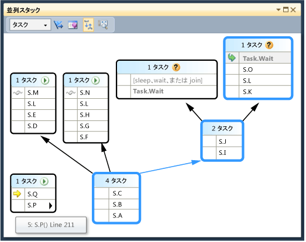  
  
     **並列スタック**ウィンドウで、S.P を右クリックし、をクリックして**スレッドに移動**です。 ウィンドウがスレッド ビューに切り替わり、対応するフレームが表示されます。 両方のタスクが同じスレッドにあることがわかります。  
  
       
  
     これは、タスク ビューのもう 1 つの利点、**並列スタック**と比較すると、ウィンドウ、**スレッド**ウィンドウです。  
  
#### 4 つ目のブレークポイントまで実行を再開するには  
  
1.  実行を再開するの 3 つ目のブレークポイントにヒットするまで、**デバッグ** メニューのをクリックして**続行**です。 クリックして、 **ID**列ヘッダーを ID で並べ替えます。 次の図のような画面が表示されます。  
  
     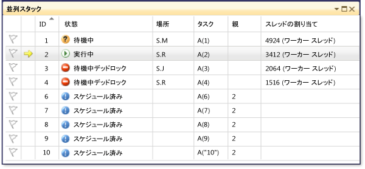  
  
     タスク 5 は完了したため、もう表示されません。 お使いのコンピューターでそうならず、デッドロックが表示されていない場合は、F11 キーを押して 1 回ステップ実行してください。  
  
     タスク 3 とタスク 4 は互いを待機しており、デッドロックの状態になっています。 また、5 つの新しいタスクがあります。これらはタスク 2 の子で、現在スケジュールされているタスクです。 スケジュールされたタスクとは、コードで開始されているがまだ実行されていないタスクです。 そのため、その**場所**と**スレッドの割り当て**列が空です。  
  
     ビュー、**並列スタック**ウィンドウをもう一度です。 各ボックスのヘッダーをポイントすると、ツールヒントにスレッドの ID と名前が表示されます。 タスク ビューに切り替え、**並列スタック**ウィンドウです。 次の図のようにヘッダーをポイントして、タスクの ID、名前、および状態を確認します。  
  
     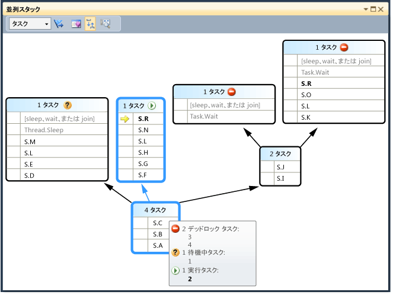  
  
     タスクを列でグループ化することもできます。 **タスク** ウィンドウを右クリックし、**ステータス**列ヘッダーをクリック**状態でグループ化**です。 次の図は、**タスク**ウィンドウがステータスによってグループ化します。  
  
       
  
     ほかにも任意の列でグループ化できます。 タスクをグループ化すると、一部のタスクに焦点を絞ることができます。 各グループは折りたたみ可能で、それぞれにグループ化されている項目の数が表示されます。 すばやくフラグを設定できます、グループ内のすべての項目をクリックして、**フラグ**の右側にあるボタン、**折りたたみ**ボタンをクリックします。  
  
     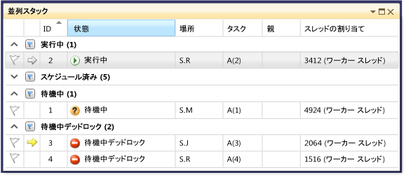  
  
     最後の機能、**タスク**ウィンドウを調べるには、タスクを右クリックしたときに表示されるショートカット メニュー。  
  
     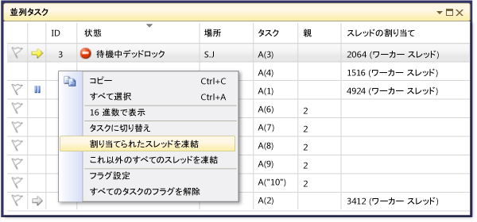  
  
     このショートカット メニューに表示されるコマンドは、タスクの状態によって異なります。 コマンドを含めることがあります**コピー**、**すべて選択**、 **16 進表示**、**タスクへの切り替え**、**割り当て凍結スレッド**、**がこの機能のすべてのスレッドを凍結**、および**割り当てられたスレッドを凍結解除**、および**フラグ**です。  
  
     1 つまたは複数のタスクの基になるスレッドを凍結したり、割り当てられたスレッド以外のすべてのスレッドを凍結したりすることができます。 表される、凍結されたスレッド、**タスク**ウィンドウでもはでは、**スレッド**ウィンドウと同じように青*を一時停止*アイコン。  
  
## まとめ  
 このチュートリアルでは説明、**並列タスク**と**並列スタック**デバッガーのウィンドウ。 マルチスレッド コードを使用する実際のプロジェクトでこれらのウィンドウを使用してみてください。 C++、C#、または Visual Basic で記述された並列コードを調べることができます。  
  
## 参照  
 [マルチ スレッド アプリケーションのデバッグ](../debugger/walkthrough-debugging-a-parallel-application.md)   
 [デバッガーの基本事項](../debugger/debugger-basics.md)   
 [マネージ コードをデバッグする](../debugger/debugging-managed-code.md)   
 [並列プログラミング](/dotnet/standard/parallel-programming/index)   
 [同時実行ランタイム](/cpp/parallel/concrt/concurrency-runtime)   
 [[並列スタック] ウィンドウの使用](../debugger/using-the-parallel-stacks-window.md)   
 [[タスク] ウィンドウの使用](../debugger/using-the-tasks-window.md)