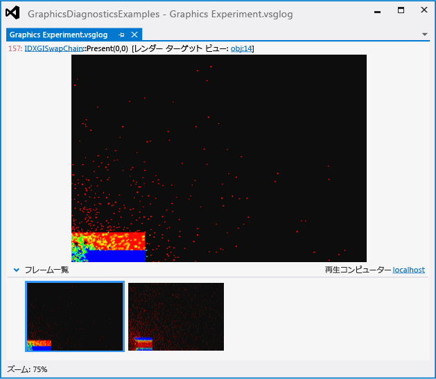
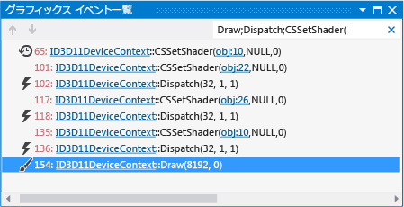
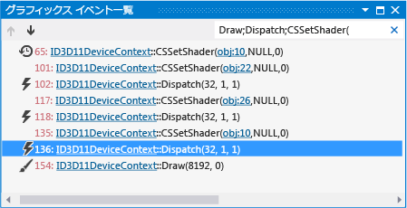
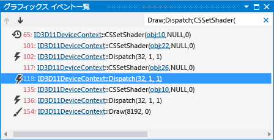

# Walkthrough: Using Graphics Diagnostics to Debug a Compute Shader (チュートリアル: 計算シェーダーをデバッグするためのグラフィックス診断の使用)
[!INCLUDE[vs2017banner](../code-quality/includes/vs2017banner.md)]

このチュートリアルでは、Visual Studio のグラフィックス診断ツールを使用して、正しくない結果を生成する計算シェーダーを調査する方法を説明します。  
  
 このチュートリアルでは、次の作業について説明します。  
  
-   **\[グラフィックス イベント一覧\]** を使用して、問題の原因となる可能性がある部分を検索します。  
  
-   **\[グラフィックス イベント呼び出し履歴\]** を使用して、DirectCompute `Dispatch` イベントによって実行される計算シェーダーを決定します。  
  
-   **\[グラフィックス パイプライン ステージ\]** ウィンドウと HLSL デバッガーを使用して、問題の原因になっている計算シェーダーを調べます。  
  
## シナリオ  
 このシナリオでは、シミュレーション更新の計算量が最も多い部分を実行するために DirectCompute を使用する流体力学シミュレーションを記述しました。  アプリを実行したときに、データセットと UI は正しくレンダリングされますが、シミュレーションが想定どおりに動作しません。  グラフィックス診断を使用すると、グラフィックス ログに問題をキャプチャして、アプリのデバッグを実行できます。  問題は、アプリケーションでは次のように見えます。  
  
   
  
 グラフィックスの問題をグラフィックス ログにキャプチャする方法については、「[グラフィックス情報のキャプチャ](../debugger/capturing-graphics-information.md)」を参照してください。  
  
## 調査  
 グラフィックス診断ツールを使用して、グラフィックス ログ ファイルを読み込み、キャプチャされたフレームを検査することができます。  
  
#### グラフィックス ログのフレームを調査するには  
  
1.  Visual Studio で、正しくないシミューレーション結果を表すフレームを含むグラフィックス ログを読み込みます。  新しいグラフィックス診断タブが Visual Studio に表示されます。  このタブの上部に、選択されたフレームのレンダー ターゲットが出力されます。  下部の **\[フレーム一覧\]** には、キャプチャされた各フレームの縮小表示が表示されます。  
  
2.  **\[フレーム一覧\]** で、正しくないシミュレーション動作を示すフレームを選択します。  DirectCompute イベントは Direct3D イベントと共にフレームごとにキャプチャされるため、エラーがレンダリング コードではなくシミュレーション コードに表示されたとしても、フレームを選択する必要があります。  このシナリオでは、グラフィックス ログのタブは次のように表示されます。  
  
       
  
 問題を示しているフレームを選択したら、**\[グラフィックス イベント一覧\]** を使用してそのフレームを診断できます。  **\[グラフィックス イベント一覧\]** には、フレームがアクティブなときに行われたすべての DirectCompute 呼び出しと Direct3D API 呼び出し \(たとえば、GPU で計算を実行する API 呼び出しやデータセットまたは UI をレンダリングする API 呼び出し\) のイベントが含まれます。  この場合、GPU で実行されたシミュレーションの一部を表す `Dispatch` イベントに注目します。  
  
#### シミュレーション更新の Dispatch イベントを見つけるには  
  
1.  **\[グラフィックス診断\]** ツール バーで、**\[イベント一覧\]** をクリックし、**\[グラフィックス イベント一覧\]** ウィンドウを開きます。  
  
2.  データセットをレンダリングする描画イベントの **\[グラフィックス イベント一覧\]** を調べます。  この操作を簡単に行うには、`[グラフィックス イベント一覧]` ウィンドウの右上隅にある **\[検索\]** ボックスに「**Draw**」と入力します。  これによって一覧がフィルター処理され、タイトルに "Draw" を含むイベントのみが一覧に表示されます。  このシナリオでは、これらの描画イベントが発生したことがわかります。  
  
       
  
3.  グラフィックス ログのドキュメント タブでレンダー ターゲットを観察しながら、各描画イベント間を移動します。  
  
4.  レンダリングされたデータセットがレンダー ターゲットによって最初に表示されたら移動を停止します。  このシナリオでは、データセットは最初の描画イベントでレンダリングされます。  シミュレーションのエラーが表示されます。  
  
       
  
5.  次に、シミュレーションを更新する **\[グラフィックス イベント一覧\]** イベントの `Dispatch` を調べます。  シミュレーションはレンダリングされる前に更新される可能性が高いため、結果をレンダリングする描画イベントの前に発生する `Dispatch` イベントに最初に集中できます。  この操作を簡単に行うには、「**Draw;Dispatch;CSSetShader\(**」を読み取るように `[検索]` ボックスを変更します。  これによって一覧がフィルター処理され、描画イベントに加えて、`Dispatch` イベントおよび `CSSetShader` イベントも一覧に表示されます。  このシナリオでは、描画イベントの前にいつくかの `Dispatch` イベントが発生したことがわかります。  
  
       
  
 これで、多数になる可能性のある `Dispatch` イベントのうち、問題に該当するいくつかのイベントを特定できるので、これらのイベントを詳しく調べることができます。  
  
#### Dispatch 呼び出しが実行する計算シェーダーを確認するには  
  
1.  **\[グラフィックス診断\]** ツール バーで、**\[イベント呼び出し履歴\]** をクリックし、**\[グラフィックス イベント呼び出し履歴\]** ウィンドウを開きます。  
  
2.  シミュレーションの結果をレンダリングする描画イベントから開始し、前の各 `CSSetShader` イベント間を後方に移動します。  次に、**\[グラフィックス イベント呼び出し履歴\]** ウィンドウで、最上位の関数を選択し、呼び出しサイトに移動します。  呼び出しサイトで、[CSSetShader](http://msdn.microsoft.com/library/ff476402.aspx) 関数呼び出しの最初のパラメーターを使用して、次の `Dispatch` イベントによって実行される計算シェーダーを確認できます。  
  
 このシナリオでは、各フレームに `CSSetShader` イベントと `Dispatch` イベントのペアが 3 つあります。  最後から説明すると、3 番目のペアは統合ステップ \(ここで、流体パーティクルが実際に動かされます\) を、2 番目のペアはフォース計算ステップ \(ここで、各パーティクルに影響を及ぼすフォースが計算されます\) を、最初のペアは密度計算ステップをそれぞれ表します。  
  
#### 計算シェーダーをデバッグするには  
  
1.  **\[グラフィックス診断\]** ツール バーで、**\[パイプライン ステージ\]** をクリックし、**\[グラフィックス パイプライン ステージ\]** ウィンドウを開きます。  
  
2.  3 番目の `Dispatch` イベント \(描画イベントの直前にあるイベント\) を選択し、次に、**\[グラフィックス パイプライン ステージ\]** ウィンドウの **\[計算シェーダー\]** ステージで、**\[デバッグ開始\]** をクリックします。  
  
       
  
     統合ステップを実行するシェーダーで HLSL デバッガーが開始されます。  
  
3.  統合ステップの計算シェーダー ソース コードを調べて、エラーの原因を探します。  グラフィックス診断を使用して、HLSL 計算シェーダー コードをデバッグする場合は、コードをステップ実行したり、ウォッチ ウィンドウなどの他の一般的なデバッグ ツールを使用したりできます。  このシナリオでは、統合ステップを実行する計算シェーダーにエラーがないことを確認します。  
  
       
  
4.  計算シェーダーのデバッグを停止するには、**\[デバッグ\]** ツール バーで、**\[デバッグの停止\]** \(キーボード: Shift \+ F5\) をクリックします。  
  
5.  次に、2 番目の `Dispatch` イベントを選択し、前のステップで実行したように、計算シェーダーのデバッグを開始します。  
  
       
  
     各流体パーティクルに対して作用するフォースを計算するシェーダーで HLSL デバッガーが開始されます。  
  
6.  フォース計算ステップの計算シェーダー ソース コードを調べます。  このシナリオでは、エラーの原因がここにあることを確認します。  
  
       
  
 エラーが発生した場所を確認した後、デバッグを停止して、計算シェーダー ソース コードを変更すると、相互作用するパーティクル間の距離を正しく計算できます。  このシナリオでは、行 `float2 diff = N_position + P_position;` を `float2 diff = N_position - P_position;` に変更するだけです。  
  
   
  
 このシナリオでは、計算シェーダーが実行時にコンパイルされるため、変更を加えた後、アプリを再起動するだけで、変更がシミュレーションに及ぼす影響を確認できます。  アプリをリビルドする必要はありません。  アプリを実行すると、シミュレーションが正しく動作していることが確認できます。  
  
 